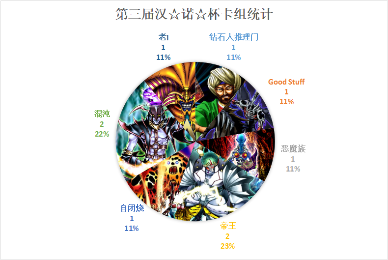
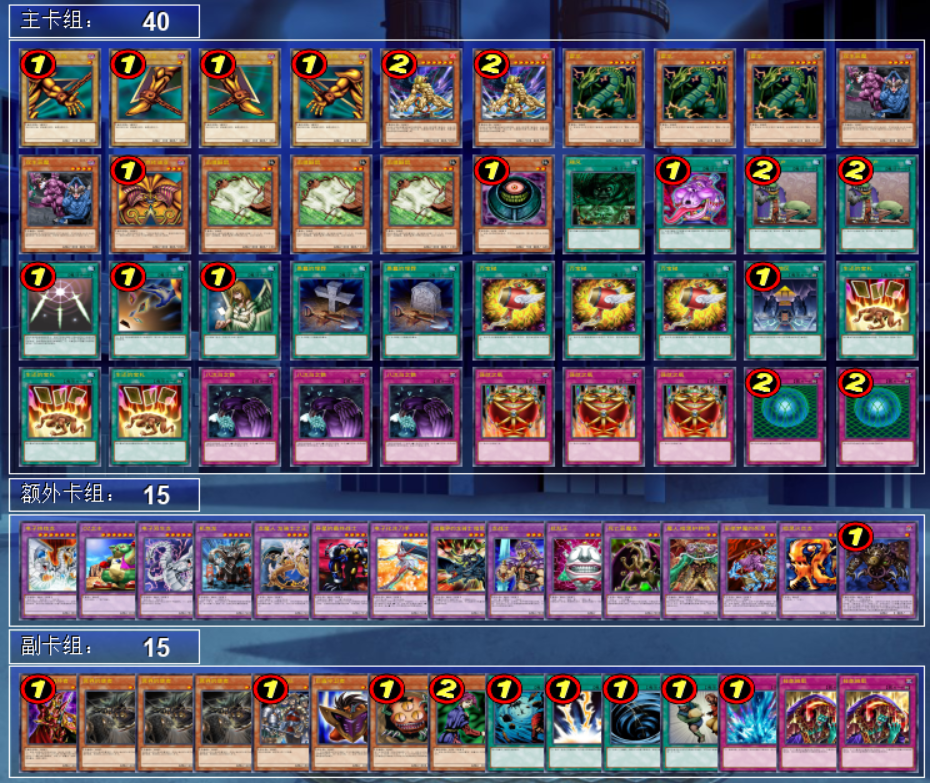
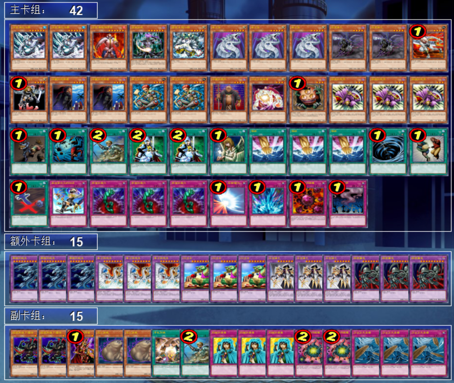
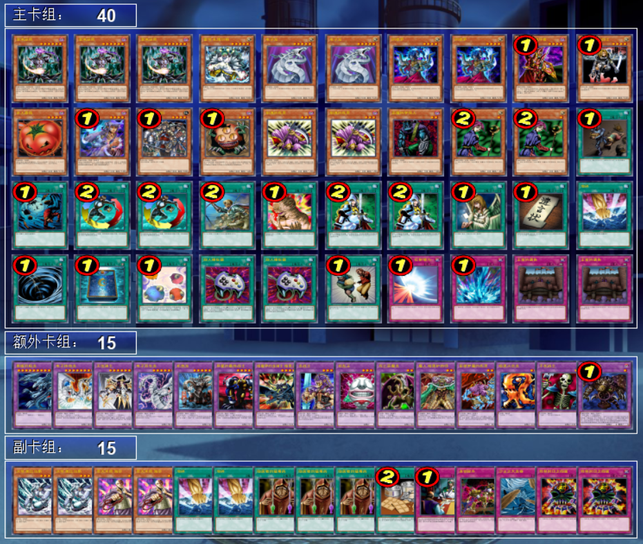
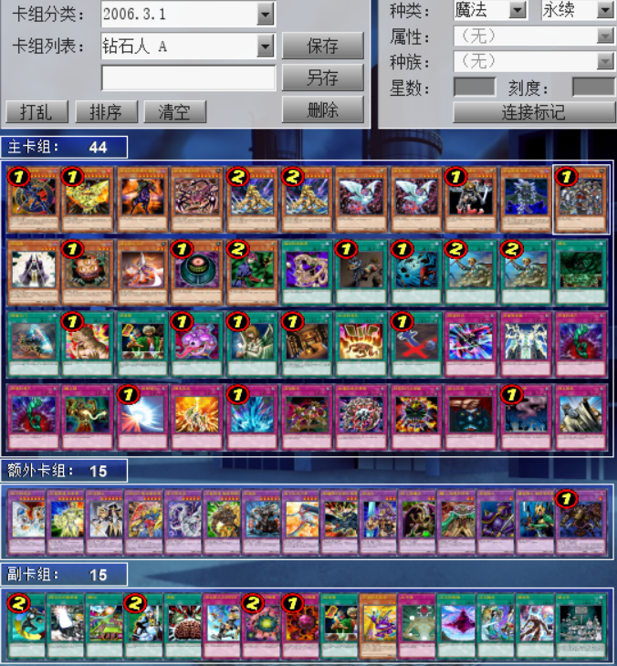
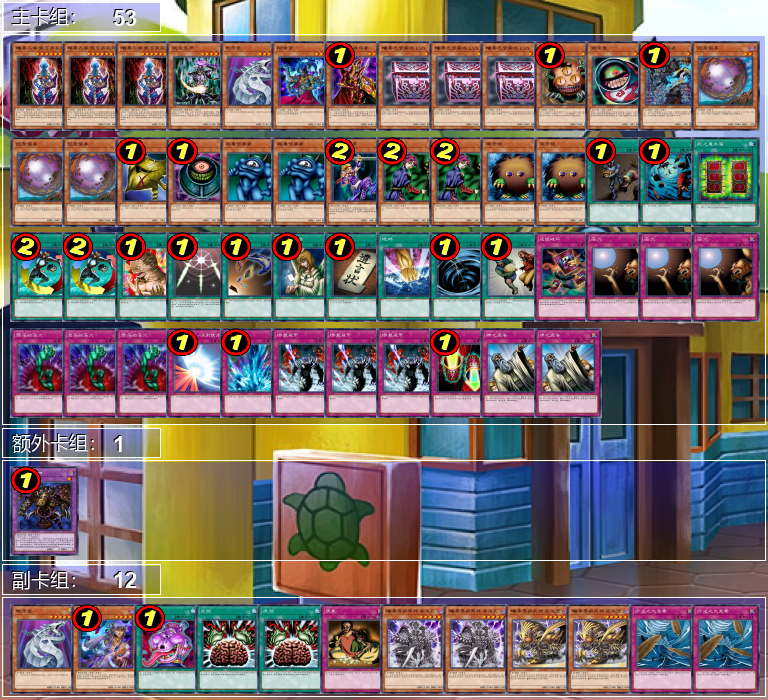
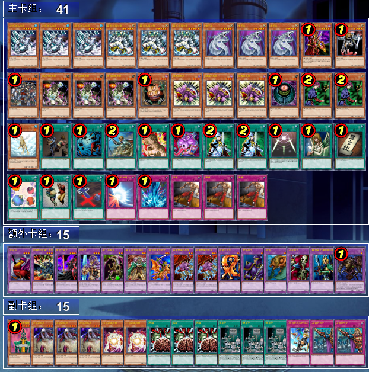
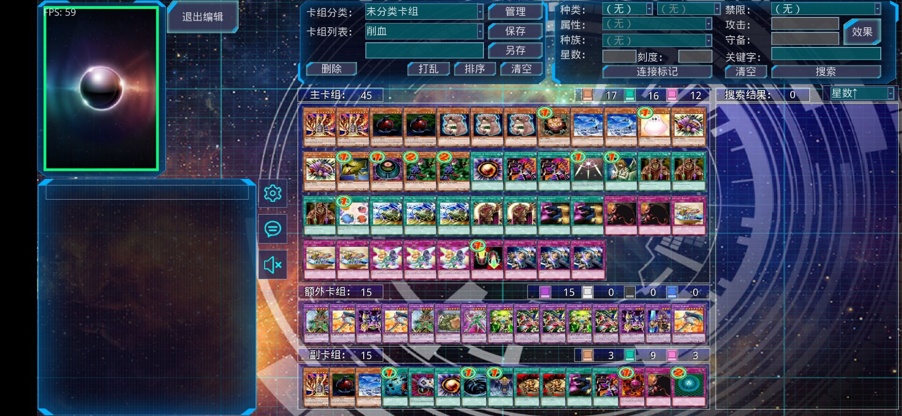
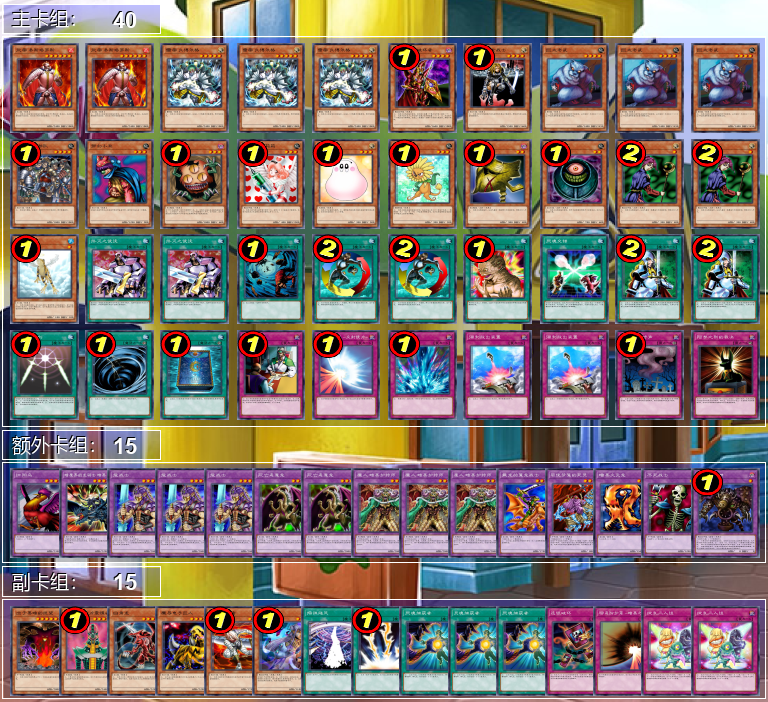
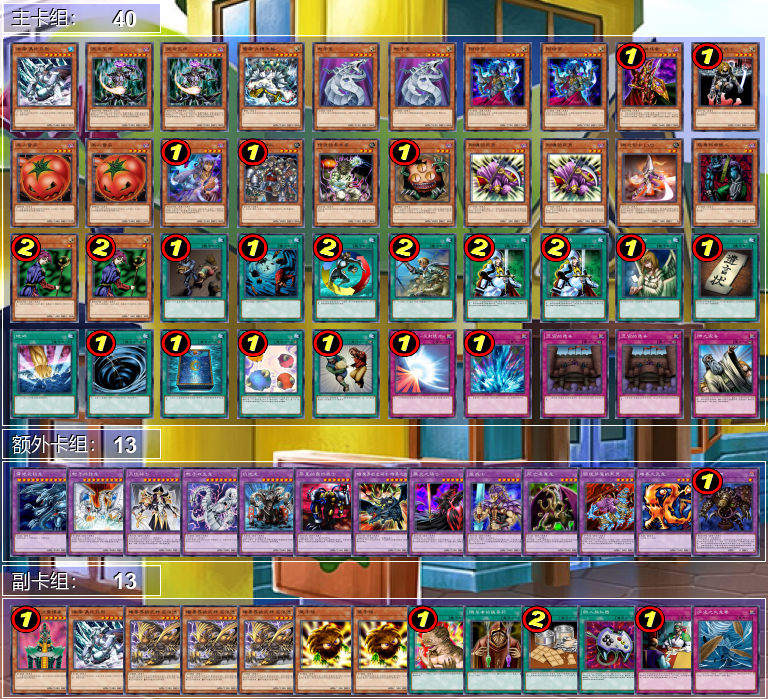

# 第三届汉诺杯战报（常规赛）

比赛时间 2021-1-1 14:30  
本比赛为模拟环境赛，因此构筑与历史上的上位思路会有少量差别  
卡池：前四期（约1999-2006.4）OCG卡池  
卡表：2006年3月限制卡表  
规则：大师规则3（调整裁定按233服2012端口处理结果）  
比赛原文：https://www.bilibili.com/read/cv8565563/  

[返回比赛信息](../../Competitions.html)  

---

## 先说比赛结果
冠军：老I（冰火仙）  
亚军：Good Stuff（薯片）  
季军：混沌（未知生命体）  

本次比比赛终于满8人了！由于卡组战术比较直观，多为均卡中慢速beat down，少量阴间卡组（笑），因此就不发详细战术了，有需要可以另外问，仅简单介绍一下卡组思路。作为“遗老”玩家的参考以及现环境玩家的娱乐阅读史料。大家可以发表自己的看法，互相讨论！  

欢迎大家参赛或日常娱乐。日常群暗号：708942347  
直播回放视频：https://www.bilibili.com/video/BV14i4y1F7qF/  

    

## 冠军：老I

第一轮 轮空  
第二轮 钻石人推理门○○  
第三轮 帝王×○×  
第四轮 混沌○○  
准决赛 帝王×○○  
决赛 Good Stuff ○×○  

    
     
    很难得老I可以取得冠军。虽然很多读过OCG历史的读者姥爷都应该知道老I在游戏王的一期二期是几乎超主流的存在，到四期后则随着一些丧病堆墓、检索部件（指苦涩的选择和第一版效果的三眼怪、 黑森林女巫）的进表、效果改订而很少在上位中看见了。冠军卡组除了经典的环境物各种抽滤和必要的自闭贴纸外，还投入了一个当年只要达成基本停不下来的闻风丧胆combo——生还的宝札+暗黑之蝎尾狮×2，没有1回合1次的送墓苏生和苏生后抽卡，理论上可以按自己的喜好抽任意数目的卡，直到抽干卡组。愚蠢的埋葬投入了2，OCG和TCG插图各1，作用是快速从卡组把暗黑之蝎尾狮送去墓地。为了提高这个combo的达成概率还投入了3迅捷鼯鼠，除了能续命、压缩卡组外还可以作为暗黑之蝎尾狮的苏生效果cost。事实上比赛中冠军也多次通过这个combo赢得一局，对方除了干看着抽完老I外只能投降，令人绝望。这个卡组也是难得的一个408环境中有手坑的卡组，双生恶魔能不亏卡使得对方的手札抹杀、变形壶、削魂的死灵、炎帝 泰斯塔罗斯等手卡破坏手段失效。顺便说一个小彩蛋，冠军在决赛的最后一局是通过beat的方式来打败亚军，而不是集齐老I，场面过于生草。

## 亚军：Good Stuff

第一轮 混沌○×○  
第二轮 自闭烧○○  
第三轮 钻石人推理门○○  
第四轮 帝王○○  
准决赛 混沌○○  
决赛 老I ×○×  

    
     
    其实所谓的Good Stuff就是“均卡”的意思，也是当年被俗称“杂卡”的卡组，但其实资源对换能力并不弱。Good Stuff的构筑思路基本上是“采用当前卡池中的最强单卡进行有机结合”，思路方向比较简单，可以斟酌的构筑细节不少。本卡组采用了4、5期经典beat系统电子龙+死灵骑士，利用电子龙的“伪下级”便利召唤方式以及死灵骑士的1900强力打点+人肉怪效康在保证打点利用战斗不亏卡换掉对方资源的同时，能康掉对方的关键性怪兽效果。卡组除了经典解场怪兽异次元的女战士外，还投入了1 D.D.暗杀者2异次元的战士1增援这样的异次元小系统，外挂1闪光之追放者，在解场的同时干扰对方的墓地堆积。外挂了当时环境的“泛用卡”冰帝 美比乌斯、守墓的侦察者和削魂的死灵，并投入了3地碎3奈落的落穴1死之卡组破坏病毒这些可以快速换取资源的强力单卡。总体而言，这个卡组很好地贯彻了老式Good Stuff里每张卡都能换取资源的理念，堪称模板一般的老式Good Stuff构筑。

## 季军：混沌

第一轮 自闭烧××  
第二轮 帝王×○×  
第三轮 帝王○○  
第四轮 钻石人推理门○○  
准决赛 Good Stuff ××  
季军争夺战 帝王○○  

    
     
    混沌也是当年的经典卡组类型之一。因为卡池并不大，因此只剩下混沌巫师的混沌卡组多是以Good Stuff的思路进行构筑的。这个构筑由于与2006年冠军混沌构筑几乎一致，仅有若干卡片的差别，就不多说了，大家可以去看互联网上随处可搜索到的2006年冠军卡组及其评析。值得一提的是副卡组针对群里日常的环境投入了可以单方面对抗混沌、黄泉青蛙等墓地利用的灵灭术师 海空和对抗帝王（卡组或外挂）、熔岩魔神的牲祭封印之假面。

## 其他参赛者卡组（本网站首次展示）

| ID   | 卡组主题 | 构筑截图 |
| :----: | :--------------: | :--------: |
| 卡莉褚  | 钻石人推理门        |     |
| 生物噪声  | 恶魔族        |     |
| 永远的干涸  | 帝王        |     |
| jiaqi  | 自闭烧        |     |
| 耀眼     | 帝王               |     |
| 口胡王     | 混沌               |     |