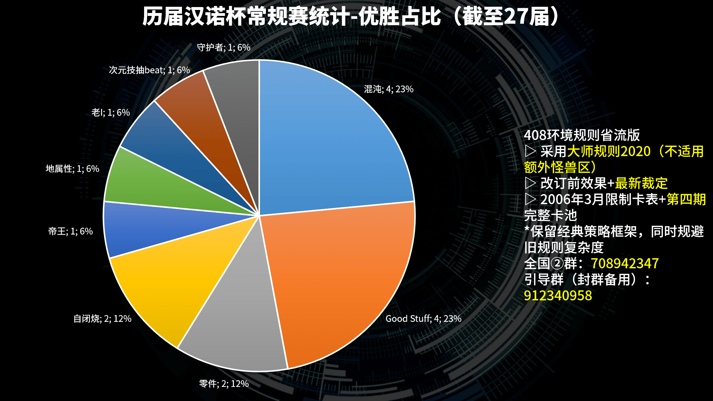

# 历届汉诺杯常规赛统计

本站专属文，不在他站发表，会随常规赛的举办而更新。  

[返回比赛信息](../../../Competitions.html)  

---

## 历届汉诺杯常规赛使用计数概括表（截至27届）

| 序号 | 卡组类型     | 使用数 | 使用占比 | 使用出轮数 | 使用出轮率 | 出轮占比 | 使用优胜数 | 使用优胜率 | 优胜占比 |
| ---- | ------------ | ------ | -------- | ---------- | ---------- | -------- | ---------- | ---------- | -------- |
| 11   | 混沌         | 61     | 21.48%   | 32         | 52.46%     | 26.23%   | 4          | 6.56%      | 23.53%   |
| 2    | Good Stuff   | 27     | 9.51%    | 15         | 55.56%     | 12.30%   | 4          | 14.81%     | 23.53%   |
| 3    | 帝王         | 40     | 14.08%   | 18         | 45.00%     | 14.75%   | 1          | 2.50%      | 5.88%    |
| 4    | 零件         | 27     | 9.51%    | 20         | 74.07%     | 16.39%   | 2          | 7.41%      | 11.76%   |
| 5    | 不死族       | 9      | 3.17%    | 7          | 77.78%     | 5.74%    | 0          | 0.00%      | 0.00%    |
| 6    | 恶魔族       | 9      | 3.17%    | 2          | 22.22%     | 1.64%    | 0          | 0.00%      | 0.00%    |
| 7    | 水属性       | 2      | 0.70%    | 0          | 0.00%      | 0.00%    | 0          | 0.00%      | 0.00%    |
| 8    | 反击天使     | 3      | 1.06%    | 1          | 33.33%     | 0.82%    | 0          | 0.00%      | 0.00%    |
| 9    | 地属性       | 6      | 2.11%    | 4          | 66.67%     | 3.28%    | 1          | 16.67%     | 5.88%    |
| 10   | 龙族         | 3      | 1.06%    | 0          | 0.00%      | 0.00%    | 0          | 0.00%      | 0.00%    |
| 11   | 守墓         | 5      | 1.76%    | 2          | 40.00%     | 1.64%    | 0          | 0.00%      | 0.00%    |
| 12   | 自闭烧       | 17     | 5.99%    | 6          | 35.29%     | 4.92%    | 2          | 11.76%     | 11.76%   |
| 13   | 连锁烧       | 1      | 0.35%    | 1          | 100.00%    | 0.82%    | 0          | 0.00%      | 0.00%    |
| 14   | 推理门       | 9      | 3.17%    | 1          | 11.11%     | 0.82%    | 0          | 0.00%      | 0.00%    |
| 15   | 老I          | 5      | 1.76%    | 1          | 20.00%     | 0.82%    | 1          | 20.00%     | 5.88%    |
| 16   | 卡组破坏     | 1      | 0.35%    | 0          | 0.00%      | 0.00%    | 0          | 0.00%      | 0.00%    |
| 17   | 倒计时       | 3      | 1.06%    | 0          | 0.00%      | 0.00%    | 0          | 0.00%      | 0.00%    |
| 18   | 黑魔术师     | 5      | 1.76%    | 1          | 20.00%     | 0.82%    | 0          | 0.00%      | 0.00%    |
| 19   | 次元beat     | 3      | 1.06%    | 0          | 0.00%      | 0.00%    | 0          | 0.00%      | 0.00%    |
| 20   | 狒狒         | 2      | 0.70%    | 0          | 0.00%      | 0.00%    | 0          | 0.00%      | 0.00%    |
| 21   | 昆虫族       | 3      | 1.06%    | 2          | 66.67%     | 1.64%    | 0          | 0.00%      | 0.00%    |
| 22   | 暗黑界       | 4      | 1.41%    | 0          | 0.00%      | 0.00%    | 0          | 0.00%      | 0.00%    |
| 23   | 凡骨beat     | 4      | 1.41%    | 2          | 50.00%     | 1.64%    | 0          | 0.00%      | 0.00%    |
| 24   | 控制权夺取   | 1      | 0.35%    | 0          | 0.00%      | 0.00%    | 0          | 0.00%      | 0.00%    |
| 25   | 神炎皇       | 5      | 1.76%    | 0          | 0.00%      | 0.00%    | 0          | 0.00%      | 0.00%    |
| 26   | 技抽beat     | 3      | 1.06%    | 1          | 33.33%     | 0.82%    | 0          | 0.00%      | 0.00%    |
| 27   | 翻翻乐       | 3      | 1.06%    | 1          | 33.33%     | 0.82%    | 0          | 0.00%      | 0.00%    |
| 28   | Beat burn    | 2      | 0.70%    | 0          | 0.00%      | 0.00%    | 0          | 0.00%      | 0.00%    |
| 29   | 元素英雄     | 2      | 0.70%    | 0          | 0.00%      | 0.00%    | 0          | 0.00%      | 0.00%    |
| 30   | 机械族       | 2      | 0.70%    | 0          | 0.00%      | 0.00%    | 0          | 0.00%      | 0.00%    |
| 31   | 次元技抽beat | 3      | 1.06%    | 2          | 66.67%     | 1.64%    | 1          | 33.33%     | 5.88%    |
| 32   | 融合beat     | 1      | 0.35%    | 0          | 0.00%      | 0.00%    | 0          | 0.00%      | 0.00%    |
| 33   | 光属性       | 1      | 0.35%    | 0          | 0.00%      | 0.00%    | 0          | 0.00%      | 0.00%    |
| 34   | 装备beat     | 1      | 0.35%    | 0          | 0.00%      | 0.00%    | 0          | 0.00%      | 0.00%    |
| 35   | 赌博         | 1      | 0.35%    | 0          | 0.00%      | 0.00%    | 0          | 0.00%      | 0.00%    |
| 36   | 电子龙       | 1      | 0.35%    | 0          | 0.00%      | 0.00%    | 0          | 0.00%      | 0.00%    |
| 37   | 沉默魔术师   | 1      | 0.35%    | 0          | 0.00%      | 0.00%    | 0          | 0.00%      | 0.00%    |
| 38   | 魔法师族     | 2      | 0.70%    | 1          | 50.00%     | 0.82%    | 0          | 0.00%      | 0.00%    |
| 39   | 黑炎龙       | 1      | 0.35%    | 1          | 100.00%    | 0.82%    | 0          | 0.00%      | 0.00%    |
| 40   | 战士族       | 1      | 0.35%    | 0          | 0.00%      | 0.00%    | 0          | 0.00%      | 0.00%    |
| 41   | 熊猫beat     | 1      | 0.35%    | 0          | 0.00%      | 0.00%    | 0          | 0.00%      | 0.00%    |
| 42   | 纳祭         | 1      | 0.35%    | 0          | 0.00%      | 0.00%    | 0          | 0.00%      | 0.00%    |
| 43   | 沉默剑士     | 1      | 0.35%    | 0          | 0.00%      | 0.00%    | 0          | 0.00%      | 0.00%    |
| 44   | 守护者       | 1      | 0.35%    | 1          | 100.00%    | 0.82%    | 1          | 100.00%    | 5.88%    |
| 总计 |              | 284    |          | 122        |            |          | 17         |            |          |

**使用数**：实际参赛，对比赛产生影响的卡组类型数目，分类并非绝对严格。  
**使用占比**：各卡组类型在使用数总计中的占比。  
**使用出轮数**：实际参赛的卡组类型中从瑞士轮进入淘汰赛的数目，包括让位顶上的。  
**使用出轮率**：某类卡组的出轮玩家与使用者的比例，计算方式为：**使用出轮数/使用数×100%**。  
**出轮占比**：各卡组类型在使用出轮数总计中的占比。  
**使用优胜率**：使用优胜数某类卡组的优胜玩家与使用者的比例，计算方式为：**使用优胜数/使用数×100%**。  
**优胜占比**：各卡组类型在使用优胜数总计中的占比。  
以上数据均已排除出轮后的犯规参赛者。  

## 统计饼图

    
     
    历届汉诺杯常规赛统计-使用占比

---

    
     
    历届汉诺杯常规赛统计-出轮占比

---

    
     
    历届汉诺杯常规赛统计-优胜占比

