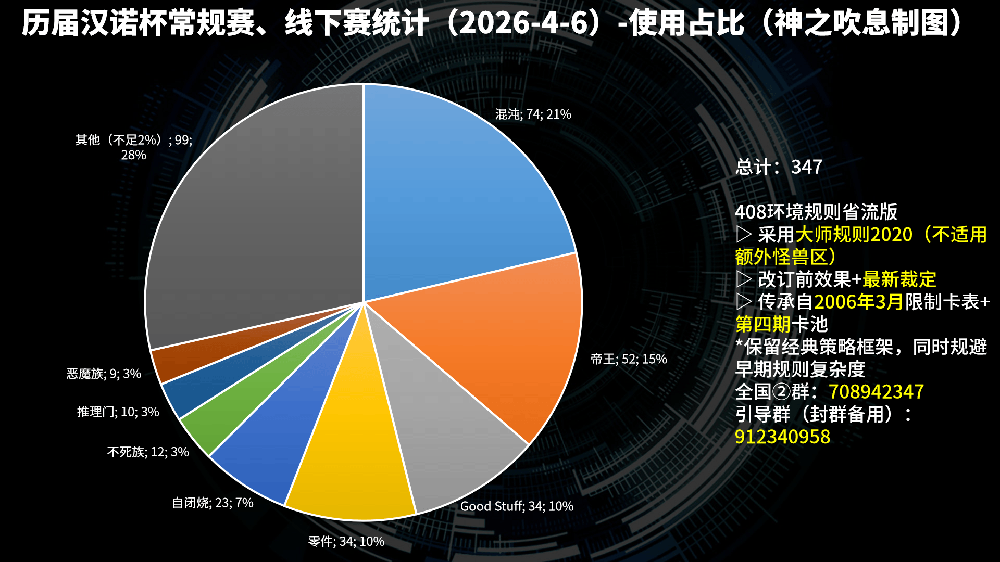
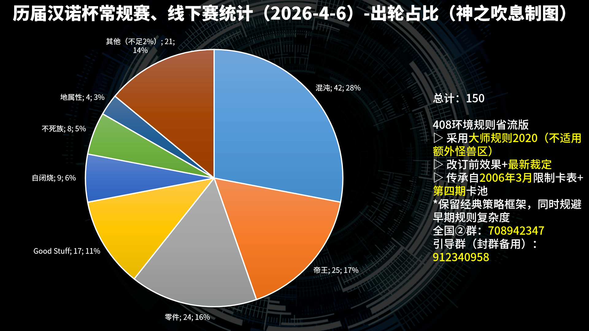
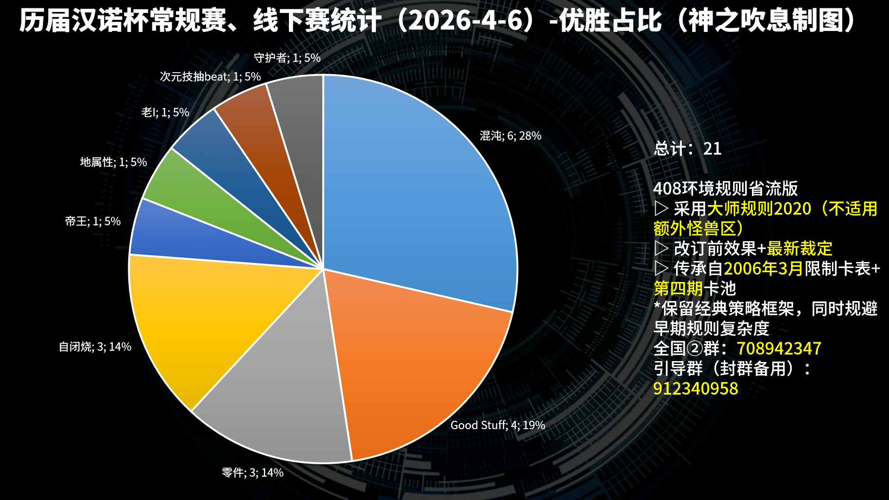

# 历届汉诺杯常规赛、线下赛统计

本站专属文，不在他站发表，会随常规赛的举办而更新。  
仅统计8人以上比赛。  

[返回比赛信息](../../../Competitions.html)  

---

## 历届汉诺杯常规赛、线下赛使用计数概括表（2026-4-6）

| 序号 | 卡组类型     | 使用数 | 使用占比 | 使用出轮数 | 使用出轮率 | 出轮占比 | 使用优胜数 | 使用优胜率 | 优胜占比 |
| ---- | ------------ | ------ | -------- | ---------- | ---------- | -------- | ---------- | ---------- | -------- |
| 1    | 混沌         | 74     | 21.33%   | 42         | 56.76%     | 28.00%   | 6          | 8.11%      | 28.57%   |
| 2    | Good Stuff   | 34     | 9.80%    | 17         | 50.00%     | 11.33%   | 4          | 11.76%     | 19.05%   |
| 3    | 帝王         | 52     | 14.99%   | 25         | 48.08%     | 16.67%   | 1          | 1.92%      | 4.76%    |
| 4    | 零件         | 34     | 9.80%    | 24         | 70.59%     | 16.00%   | 3          | 8.82%      | 14.29%   |
| 5    | 不死族       | 12     | 3.46%    | 8          | 66.67%     | 5.33%    | 0          | 0.00%      | 0.00%    |
| 6    | 恶魔族       | 9      | 2.59%    | 2          | 22.22%     | 1.33%    | 0          | 0.00%      | 0.00%    |
| 7    | 水属性       | 2      | 0.58%    | 0          | 0.00%      | 0.00%    | 0          | 0.00%      | 0.00%    |
| 8    | 反击天使     | 3      | 0.86%    | 1          | 33.33%     | 0.67%    | 0          | 0.00%      | 0.00%    |
| 9    | 地属性       | 6      | 1.73%    | 4          | 66.67%     | 2.67%    | 1          | 16.67%     | 4.76%    |
| 10   | 龙族         | 3      | 0.86%    | 0          | 0.00%      | 0.00%    | 0          | 0.00%      | 0.00%    |
| 11   | 守墓         | 5      | 1.44%    | 2          | 40.00%     | 1.33%    | 0          | 0.00%      | 0.00%    |
| 12   | 自闭烧       | 23     | 6.63%    | 9          | 39.13%     | 6.00%    | 3          | 13.04%     | 14.29%   |
| 13   | 连锁烧       | 1      | 0.29%    | 1          | 100.00%    | 0.67%    | 0          | 0.00%      | 0.00%    |
| 14   | 推理门       | 10     | 2.88%    | 1          | 10.00%     | 0.67%    | 0          | 0.00%      | 0.00%    |
| 15   | 老I          | 6      | 1.73%    | 1          | 16.67%     | 0.67%    | 1          | 16.67%     | 4.76%    |
| 16   | 卡组破坏     | 2      | 0.58%    | 0          | 0.00%      | 0.00%    | 0          | 0.00%      | 0.00%    |
| 17   | 倒计时       | 3      | 0.86%    | 0          | 0.00%      | 0.00%    | 0          | 0.00%      | 0.00%    |
| 18   | 黑魔术师     | 6      | 1.73%    | 1          | 16.67%     | 0.67%    | 0          | 0.00%      | 0.00%    |
| 19   | 次元beat     | 3      | 0.86%    | 0          | 0.00%      | 0.00%    | 0          | 0.00%      | 0.00%    |
| 20   | 狒狒         | 2      | 0.58%    | 0          | 0.00%      | 0.00%    | 0          | 0.00%      | 0.00%    |
| 21   | 昆虫族       | 4      | 1.15%    | 2          | 50.00%     | 1.33%    | 0          | 0.00%      | 0.00%    |
| 22   | 暗黑界       | 4      | 1.15%    | 0          | 0.00%      | 0.00%    | 0          | 0.00%      | 0.00%    |
| 23   | 凡骨beat     | 4      | 1.15%    | 2          | 50.00%     | 1.33%    | 0          | 0.00%      | 0.00%    |
| 24   | 控制权夺取   | 1      | 0.29%    | 0          | 0.00%      | 0.00%    | 0          | 0.00%      | 0.00%    |
| 25   | 神炎皇       | 5      | 1.44%    | 0          | 0.00%      | 0.00%    | 0          | 0.00%      | 0.00%    |
| 26   | 技抽beat     | 3      | 0.86%    | 1          | 33.33%     | 0.67%    | 0          | 0.00%      | 0.00%    |
| 27   | 翻翻乐       | 3      | 0.86%    | 1          | 33.33%     | 0.67%    | 0          | 0.00%      | 0.00%    |
| 28   | Beat burn    | 2      | 0.58%    | 0          | 0.00%      | 0.00%    | 0          | 0.00%      | 0.00%    |
| 29   | 元素英雄     | 2      | 0.58%    | 0          | 0.00%      | 0.00%    | 0          | 0.00%      | 0.00%    |
| 30   | 机械族       | 3      | 0.86%    | 0          | 0.00%      | 0.00%    | 0          | 0.00%      | 0.00%    |
| 31   | 次元技抽beat | 3      | 0.86%    | 2          | 66.67%     | 1.33%    | 1          | 33.33%     | 4.76%    |
| 32   | 融合beat     | 1      | 0.29%    | 0          | 0.00%      | 0.00%    | 0          | 0.00%      | 0.00%    |
| 33   | 光属性       | 2      | 0.58%    | 0          | 0.00%      | 0.00%    | 0          | 0.00%      | 0.00%    |
| 34   | 装备beat     | 1      | 0.29%    | 0          | 0.00%      | 0.00%    | 0          | 0.00%      | 0.00%    |
| 35   | 赌博         | 1      | 0.29%    | 0          | 0.00%      | 0.00%    | 0          | 0.00%      | 0.00%    |
| 36   | 电子龙       | 2      | 0.58%    | 0          | 0.00%      | 0.00%    | 0          | 0.00%      | 0.00%    |
| 37   | 沉默魔术师   | 1      | 0.29%    | 0          | 0.00%      | 0.00%    | 0          | 0.00%      | 0.00%    |
| 38   | 魔法师族     | 2      | 0.58%    | 1          | 50.00%     | 0.67%    | 0          | 0.00%      | 0.00%    |
| 39   | 黑炎龙       | 2      | 0.58%    | 1          | 50.00%     | 0.67%    | 0          | 0.00%      | 0.00%    |
| 40   | 战士族       | 1      | 0.29%    | 0          | 0.00%      | 0.00%    | 0          | 0.00%      | 0.00%    |
| 41   | 熊猫beat     | 1      | 0.29%    | 0          | 0.00%      | 0.00%    | 0          | 0.00%      | 0.00%    |
| 42   | 纳祭         | 2      | 0.58%    | 1          | 50.00%     | 0.67%    | 0          | 0.00%      | 0.00%    |
| 43   | 沉默剑士     | 1      | 0.29%    | 0          | 0.00%      | 0.00%    | 0          | 0.00%      | 0.00%    |
| 44   | 守护者       | 1      | 0.29%    | 1          | 100.00%    | 0.67%    | 1          | 100.00%    | 4.76%    |
| 45   | 突击命令     | 1      | 0.29%    | 0          | 0.00%      | 0.00%    | 0          | 0.00%      | 0.00%    |
| 46   | 究极龙骑士   | 1      | 0.29%    | 0          | 0.00%      | 0.00%    | 0          | 0.00%      | 0.00%    |
| 47   | 自爆开关     | 1      | 0.29%    | 0          | 0.00%      | 0.00%    | 0          | 0.00%      | 0.00%    |
| 48   | 武藤游戏     | 1      | 0.29%    | 0          | 0.00%      | 0.00%    | 0          | 0.00%      | 0.00%    |
| 49   | 扰乱         | 1      | 0.29%    | 0          | 0.00%      | 0.00%    | 0          | 0.00%      | 0.00%    |
| 总计 |              | 347    |          | 150        |            |          | 21         |            |          |

**使用数**：实际参赛，对比赛产生影响的卡组类型数目，分类并非绝对严格。  
**使用占比**：各卡组类型在使用数总计中的占比。  
**使用出轮数**：实际参赛的卡组类型中从瑞士轮进入淘汰赛的数目，包括让位顶上的。  
**使用出轮率**：某类卡组的出轮玩家与使用者的比例，计算方式为：**使用出轮数/使用数×100%**。  
**出轮占比**：各卡组类型在使用出轮数总计中的占比。  
**使用优胜率**：某类卡组的优胜玩家与使用者的比例，计算方式为：**使用优胜数/使用数×100%**。  
**优胜占比**：各卡组类型在使用优胜数总计中的占比。  
以上数据均已排除出轮后的犯规参赛者。  

## 统计饼图

    
     
    历届汉诺杯常规赛、线下赛统计-使用占比

---

    
     
    历届汉诺杯常规赛、线下赛统计-出轮占比

---

    
     
    历届汉诺杯常规赛、线下赛统计-优胜占比

