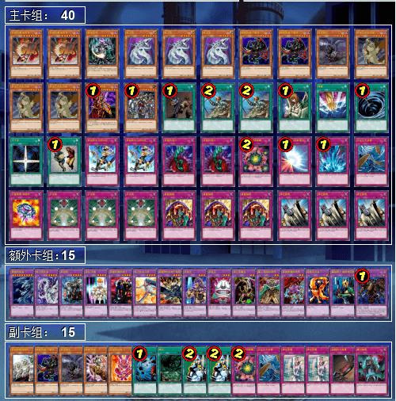
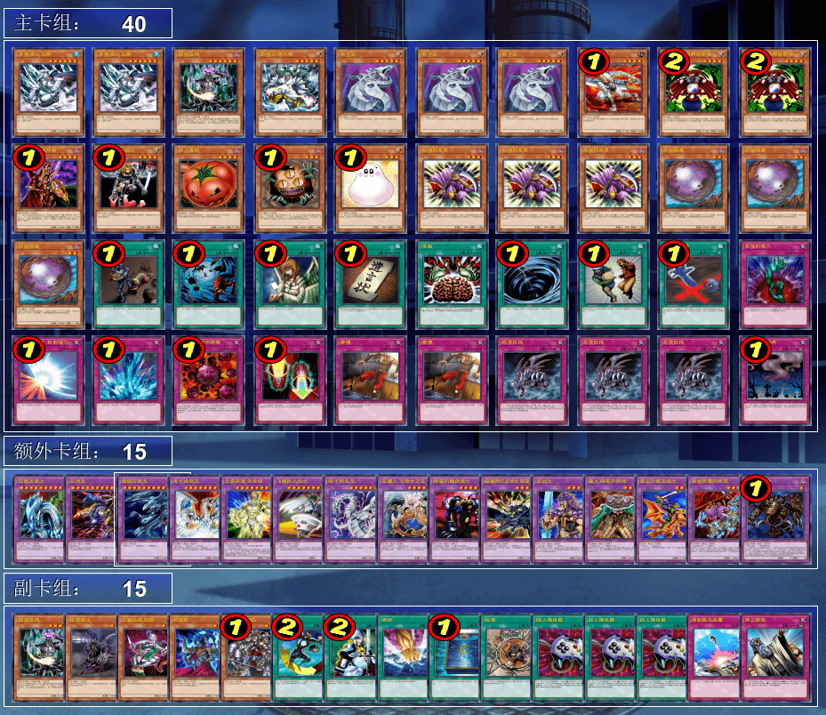
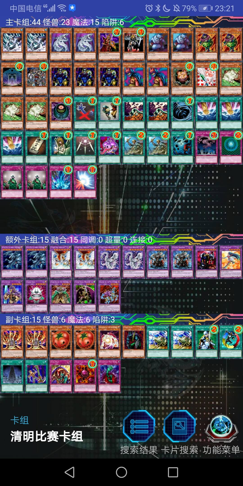
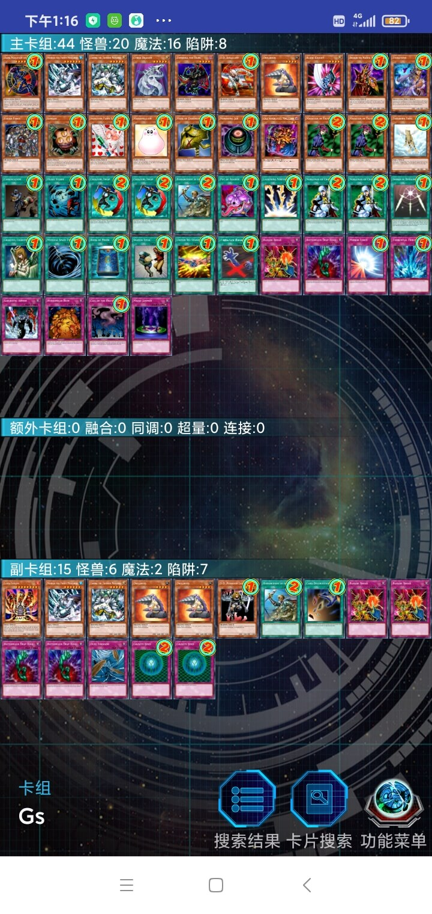
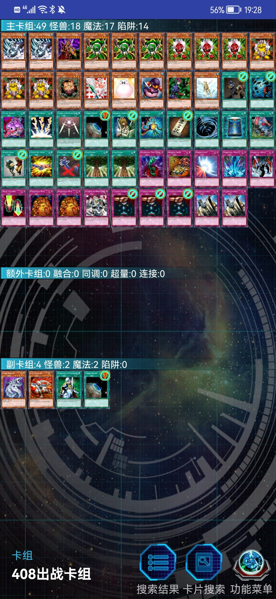
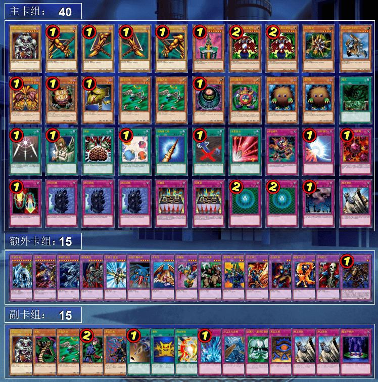

# 第十届汉诺杯战报（常规赛）

比赛时间 2022年4月3日 14:00
本比赛卡组构筑与历史上的上位思路会有少量差别
卡池：前四期（1999-2006.4）OCG卡池
卡表：2006年3月限制卡表
规则：大师规则2020（无额外怪兽区，调整裁定按233服408端口处理结果）
比赛原文：【地址】

[返回比赛信息](../../../Competitions.html)  

---

## 先说比赛结果
冠军：次元技抽beat（未知生命体）  
亚军：零件（冰火仙）  
季军：不死族（虹霓）  
殿军：Good Stuff（YUAN）  

    

根据本次比赛举办的情况来看，不熟悉瑞士轮的参赛者还是有的，本次比赛存在2位参赛者以为一开始就是淘汰赛，瑞士轮第一轮之后以为输了就退出了，其中一位更是直接出门无法继续参赛，白送后面三轮的对手不战胜，惨。另外，有位参赛者明知道比赛当天要上课依然参加，中途直接缺席，后来告知其只要多赢一轮即可进入8强也依然认为不太可能出轮放弃比赛，令人惋惜。本文不发详细战术，仅简单介绍一下卡组思路，有需要可以另外问。欢迎把本文作为“遗老”玩家的参考以及现环境玩家的娱乐阅读资料。大家可以发表自己的看法，互相讨论！日常打牌群708942347。
直播回放视频：【地址】

## 冠军：次元技抽beat

第一轮 Good Stuff ××  
第二轮 黑魔术师×○○  
第三轮 技抽beat ○×○  
第四轮 帝王○○  
八强 帝王○○  
准决赛 不死族○×○  
决赛 零件○○  

    
     
    未知生命体在本群中经常不吝分享各种实用卡组，上一届比赛的冠军更是直接使用了其分享的卡组，1卡未改。虽然上届比赛人数不足13，只选出4强，导致瑞士轮积分第5的未知生命体无缘淘汰赛，但冠军使用的是未知生命体的卡组，因此未知生命体在也事精神上的冠军，事无冕之王（笑）。回到正题，未知的这个卡组较为报社，有2种类共6张贴纸，搭载次元和技抽2个系统。原本6贴纸的卡手率非常高，以前笔者在使用3大宇宙3次元的裂缝之时体会过，但这次未知生命体采用的是3大宇宙3技能抽取的构筑，2种贴纸的战术作用明显不同，即使一同上手，也不会显得卡手，反而能给予对方双重精神打击。这两个系统互为补充，beat能力不弱，大部分情况即使抽到的贴纸与怪兽不对应，也能通过贴纸和坑争取时间抽到另一种贴纸。另外本人不得不佩服大十字的投入，这让整个卡组多了1张黑洞，间接无视限制卡表（笑）。

## 亚军：零件

第一轮 不死族××  
第二轮 融合beat ○○（不战而胜）  
第三轮 Good Stuff ○○  
第四轮 Good Stuff ○○  
八强 零件×○○  
准决赛 Good Stuff ○×○  
决赛 次元技抽beat ××  

    
     
    经典的零件卡组，冰火仙还是与上一次一样使用他的6齿构筑的40零件。卡组内容只是轻微调整，相关的评价上次比赛已经说过，这里就不赘述了。

## 季军：不死族

第一轮 零件○○  
第二轮 零件○○  
第三轮 Good Stuff ○○  
第四轮 Good Stuff ○××  
八强 Good Stuff ○○  
准决赛 次元技抽beat×○×  
季军争夺战 Good Stuff ×○○  

    
     
    虹霓比起上次第八届参赛时的卡组构筑去掉了仙鹤，投入了王虎，难怪他在瑞士轮对上零件的时候能够全胜（笑）。削魂的死灵也多投入了1，以便金字塔龟能将其特殊召唤，然后发动死之卡组破坏病毒（旧效果）进行场上与手卡的控制。卡组其余构筑没有改动。

## 殿军：Good Stuff
第一轮 融合beat ○○  
第二轮 Good Stuff ○○  
第三轮 零件○○  
第四轮 不死族×○○  
八强 技抽beat ○○  
准决赛 零件×○×  
季军争夺战 不死族○××  

    
     
    也许是YUAN在群里的日常决斗中发现两个卡组互相beat好久都还是锁血状态胜负难分，因此他在主卡组足足投入了⑨张具有伤害效果的卡。YUAN的Good Stuff还是挺标准的，但似乎对自闭的对策只有主卡组的2冰帝，幸好本次没有自闭烧类卡组，不然他可能得吃点苦头。无论如何，有名次就是实力的证明，希望YUAN下次的比赛能再接再厉。

---

以下是其他各参赛者的卡组，算是技术分享。

    
     
    八强 古代的志浩：9齿40卡血代零件，但是通告向

---

    
     
    八强 耀眼：明显的《混沌力量：城之内》的AI卡组风格，暂且归入Good Stuff罢（心虚）

---

    
     
    八强 rl：技抽beat，投入了大量的遗言怪兽以规避技能抽取对自己的负面影响

---

    
     
    八强 只房：暂且归类为帝王罢（二度心虚）

---

    
     
    参赛者 反则中级高手：不错的Good Stuff，可惜因晚上没有时间参与淘汰赛而只能忍痛退赛将名额让给第九名

---

    
     
    参赛者 EGCLM：机械族卡组，明明再打赢一局就可以进入淘汰赛却弃权的屑（半恼）

---

    
     
    参赛者 Playmaker：投入了大地力量的9齿40卡血代零件，这样零件就几乎卡均天空侠了（笑）

---

    
     
    参赛者 逃之夭夭：黑魔术师卡组，过于魂

---

    
     
    参赛者 TabYz：老I，本群的“剧本杀”（剧情决斗）作者，卡组十分魂。有些决斗（差点）反杀主流狗，令人拍案叫绝

---

    
     
    参赛者 超高校级的卷王：暂且归类为融合beat罢（心虚，三回啊三回）。打完第一轮以后误以为是在淘汰赛中被淘汰就出门了，惨送后面三轮对手各一轮的不战胜，默哀

---

本届汉☆诺☆杯已完满落幕，欢迎大家加群参赛或日常娱乐！