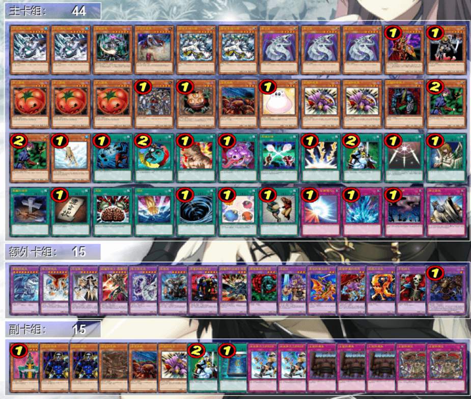

# 第十一届汉诺杯战报（常规赛）

比赛时间 2022年5月1日 14:00
本比赛卡组构筑与历史上的上位思路会有少量差别
卡池：前四期（1999-2006.4）OCG卡池
卡表：2006年3月限制卡表
规则：大师规则2020（无额外怪兽区，调整裁定按233服408端口处理结果）
比赛原文：https://www.bilibili.com/read/cv16263629/

[返回比赛信息](../../../Competitions.html)  

---

## 先说比赛结果
冠军：混沌（sanfandeng）  
亚军：守墓（回忆总最美）  
季军：地属性（321）  
殿军：零件（EGCLM）  

    

本次比赛的实际参赛人数有19人，再次打破了参赛人数纪录。衷心感谢群友カーリー渚再次协助收取录像，大大减少了本次比赛因电脑卡顿给各位参赛者造成的不便。为了提高战报制作效率，从本次起，即使是冠亚季殿军的卡组也不发详细战术，其他未取得名次的卡组也仅简单介绍一下卡组思路，有需要可以另外问。欢迎把本文作为“遗老”玩家的参考以及现环境玩家的娱乐阅读资料。大家可以发表自己的看法，互相讨论！日常打牌群708942347。  
直播回放视频：https://www.bilibili.com/video/BV1iS4y1b7wV/  

## 冠军：混沌
第一轮 自闭烧○○  
第二轮 守墓○×○  
第三轮 零件××  
第四轮 帝王○○  
第五轮 帝王○××  
八强 次元技抽beat ×○○  
准决赛 零件×○○  
决赛 守墓○×○  

    

## 亚军：守墓
第一轮 推理门○○  
第二轮 混沌×○×  
第三轮 自闭烧—○  
第四轮 帝王○×○  
第五轮 帝王××  
八强 帝王○×○  
准决赛 地属性○○  
决赛 混沌×○×  

    

## 季军：地属性
第一轮 次元技抽beat ×○×  
第二轮 黑魔术师○○  
第三轮 推理门○×○  
第四轮 零件××  
第五轮 黑魔术师○×○  
八强 零件○○  
准决赛 守墓××  
季军争夺战 零件○○  

    

## 殿军：零件
第一轮 帝王×○×  
第二轮 推理门××  
第三轮 推理门○○  
第四轮 混沌○○  
第五轮 帝王○○（对方弃权）  
八强 帝王○×○  
准决赛 混沌○××  
季军争夺战 地属性××  

    

---

以下是其他各参赛者的卡组，算是技术分享。

    
     
    八强 未知生命体：次元技抽beat，本次比赛唯一瑞士轮全胜的强者

---

    
     
    八强 只房：投入了暗属性遗言小系统的黄泉帝

---

    
     
    八强 永远的干涸：经典的45卡9齿的闪光零件

---

    
     
    八强 虹霓：不投入黄泉青蛙的遗言帝

---

    
     
    参赛者 反则中级高手：自称泥头车的机械族向推理门（笑）。原本是八强，因晚上无法参加比赛不得不弃权，把淘汰赛名额让给了第九名。让我们预祝他高考顺利罢！

---

    
     
    参赛者 RL：9帝构筑的黄泉狮子帝，可惜于第五轮瑞士轮弃权

---

    
     
    参赛者 耀眼：投入了纳祭的光属性beat，小耀眼日常整活构筑

---

    
     
    参赛者 逃之夭夭：过于魂的黑魔术师卡组，但可以构筑得稍微竞技向一点

---

    
     
    参赛者 树懒：海龙特化的水属性卡组，投入了龙卷海流壁，本次比赛中多次摆烂（笑）

---

    
     
    参赛者 冰火仙：难得一见的栗子黄泉帝

---

    
     
    参赛者 kencyan：稍微竞技向一点的黑魔术师，但还有进步空间

---

    
     
    参赛者 左拾遗：起名起得非常恶趣味的爆炎少女特化自闭烧。为了进死三恶意拖时间，甚至被本人警告之后仍然裁 目 前 犯，不进行任何操作。虽然最后被系统制裁超时杀，但由于行为太屑，影响恶劣，本人在此提出点名批评。赛后本人与其对手吐槽：投入终焉的倒计时的话不早就赢了吗！（恼）

---

    
     
    参赛者 皮：投入了魔力爆发的推理门，还好这个卡池没有电子多变龙（笑）

---

    
     
    参赛者 Kozi：混沌，但卡组截图没有排序（恼）

---

    
     
    参赛者 YUAN：经典自闭烧构筑

---

本届汉☆诺☆杯已完满落幕，欢迎大家加群参赛或日常娱乐！