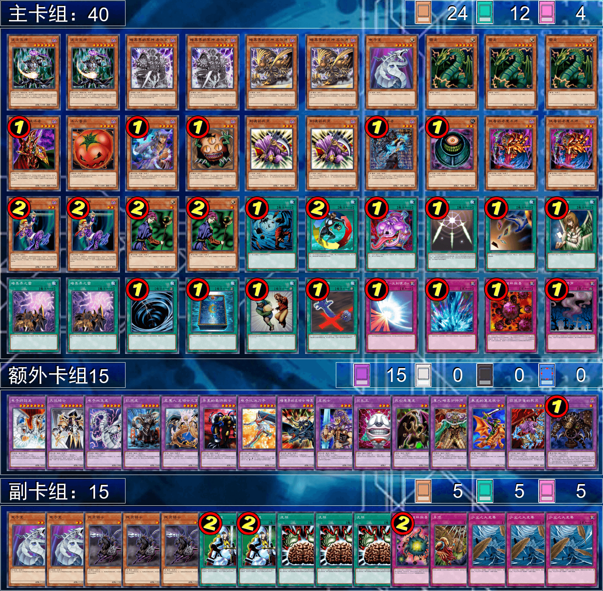

# 第十四届汉诺杯（线上线下赛区）战报（常规赛）

## 线上赛区

2022年10月2日 14:00  
本比赛卡组构筑与历史上的上位思路会有少量差别  
卡池：前四期（1999-2006.4）OCG卡池  
卡表：2006年3月限制卡表  
规则：大师规则2020（无额外怪兽区，调整裁定按233服408端口处理结果）  
比赛原文：https://www.bilibili.com/read/cv18396868/  

[返回比赛信息](../../../Competitions.html)  

---

### 先说比赛结果

冠军：零件（677）  
亚军：零件（YUAN）  
季军：混沌（EGCLM）  
殿军：混沌（冰火仙）  

    

本次比赛报名人数与实际参与人数再创新高！32人报名，28人实际参赛，差一点就可以从选拔8强变成16强了。本文不发详细战术，仅简单介绍一下卡组思路，有需要可以另外问。欢迎把本文作为“遗老”玩家的参考以及现环境玩家的娱乐阅读资料。大家可以发表自己的看法，互相讨论！日常打牌群708942347。  
直播回放视频：https://www.bilibili.com/video/BV12e4y1z7EP/  

### 冠军：零件

第一轮 推理门○○  
第二轮 零件×○○  
第三轮 混沌○○  
第四轮 不死族○○  
第五轮 帝王○○  
八强 推理门○○  
准决赛 混沌○×○  
决赛 零件○○  

    

### 亚军：零件

第一轮 混沌○○  
第二轮 零件×○○  
第三轮 帝王○○  
第四轮 自闭烧×○○  
第五轮 混沌○×○  
八强 自闭烧×○○  
准决赛 混沌○○  
决赛 零件××  

    

### 季军：混沌

第一轮 零件××  
第二轮 暗黑界○○  
第三轮 混沌×○○  
第四轮 帝王○○  
第五轮 自闭烧○○  
八强 凡骨beat ○×○  
准决赛 零件××  
季军争夺战 混沌○×○  

    

### 殿军：混沌

第一轮 装备beat ○○  
第二轮 地属性○○  
第三轮 帝王×○○  
第四轮 推理门○○  
第五轮 零件×○×  
八强 混沌×○○  
准决赛 零件×○×  
季军争夺战 混沌×○×  

    

### 以下是其他各参赛者的卡组，算是技术分享

    
     
    八强 反则中级高手：机械族向推理门，自称“泥头车”

---

    
     
    八强 未知生命体：投入了王宫的弹压与技能抽取的凡骨beat

---

    
     
    八强 虹霓：阳光男孩式经典自闭烧

---

    
     
    八强 异次元的导游：12帝构筑的黄泉狮子帝，因睡觉缺席第4轮还能出轮进入淘汰赛才让人震惊

---

    
     
    参赛者 RL：9帝构筑的黄泉狮子帝

---

    
     
    参赛者 永远的干涸：除了副卡组外直接手抄本人的7帝构筑的黄泉帝（半恼）

---

    
     
    参赛者 幸运的九木：赌博卡组，过于魂

---

    
     
    参赛者 虚渊 玄：60大卡堆，暂且归类为Beat burn

---

    
     
    参赛者 11k金：恶魔族卡组

---

    
     
    参赛者 月晴目：不死族卡组

---

    
     
    参赛者 yukinya617：60卡的Good Stuff

---

    
     
    参赛者 水母：难得的无混沌暗黑界

---

    
     
    参赛者 云中鱼：混沌卡组

---

    
     
    参赛者 花花：自闭向神炎皇卡组

---

    
     
    参赛者 死棘：混沌卡组

---

    
     
    参赛者 天上的A：自闭卡较少的神炎皇卡组

---

    
     
    参赛者 御魄：地属性卡组，有提升空间

---

    
     
    参赛者 冰老板：沉默魔术师卡组，比较魂

---

    
     
    参赛者 MgZn：装备beat卡组，有提升空间，且没有排序（半恼）

---

    
     
    参赛者 耀眼：Good Stuff，依然是整活性质

---

    
     
    参赛者 蜜桃哥：机械族向推理门

---

    
     
    参赛者 霞霞maider：难得的电子龙卡组而非仅仅是外挂打手

---

    
     
    参赛者 雨过天阴：6齿构筑的零件卡组

---

    
     
    参赛者 呜啦啦：自闭烧，打完第1轮后就直接缺席甚至退群

---

## 线下赛区

2022年10月6日 14:00  
本比赛卡组构筑与历史上的上位思路会有少量差别  
卡池：前四期（1999-2006.4）OCG卡池  
卡表：2006年3月限制卡表  
规则：大师规则2020（无额外怪兽区，调整裁定按最新）  
比赛原文：https://www.bilibili.com/read/cv18575338/  

### 先说比赛结果

冠军：零件（KinKo）  
亚军：技抽次元beat（Gaga）  
季军：狒狒（LOF）  
殿军：推理门（龙行天下）  

    

不知为何线下赛区比赛人比较少，这次也是4人大会（悲），准决赛的对阵是抽签的。本文不发详细战术，仅简单介绍一下卡组思路，有需要可以另外问。欢迎把本文作为“遗老”玩家的参考以及现环境玩家的娱乐阅读资料。大家可以发表自己的看法，互相讨论！日常打牌群708942347。
直播回放视频：https://www.bilibili.com/video/BV1jP41177pJ/  

### 冠军：零件

准决赛 狒狒○×○  
决赛 技抽次元beat ×○○  

    

### 亚军：技抽次元beat

准决赛 推理门○○  
决赛 零件○××  

    

### 季军：狒狒

准决赛 零件×○×  
季军争夺战 推理门○○  

    

### 殿军：推理门

准决赛 技抽次元beat ××  
季军争夺战 狒狒××  

    

---

本届汉☆诺☆杯已完满落幕，欢迎大家加群参赛或日常娱乐！