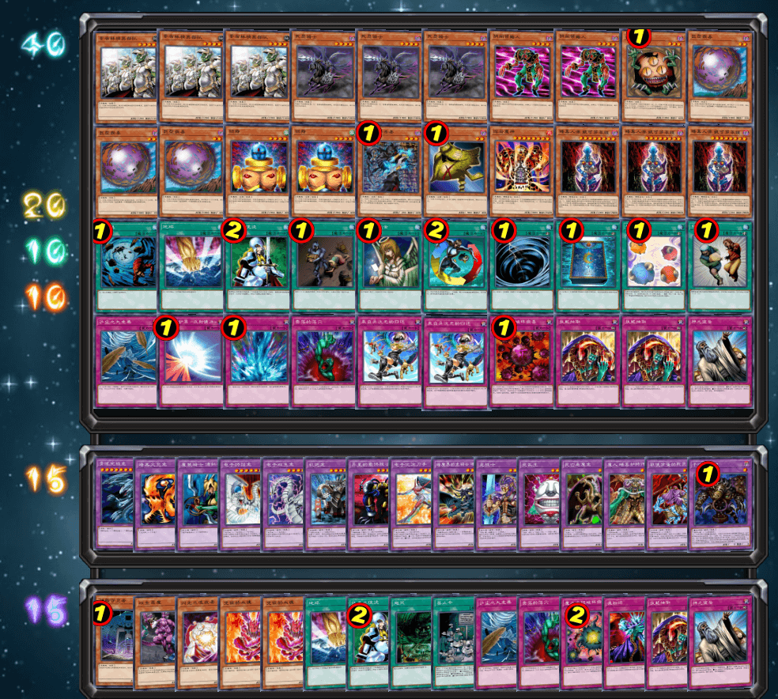

# 第十六届汉诺杯战报（常规赛）

开赛时间：2023年10月5日 13:00  
本比赛卡组构筑与历史上的上位思路会有少量差别  
卡池：前四期（1999-2006.4）OCG卡池  
卡表：2006年3月限制卡表  
规则：大师规则2020（无额外怪兽区，调整裁定按233服408端口处理结果）  
比赛原文：https://www.bilibili.com/read/cv26460431  

[返回比赛信息](../../../Competitions.html)  

---

## 先说比赛结果

冠军：零件（阿伟）  
亚军：恶魔族（未知生命体）  
季军：混沌（树赖）  
殿军：零件（YUAN）  

    

本次只有13人参赛。本文不发详细战术，仅简单介绍一下卡组思路，有需要可以另外问。欢迎把本文作为“遗老”玩家的参考以及现环境玩家的娱乐阅读资料。大家可以发表自己的看法，互相讨论！日常打牌群708942347。
直播回放视频：https://www.bilibili.com/video/BV1Dj411b75f/

## 冠军：零件

第一轮 帝王×○×
第二轮 混沌○○
第三轮 Good Stuff ○○
第四轮 恶魔族○○
八强 混沌○×○
半决赛 零件×○○
决赛 恶魔族○×○

    

## 亚军：恶魔族

第一轮 混沌×○○
第二轮 混沌×○×
第三轮 暗黑界○×○
第四轮 零件××
八强 Good Stuff ○×○
半决赛 混沌×○○（G3断线杀）
决赛 零件×○×

    

## 季军：混沌

第一轮 Good Stuff ×○○
第二轮 恶魔族○×○
第三轮 帝王×○×
第四轮 帝王×○×
八强 帝王○×○
半决赛 恶魔族○××（G3断线杀）
季军争夺战 零件○×○

    

## 殿军：零件

第一轮 暗黑界○○
第二轮 零件○×○
第三轮 帝王××
第四轮 帝王○○
八强 帝王○○
半决赛 零件○××
季军争夺战 混沌×○×

    

---

## 以下是其他各参赛者的卡组，算是技术分享

    
     
    八强 RL：9帝王的黄泉狮子帝

---

    
     
    八强 丰收鱼：很少见的仅挂1组零件的Good Stuff

---

    
     
    八强 虐昊：7帝王的遗言向黄泉帝

---

    
     
    八强 冰火仙：电子死灵轴闪光混沌

---

    
     
    参赛者 MZombie：投入了多种融合怪兽的英雄，十分娱乐

---

    
     
    参赛者 不爆人不断人不生气不计较的娱乐玩家：干涸日常换ID，闪光除去零件

---

    
     
    参赛者 gd小龙：经典遗言混沌

---

    
     
    参赛者 天上的A：纯度较高的暗黑界

---

    
     
    参赛者 EGCLM：外挂了沉默剑士的遗言混沌

---

本届汉☆诺☆杯已完满落幕，欢迎大家加群参赛或日常娱乐！