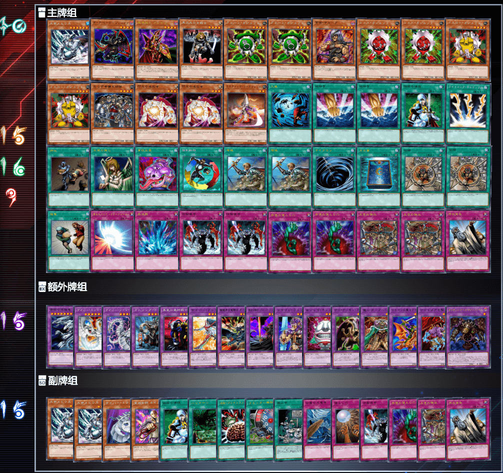

# 第十七届汉诺杯战报（常规赛）

开赛时间：2023年12月30日 13:00  
卡池：前四期（1999-2006.4）OCG卡池  
卡表：2006年3月限制卡表  
规则：大师规则2020（不适用额外怪兽区，调整裁定按233服408端口处理结果）  
比赛原文：https://www.bilibili.com/read/cv28565695  

[返回比赛信息](../../../Competitions.html)  

---

## 比赛结果

冠军：混沌（jun）  
亚军：混沌（虐昊）  
季军：混沌（YUAN）  
殿军：混沌（冰火仙）  

    

时间荏苒，光阴似箭，充满奇迹与幻想的2023如白马过隙般到了年末，我们即将迎来崭新的2024。这次报名人数24人，全员出勤，感谢各位参赛者对汉☆诺☆杯的大力支持。本届比赛赛程进展神速，未达晚上6点已全部完毕，耗时不足5小时竟可打完4轮瑞士轮+8强淘汰赛（3轮）。本人在此提前祝各位元旦快乐！感谢LOF、B、EGCLM、Gaga、冰老板、YUAN、虹霓等多位群员为历届汉☆诺☆杯中至少一届提供奖品、奖金（以上排名不分先后）。本文仅简单介绍卡组，有需要可以评论问思路。欢迎发表看法，互相讨论！日常打牌群708942347。直播回放：https://www.bilibili.com/video/BV1jC4y1N7a2/ 。  

## 冠军：混沌

第一轮 帝王○×○  
第二轮 零件○×○  
第三轮 混沌×○×  
第四轮 混沌○○  
八强 帝王○×○  
半决赛 混沌○○  
决赛 混沌○×○  

    

## 亚军：混沌

第一轮 次元beat ○○  
第二轮 混沌○○  
第三轮 帝王○○  
第四轮 混沌××  
八强 混沌○○  
半决赛 混沌×○○  
决赛 混沌×○×  

    

## 季军：混沌

第一轮 帝王○×○  
第二轮 混沌××  
第三轮 次元技抽beat ×○○  
第四轮 守墓○○  
八强 帝王○○  
半决赛 混沌○××  
季军争夺战 混沌○×○  

    

## 殿军：混沌

第一轮 零件○○  
第二轮 次元技抽beat ×○○  
第三轮 混沌○×○  
第四轮 混沌○○  
八强 黑炎龙○○  
半决赛 混沌××  
季军争夺战 混沌×○×  

    

---

## 以下是其他各参赛者的卡组，算是技术分享

    
     
    八强 桐生清子：历届汉☆诺☆杯首次出现的黑炎龙

---

    
     
    八强 EGCLM：投入沉默剑士 LV5与恶魔科学怪人的混沌

---

    
     
    八强 RL：9帝构筑的黄泉狮子帝

---

    
     
    八强 狗娃：投入了伟大魔兽 加泽特、加农炮兵的卡组，暂且归为帝王？

---

    
     
    参赛者 未知生命体：6齿构筑的40弹压零件

---

    
     
    参赛者 反则中级高手：经常创造当轮最速传说的推理门，自称泥头车

---

    
     
    参赛者 耀眼：没有额外卡组和副卡组的恶魔族

---

    
     
    参赛者 左拾遗：4种类8帝构筑的黄泉狮子帝

---

    
     
    参赛者 gd小龙：意料之外投入混沌之黑魔术师的守墓

---

    
     
    参赛者 我非我：更像是自闭烧的神炎皇

---

    
     
    参赛者 十二：4种类12帝构筑的黄泉狮子帝

---

    
     
    参赛者 筱（xiǎo）晓：投入忍者侦察机系统的次元beat

---

    
     
    参赛者 阿伟：9齿构筑的弹压零件

---

    
     
    参赛者 MZombie青锋：投入了若干beat卡的60卡自闭烧

---

    
     
    参赛者 丰收鱼：次元技抽beat

---

    
     
    参赛者 水果拼：《不拖节奏》倒计时

---

    
     
    参赛者 月晴目：很有隔壁赛制味道的Good Stuff

---

    
     
    参赛者 球体时限炸弹：兼具burn和卡组破坏的翻翻乐

---

    
     
    参赛者 高：6帝+坑、无黄泉青蛙构筑的狮子帝

---

    
     
    参赛者 汉诺伊骑士：49卡无额外卡组、副卡组的Good Stuff

---

本届汉☆诺☆杯已完满落幕，欢迎大家加群参赛或日常娱乐！