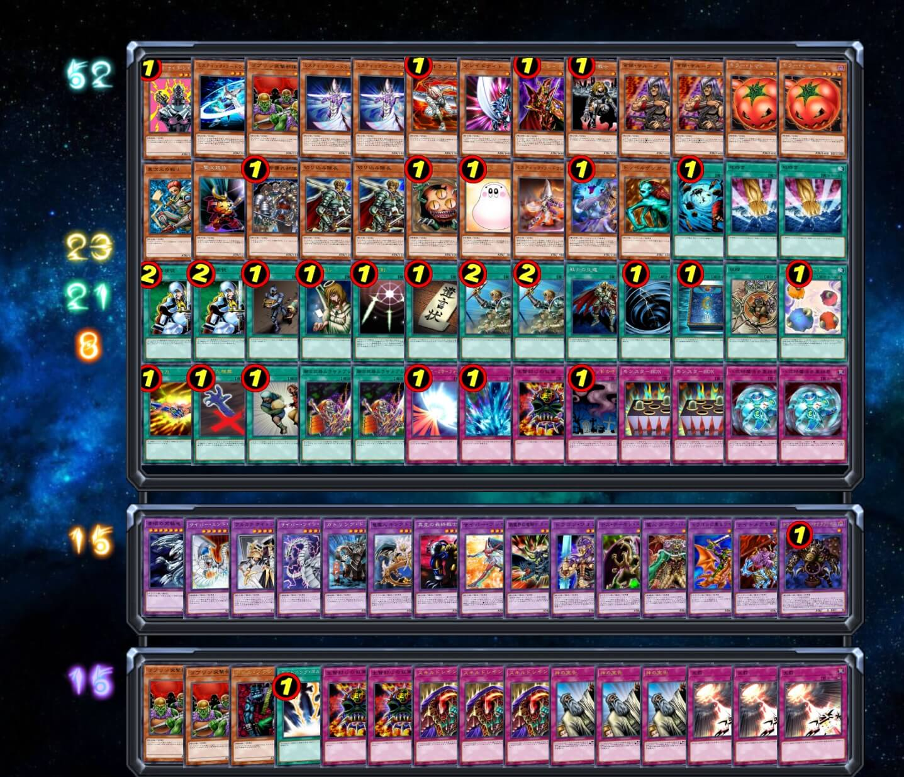

# 第二十届汉诺杯战报（常规赛）

开赛时间：2024年5月4日 13:00
卡池：前四期（1999-2006.4）OCG卡池
卡表：2006年3月限制卡表
规则：大师规则2020（不适用额外怪兽区，调整裁定按233服408端口处理结果）
比赛原文：https://www.bilibili.com/read/cv33788581/

[返回比赛信息](../../../Competitions.html)  

---

## 比赛结果

冠军：混沌（虐昊）  
亚军：混沌（Daniel408）  
季军：混沌（卡卡帝）  
殿军：黑魔术师（未知生命体）  

    

18人参加，实到17人，2人中途退赛。本次比赛的亮点有2：黑魔术师卡组进入四强；某出轮参赛选手以为自己无缘出轮离开而被缺席杀（悲）。感谢LOF、B、EGCLM、Gaga、冰老板、YUAN、旦挞王子（线下）、虹霓、果拼、丰收鱼、gd小龙、卡卡帝等多位群员，以及若干不愿意透露姓名的决斗者为历届汉☆诺☆杯中至少一届提供奖品、奖金（以上排名不分先后，如有遗漏请提出）。本文仅简单介绍卡组，有需要可以评论问思路。欢迎发表看法，互相讨论！日常打牌群708942347。直播回放：https://www.bilibili.com/video/BV1Ef421D7PY  

## 冠军：混沌

第一轮 地属性○○  
第二轮 混沌×○×  
第三轮 混沌×○○  
第四轮 不死族×○○  
八强 Good Stuff ○×○  
半决赛 混沌○×○  
决赛 混沌○○  

    

## 亚军：混沌

第一轮 混沌○○  
第二轮 熊猫beat ○○  
第三轮 混沌××  
第四轮 黑魔术师×○○  
八强 混沌○×○  
半决赛 黑魔术师○○  
决赛 混沌××  

    

## 季军：混沌

第一轮 自闭烧×○○  
第二轮 混沌○×○  
第三轮 混沌○○  
第四轮 混沌○××  
八强 零件○○  
半决赛 混沌×○×  
季军争夺战 黑魔术师○×○  

    

## 殿军：黑魔术师

第一轮 混沌××  
第二轮 轮空
第三轮 零件○○  
第四轮 混沌○××  
八强 混沌×○○  
半决赛 混沌××  
季军争夺战 混沌×○×  

    

---

以下是其他各参赛者的卡组，算是技术分享。

    
     
    八强 沉晨：45卡组的9齿闪光弹压零件

---

    
     
    八强 Q：陷阱投入比较少的混沌

---

    
     
    八强 初代游戏：43卡组、不怎么依赖混沌巫师的good stuff，主卡双生恶魔

---

    
     
    八强 6：投入了较多战士族怪兽的混沌

---

    
     
    参赛者 YUAN：投入了3哥布林僵尸的不死族

---

    
     
    参赛者 永远的干涸：45卡组9齿的闪光零件

---

    
     
    参赛者 冰火仙：9帝构筑的栗子黄泉帝

---

    
     
    参赛者 gd小龙：难得的熊猫beat，主卡双生恶魔

---

    
     
    参赛者 正义的同伴 海马侠：投入了仪式白龙轴的混沌

---

    
     
    参赛者 熊哥：外挂魔杂turbo的反转向混沌

---

    
     
    参赛者 丰收鱼：无8星大宝贝的自闭烧

---

    
     
    参赛者 暴雨心奴：外挂若干光属性上级的地属性

---

    
     
    参赛者 MZombie青锋：52战士族大卡组，比较娱乐

---

本届汉☆诺☆杯已完满落幕，欢迎大家加群参赛或日常娱乐！