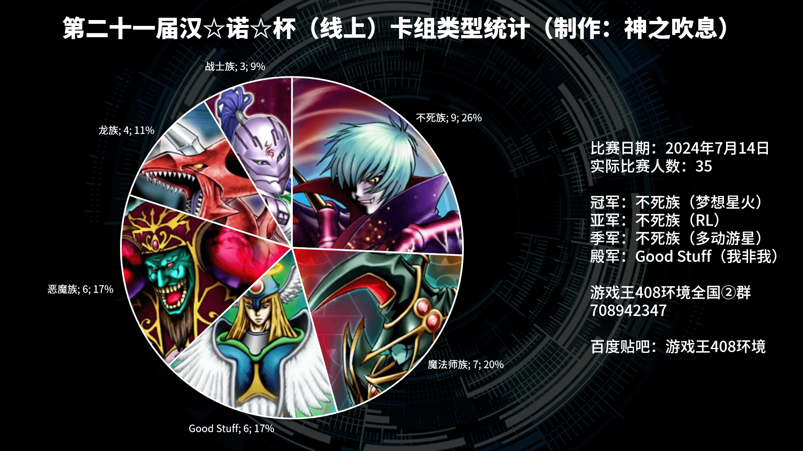

# 第二十一届汉诺杯战报（推广赛）

开赛时间：2024年7月14日 13:00  
卡池：前四期（1999-2006.4）OCG卡池  
卡表：2006年3月限制卡表  
规则：大师规则2020（不适用额外怪兽区，调整裁定按233服408端口处理结果）  
比赛原文：https://www.bilibili.com/read/cv35979533/  

[返回比赛信息](../../../Competitions.html)  

---

## 比赛结果

冠军：不死族（梦想星火）  
亚军：不死族（RL）  
季军：不死族（多动游星）   
殿军：Good Stuff（我非我）  

    

建立408环境以来搞的比赛从来没试过这么多人：43人报名，实到35人，7人中途缺席或退赛，无论是报名还是实际参与人数都是历届之最。一开始可把我忙坏了，当然这也暴露了现在赛务方案只针对少数人参加的弊端、弱点，有问题趁早整改，也不失为一件好事。感谢LOF、B、EGCLM、Gaga、冰老板、YUAN、旦挞王子（线下）、虹霓、果拼、丰收鱼、gd小龙、卡卡帝、Daniel等多位群员，以及若干不愿意透露姓名的决斗者为历届汉☆诺☆杯中至少一届提供奖品、奖金（以上排名不分先后，如有遗漏请提出）。本文仅简单介绍卡组，有需要可以评论问思路。欢迎发表看法，互相讨论！日常打牌群708942347。直播回放：https://www.bilibili.com/video/BV1JS411w7Lg/  

## 冠军：不死族

第一轮 Good Stuff OO  
第二轮 恶魔族×OO  
第三轮 龙族OO  
第四轮 Good Stuff O×O  
十六强 魔法师族OO  
八强 魔法师族OO  
半决赛 Good Stuff O×O  
决赛 不死族×OO（G3对方弃权）

## 亚军：不死族

第一轮 不战而胜
第二轮 战士族OO  
第三轮 魔法师族××  
第四轮 恶魔族×OO  
十六强 恶魔族OO  
八强 Good Stuff ×OO  
半决赛 不死族OO  
决赛 不死族O××（G3弃权）  

## 季军：不死族

第一轮 恶魔族O××  
第二轮 轮空
第三轮 龙族O×O（G3断线杀）  
第四轮 恶魔族×OO  
十六强 Good Stuff OO  
八强 魔法师族×OO  
半决赛 不死族××  
季军争夺战 Good Stuff O×O  

## 殿军：Good Stuff

第一轮 Good Stuff O×O  
第二轮 龙族×OO  
第三轮 不死族OO  
第四轮 不死族×O×  
十六强 不死族OO  
八强 魔法师族×OO  
半决赛 不死族×O×  
季军争夺战 不死族×O×  

## 十六强卡组构成

不死族6  
魔法师族4  
Good Stuff 4  
恶魔族1  
战士族1  

## 八强卡组构成

不死族3  
魔法师族3  
Good Stuff 2  

---

本届汉☆诺☆杯已完满落幕，欢迎大家加群参赛或日常娱乐！