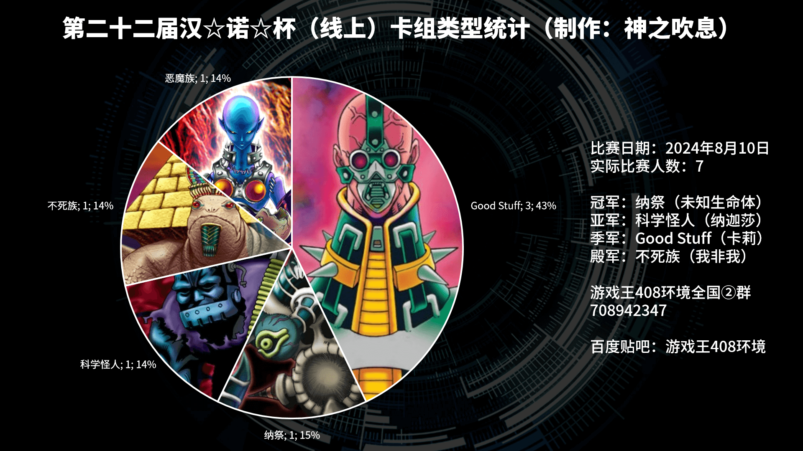
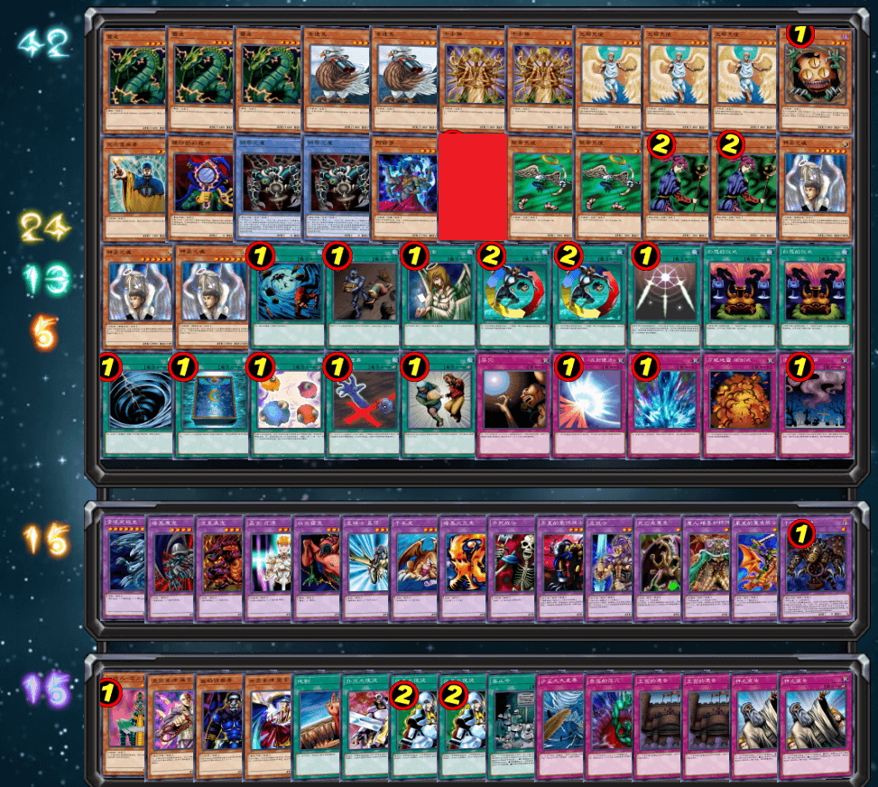
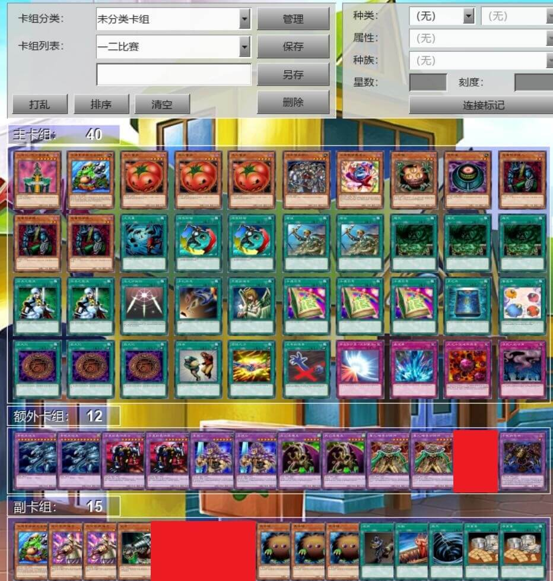
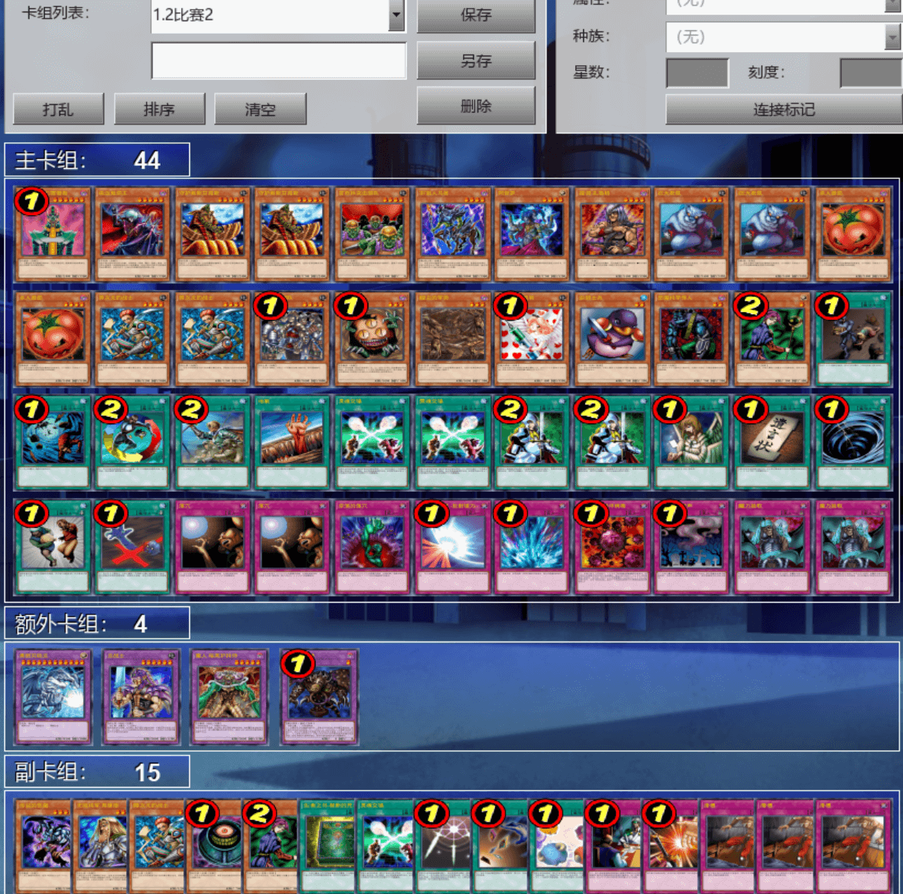
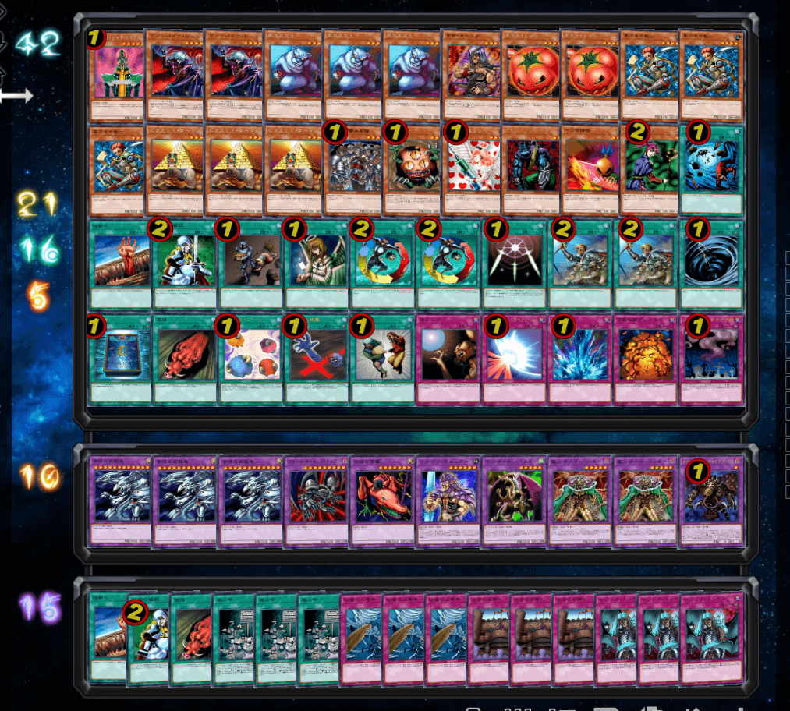
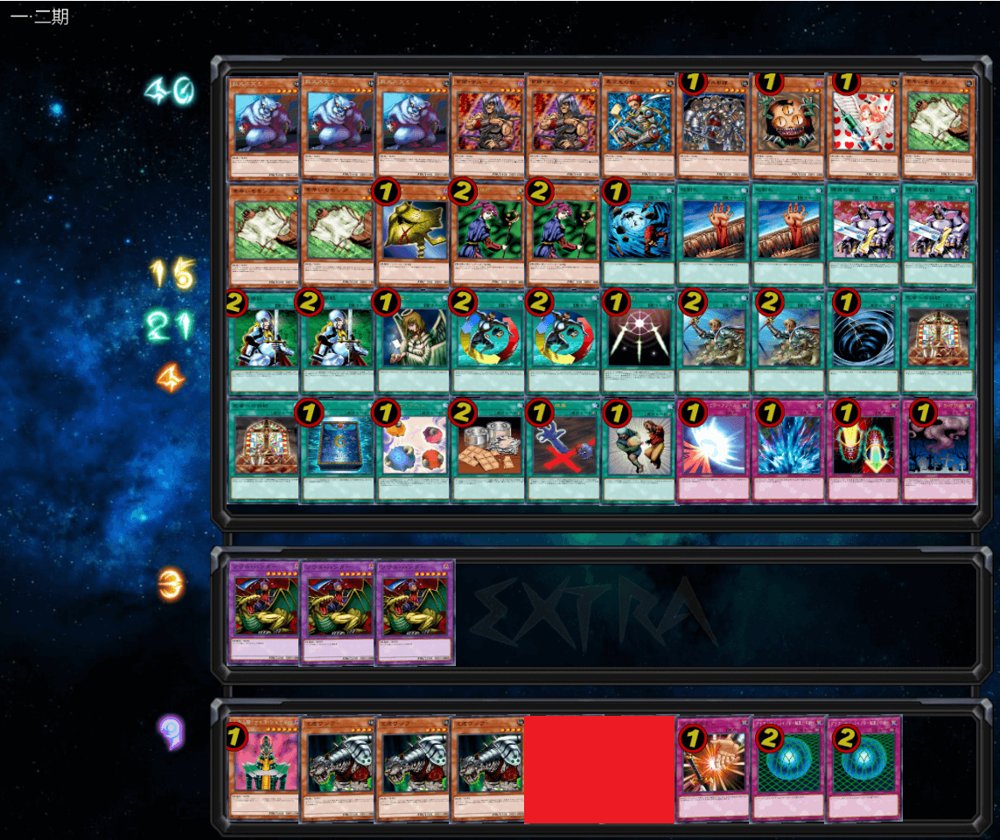
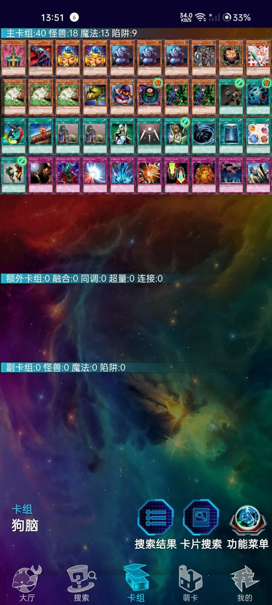
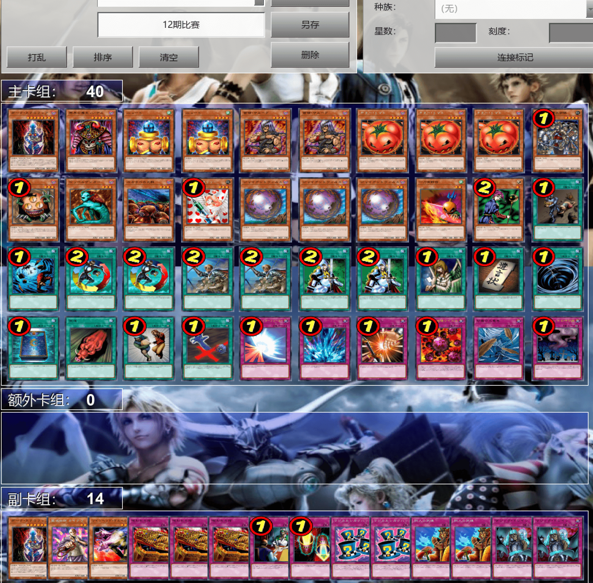

# 第二十二届汉诺杯战报（整活赛）

开赛时间：2024年8月10日 13:00  
卡池：前四期OCG卡池  
卡表：2006年3月限制卡表  
规则：大师规则2020（不适用额外怪兽区，调整裁定按233服408端口处理结果）  
比赛原文：https://www.bilibili.com/read/cv36406047  

[返回比赛信息](../../../Competitions.html)  

---

## 比赛结果

冠军：纳祭（未知生命体）  
亚军：科学怪人（纳迦莎）  
季军：Good Stuff（卡莉）  
殿军：不死族（我非我）  

    

这次整活赛可能变动有丶大，且要不是有人提及还真没注意到就是七夕（笑），参赛者少了点，7人参加，实到7人。人少但完结最快的一次，且进一步采用更自动化的方式处理赛务，比赛群中刷屏的情况有所缓解，也算是有收获。感谢LOF、B、EGCLM、Gaga、冰老板、YUAN、旦挞王子（线下）、虹霓、果拼、丰收鱼、gd小龙、卡卡帝、Daniel、亓等多位群员，以及若干不愿意透露姓名的决斗者为历届汉☆诺☆杯中至少一届提供奖品、奖金（以上排名不分先后，如有遗漏请提出）。本文仅简单介绍卡组，有需要可以评论问思路。欢迎发表看法，互相讨论！日常打牌群708942347。直播回放：https://www.bilibili.com/video/BV1pU411S7rK  

## 冠军：纳祭

第一轮 不死族○××  
第二轮 Good Stuff ○×○（G1卡表杀）  
第三轮 Good Stuff ○○  
半决赛  Good Stuff ○×○  
决赛 科学怪人×○○  

    

## 亚军：科学怪人

第一轮 恶魔族×○○  
第二轮 Good Stuff ××  
第三轮 轮空  
半决赛 不死族○○  
决赛 纳祭○××  

    

## 季军：Good Stuff

第一轮 轮空  
第二轮 不死族××  
第三轮 恶魔族○○  
半决赛 纳祭×○×  
季军争夺战 不死族○○  

    

## 殿军：不死族

第一轮 纳祭×○○  
第二轮 Good Stuff ○○  
第三轮 Good Stuff ○○  
半决赛 科学怪人××  
季军争夺战  Good Stuff ××  

    

---

以下是其他各参赛者的卡组，算是技术分享。

    
     
    参赛者 望远镜1437：地属性为主但不算特别纯属性的Good Stuff

---

    
     
    参赛者 小米割割：Good Stuff，第一轮误投入卡池外的卡被卡表杀，在修改1张卡后，第二轮继续比赛

---

    
     
    参赛者 树赖：本次比赛中牛头人得比较狂野的恶魔族卡组

---

本届汉☆诺☆杯已完满落幕，欢迎大家加群参赛或日常娱乐！