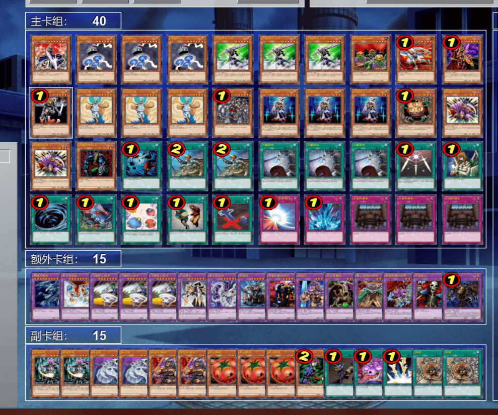
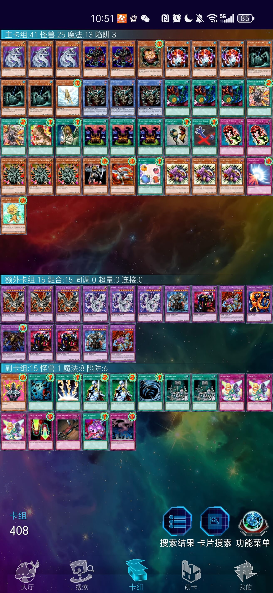

# 第二十三届汉诺杯战报（常规赛）

开赛时间：2024年10月4日 13:00  
卡池：前四期OCG卡池  
卡表：2006年3月限制卡表  
规则：大师规则2020（不适用额外怪兽区，调整裁定按MC服408端口处理结果）  
比赛原文：https://www.bilibili.com/read/cv38461277/  

[返回比赛信息](../../../Competitions.html)  

---

## 比赛结果

冠军：Good Stuff（gd小龙）  
亚军：混沌（Q）  
季军：混沌（纳迦莎）  
殿军：零件（黑色王子）  

    

再次感谢MC萌卡平提供、维持服务器，并为比赛友情宣传！本次比赛32人报名，31人实际参加，在MC萌卡平台建立服务器、宣传后，能有较多的新玩家对408环境感兴趣并参与游戏，也算是让OCG玩家们体会到了一种与OCG环境截然不同但又独具特色的快乐游戏体验，希望日后比赛规模能再接再厉！感谢LOF、B、EGCLM、Gaga、冰老板、YUAN、旦挞王子（线下）、虹霓、果拼、丰收鱼、gd小龙、卡卡帝、Daniel、亓等多位群员，以及若干不愿意透露姓名的决斗者为历届汉☆诺☆杯中至少一届提供奖品、奖金（以上排名不分先后，如有遗漏请提出）。本文仅简单介绍卡组，有需要可以评论问思路。欢迎发表看法，互相讨论！引导群（群组推荐）912340958。直播回放：https://www.bilibili.com/video/BV1pC4weiEkU  

## 十六强卡组主题分布

混沌 5  
Good Stuff 3  
零件 4  
帝王 1  
地属性 1  
守墓 1  
连锁烧 1  

## 八强卡组主题分布

混沌 2  
Good Stuff 2  
零件 1  
帝王 1  
地属性 1  
连锁烧 1  

## 冠军：Good Stuff

第一轮 老I ○○  
第二轮 混沌○×○  
第三轮 零件○○  
第四轮 Good Stuff ○○（缺席杀）  
十六强 零件○○  
八强 帝王○×○  
半决赛 混沌○○  
决赛 混沌○×○  

    

## 亚军：混沌

第一轮 Good Stuff ××  
第二轮 帝王○○  
第三轮 自闭烧—○○  
第四轮 混沌○×○  
十六强 零件○×○  
八强 连锁烧×○○  
半决赛 零件○○  
决赛 Good Stuff ×○×  

    

## 季军：混沌

第一轮 混沌○×○  
第二轮 Good Stuff ×○×  
第三轮 混沌○×○  
第四轮 零件××  
十六强 混沌×○○  
八强 地属性○○  
半决赛 Good Stuff ××  
季军争夺战 零件○×○  

    

## 殿军：零件

第一轮 不死族×○○  
第二轮 零件○○  
第三轮 Good Stuff ××  
第四轮 混沌○○  
十六强 混沌○○  
八强 Good Stuff ×○○  
半决赛 混沌××  
季军争夺战 混沌×○×  

    

---

## 以下是其他各参赛者的卡组，算是技术分享

    
     
    八强 薯片：个人特色比较明显的Good Stuff

---

    
     
    八强 冰火仙：依然是十分大胆的9帝投入黄泉帝

---

    
     
    八强 KOVATW：没有常见自闭贴纸的连锁烧

---

    
     
    八强 未知生命体：归还向地属性

---

    
     
    十六强 yuer：牲祭向守墓，弟啊你手抄也好歹把卡组名改改罢（半恼）

---

    
     
    十六强 鵺：经典混沌

---

    
     
    十六强 澜冬贝贝：纳祭轴混沌

---

    
     
    十六强 ricky：几乎一刀流的Good Stuff，变形截图看着挺难受

---

    
     
    十六强 YUAN：恶魔科学怪人向6齿40卡零件

---

    
     
    十六强 熊哥：经典遗言混沌

---

    
     
    十六强 望远镜1437：6齿地属性血代零件

---

    
     
    十六强 涸：9齿45卡零件

---

    
     
    参赛者 19cm：主卡投入闪光之追放者的不死族

---

    
     
    参赛者 余味：TCG风格的暗黑界，次元壁用出来时节目效果满分

---

    
     
    参赛者 虐昊：主卡投入双生恶魔的混沌

---

    
     
    参赛者 小猪：副卡组投入升灵术师 奘玄的混沌，顺便吐槽过于变形的截图

---

    
     
    参赛者 亓：几乎一刀流的混沌

---

    
     
    参赛者 默：主打利用额外但卡通轴只有3卡通目录的Good Stuff

---

    
     
    参赛者 球体时限炸弹：投入暗道化师 彼得的黄泉狮子帝

---

    
     
    参赛者 树赖：机械向混沌

---

    
     
    参赛者 我非我：投入飞碟机人融合轴的沉默剑士

---

    
     
    参赛者 汉诺力量：地属性战士轴黄泉狮子帝

---

    
     
    参赛者 莱万多夫期基：TCG风格比较明显的混沌

---

    
     
    参赛者 似剑非攻：副卡组可换装不死轴的混沌

---

    
     
    参赛者 c/1：融合向纳祭

---

    
     
    参赛者 决斗带来笑容：经典自闭烧

---

    
     
    参赛者 某君傲：十分大胆的推理门老I，但似乎缺少了贪欲之壶外回收头部的方法

## 本次比赛云录像密码（在MC服408端口输入、粘贴后即可观看）

| 桌号 | 轮次             | 云录像编号                                                   |
| ---- | ---------------- | ------------------------------------------------------------ |
| 1    | 瑞士轮第一轮     | R#4827830718894755                                           |
| 2    | 瑞士轮第一轮     | R#6332423691860471                                           |
| 3    | 瑞士轮第一轮     | R#3563825104458625                                           |
| 4    | 瑞士轮第一轮     | 缺席杀                                                       |
| 5    | 瑞士轮第一轮     | R#962225366578341                                            |
| 6    | 瑞士轮第一轮     | 缺席杀                                                       |
| 7    | 瑞士轮第一轮     | 缺失（到233服打且未提交）                                    |
| 8    | 瑞士轮第一轮     | R#5937183794731799（断线无效）、R#7171341047019133（有效）   |
| 9    | 瑞士轮第一轮     | R#2017938136128249                                           |
| 10   | 瑞士轮第一轮     | R#1214825855351945                                           |
| 11   | 瑞士轮第一轮     | R#6502332055886783                                           |
| 12   | 瑞士轮第一轮     | R#554467230291679                                            |
| 13   | 瑞士轮第一轮     | R#1367142642399791                                           |
| 14   | 瑞士轮第一轮     | R#3127763526743753                                           |
| 15   | 瑞士轮第一轮     | R#42045192258449                                             |
| 16   | 瑞士轮第一轮     | R#708163203885005                                            |
| 17   | 瑞士轮第二轮     | R#5269358621409693                                           |
| 18   | 瑞士轮第二轮     | R#8558117691027987                                           |
| 19   | 瑞士轮第二轮     | R#1838559943669077                                           |
| 20   | 瑞士轮第二轮     | R#5657534209681691                                           |
| 21   | 瑞士轮第二轮     | R#6230484849673629                                           |
| 22   | 瑞士轮第二轮     | R#2336431791747073                                           |
| 23   | 瑞士轮第二轮     | R#182620685542021                                            |
| 24   | 瑞士轮第二轮     | R#5052838022854323                                           |
| 25   | 瑞士轮第二轮     | R#1696559670527779                                           |
| 26   | 瑞士轮第二轮     | R#4369325097517747                                           |
| 27   | 瑞士轮第二轮     | R#1972245255425117                                           |
| 28   | 瑞士轮第二轮     | 缺席杀                                                       |
| 29   | 瑞士轮第二轮     | R#3004114416039223                                           |
| 30   | 瑞士轮第二轮     | R#661090492465319（后2G断线无效），R#4224055739451075（最后1G无效） |
| 31   | 瑞士轮第二轮     | R#1559922673279543                                           |
| 32   | 瑞士轮第二轮     | R#8621898491761771                                           |
| 33   | 瑞士轮第三轮     | R#1347427807492753（G1迟到杀）                               |
| 34   | 瑞士轮第三轮     | R#5878517220327547                                           |
| 35   | 瑞士轮第三轮     | R#3760627267746821                                           |
| 36   | 瑞士轮第三轮     | R#284375923368005                                            |
| 37   | 瑞士轮第三轮     | R#7306990693234683（G1无效），R#130140445231467（G1无效）    |
| 38   | 瑞士轮第三轮     | R#5989950680286547                                           |
| 39   | 瑞士轮第三轮     | R#8078403489718761                                           |
| 40   | 瑞士轮第三轮     | R#601619985593383                                            |
| 41   | 瑞士轮第三轮     | R#5212419545591605                                           |
| 42   | 瑞士轮第三轮     | R#384282799695299                                            |
| 43   | 瑞士轮第三轮     | R#4303733500099325                                           |
| 44   | 瑞士轮第三轮     | R#4797335775300879                                           |
| 45   | 瑞士轮第三轮     | R#3683578519594525                                           |
| 46   | 瑞士轮第三轮     | R#5324105417926401                                           |
| 47   | 瑞士轮第三轮     | R#4404674787170967                                           |
| 48   | 瑞士轮第四轮     | 缺席杀                                                       |
| 49   | 瑞士轮第四轮     | R#8942107607622291                                           |
| 50   | 瑞士轮第四轮     | R#6587945090272191                                           |
| 51   | 瑞士轮第四轮     | R#918226540891507                                            |
| 52   | 瑞士轮第四轮     | R#4054005170468787                                           |
| 53   | 瑞士轮第四轮     | R#8925081716361417                                           |
| 54   | 瑞士轮第四轮     | 一方弃权                                                     |
| 55   | 瑞士轮第四轮     | R#1741161105305833                                           |
| 56   | 瑞士轮第四轮     | R#7581538117667407                                           |
| 57   | 瑞士轮第四轮     | R#7538363004965209                                           |
| 58   | 瑞士轮第四轮     | R#8439772099465355                                           |
| 59   | 瑞士轮第四轮     | R#4692949392542511                                           |
| 60   | 瑞士轮第四轮     | R#4421028414975069                                           |
| 61   | 瑞士轮第四轮     | R#8189079403237653                                           |
| 62   | 瑞士轮第四轮     | R#555079005125195                                            |
| 1    | 淘汰赛十六强     | R#8869382227216615                                           |
| 2    | 淘汰赛十六强     | R#8553122954232895                                           |
| 3    | 淘汰赛十六强     | R#6174727475902255                                           |
| 4    | 淘汰赛十六强     | R#4870177056293513                                           |
| 5    | 淘汰赛十六强     | R#6873339726166759                                           |
| 6    | 淘汰赛十六强     | R#8891085222525337                                           |
| 7    | 淘汰赛十六强     | R#5781441044747061                                           |
| 8    | 淘汰赛十六强     | R#928516480218541                                            |
| 9    | 淘汰赛八强       | R#3715612387418509                                           |
| 10   | 淘汰赛八强       | R#6663695748208951                                           |
| 11   | 淘汰赛八强       | R#8060817199579975                                           |
| 12   | 淘汰赛八强       | R#2391348935952203                                           |
| 13   | 淘汰赛半决赛     | R#2922295994573889                                           |
| 14   | 淘汰赛半决赛     | R#7059685966560451                                           |
| 15   | 淘汰赛决赛       | R#3109097923109225                                           |
| 16   | 淘汰赛季军争夺战 | R#4571079791156045                                           |

---

本届汉☆诺☆杯已完满落幕，欢迎大家加群参赛或日常娱乐！