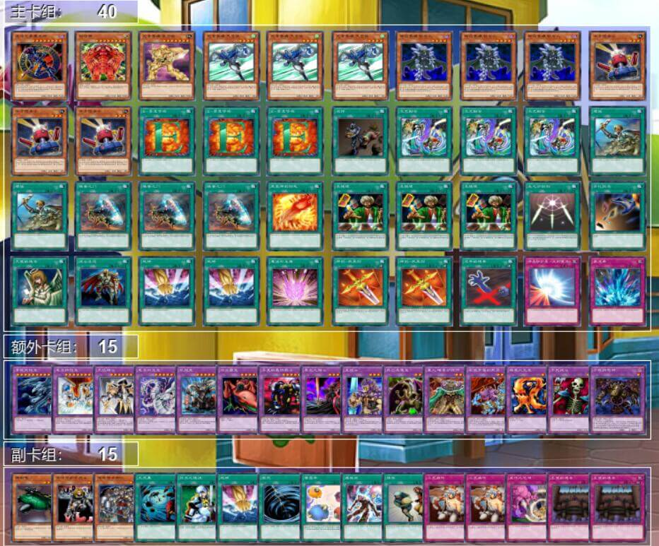

# 第二十四届汉诺杯战报（跨表赛）

开赛时间：2024年10月19日 13:00  
卡池：前四期OCG卡池+特定6张506环境卡  
卡表：2006年3月限制卡表  
规则：大师规则2020（不适用额外怪兽区，调整裁定按MC服408端口处理结果）  
比赛原文：https://www.bilibili.com/read/cv39361831/  

[返回比赛信息](../../../Competitions.html)  

---

## 比赛结果

冠军：元素英雄（含506）（未知生命体）  
亚军：帝王（含506）（阿伟）  
季军：光与暗之龙（含506）（卡卡帝）  
殿军：不死族（YUAN）  

    

本次比赛16人报名，实际13人参赛，整体而言还算是进行得比较顺利。感谢LOF、B、EGCLM、Gaga、冰老板、YUAN、旦挞王子（线下）、虹霓、果拼、丰收鱼、gd小龙、卡卡帝、Daniel、亓、薯片等多位群员，以及若干不愿意透露姓名的决斗者为历届汉☆诺☆杯中至少一届提供奖品、奖金（以上排名不分先后，如有遗漏请提出）。本文仅简单介绍卡组，有需要可以评论问思路。欢迎发表看法，互相讨论！引导群（群组推荐）912340958。直播回放：https://www.bilibili.com/video/BV1QYCoYfE6u/  

## 冠军：元素英雄（含506）

第一轮 战士族（含506）×○○  
第二轮 光与暗之龙（含506）○○  
第三轮 不死族××  
第四轮 帝王（含506）○×○  
半决赛 不死族○×○  
决赛 帝王（含506）○○  

    

## 亚军：帝王（含506）

第一轮 零件（含506）×○○  
第二轮 反击天使（含506）○○（G2掉线杀）
第三轮 推理门（含506）×○○  
第四轮 不死族○○  
半决赛 光与暗之龙（含506）○×○  
决赛 元素英雄（含506）××  

    

## 季军：光与暗之龙（含506）

第一轮 帝王×○○  
第二轮 元素英雄（含506）××  
第三轮 反击天使（含506）○○（G2死三杀）
第四轮 零件（含506）○○  
半决赛 帝王（含506）×○×  
季军争夺战 不死族○×○  

    

## 殿军：不死族

第一轮 帝王（含506）○×○  
第二轮 Good Stuff ○○  
第三轮 元素英雄（含506）○○  
第四轮 帝王（含506）××  
半决赛 元素英雄（含506）×○×  
季军争夺战 光与暗之龙（含506）×○×  

    

---

## 以下是其他各参赛者的卡组，算是技术分享

    
     
    参赛者 我非我：以3天空侠代替3电子龙的43卡9齿零件

---

    
     
    参赛者 yuer：投入2风帝3天空侠的48卡战士族

---

    
     
    参赛者 鵺：投入3风帝3美奈的黄泉帝

---

    
     
    参赛者 gd小龙：常规408环境的Good Stuff

---

    
     
    参赛者 澜冬贝贝：基本把本次506环境可选卡投入的黄泉狮子帝

---

    
     
    参赛者 纳迦莎：天空凤凰剑向推理门

---

    
     
    参赛者 ricky：投入潜行狙击手，可换装自闭烧的反击天使

---

    
     
    参赛者 神魔：登记错误、使用也错误，却错有错着能对应上的常规408环境黄泉帝

---

    
     
    参赛者 莱万多夫期基：投入3天空侠的融合向元素英雄

## 本次比赛云录像密码（在MC服408端口输入、粘贴后即可观看）

| 桌号 | 轮次             | 云录像编号                                                   |
| ---- | ---------------- | ------------------------------------------------------------ |
| 1    | 瑞士轮第一轮     | R#8848981424779377                                           |
| 2    | 瑞士轮第一轮     | R#3568019906186249                                           |
| 3    | 瑞士轮第一轮     | R#5774022996882347                                           |
| 4    | 瑞士轮第一轮     | R#8086025892254259                                           |
| 5    | 瑞士轮第一轮     | R#1236868626666165，R#2516890790114351，R#3783054169369635（G2死三） |
| 6    | 瑞士轮第一轮     | R#2515852686768607，R#2617134913870249（第三局断线连不上，重新打了单局，1胜2负） |
| 7    | 瑞士轮第二轮     | R#2742616902915401                                           |
| 8    | 瑞士轮第二轮     | R#4811333852365189                                           |
| 9    | 瑞士轮第二轮     | R#1963493832869915（掉线杀）                                 |
| 10   | 瑞士轮第二轮     | R#2045089059711713，R#3621525070495083                       |
| 11   | 瑞士轮第二轮     | R#7652986941900999                                           |
| 12   | 瑞士轮第二轮     | R#886514674791139                                            |
| 13   | 瑞士轮第三轮     | R#1936880682563917                                           |
| 14   | 瑞士轮第三轮     | R#2720452679722009                                           |
| 15   | 瑞士轮第三轮     | R#8811098399532785                                           |
| 16   | 瑞士轮第三轮     | R#2429411215553469                                           |
| 17   | 瑞士轮第三轮     | R#8262760684453177（第二局死三胜）                           |
| 18   | 瑞士轮第三轮     | R#2370736783276969                                           |
| 19   | 瑞士轮第四轮     | R#6171668740690923                                           |
| 20   | 瑞士轮第四轮     | R#3268558552037423                                           |
| 21   | 瑞士轮第四轮     | R#667938150395235                                            |
| 22   | 瑞士轮第四轮     | R#6740763367562713                                           |
| 23   | 瑞士轮第四轮     | R#6664667582998289（G2网络问题投降）                         |
| 24   | 瑞士轮第四轮     | R#6354584536197017                                           |
| 1    | 淘汰赛半决赛     | R#8140416515469895                                           |
| 2    | 淘汰赛半决赛     | R#3457662766791715                                           |
| 3    | 淘汰赛决赛       | R#7463246011049693                                           |
| 4    | 淘汰赛季军争夺战 | R#1594825893583703                                           |

---

本届汉☆诺☆杯已完满落幕，欢迎大家加群参赛或日常娱乐！