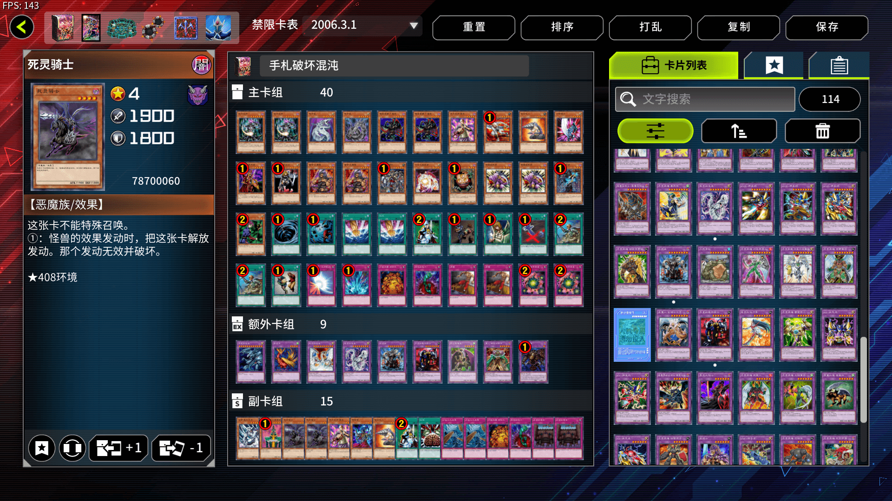

# 第二十五届汉诺杯战报（整活赛）

开赛时间：2024年11月23日 13:00  
卡池：前四期OCG卡池  
卡表：2006年3月限制卡表  
规则：大师规则2020（不适用额外怪兽区，调整裁定按MC服408端口处理结果）  
比赛原文：https://www.bilibili.com/read/cv39751154/  

[返回比赛信息](../../../Competitions.html)  

---

## 比赛结果

冠军：地属性（我非我）  
亚军：帝王（阿伟）  
季军：混沌（纳迦莎）  
殿军：推理门（毛毛）  

    

8人报名，7人参赛。本次比赛规则比较大胆，因此可能愿意尝试参赛的群友较少，但无论怎样，作为比赛制度变革前的一次整活赛来讲也算是一个还可以的承接，就是不知为何超时进入加时赛（死三）的战局比较多。感谢LOF、B、EGCLM、Gaga、冰老板、YUAN、旦挞王子（线下）、虹霓、果拼、丰收鱼、gd小龙、卡卡帝、Daniel、亓、薯片等多位群员，以及若干不愿意透露姓名的决斗者为历届汉☆诺☆杯中至少一届提供奖品、奖金（以上排名不分先后，如有遗漏请提出）。本文仅简单介绍卡组，有需要可以评论问思路。欢迎发表看法，互相讨论！引导群（群组推荐）912340958。直播回放：https://www.bilibili.com/video/BV1BHBxYuEf5/  

## 冠军：地属性

第一轮 Good Stuff ○×○（G3后攻攻击规则杀）  
第二轮 自闭烧○○  
第三轮 推理门○○  
半决赛 混沌○○  
决赛 帝王○×○  

    

## 亚军：帝王

第一轮 混沌×○○  
第二轮 推理门×○×  
第三轮 自闭烧○×○  
半决赛 推理门×—○○（G4死三杀）  
决赛 地属性×○×  

    

## 季军：混沌

第一轮 帝王○××  
第二轮 轮空  
第三轮 混沌○○（G1后攻攻击规则杀）  
半决赛 地属性××  
季军争夺战 推理门○○  

    

## 殿军：推理门

第一轮 ○○（缺席杀）  
第二轮 帝王○×○  
第三轮 地属性××  
半决赛 帝王○—××（G4死三杀）  
季军争夺战 混沌××  

    

---

## 以下是其他各参赛者的卡组，算是技术分享

    
     
    参赛者 YUAN：48卡自闭烧

---

    
     
    参赛者 Z：手卡控制向混沌

---

    
     
    参赛者 贝贝：经典Good Stuff

---

## 本次比赛云录像密码（在MC服408端口输入、粘贴后即可观看）

| 桌号 | 轮次   | 云录像编号                                                   |
| ---- | ------ | ------------------------------------------------------------ |
| 1    | 瑞士轮 | R#7059541215760811                                           |
| 2    | 瑞士轮 | 缺席杀                                                       |
| 3    | 瑞士轮 | R#4404460407913219（G3后攻攻击规则杀）                       |
| 4    | 瑞士轮 | R#8628477941505617                                           |
| 5    | 瑞士轮 | R#8618953942801577                                           |
| 6    | 瑞士轮 | R#2538333763674413                                           |
| 7    | 瑞士轮 | R#168715177211809                                            |
| 8    | 瑞士轮 | R#5814418424000371                                           |
| 9    | 瑞士轮 | R#5887252893329485（G1后攻攻击规则杀）                       |
| 10   | 瑞士轮 | R#225915281153629                                            |
| 1    | 淘汰赛 | R#5334622709443171                                           |
| 2    | 淘汰赛 | R#2534591100423711（未分胜负），R#2783984866639817（忽略G1，G2死三杀） |
| 3    | 淘汰赛 | R#8333373727071423                                           |
| 4    | 淘汰赛 | R#5332063296082849                                           |

---

本届汉☆诺☆杯已完满落幕，欢迎大家加群参赛或日常娱乐！