# 第二十六届汉诺杯战报（常规赛）

开赛时间：2025年1月29日 13:00
卡池：前四期OCG卡池
卡表：2006年3月限制卡表
规则：大师规则2020（不适用额外怪兽区，调整裁定按MC服408端口处理结果）
比赛原文：https://www.bilibili.com/read/cv40404535/

[返回比赛信息](../../../Competitions.html)  

---

## 比赛结果

冠军：混沌（车万）  
亚军：混沌（涸）  
季军：混沌（澜冬贝贝）  
殿军：零件（老游戏）  

    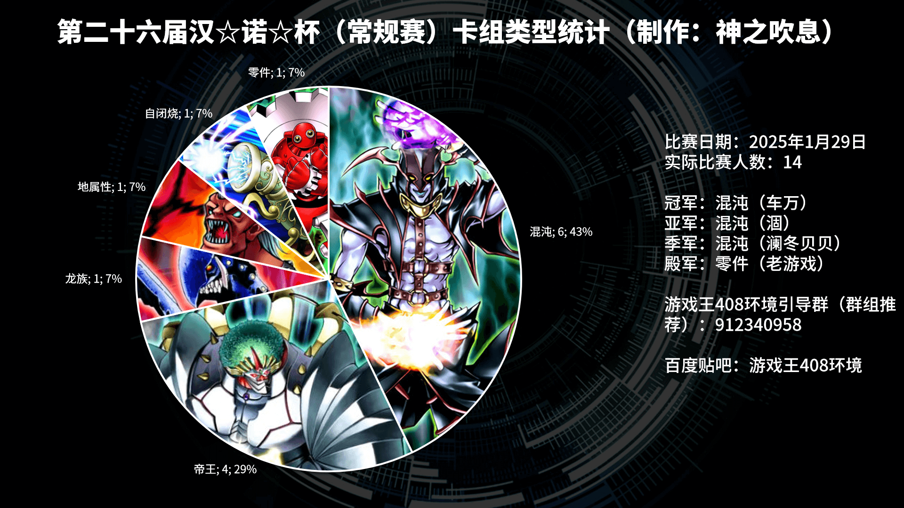

新年伊始，祝大家蛇年大吉吧！汉诺杯终于再度举行，本次14人报名，14人参赛，大家在大年初一玩得十分开心。感谢B、冰老板、YUAN、虹霓、果拼、丰收鱼、gd小龙、卡卡帝、Daniel、亓、薯片等多位群员，以及若干不愿意透露姓名的决斗者为历届汉☆诺☆杯中至少一届提供奖品、奖金（以上排名不分先后，篇幅所限未完全列出）。本文仅简单介绍卡组，有需要可以评论问思路。欢迎发表看法，互相讨论！引导群（群组推荐）912340958。直播回放：https://www.bilibili.com/video/BV128FMesEVM/  

## 八强卡组主题分布

混沌 5
零件 1
帝王 1
地属性 1

## 冠军：混沌

第一轮 零件×○○  
第二轮 帝王○○  
第三轮 混沌×○○  
第四轮 混沌○××  
八强 混沌×○○  
半决赛 混沌×○○  
决赛 混沌○○  

    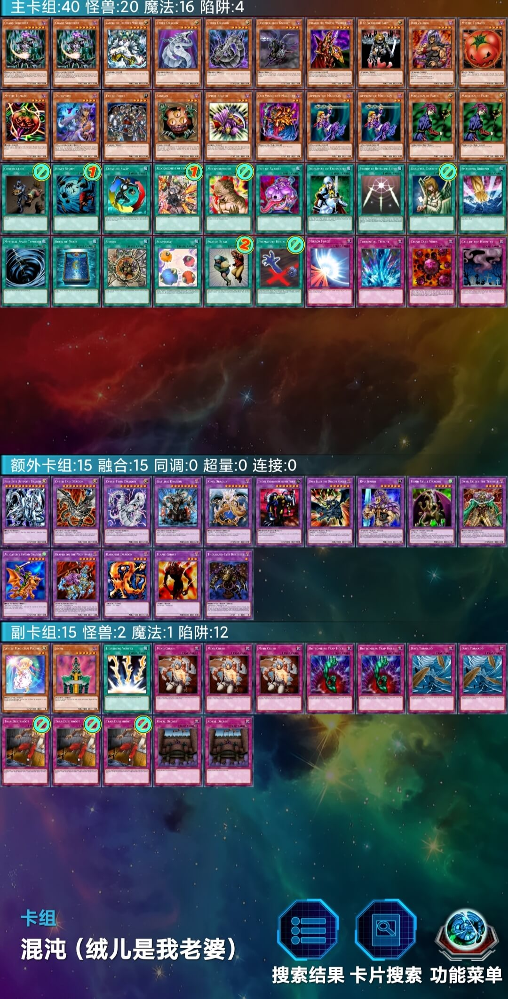

## 亚军：混沌

第一轮 混沌○○  
第二轮 混沌○×○  
第三轮 帝王×○○  
第四轮 混沌×○○  
八强 地属性○○  
半决赛 零件○×○  
决赛 混沌××  

    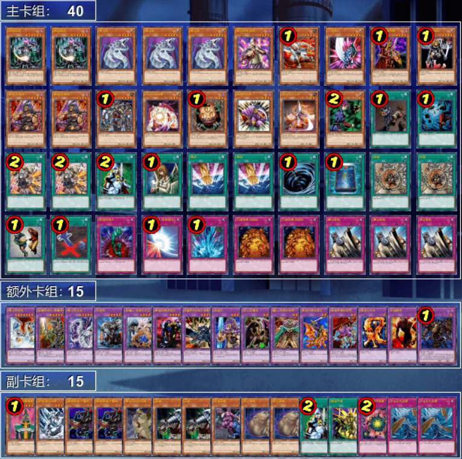

## 季军：混沌

第一轮 帝王○×○（G2、G3死三杀）  
第二轮 混沌○×○  
第三轮 混沌○××  
第四轮 混沌○××  
八强 零件○○  
半决赛 混沌○××  
季军争夺战 零件○×○  

    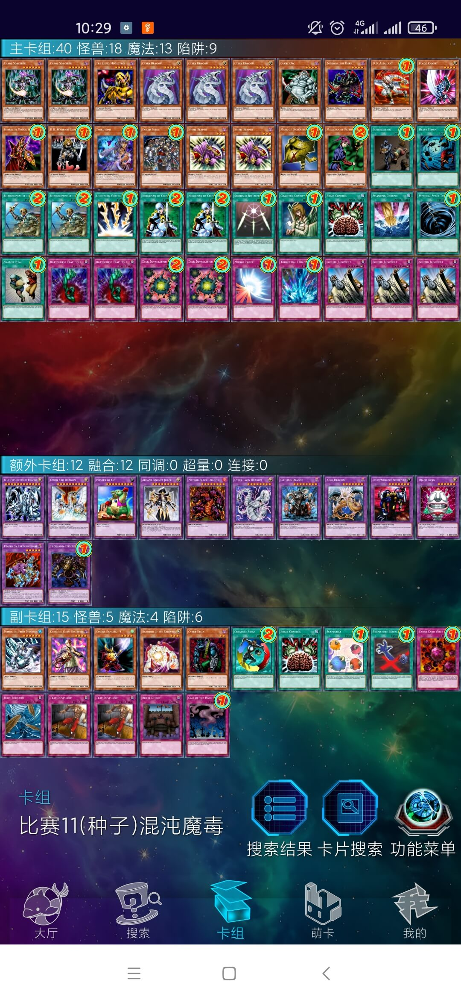

## 殿军：零件

第一轮 混沌○××  
第二轮 帝王×○○  
第三轮 自闭烧○○（缺席杀）  
第四轮 混沌○×○  
八强 混沌○×○（G1迟到杀）  
半决赛 混沌×○×  
季军争夺战 混沌×○×  

    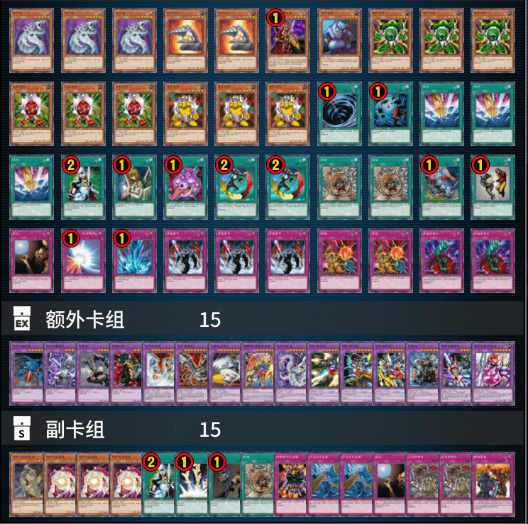

---

## 以下是其他各参赛者的卡组，算是技术分享

    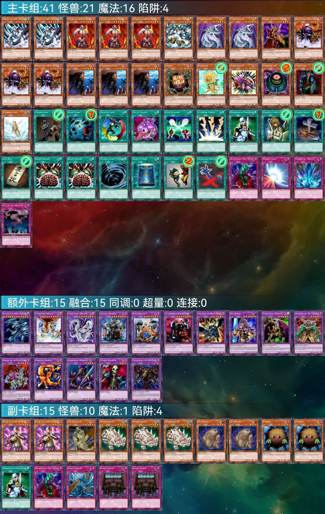
     
    八强 阿伟：6帝构筑的黄泉狮子帝

---

    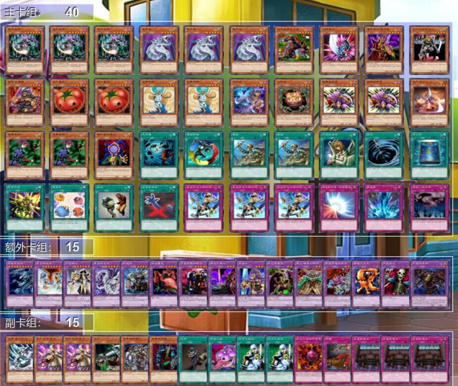
     
    八强 纳迦莎：归还向遗言混沌

---

    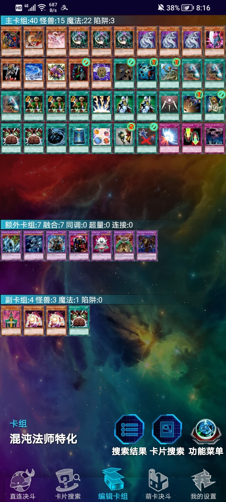
     
    八强 望远镜1437：推理门向混沌

---

    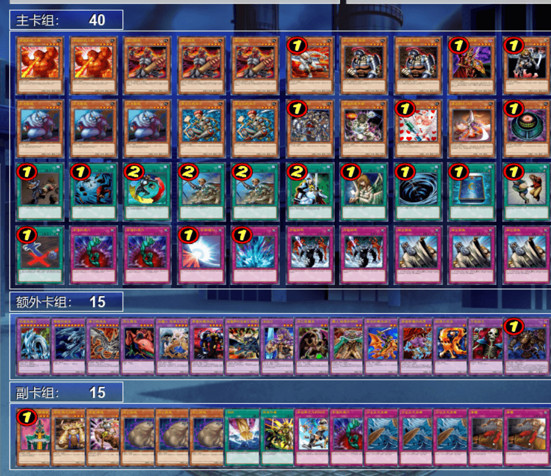
     
    八强 我非我：经典快攻地属性

---

    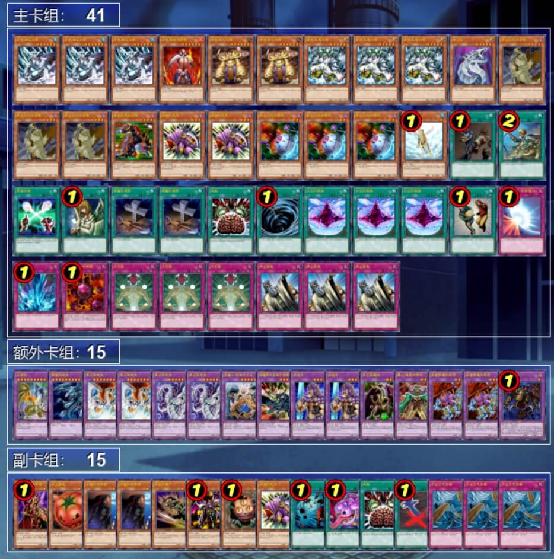
     
    参赛者 梦想星火：9帝构筑且同时投入黄泉青蛙的次元帝

---

    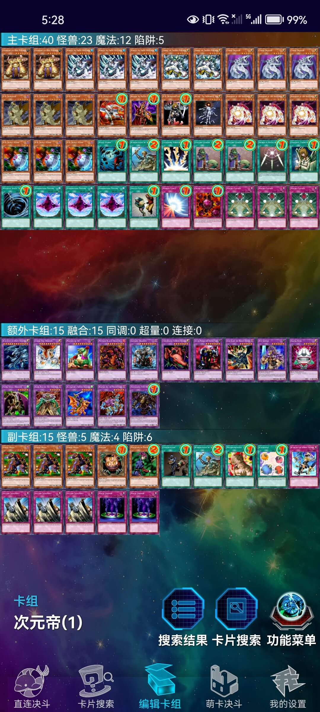
     
    参赛者 多多良赤伞：7帝构筑次元帝，副卡组是黑色忍者换装

---

    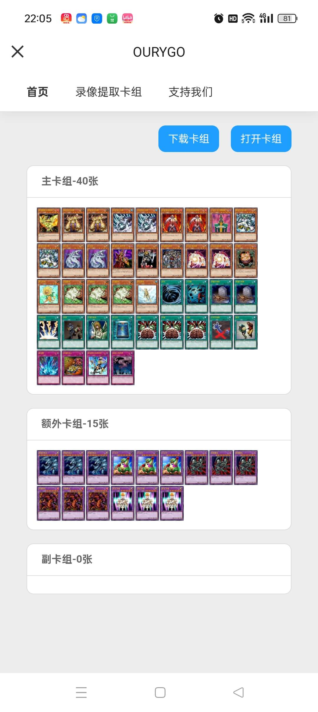
     
    参赛者 玩一辈子HERO：外挂凤凰神的8帝黄泉狮子帝

---

    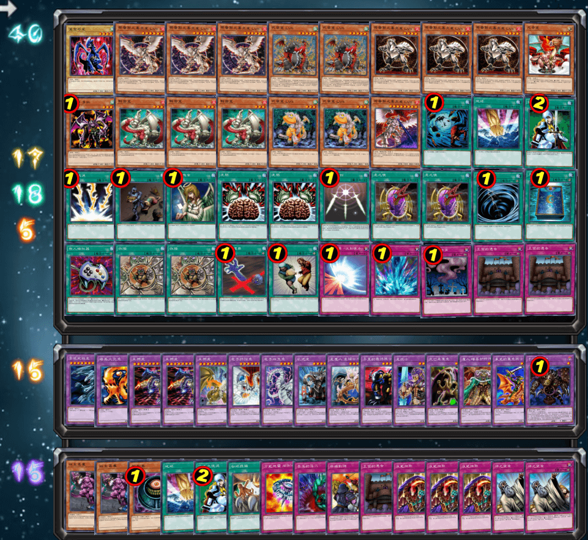
     
    参赛者 未知生命体：黑炎龙×武装龙且能融合的龙族卡组

---

    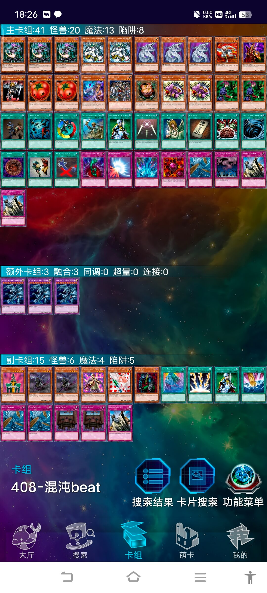
     
    参赛者 九代：经典混沌

---

    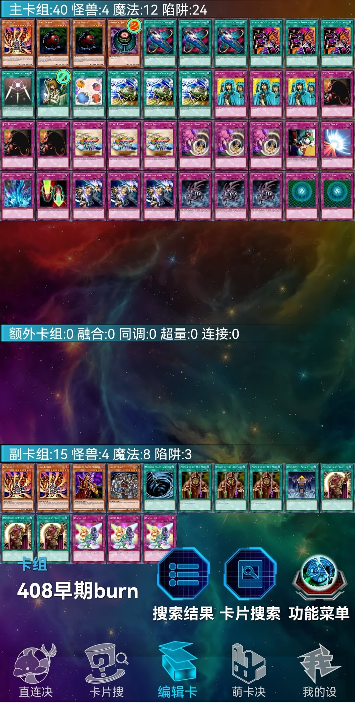
     
    参赛者 KOVATW：经典自闭烧

---

## 本次比赛云录像密码（输入或粘贴至MC服408端口的密码处即可观看）

| 桌号 | 轮次   | 云录像编号                         |
| ---- | ------ | ---------------------------------- |
| 1    | 瑞士轮 | R#5627448647914033                 |
| 2    | 瑞士轮 | R#1375256375095691                 |
| 3    | 瑞士轮 | R#4149174117986211                 |
| 4    | 瑞士轮 | R#6226984650384933                 |
| 5    | 瑞士轮 | R#7536741239835907                 |
| 6    | 瑞士轮 | R#6923706998751279（G2、G3死三杀） |
| 7    | 瑞士轮 | R#2163253732564473                 |
| 8    | 瑞士轮 | R#8257689631166977                 |
| 9    | 瑞士轮 | R#8467840164280661                 |
| 10   | 瑞士轮 | R#2715555907661761                 |
| 11   | 瑞士轮 | R#7662871366109061                 |
| 12   | 瑞士轮 | R#2322138804348265                 |
| 13   | 瑞士轮 | R#7847079591126903                 |
| 14   | 瑞士轮 | R#7629946264533925                 |
| 15   | 瑞士轮 | R#2665042698472423                 |
| 16   | 瑞士轮 | R#3656176518799169                 |
| 17   | 瑞士轮 | R#2567215993294667                 |
| 18   | 瑞士轮 | R#5718054180615285                 |
| 19   | 瑞士轮 | 缺席杀                             |
| 20   | 瑞士轮 | R#2542812361891407                 |
| 21   | 瑞士轮 | R#8656017114200403                 |
| 22   | 瑞士轮 | R#1644716162759301                 |
| 23   | 瑞士轮 | R#342089238065667                  |
| 24   | 瑞士轮 | R#2154739508000791                 |
| 25   | 瑞士轮 | R#5557189649443527                 |
| 26   | 瑞士轮 | R#301355927328091                  |
| 27   | 瑞士轮 | R#1693371921239051                 |
| 1    | 淘汰赛 | R#7497392501660631                 |
| 2    | 淘汰赛 | R#4595607151062525（G1迟到杀）     |
| 3    | 淘汰赛 | R#6922581623541407                 |
| 4    | 淘汰赛 | R#2265358304028335                 |
| 5    | 淘汰赛 | R#8853170110018733                 |
| 6    | 淘汰赛 | R#3590272655502175                 |
| 7    | 淘汰赛 | R#5751549411889103                 |
| 8    | 淘汰赛 | R#349374504821495                  |

---

本届汉☆诺☆杯已完满落幕，欢迎大家加群参赛或日常娱乐！