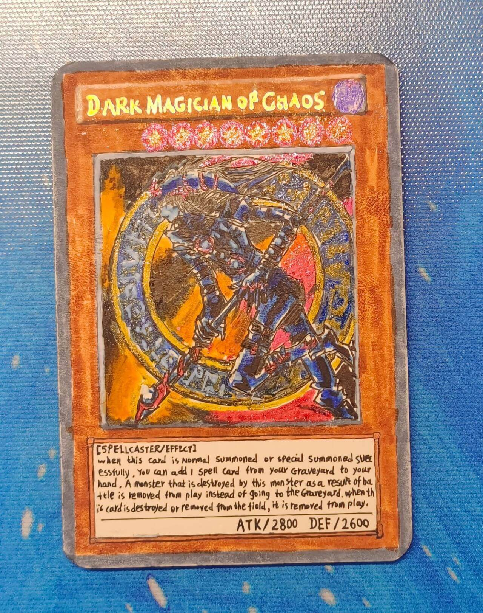

# 第二十七届汉诺杯举办公告

[返回比赛信息](../../../Competitions.html)  

---

## 赛事简介

- **环境设定**：基于大师规则2020（无额外怪兽区），重制2006年3月OCG限制卡表+四期卡池的健康环境 （末位补充包编号为408，故称“408环境”）。  
- **核心目标**：适合新手入门，可培养OCG环境兴趣。  

---

## 规则摘要

### 规则版本

#### 408环境规则省流版

▷ 采用大师规则2020（不适用额外怪兽区）  
▷ 改订前效果+最新裁定  
▷ 2006年3月限制卡表+第四期完整卡池  
*保留经典策略框架，同时规避旧规则复杂度  
   
#### 相关链接

- [环境介绍](../../../../../Articles/Notices/Intro.html)  
- [卡池范围](../../../../Cardpool%20Banlist/Cardpool.html)  
- [线上决斗指南](../../../../Notices/Online.html)（软件下载与连线教程）  

---

## 参赛信息

- **比赛时间**：`2025年10月4日` 13:00（周六，国庆假期第4日）  
- **报名方式**：  
  - **费用**：5元/人，报名提交支付截图。  
    - **8人开赛。若人数少于16，则改为免费赛，退还参赛费，奖金变更为括号后数字，不设冠亚季殿军外奖项。**
    - **赛前未退赛而无故缺席**，或**开赛时间后退赛**，费用不退。  
    - 务必备注**参赛ID**或**QQ**！！！
    - 费用超出奖金部分用于后续活动。  
    - 截至**赛后仍无人认领**某项报名费转账，视为**匿名赞助**。
  - **提交要求**：卡组需排序发送ydk文件（建议）或截图（包含卡片计数），于`2025年10月3日 24:00`前提交至**登记地址**（https://www.wjx.top/vm/YrZspll.aspx# ），逾期无效。  
  - **修改构筑**：截止前重填表格并告知主办方（神之吹息），请勿滥用权利。  
- **参赛群**：QQ群 `936891040`（有直播/录播，观赛无需加群）。  
- **退赛条件**：比赛当日0点前未加群、赛中退群/缺席均视为退赛，后果自负。  

  

---

## 比赛流程

- **共通规定**：[V2版本](../../Common_Rules.html)（必读）。  

---

## 奖品设置

- **奖项明细**：  
  
  | 名次           | 奖品内容                          |
  | -------------- | --------------------------------- |
  | **冠军**       | 奖金114元（<16人→35）             |
  | **亚军**       | 奖金51.4元（<16人→25）            |
  | **季军**       | 奖金19.19元（<16人→15）           |
  | **殿军**       | 奖金8.10元（<16人→5）             |
  | **八强其余**   | 参赛≥30人时追加：奖金2坤（5）元   |
  | **十六强其余** | 参赛≥70人时追加：奖金1坤（2.5）元 |

16人以上实质参赛追加群友@群火花 的手绘纪念卡“混沌之黑魔术师”！
  

---

## 注意事项

- **违规处理**：未按规提交卡组、退赛等行为将影响后续参赛资格。  

- **未尽事宜**：主办方保留最终解释权，未尽事宜以群公告为准。  