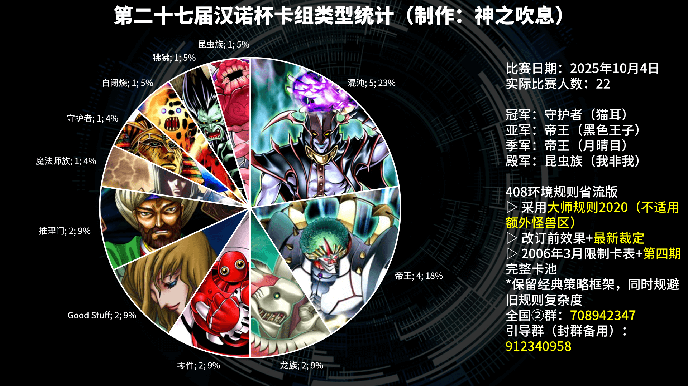
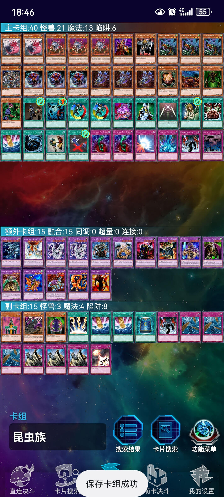
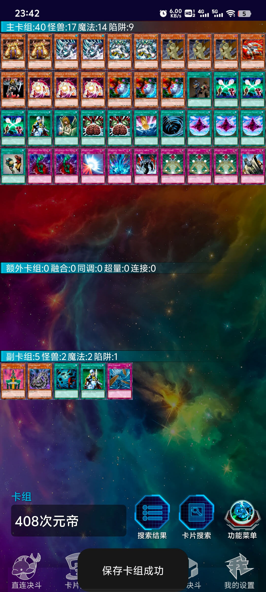
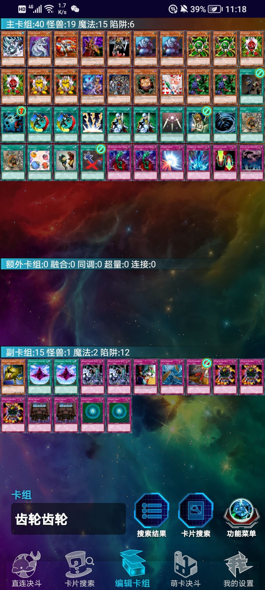
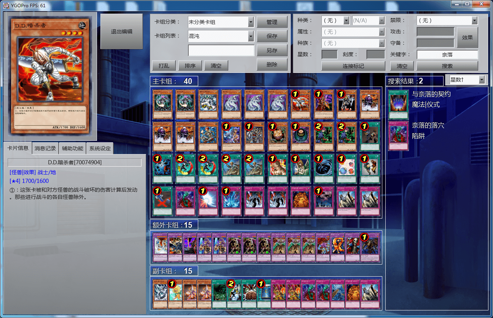
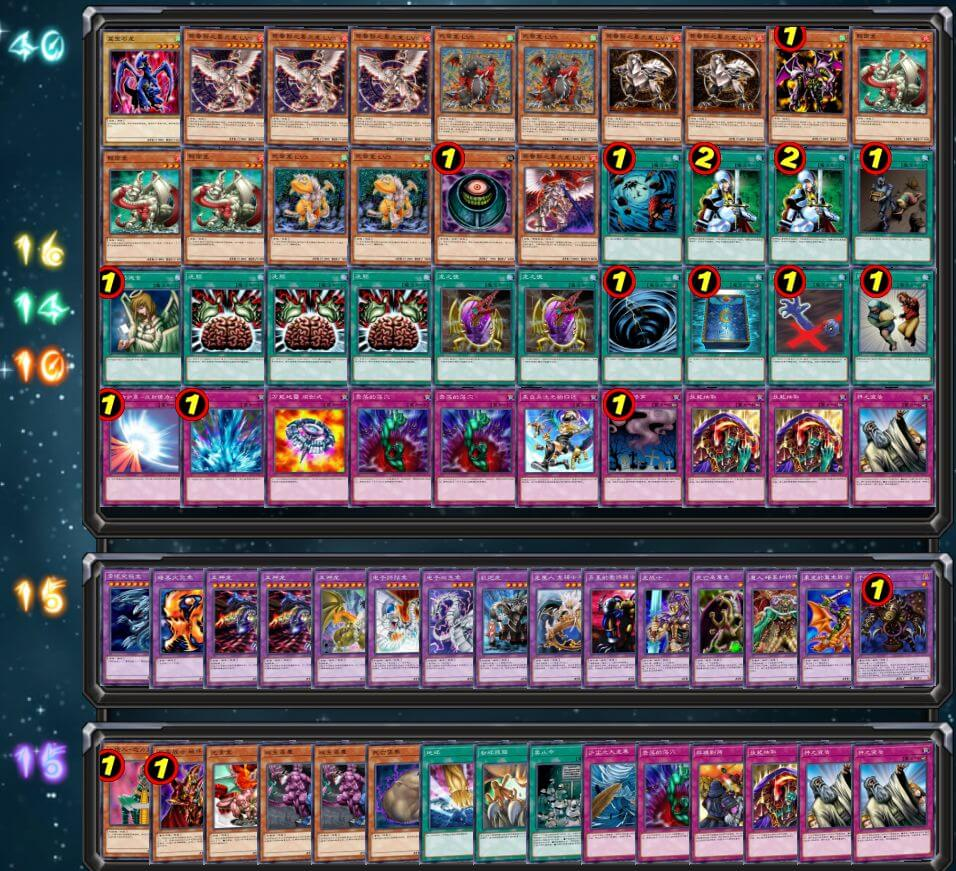
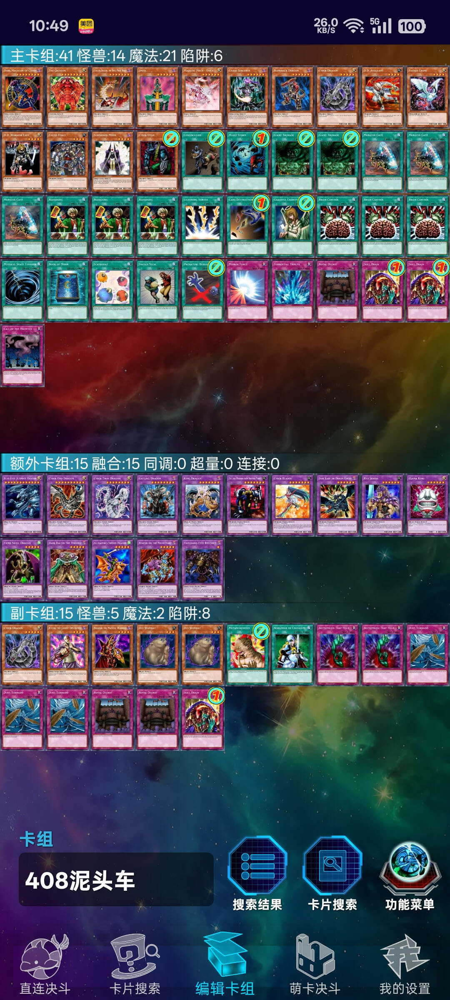
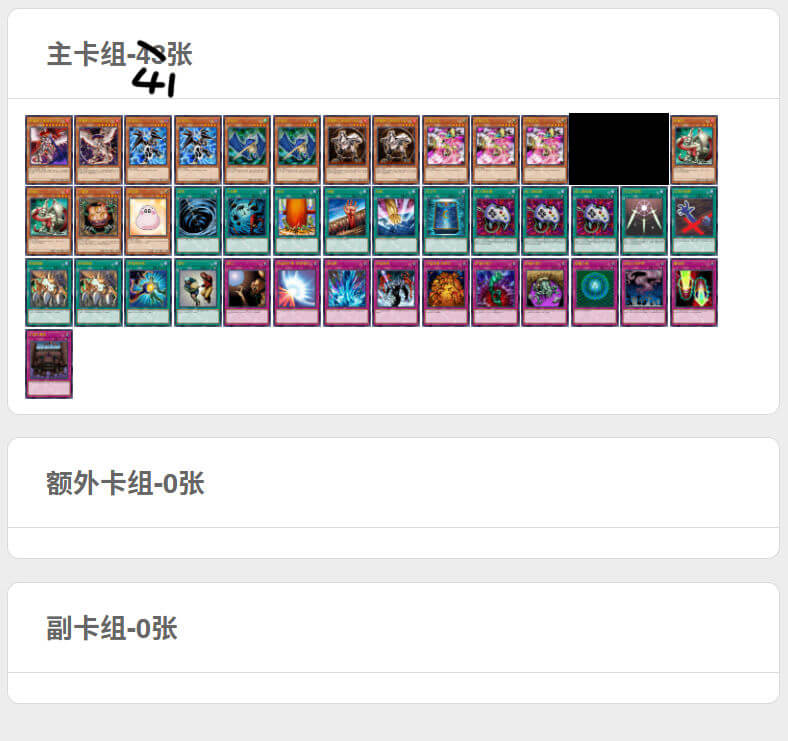
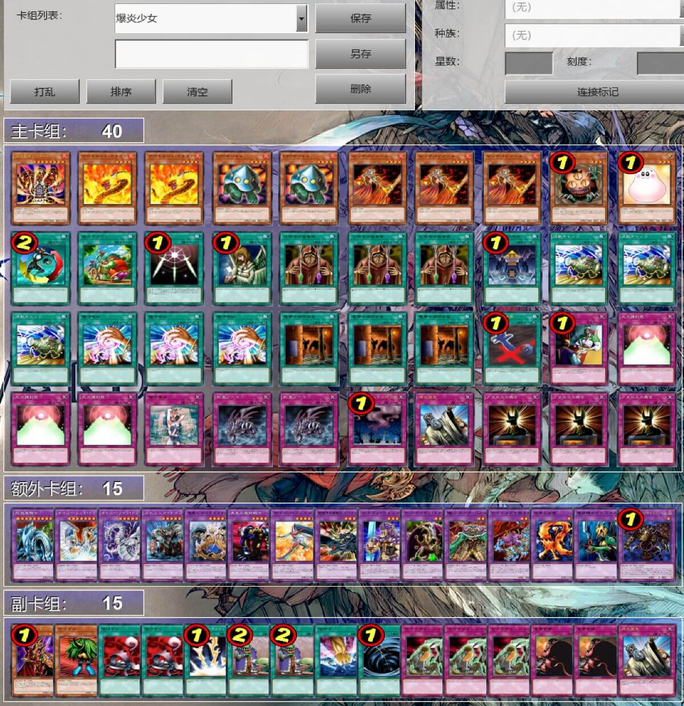
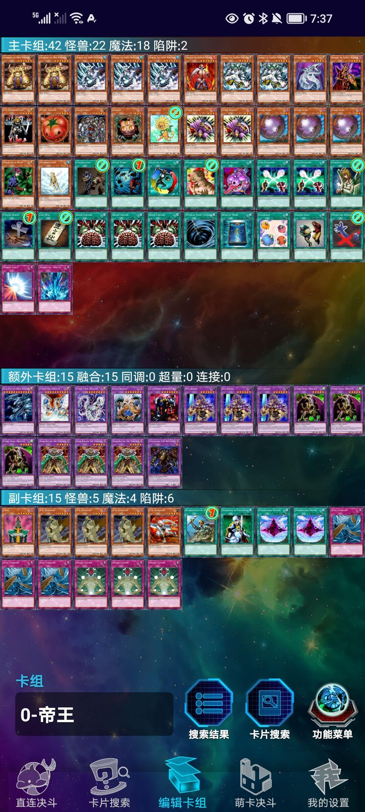

# 第二十七届汉诺杯战报

[返回比赛信息](../../../Competitions.html)  

---

## 赛事概览

- **开赛时间**：2025年10月4日 13:00  
- **卡池规则**：前四期OCG卡池 + 2006年3月限制卡表  
- **对战规则**：大师规则2020（无额外怪兽区，裁定以MC服408端口为准）  
- **比赛公告**：[地址](./27.Hanoi27_0.html)  
- **直播回放**：[地址](https://www.bilibili.com/video/BV1hpx4zkEm5/)  
- **比赛树状图**：[地址](https://challonge.com/zh_CN/408hanoi27)  

---

## 比赛结果

| 名次 | 选手ID | 卡组主题   |
| :----: | :------: | :----------: |
| 冠军 | 猫耳 | 守护者 |
| 亚军 | 黑色王子 | 帝王 |
| 季军 | 月晴目 | 帝王 |
| 殿军 | 我非我 | 昆虫族 |

    

22人报名，22人参赛（包括部分轮次参与）。群友们几乎人均ddl战士，赛前最后一天扎堆报名，可把我吓坏了嘤嘤嘤。这次比赛很难得的一次非主流夺冠，属实牛批。部分卡组分类比较模糊，我只能按照直播时的观感去划分。感谢神风赞助的部分奖金。

---

## 卡组分布统计

### 八强

- 帝王：3
- 守护者：1
- 昆虫族：1
- Good Stuff：1
- 混沌：1
- 零件：1

---

## 强者对战记录

### 冠军：守护者

    

- **第一轮**：帝王○○  
- **第二轮**：帝王×○○  
- **第三轮**：帝王×○×  
- **第四轮**：零件○×○  
- **八强**：Good Stuff ○×○  
- **半决赛**：帝王○×○  
- **决赛**：帝王○○  

### 亚军：帝王

    

- **第一轮**：不战而胜  
- **第二轮**：守护者○××  
- **第三轮**：Good Stuff ○○  
- **第四轮**：混沌○○  
- **八强**：混沌○○  
- **半决赛**：昆虫族×○○（G3死三杀）  
- **决赛**：守护者××  

###  季军：帝王

    

- **第一轮**：守护者××  
- **第二轮**：不战而胜  
- **第三轮**：狒狒○○  
- **第四轮**：推理门○○  
- **八强**：帝王○○  
- **半决赛**：守护者×○×  
- **季军争夺战**：昆虫族○×○  

### 殿军：昆虫族

    

- **第一轮**：龙族○○  
- **第二轮**：推理门○×○  
- **第三轮**：混沌○×○  
- **第四轮**：混沌○×○  
- **八强**：零件○○  
- **半决赛**：帝王○××（G3死三杀）  
- **季军争夺战**：帝王×○×  

---

## 参赛者卡组公开

### 八强

| ID   | 卡组主题及简评 | 构筑截图 |
| :----: | :--------------: | :--------: |
| 幽术师 | 直接把次元系统入主的6帝帝王 |     |
| GGBond | 投入2滑槽的经典Good Stuff |     |
| 尼亚 | 通告向混沌 |     |
| 望远镜1437 | 40卡组6齿零件，特点是副卡组投入2大成佛 |     |

### 其他参赛者

| ID   | 卡组主题及简评 | 构筑截图 |
| :----: | :--------------: | :--------: |
| 天命马铃薯 | 坑向混沌 |     |
| 纳迦莎 | 同时投入3混沌巫师1贪欲之壶的混沌 |     |
| ID7 | 技抽向推理门 |     |
| 暴雨心奴 | 投入2凤翼的爆风的无混沌Good Stuff |     |
| 汉诺伊骑士 | 56卡大卡堆混沌 |     |
| 平行五香鸡 变革空锤手—残暴正义 | 50卡组6齿血代弹压零件 |     |
| 未知生命体 | 投入2个LV系统的技抽龙族 |     |
| 将薄知 | 41卡组通告向混沌 |     |
| 布丁 | 非常魂的魔法师族 |     |
| 龙天伊思 | 通告+技抽向推理门 |     |
| sisteria | 外挂极少黑炎龙系统的无副卡组龙族 |     |
| 树懒 | 爆炎少女自闭烧 |     |
| 姬特你在干什么 | 8帝黄泉狮子帝 |     |
| 沉晨 | 主卡投入自闭烧系统的狒狒 |     |

---

## 特别鸣谢

义父义母赞助名单（排名不分先后，包括奖金回流）：  
- B、冰老板、YUAN、虹霓、果拼、丰收鱼、gd小龙、卡卡帝、Daniel、亓、薯片、F、殺手蛇、神风等（未穷举）众多决斗者。  

---

## 加入社群

- **交流群**：QQ群 `912340958`  
- **参赛群**：QQ群 `936891040`  

---

## 云录像密码

作为密码输入至MC服408端口即可观看  

| 桌号 | 轮次 | 云录像编号 |
| :----: | :----: | :----------: |
| 1 | 瑞士轮 | R#7088702301637447 |
| 2 | 瑞士轮 | R#533171816591669 |
| 3 | 瑞士轮 | R#3706880095020581 |
| 4 | 瑞士轮 | R#5969035493273013 |
| 5 | 瑞士轮 | R#6325961920611245 |
| 6 | 瑞士轮 | 缺席杀 |
| 7 | 瑞士轮 | 缺席杀 |
| 8 | 瑞士轮 | R#6984188052087431 |
| 9 | 瑞士轮 | R#4826986400993011 |
| 10 | 瑞士轮 | R#2940836509007139 |
| 11 | 瑞士轮 | R#1883857048425511 |
| 12 | 瑞士轮 | R#3952163259838647 |
| 13 | 瑞士轮 | 缺席杀 |
| 14 | 瑞士轮 | R#1589522943598871 |
| 15 | 瑞士轮 | R#3961740991723131 |
| 16 | 瑞士轮 | R#2354537889208629 |
| 17 | 瑞士轮 | R#4907691797662609 |
| 18 | 瑞士轮 | R#3722050484138463 |
| 19 | 瑞士轮 | R#5253988438649053 |
| 20 | 瑞士轮 | R#6456682374884559 |
| 21 | 瑞士轮 | R#3365429711794951 |
| 22 | 瑞士轮 | R#8331318383511185 |
| 23 | 瑞士轮 | R#3730586464396361 |
| 24 | 瑞士轮 | R#4400512247542407 |
| 25 | 瑞士轮 | R#1049417689901809 |
| 26 | 瑞士轮 | R#3772960285717187 |
| 27 | 瑞士轮 | R#738547560970101 |
| 28 | 瑞士轮 | R#8679606235848265 |
| 29 | 瑞士轮 | 缺席杀 |
| 30 | 瑞士轮 | R#1963198413587699 |
| 31 | 瑞士轮 | R#7850660970017981 |
| 32 | 瑞士轮 | R#3487480426418263 |
| 33 | 瑞士轮 | R#8482029292542607 |
| 34 | 瑞士轮 | R#1389579396622795 |
| 35 | 瑞士轮 | R#1339439169406549 |
| 36 | 瑞士轮 | R#5360058112914299 |
| 37 | 瑞士轮 | R#2859379715366649，R#882404441981679（开2单局） |
| 38 | 瑞士轮 | R#1463213208732791 |
| 39 | 瑞士轮 | R#3260755049539647 |
| 40 | 瑞士轮 | R#1120140567124575 |
| 41 | 瑞士轮 | R#917546962162047 |
| 42 | 瑞士轮 | R#5974300147117219 |
| 1 | 淘汰赛 | R#7910214330558231 |
| 2 | 淘汰赛 | R#8780845341775121 |
| 3 | 淘汰赛 | R#3260701967927401 |
| 4 | 淘汰赛 | R#3390012387246749 |
| 5 | 淘汰赛 | R#2508304012750479（G3死三杀） |
| 6 | 淘汰赛 | R#8122447312464759 |
| 7 | 淘汰赛 | R#432619287195455 |
| 8 | 淘汰赛 | R#1296779176282535 |

---

**本届比赛圆满结束，欢迎参加下届赛事！**  