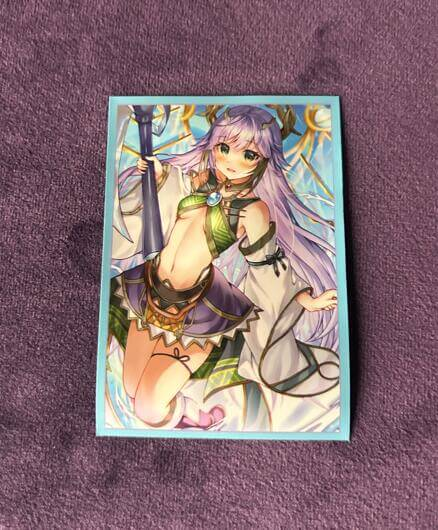
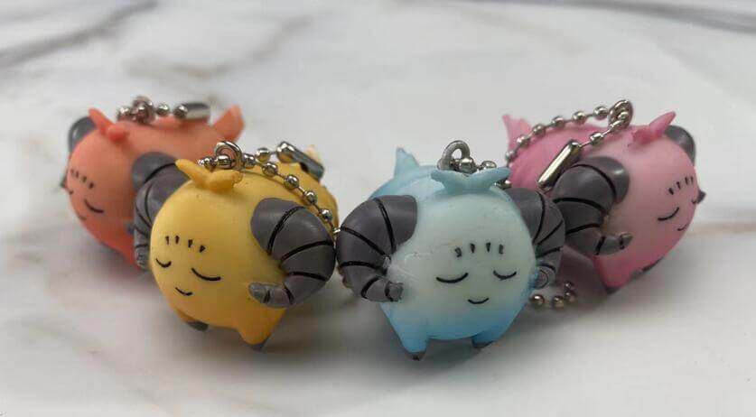
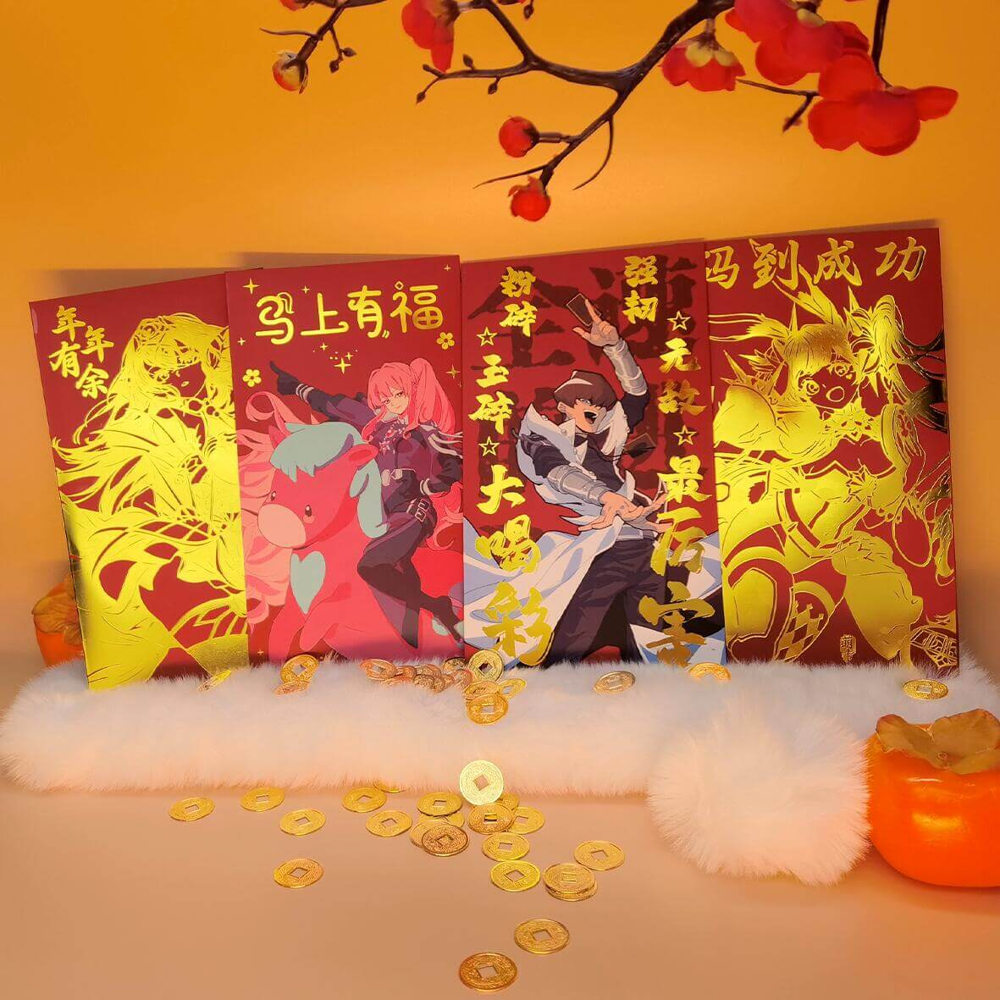
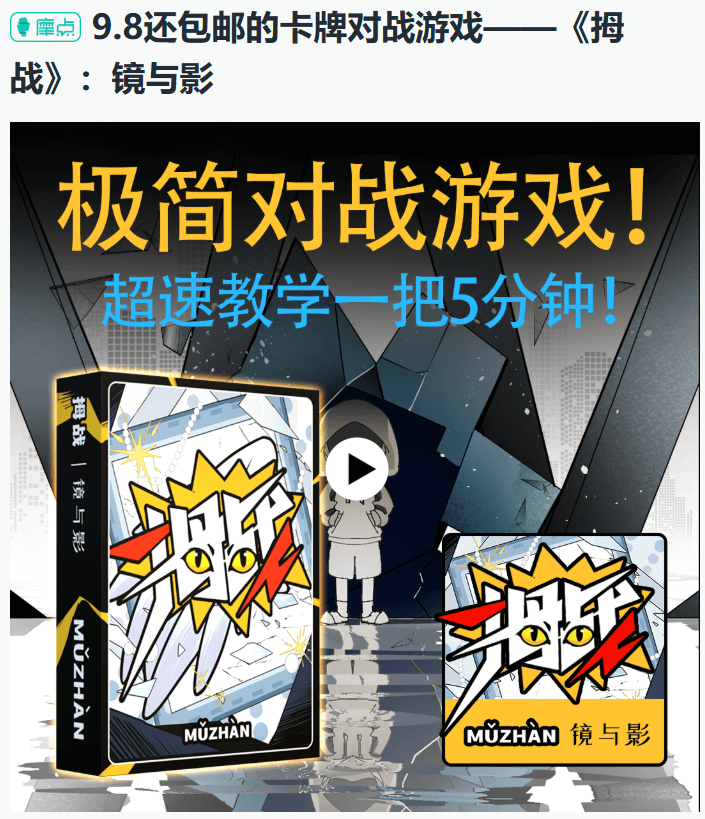
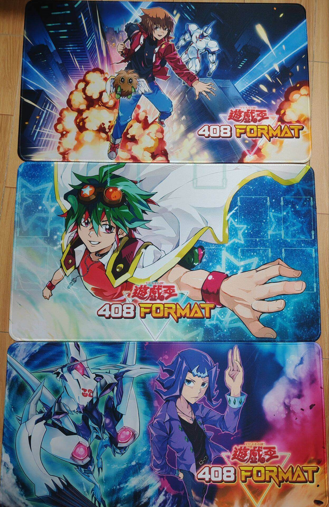
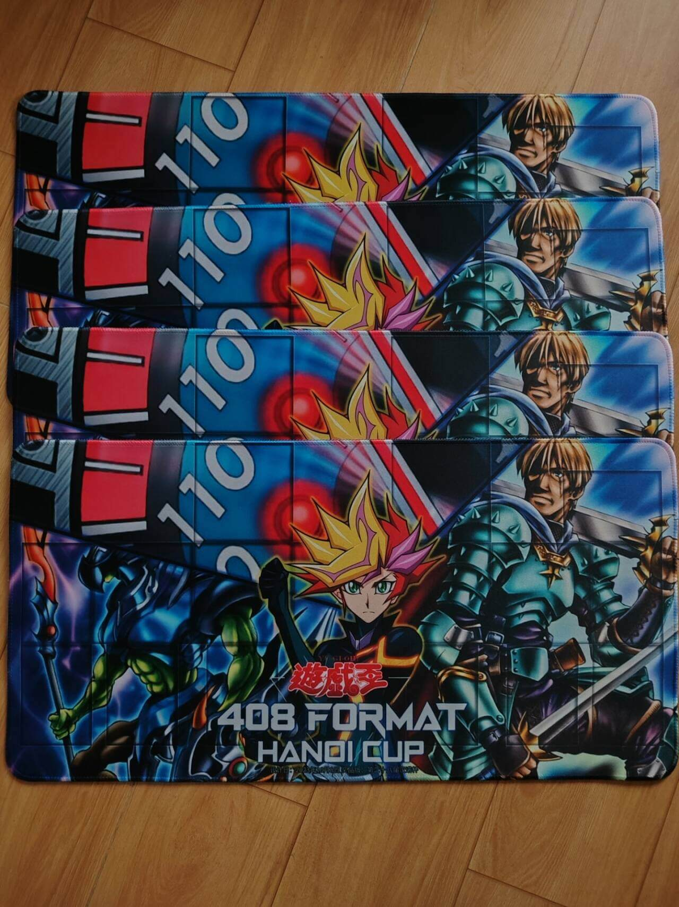

# 第28届汉诺杯举办公告

[返回比赛信息](../../../Competitions.html)  

---

## 赛事简介

- **规则省流**：
  - 采用大师规则2020（不适用额外怪兽区）  
  - 改订前效果+最新裁定  
  - 传承自2006年3月限制卡表+第四期卡池  
- **核心目标**：
  - 保留经典策略框架，同时规避旧规则复杂度。
  - 适合新手入门，有助于培养OCG环境兴趣。   

---

## 相关链接

- [环境介绍](../../../../../Articles/Notices/Intro.html)  
- [卡池范围](../../../../Cardpool%20Banlist/Cardpool.html)  
- [线上决斗指南](../../../../Notices/Online.html)（软件下载与连线教程）  

---

## 参赛信息

- **比赛时间**：`2026年2月21日` 13:00（周六，年初五）；实际参赛14人以上，在瑞士轮结束征集出轮玩家意见后，可以将淘汰赛延续至`2026年2月22日` 13:00（即可以1日或2日完赛）  
- **报名方式**：  
  - **费用**：免费。  
  - **提交要求**：卡组需排序发送ydk文件（建议）或截图（包含卡片计数），于`2026年2月20日24:00`前提交至**登记地址**（https://www.wjx.top/vm/YHlvypl.aspx# ），逾期无效。  
  - **修改构筑**：截止前重填表格并告知主办方（神之吹息），请勿滥用权利。  
- **参赛群**：QQ群 `936891040`（有直播/录播，观赛无需加群）。  
- **退赛条件**：比赛当日0点前未加群、赛中退群/缺席均视为退赛，后果自负。  

---

## 比赛流程

- **共通规定**：[V2版本](../../Common_Rules.html)（必读）。  

---

## 奖品设置

- **邮寄规则**：包邮（10元内），偏远地区需补差价，支持到付/顺丰。  

- **奖项明细**：  

  | 名次             | 奖品内容                                                     |
  | ---------------- | ------------------------------------------------------------ |
  | **冠军**         | 新春红包68.8元 + 纪念卡垫2张（1张自选） + 萌卡MCPro【神子卡套（60张）、 游戏王主题红包1套、替罪羊塑胶玩偶X4】 + 自制衍生物一套10张 |
  | **亚军**         | 新春红包38.8元 + 纪念卡垫2张（1张自选） + 萌卡MCPro【神子卡套（60张）、 游戏王主题红包1套】 + 自制衍生物随机5张 |
  | **季军**         | 新春红包28.8元 + 纪念卡垫2张（1张自选） + 萌卡MCPro【神子卡套（60张）、 游戏王主题红包1套】+ 自制衍生物随机3张 |
  | **殿军**         | 新春红包18.8元 + 纪念卡垫1张  + 萌卡MCPro【神子卡套（60张）、 游戏王主题红包1套】 + 自制衍生物随机2张 |
  | **八强其余**     | 参赛≥30人时追加：新春红包8.8元                               |
  | **十六强其余**   | 参赛≥70人时追加：新春红包6.6元                               |
  | **瑞士轮出轮奖** | 瑞士轮出轮必得：卡牌对战游戏《拇战》1盒                      |

- 感谢赞助义父萌卡MyCard平台！
  - 物资包括：MCPro神子卡套、赞助物资替罪羊塑胶玩偶、游戏王主题红包。**与其他奖品分开寄出**。
  - 淘宝店——萌卡MCPro决斗暗网：https://shop387046095.taobao.com/ 。
  - 萌卡MyCard平台中可便捷下载YGOPro、KoishiPro、YGOPro2并打408环境补丁，畅爽约战！
- 感谢赞助义父梁山卡牌！
  - 物资包括：卡牌对战游戏《拇战》。由梁山卡牌负责人之一逗小沙创作，已在摩点结束众筹（目标金额¥1000，已筹¥5573）。
  - 第二扩展“镜与影”摩点众筹链接（仅供参考）：https://zhongchou.modian.com/item/152619.html 。
  - 作者试玩视频：https://www.bilibili.com/video/BV1jeTczeExL/ ，https://www.bilibili.com/video/BV1zfvBBcEMR/ 。
  - 第三方介绍/试玩视频：https://www.bilibili.com/video/BV1YMbXzfE2b/ ，https://www.bilibili.com/video/BV1ce8PzrEam/ 。
  - 广州租场玩桌游可联系微信wobushidousha【广东省广州市天河区黄埔大道中锦明街1号嘉惠苑写字楼前座二楼248（进门左手第一间）】
- 感谢自绘408环境卡垫赞助义父、408环境全国群群管虹霓！
  - 友情宣传其自制桌游《啵姆》，作者试玩视频：https://www.bilibili.com/video/BV1hdu6zzEcj/ 。

    
     
    
     
    
     
    萌卡MyCard平台赞助的部分奖品

    
     
    《拇战》第二扩展“镜与影”众筹页面（仅供参考）

    
     
    虹霓赞助卡垫奖品

    
     
    神之吹息提供的卡垫奖品

---

## 注意事项

- **卡牌说明**：奖品卡可能存在轻微瑕疵，含简中、日语及其他语种卡。  
- **违规处理**：未按规提交卡组、退赛等行为将影响后续参赛资格。  
- **未尽事宜**：主办方保留最终解释权，未尽事宜以群公告为准。  