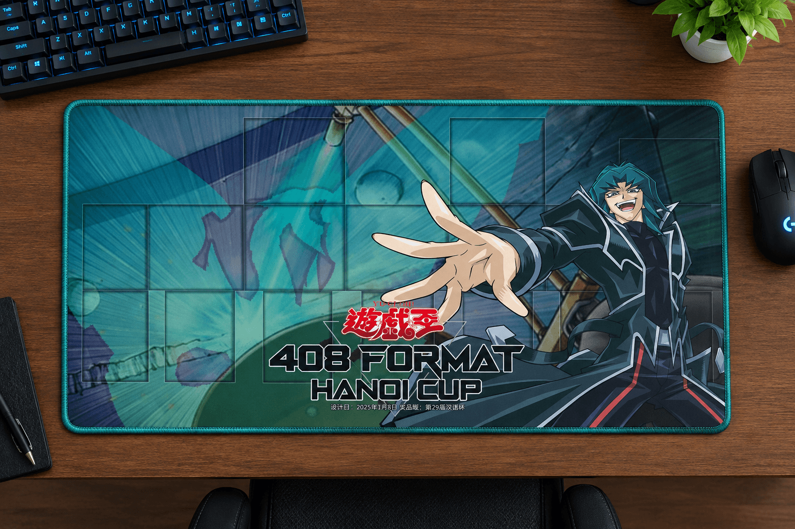

# 第29届汉诺杯举办公告

[返回比赛信息](../../../Competitions.html)

**本文/视频参照CC BY（署名）协议开放转载，敬请保留原链接与作者信息噢~感谢传播！支持知识开放、协作与共享**。

---

# **赛事简介**

- **规则省流**：
  - 采用大师规则2020（不适用额外怪兽区）
  - 改订前效果+最新裁定
  - 传承自2006年3月限制卡表+第四期卡池（2006年4月末）
- **核心目标**：
  - 保留经典策略框架，同时规避早期规则复杂度。
  - 适合新手入门，有助于培养官方环境兴趣。

---

# **相关链接**

- [环境介绍](../../../../../Articles/Notices/Intro.html)
- [卡池范围](../../../../Cardpool%20Banlist/Cardpool.html)
- [线上决斗指南](../../../../Notices/Online.html)（软件下载与连线教程）
---

# **参赛信息**

- **比赛时间**：`2026年10月1日` 14:00（周四，国庆假期第一日）起，每天1轮**瑞士轮/淘汰赛**，每日24:00左右强制出下一轮排表（包括开赛当日），无战果视为双败（以**无单局战绩**的平局显示）。提前打完可以提前安排下一轮。
- **类型**：竞技赛。
- **报名方式**：
  - **费用**：免费。
  - **提交要求**：卡组需排序发送截图（包含卡片计数），于`（日期）24:00`前提交至**登记地址**（https://docs.qq.com/form/page/DQWZNaXVzdFNVeU5z ），逾期无效。
  - **修改构筑**：截止前重填表格并告知主办方（神之吹息），请勿滥用权利。
- **参赛群**：QQ群 `936891040`（有录播，观赛无需加群）。
- **退赛条件**：比赛当日0点前未加群、赛中退群/缺席均视为退赛，后果自负。

---

# **比赛流程**

- [**共通规定**](../../Common_Rules.html)（必读）。

---

# **奖品设置**

- **邮寄规则**：包邮（10元内），偏远地区需补差价，支持到付/顺丰。
- **奖项明细**：  
  
  | 名次         | 奖励内容                          |
  | ------------ | --------------------------------- |
  | **冠军**     | 奖金16坤（40）元 + 自制纪念卡垫   |
  | **亚军**     | 奖金12坤（30）元                  |
  | **季军**     | 奖金8坤（20）元                   |
  | **殿军**     | 奖金4坤（10）元                   |
  | **八强其余** | 参赛≥30人时追加：奖金各2坤（5）元 |

    
     
    部分冠军奖品（AI预览效果图，细节有偏差，仅供参考）

---

# **注意事项**

- **卡牌说明**：奖品卡可能存在轻微瑕疵，含简中、日语及其他语种卡。
- **违规处理**：未按规提交卡组、退赛等行为将影响后续参赛资格。
- **未尽事宜**：主办方保留最终解释权，未尽事宜以群公告为准。