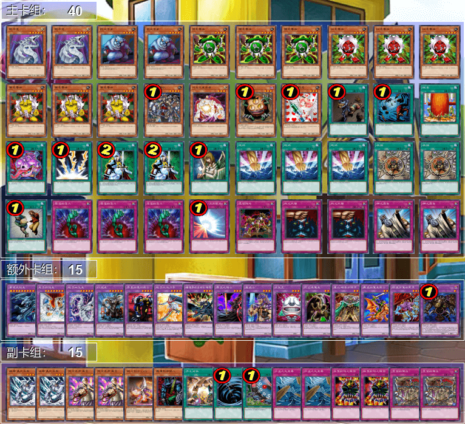

# 第四届汉诺杯战报（常规赛）

比赛时间 2021-2-14 14:00  
本比赛为模拟环境赛，因此构筑与历史上的上位思路会有少量差别  
卡池：前四期（约1999-2006.4）OCG卡池  
卡表：2006年3月限制卡表  
规则：大师规则3（调整裁定按233服2012端口处理结果）  
比赛原文：https://www.bilibili.com/read/cv9585453/  

[返回比赛信息](../../../Competitions.html)  

---

## 先说比赛结果

冠军：Good Stuff（薯片）
亚军：帝王（zyq900804）
季军：自闭烧（jiaqi）

本次比赛报名人数13，实际参赛9人（悲）。由于卡组战术比较直观，多为均卡中慢速beat down，少量阴间卡组（笑），因此就不发详细战术了，有需要可以另外问，仅简单介绍一下卡组思路。作为“遗老”玩家的参考以及现环境玩家的娱乐阅读史料。大家可以发表自己的看法，互相讨论！日常群暗号：708942347。  

直播回放视频：https://www.bilibili.com/video/BV155411E7Ud/

    

## 冠军：Good Stuff
第一轮 自闭烧○○（G1迟到杀）  
第二轮 卡组破坏○○  
第三轮 帝王○○  
第四轮 Good Stuff ○○  
准决赛 混沌○○  
决赛 帝王○○  

    
     
    冠军是本次比赛的全胜强者，未 尝 一 败，卡组与上次参赛时使用的版本差别极小。其实所谓的Good Stuff就是“均卡”的意思，也是当年被俗称“杂卡”的卡组，但其实资源对换能力并不弱。Good Stuff的构筑思路基本上是“采用当前卡池中的最强单卡进行有机结合”，思路方向比较简单，可以斟酌的构筑细节不少。本卡组采用了4、5期经典beat系统电子龙+死灵骑士，利用电子龙的“伪下级”便利召唤方式以及死灵骑士的1900强力打点+人肉怪效康在保证打点利用战斗不亏卡换掉对方资源的同时，能康掉对方的关键性怪兽效果。卡组除了经典解场怪兽异次元的女战士外，还投入了1 D.D.暗杀者2异次元的战士1增援这样的异次元小系统，外挂1闪光之追放者，在解场的同时干扰对方的墓地堆积。外挂了当时环境的“泛用卡”冰帝 美比乌斯、守墓的侦察者和削魂的死灵，并投入了3地碎3奈落的落穴1死之卡组破坏病毒这些可以快速换取资源的强力单卡。总体而言，这个卡组很好地贯彻了老式Good Stuff里每张卡都能换取资源的理念，堪称模板一般的老式Good Stuff构筑。

## 亚军：帝王
第一轮 混沌○○  
第二轮 Good Stuff ○○  
第三轮 Good Stuff ××  
第四轮 老I ○○  
准决赛 自闭烧○○  
决赛 Good Stuff ××  

    
     
    虽然当时比较流行的帝王构筑是黄泉帝，但亚军在解放源上并未投入黄泉青蛙和蒲公英狮，只有传统的守墓小轴和3只不能被战斗破坏的下级，一定程度上减少了对墓地的依赖。由于可以便利地从卡组调动守墓的番兵，因此投入了当时的限制卡死之卡组破坏病毒（原效果）。鉴于帝王类卡组的上级具有较强的资源交换能力，因此无需过于依赖红坑，只投入崇高力量，并主卡组投入王宫的通告排除对方的陷阱卡对帝王怪兽的干扰，虽然3王宫的通告很可能造成手卡事故。副卡组是换装用的次元帝系统，足以对对方的墓地造成严重干扰，并在对方缺少风的时候源源不断保障解放源和防壁怪兽。虽然异次元的侦察机和异次元的生还者的特殊召唤效果已被调整杀为单卡1回合1次，但在对方缺乏多次除去手段时，这个循环是无法停下来的，比黄泉青蛙更可怕。

## 季军：混沌自闭烧
第一轮 Good Stuff ××（G1迟到杀）  
第二轮 老I ○○  
第三轮 Good Stuff ○○  
第四轮 混沌○×○  
准决赛 帝王××  
季军争夺战 混沌○×○  

    
     
    季军卡组比较厚，达到了46张，这样也使得卡组内能投入多种自闭和burn单卡。详细我就不介绍了，总之就非常阴间2333。MVP单卡是魔力之枷和波动加农炮。

## 其他参赛者卡组（本网站首次展示）

| ID   | 卡组主题及简评 | 构筑截图 |
| :----: | :--------------: | -------- |
|          Andrew           |   Good Stuff   |     |
| 超高校级的决斗者-罪论断一 |      混沌      |     |
|        未知生命体         |  零件（齿轮）  |     |
|           耀眼            |   Good Stuff   |     |
| 生物噪声 | 卡组破坏 |     |
| 冰火仙 | 老I |     |

---

欢迎大家一同加入参赛或日常娱乐！