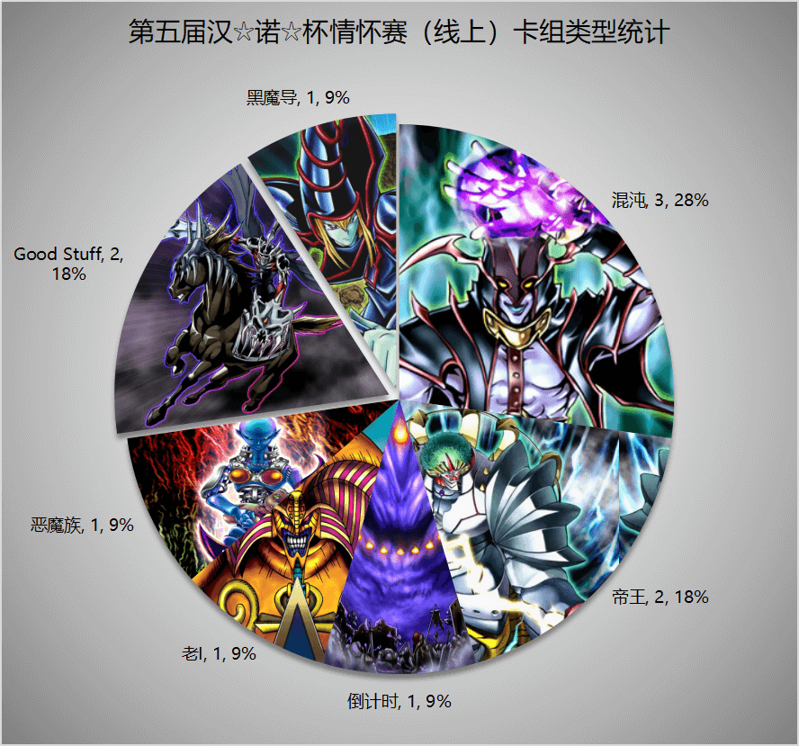
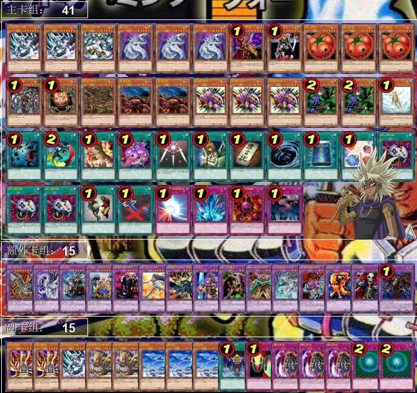

# 第五届汉诺杯战报（常规赛）

比赛时间 2021-5-2 14:00  
本比赛为模拟环境赛，因此构筑与历史上的上位思路会有少量差别  
卡池：前四期（约1999-2006.4）OCG卡池  
卡表：2006年3月限制卡表  
规则：大师规则2020（调整裁定按233服408端口处理结果）  
比赛原文：https://www.bilibili.com/read/cv10272577/  

[返回比赛信息](../../../Competitions.html)  

---

## 先说比赛结果
冠军：Good Stuff（洛夫LOF）  
亚军：帝王（冰火仙）  
季军：帝王（只房）  

    
     
    此处是图注

本次比赛报名人数14，实际参赛11人（不包含1个临时放鸽子的）。由于卡组战术比较直观，多为均卡中慢速beat down，少量阴间卡组（笑），因此就不发详细战术了，有需要可以另外问，仅简单介绍一下卡组思路，作为“遗老”玩家的参考以及现环境玩家的娱乐阅读资料。大家可以发表自己的看法，互相讨论！日常群暗号：708942347。  

直播回放视频：https://www.bilibili.com/video/BV1UV411776J/  

## 冠军：Good Stuff  
第一轮 倒计时-○×  
第二轮 ○○（不战胜）  
第三轮 混沌○○  
第四轮 帝王○×○  
准决赛 帝王×○○  
决赛 帝王○×○  

    
     
    冠军是本群狗管理之一，但UP可以保证比赛没有黑幕。Good Stuff的含义本次战报不再重复，有兴趣了解可以看第三届或第四届比赛的战报。冠军的主卡采用了番茄遗言轴，并外挂了2圣甲虫群1蝗虫的军势，以便于在对方战斗破坏番茄、没有其他怪兽可以攻击后，拉出圣甲虫群或蝗虫的军势，下回合发动效果变成里侧守备表示再反转召唤，使用效果先破坏对方1张卡。如果此时手卡有帝王，还能上级召唤帝王，进一步换取资源，也就是使得“帝王的解放源本身也能够换区资源”，在光之护封剑的保护下更是为所欲为。这2只虫还支持死之卡组破坏病毒（旧效果），十分可怕。副卡组是换装的自闭部件，可以让对方动不了，然后用一堆翻翻乐怪兽恶心对面，或者送给对方一个熔岩魔神大宝贝，给对方带来笑容。卡组整体速度偏慢，消磨对方的意志，可谓同时给予对方战术打击和精神攻击，十分阴间。卡组截图是冠军夺冠后自己提供的，放一个阳 光 大 男 孩马利克上去是他的恶趣味。

## 亚军：帝王
第一轮 混沌○○  
第二轮 帝王○○  
第三轮 混沌○○  
第四轮 Good Stuff ×○×  
准决赛 Good Stuff ○○  
决赛 Good Stuff ××  

    
     
    第三届比赛的冠军归来了！虽然他换了一个卡组。这个帝王卡组是UP在群里看过帝王数目最多的，没有之一，足足10帝，怪兽数也有25只之多，可以说比起其他玩家把帝王当作下级的补充，他更偏向于当作主打。据他自己透露，完☆美☆的☆手☆卡情况很少。总体运作起来挺流畅，只要解放源不全灭，几乎每回合都能拍出帝王，UP在没有仔细研究他卡组的时候，直播中都被他每1-2回合拍1个帝王的上手率吓到了，后来才发现原来是特化——整个卡组极端地基本上是完全的解放源+帝王，下级战斗力不算是完全没有，但十分弱，不太能不依赖帝王单独战斗。看到这个卡组UP主瞬间觉得自己卡盒里面的帝王不香了。

## 季军：帝王
第一轮 ○○（不战胜）  
第二轮 帝王××  
第三轮 混沌○○  
第四轮 倒计时○○  
准决赛 Good Stuff ○××  
季军争夺战 Good Stuff ○○  

    
     
    季军卡组是44张，UP主思考再三，还是把卡组分类为帝王。这个帝王的主卡组比较中规中矩，搭载了番茄轴之后，外挂了FLK爆发系统，容易通过爆发直接OTK。也外挂了沙尘之恶灵，如能实现黄泉青蛙+沙尘之恶灵的combo，则对方的表侧表示怪兽难以留在场上，没有魔法陷阱保护的话很容易被沙尘之恶灵beat死。副卡组学习冠军投入了圣甲虫群，眼前一亮的配置是2只凭依的血魔，可以用于牛头人对方场上的下级怪兽，特别是削魂的死灵、棉花糖等“不死小神童”，以及烦人的千眼纳祭神，可以说这个构筑是确实了解过环境而进行的针对。

## 以下是其他参赛者卡组，算是技术分享（部分本站首次展示）

    
     
    参赛者 超高校级的决斗者-罪论断一：经典混沌

---

    
     
    参赛者 回梦游仙：经典混沌

---

    
     
    参赛者 ε：挂甘多拉的混沌卡组

---

    
     
    参赛者 未知生命体：挂自爆开关的倒计时卡组

---

    
     
    参赛者 我家的蘑菇不见了：蝎尾狮老I

---

    
     
    参赛者 虹霓：恶魔族卡组，实际上叫恋尸归还更合适

---

    
     
    参赛者 耀眼：挂假面魔道士、暗黑界的均卡

---

    
     
    参赛者 看来我今天运气不错：本次比赛最魂卡组——黑魔术师

---

本届汉☆诺☆杯已完满落幕，欢迎大家一同加入参赛或日常娱乐！