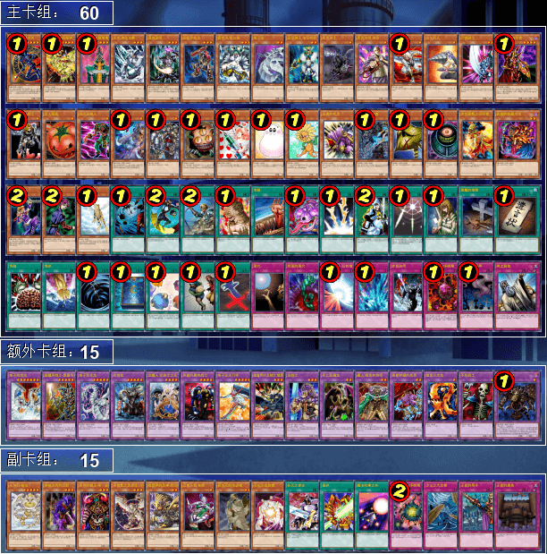
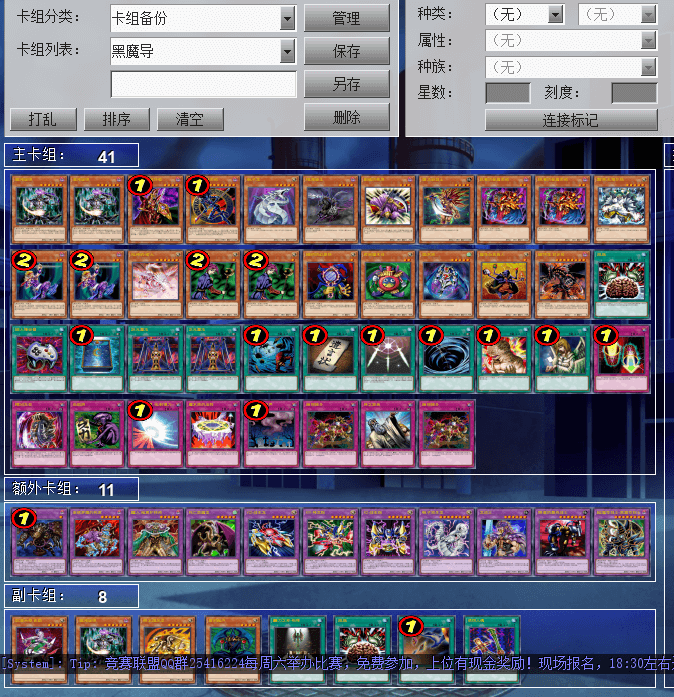
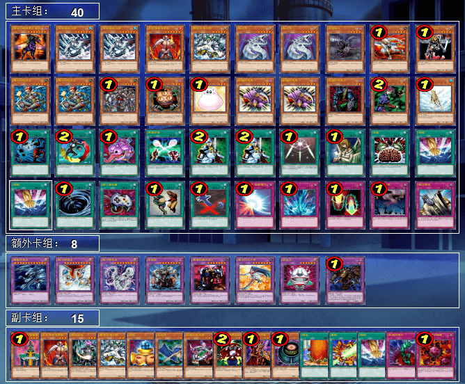
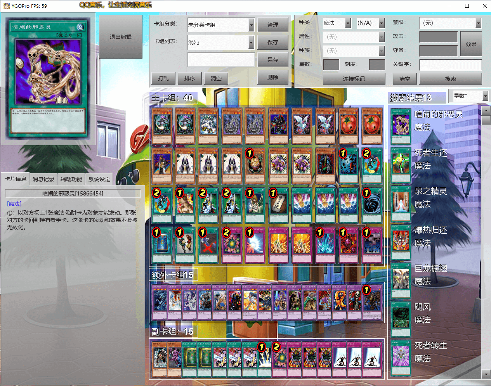
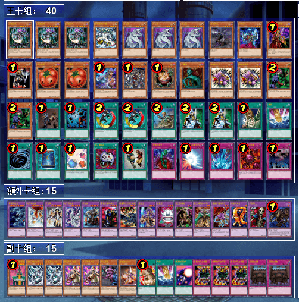

# 第六届汉诺杯战报（常规赛）

比赛时间 2021-6-12 14:00  
本比赛为模拟环境赛，因此构筑与历史上的上位思路会有少量差别  
卡池：前四期（约1999-2006.4）OCG卡池  
卡表：2006年3月限制卡表  
规则：大师规则2020（无额外怪兽区，调整裁定按233服408端口处理结果）  
比赛原文：https://www.bilibili.com/read/cv11398834/  

[返回比赛信息](../../../Competitions.html)  

---

## 先说比赛结果
冠军：帝王（冰火仙）   
亚军：Good Stuff（一刀斋主干涸）   
季军：不死族（カーリー渚）  

本次比赛报名人数15，实际参赛12人（包含1个睡晚了只能打第四轮瑞士轮，重在参与的）。由于卡组战术比较直观，多为均卡中慢速beat down，少量阴间卡组（笑），因此就不发详细战术了，仅简单介绍一下卡组思路，有需要可以另外问。欢迎把本文作为“遗老”玩家的参考以及现环境玩家的娱乐阅读资料。大家可以发表自己的看法，互相讨论！日常群暗号708942347。  

直播回放视频：https://www.bilibili.com/video/BV1ph411a74V/  

## 冠军：帝王

第一轮 混沌○○  
第二轮 不死族○○  
第三轮 帝王×○×  
第四轮 混沌×○○  
准决赛 帝王○○  
决赛 Good Stuff ○×○  

    
     
    此冰火仙第二次夺冠了！继上次比赛他以10帝构筑取得亚军后，这次他采用了12帝构筑，可以说是把408环境的帝王全满上了，极大增加了帝王的上手率，怪兽也足足26只。由于环境速度并不快，因此冠军并未采用大量的回合外响应的卡，而是投入便于特殊召唤、不能被战斗破坏以及可以牛头人对面怪兽的卡，尽可能地为帝王提供解放源，然后基本每几回合上召1次帝王，在自己的回合换取卡差，同时给对面带来较大的心理压力。当然完 美 的 手 卡的情况也是会有的，因此冠军透露，每次G2、G3，他总会换下一些帝王，缓和帝王卡手的情况。副卡组有针对各种阴间卡组的对策，包括对除外陷阱、对贴纸、对低星“不死小神童”的对策。

## 亚军：Good Stuff
第一轮 Good Stuff ○○（不战胜）  
第二轮 混沌×○○  
第三轮 混沌○×○  
第四轮 帝王××  
准决赛 不死族○×○  
决赛 帝王×○×  

    
     
    真·均卡，完全一刀流60大卡堆，确实很好地贯彻了Good Stuff“强力单卡有机结合”的理念，使用的基本上是408卡池里都算是强力的卡片，确确实实做到了抽什么打什么。只要不是手卡怪兽能力过与单一，吃死之卡组破坏病毒或魔之卡组破坏病毒之一问题也不会特别大。唯一的不足是卡均“限制卡”，如果被对方识破了构筑风格，对方就不必再提防同名卡，无法很好地利用对方的防备心迫使对方博弈作出非最优解。另外，本次比赛中出瑞士轮后回膛手枪龙发动效果没一次成功，场面过于草。

## 季军：不死族
第一轮 守墓○×○  
第二轮 帝王××  
第三轮 混沌○○  
第四轮 Good Stuff ○×○  
准决赛 Good Stuff ×○×  
季军争夺战 帝王○○  

    
     
    重铸不死荣光，我辈义不容辞！这是继本人之后第二个使用不死族卡组在汉☆诺☆杯中取得名次的玩家（之前4人和6人大会而且还是私表黑历史时代也好意思说？）。由于群内不断研究各种史料以及现代打牌理论（以卡差理论为主），因此卡组的构筑水平已经明显超越了早期的本人。除了明显外挂帝王弥补不死族系统内缺乏解场效果的缺点外，也投入了死亡骆驼，企图在金字塔龟、生者之书-禁断的咒术-的特殊召唤下可以赚卡，诱导对方优先攻击，而且也能被哥布林僵尸检索，减少空发的损失。为了控制游戏节奏，多让死亡骆驼抽卡，甚至还投入了超重力网，除了自己可以用冰帝 美比乌斯、大风暴方便地解决，做到几乎单方面限制攻击，也能诱导对方浪费本来就不多的魔法陷阱破坏效果在它上面。让人比较意外的是副卡组竟然含有呼声向小系统。

## 以下是其他参赛者卡组，算是技术分享（部分本站首次展示）

    
     
    参赛者 光荣感：挂甘多拉、时间魔术师等少见外挂的魔法师向混沌卡组

---

    
     
    参赛者 八重嘤：十分阳光的异次元卡组

---

    
     
    参赛者 我家的蘑菇不见了（退赛，以前误放，此处保留）：融合向混沌卡组

---	

    
     
    参赛者 林夕：8帝构筑次元帝

---

    
     
    参赛者 薯片：稍微增加了一些帝王投入的good stuff

---

    
     
    参赛者 放弃治疗小学生：挂疾风之暗黑骑士 盖亚的均卡（保留）

---

    
     
    参赛者 西门吹雪：召唤僧仙鹤GBA小系统投入型混沌，可惜召唤僧不能解放

---

    
     
    参赛者 未知生命体：经典混沌

---

    
     
    参赛者 阿森：可换装自闭烧的守墓

---

    
     
    参赛者 翻墙撸：副卡组十分有特色的good stuff

---

本届汉☆诺☆杯已完满落幕，欢迎大家一同加入参赛或日常娱乐！