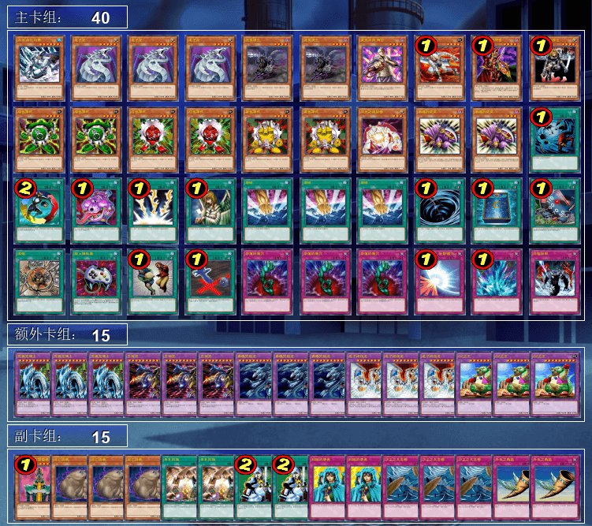
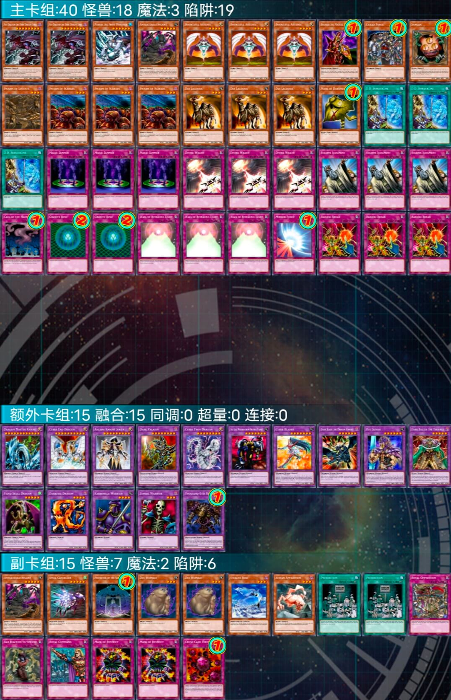
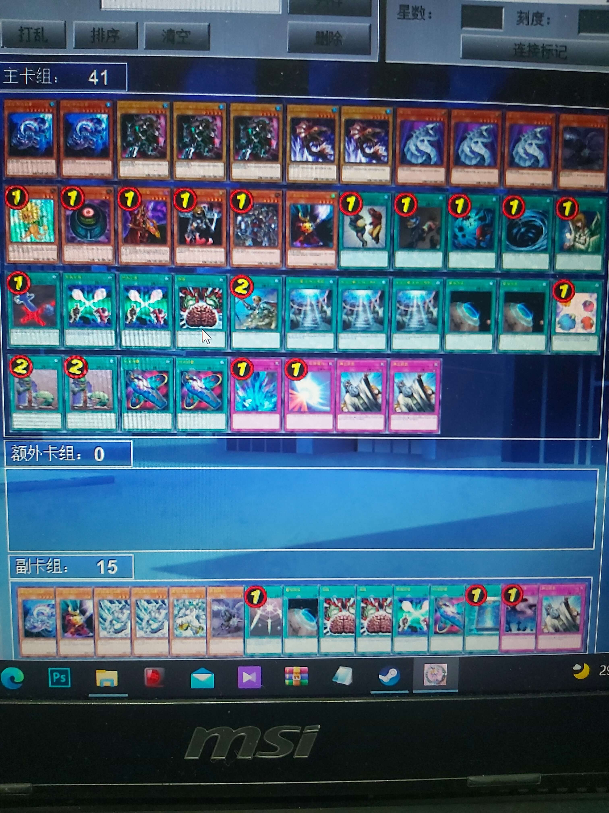

# 第七届汉诺杯战报（常规赛）

比赛时间 2021-10-3 14:00  
本比赛卡组构筑与历史上的上位思路会有少量差别  
卡池：前四期（约1999-2006.4）OCG卡池  
卡表：2006年3月限制卡表  
规则：大师规则2020（无额外怪兽区，调整裁定按233服408端口处理结果）  
比赛原文：https://www.bilibili.com/read/cv13166568  

[返回比赛信息](../../../Competitions.html)  

---

## 先说比赛结果
冠军：Good Stuff（亓）  
亚军：不死族（虹霓）  
季军：混沌（sanfandeng）  

    

本次比赛报名人数18，全勤参赛！这是有史以来的汉☆诺☆杯中参赛人数和参赛率最高，也是环境最百花齐放的一次。18人参赛，卡组类型有13种。由于卡组战术比较直观，多为均卡中慢速beat down，少量阴间卡组（笑），因此就不发详细战术了，仅简单介绍一下卡组思路，有需要可以另外问。欢迎把本文作为“遗老”玩家的参考以及现环境玩家的娱乐阅读资料。大家可以发表自己的看法，互相讨论！日常打牌群708942347。  

另外特别感谢群友カーリー渚（ID @月華の剣士黎明の決意）的无私奉献，放弃参赛主动担任副裁判协助维持比赛秩序。  

直播回放视频：https://www.bilibili.com/video/BV1Uf4y1j7vV/  

## 冠军：Good Stuff

第一轮 混沌○○  
第二轮 海龙○×○  
第三轮 帝王××  
第四轮 帝王○○  
八强 零件×○○  
准决赛 混沌○×○  
决赛 不死族○○  

    
     
    强力的卡组往往只需要简单的思路，由于Good Stuff类型的卡组在汉☆诺☆杯战报中已经介绍过多次，这里就不赘述了。

## 亚军：不死族

第一轮 零件××  
第二轮 反击天使○○  
第三轮 反击天使○×○  
第四轮 帝王○×○  
八强 混沌○×○  
准决赛 昆虫族○○  
决赛 Good Stuff ××  

    
     
    这是难得的一个投入了诅咒之吸血鬼和吸血鬼领主，且削魂的死灵仅仅只投入1的不死族卡组，主卡组很意外地投入了召唤僧与圣鸟 仙鹤各1的僧鹤小轴。副卡组的满江红更是亮点，特别是旋风不入主，取而代之使用了需要上级召唤才能发动效果的冰帝 美比乌斯更是体现了其面对阴间卡组的勇气。

## 季军：混沌

第一轮 帝王××  
第二轮 狒狒×○○  
第三轮 倒计时○○  
第四轮 昆虫族○○  
八强 零件×○○  
准决赛 Good Stuff ×○×  
季军争夺战 昆虫族×○○  

    
     
    强力的卡组往往只需要简单的思路+1。与历史不同的是，本群群友会更多地在主卡组投入敌人操纵器。以前网络未普及，玩家们的思维不能很好地碰撞，而现在的网络与历史资料的客观条件则使得季军可以研究出高度不同于历史中一些上位的混沌——投入3削魂的死灵+2敌人操纵器，以及仅仅只有1的王宫的通告。其余部分依然是Good Stuff思路，这里就不再赘述。

## 八强

零件3  
混沌2  
不死族1  
昆虫族1  
Good Stuff 1  

## 四强
混沌1  
不死族1  
昆虫族1  
Good Stuff 1  

## 以下是其他各参赛者的卡组，算是技术分享

    
     
    副裁判 カーリー渚：外挂了哥布林僵尸小系统的均卡，应其要求特别展示

---

    
     
    四强 只房：昆虫族卡组，比较少见的能上位的非主流种族卡组

---

    
     
    八强 耀眼：搭载次元斩系统的6齿零件卡组

---

    
     
    八强 薯片：中规中矩的6齿零件卡组，特色是副卡组里的3升天之角笛

---

    
     
    八强 黑巫女的右瞳：通告向的9齿零件卡组

---

    
     
    八强 我家的蘑菇不见了：说是“电子龙”卡组但混沌部分强度更高啊（半恼）

---

    
     
    参赛者 未知生命体：投入了不死族遗言轴的倒计时卡组，老报社了

---

    
     
    参赛者 冰火仙：9帝构筑的黄泉帝

---

    
     
    参赛者 齿轮齿巨人X干涸：基本从当年06年日本选考会手抄的异次元的境界线向反击天使，十分报社

---

    
     
    参赛者 树懒：投入了凤凰神的帝王，但没有投入黄泉青蛙

---

    
     
    参赛者 奥西里斯2：返璞归真的凡骨beat，是男人就来肛正面！

---

    
     
    参赛者 爱你的猫帕瓦：控制权夺取卡组。截图中这卡组名……纯爱战士震怒（恼）

---

    
     
    参赛者 嘉诚天下第一：虽然挂了暗黑界但看上去我还是偏向认为是反击天使。话说是不是忘记投入突然变异了……

---

    
     
    参赛者 回忆总最美：手卡控制向的暗黑界卡组

---

    
     
    参赛者 亞深：比较魂的海龙卡组

---

    
     
    参赛者 RL：投入生还的宝札的狒狒卡组，狒狒是新裁定

---

本届汉☆诺☆杯已完满落幕，欢迎大家一同加入参赛或日常娱乐！