# 第八届汉诺杯战报（常规赛）

比赛时间 2022-1-2 14:00  
本比赛卡组构筑与历史上的上位思路会有少量差别  
卡池：前四期（1999-2006.4）OCG卡池  
卡表：2006年3月限制卡表  
规则：大师规则2020（无额外怪兽区，调整裁定按233服408端口处理结果）  
比赛原文：https://www.bilibili.com/read/cv14438938/

[返回比赛信息](../../../Competitions.html)  

---

## 先说比赛结果

冠军：自闭烧（冰火仙）  
亚军：翻翻乐（亞深）  
季军：不死族（虹霓）  

    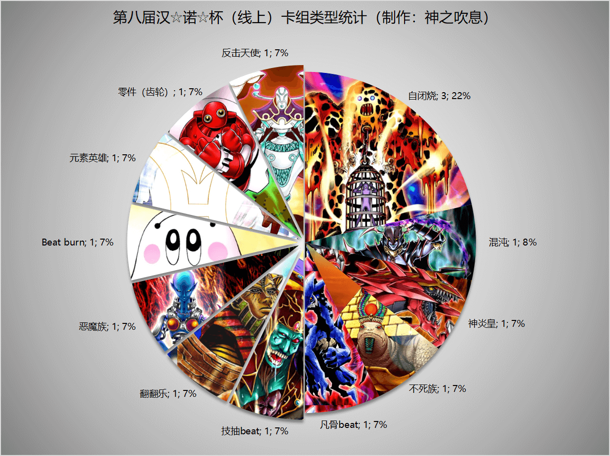

最近换了新工作，忙了好多，战报只能延后几乎一个月发。本次比赛报名人数16，参赛14，难得的是阴间卡组或带有阴间系统的卡组竟然多了点（笑）。本文不发详细战术，仅简单介绍一下卡组思路，有需要可以另外问。欢迎把本文作为“遗老”玩家的参考以及现环境玩家的娱乐阅读资料。大家可以发表自己的看法，互相讨论！日常打牌群708942347。  

另外特别感谢群友永远的干涸的无私奉献，在瑞士轮结束后主动担任副裁判协助维持比赛秩序。  

直播回放视频：https://www.bilibili.com/video/BV1yL411V7tM/  

## 冠军：自闭烧

第一轮 自闭烧×○×  
第二轮 元素英雄××  
第三轮 翻翻乐○--  
第四轮 自闭烧○○  
八强 零件○--  
准决赛 恶魔族○--  
决赛 翻翻乐×○○  

    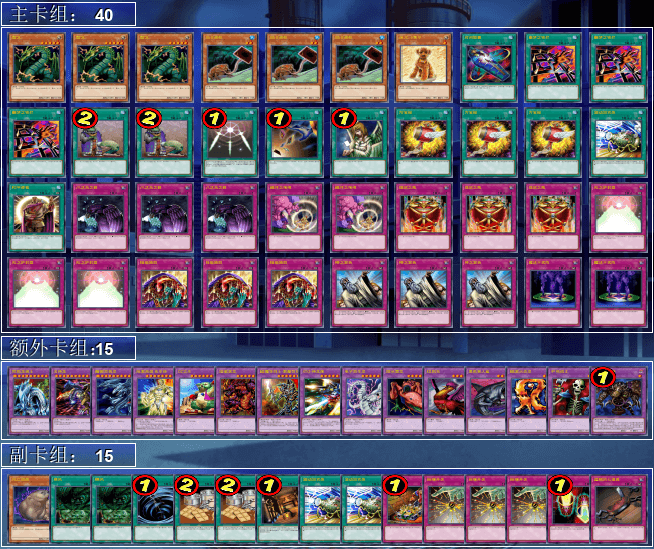
     
    投入自爆开关的自闭烧，一般是采用G1烧死对方，然后G2、G3自爆开关强行结束本局的战术，如果不行，再正常烧死对方。老朋友冰火仙总是能给我们整出点新花样，他曾经试过用老I夺冠，打了大家一个措手不及，然后下一届老I就被其他参赛者针对，连瑞士轮都出不了。估计下次大家就对自爆开关有所顾忌，不会这么容易再中招的了。

## 亚军：翻翻乐

第一轮 反击天使○○  
第二轮 自闭烧××  
第三轮 自闭烧×--  
第四轮 元素英雄○○  
八强 反击天使○○  
准决赛 不死族×○○  
决赛 自闭烧○××  

    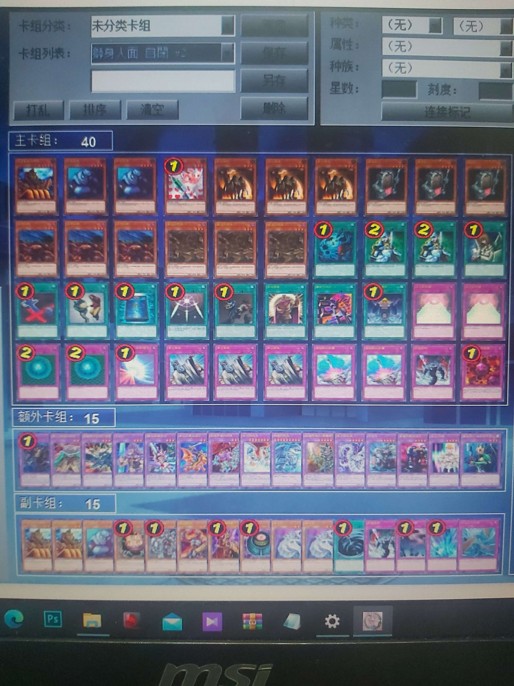
     
    亚深在用过2次海龙卡组无法出瑞士轮后，选择加入了阴间卡组的行列，采用了昆虫投入向的地属性翻翻乐卡组。虽然投入了大量的自闭贴纸，但本质上还是beat卡组，有当年狗管理LOF翻翻乐折磨人内味了2333（虽然构筑方向不同）。

## 季军：不死族

第一轮 恶魔族○○  
第二轮 Beat burn ○○  
第三轮 元素英雄○○  
第四轮 自闭烧○××  
八强 自闭烧×○○  
准决赛 翻翻乐○××  
季军争夺战 恶魔族○×○  

    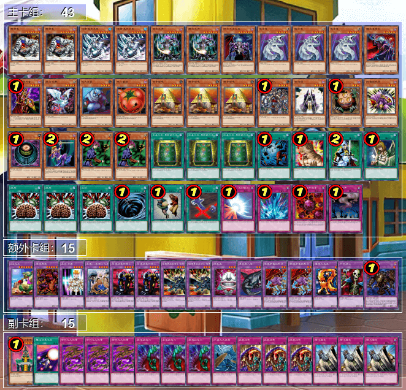
     
    本次比赛难得的beat卡组之一，重铸不死荣光，我辈义不容辞！作为不死族来说，构筑确实比较中规中矩，稍微有点特色的是那个各投入1的僧鹤小轴。

## 八强
自闭烧 2  
零件 1  
不死族 1  
恶魔族 1  
凡骨beat 1  
翻翻乐 1  
反击天使 1  

## 四强
自闭烧 2  
不死族 1  
恶魔族 1  

## 以下是其他各参赛者的卡组，算是技术分享

    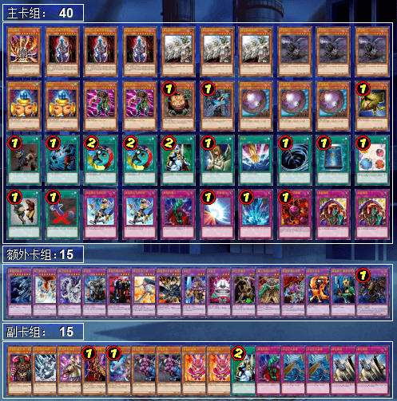
     
    四强 未知生命体：外挂了8星大宝贝的归还向恶魔族卡组，大宝贝能在关键时刻作为补刀卡使用。这是本次比赛难得的beat卡组之一

---

    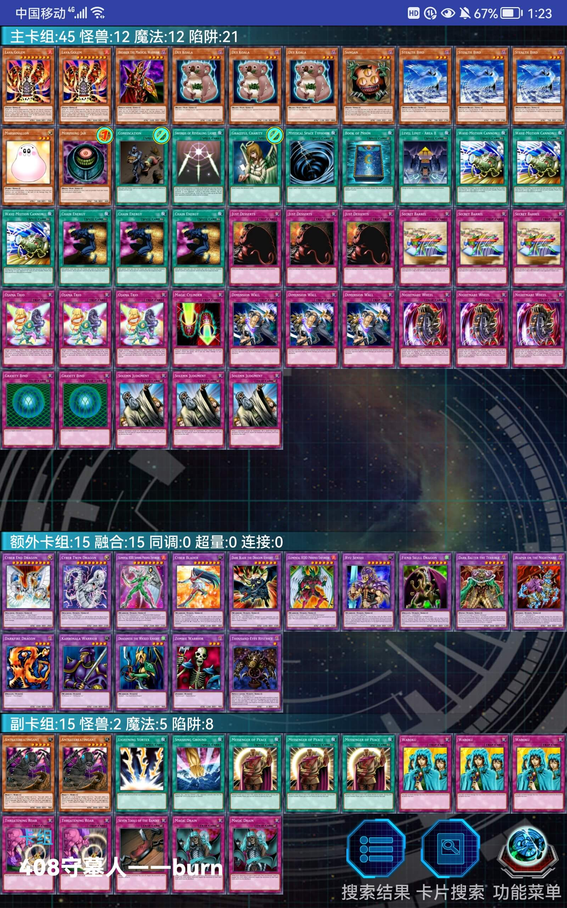
     
    八强 自闭烧：扰乱三人组向自闭烧卡组

---

    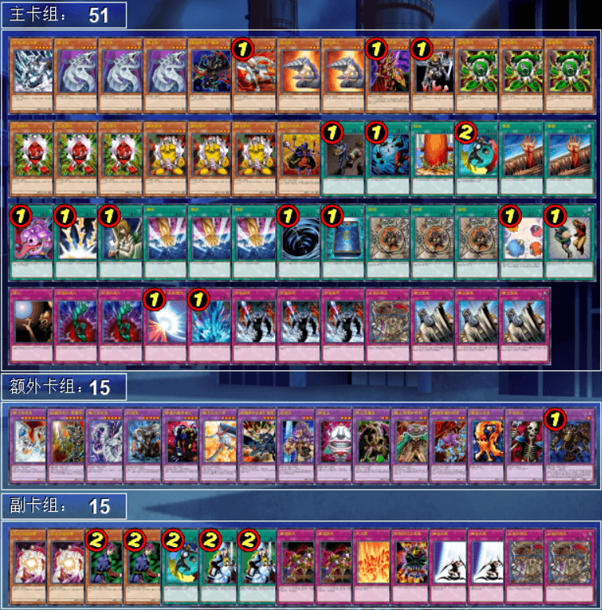
     
    八强 新人求轻虐（其实就是永远的干涸）：外挂了魔导杂货商人和王宫的弹压的9齿零件大卡组

---

    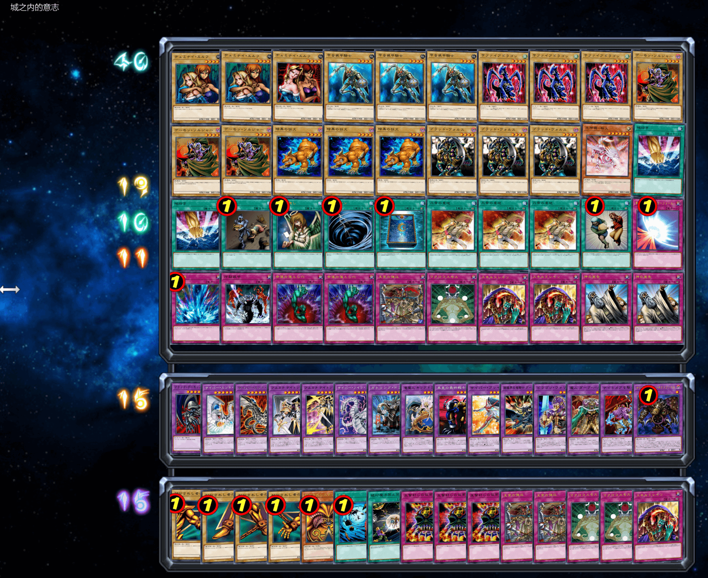
     
    八强 奥西里斯2：返璞归真的凡骨beat，是男人就来肛正面！副卡组可以换装成凡骨老I

---

    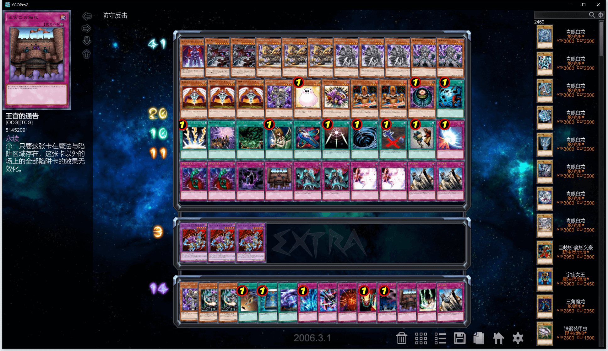
     
    八强 嘉诚天下第一：外挂了暗黑界轴的反击天使

---

    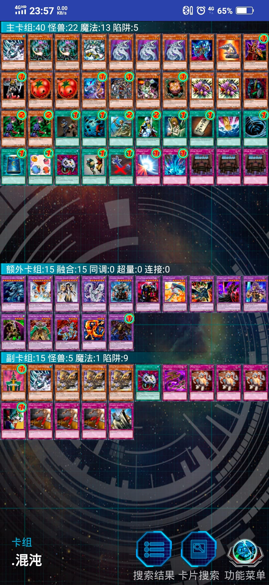
     
    参赛者 皮一下行不：经典的混沌卡组，副卡组能换装成手控向。原本他才是八强之一，但可惜有别的事要做，因此在瑞士轮之后退出比赛，八强名额让给积分第九名

---

    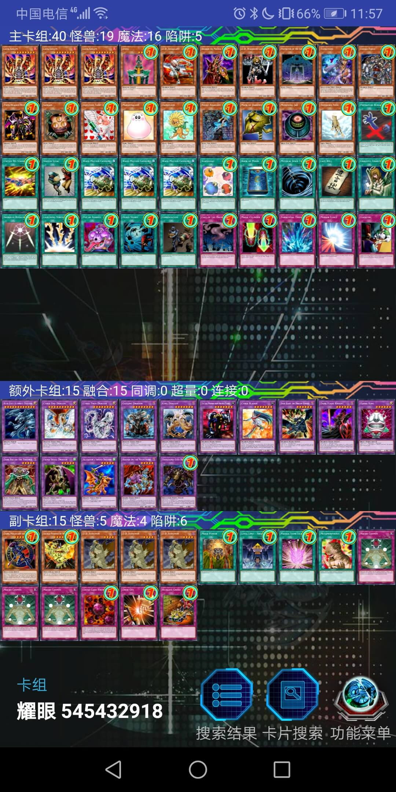
     
    参赛者 耀眼：一个投入了3大宝贝的beat burn卡组，他甚至还在副卡组里投入了次元小轴

---

    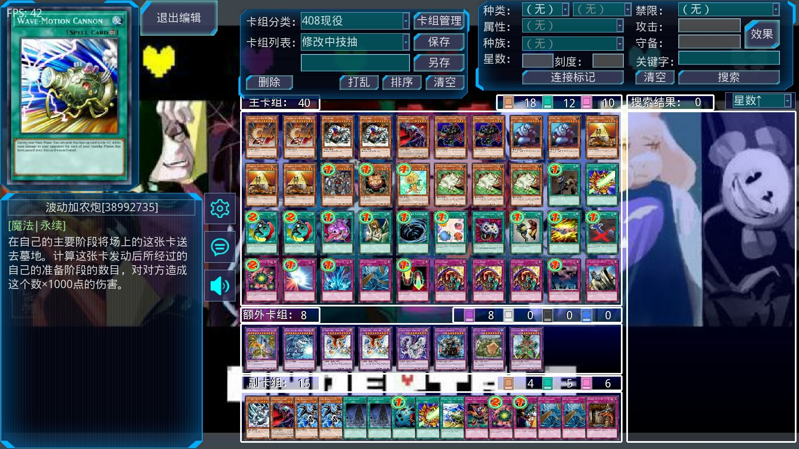
     
    参赛者 RL：投入了不死遗言轴的技抽beat卡组

---

    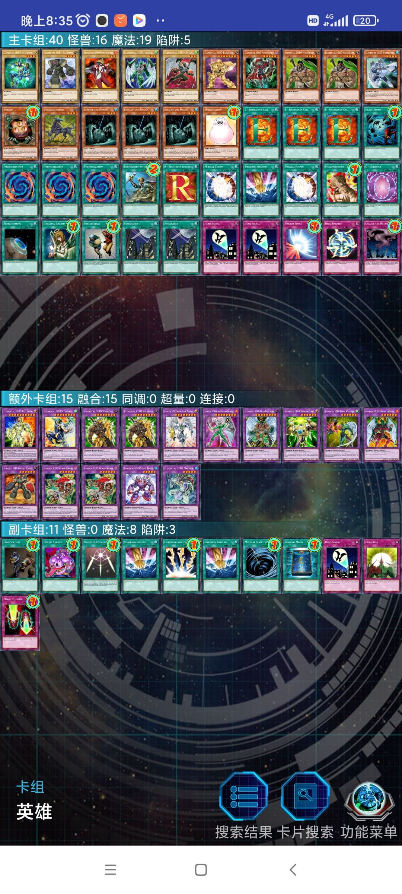
     
    参赛者 武藤游戏fan：在没有天空侠年代的卡池里构筑的手融元素英雄卡组，非常魂，可惜在比赛中只打败了beat能力严重不足的冠军2333。“我并不讨厌像你这般热血的男人，但是决斗是残酷的”。另外，弟啊，你这突然变异怎么用啊？

---

    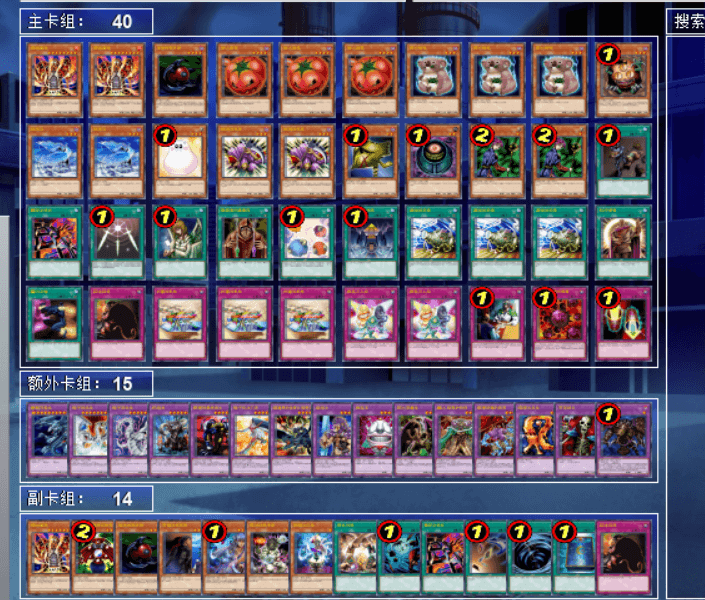
     
    参赛者 回忆总最美：投入了扰乱三人组和魔力之枷的自闭烧

---

    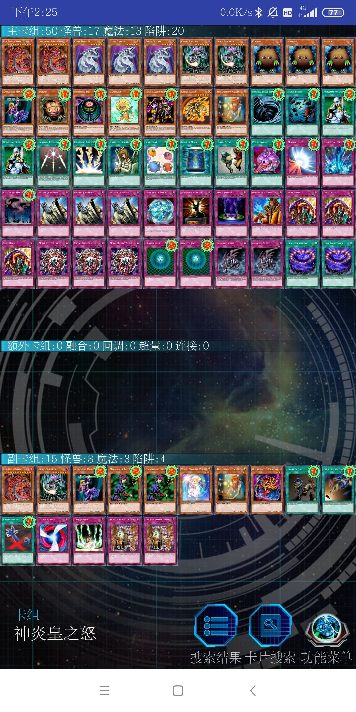
     
    参赛者 左拾遗：神炎皇卡组，在这个环境里算是有点魂的

---

本届汉☆诺☆杯已完满落幕，欢迎大家加入参赛或日常娱乐！