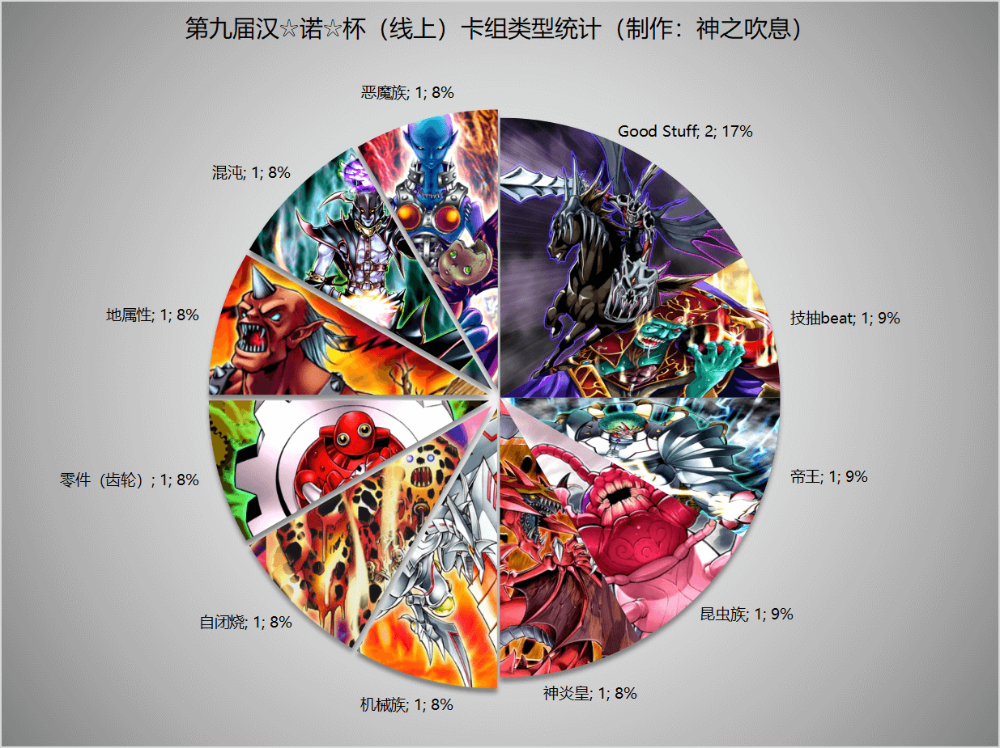
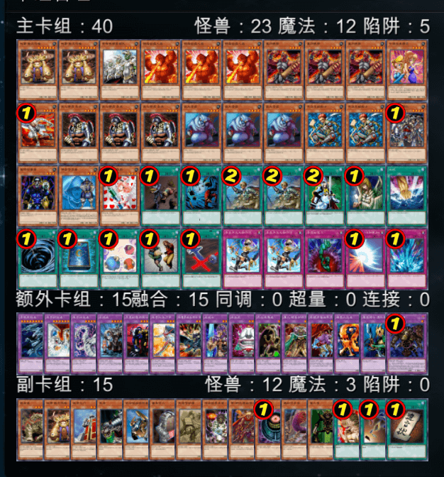
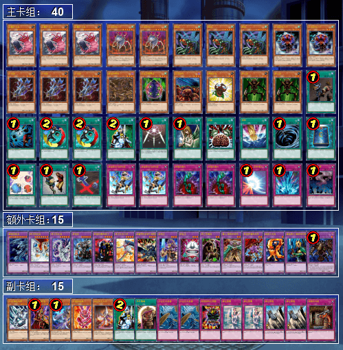
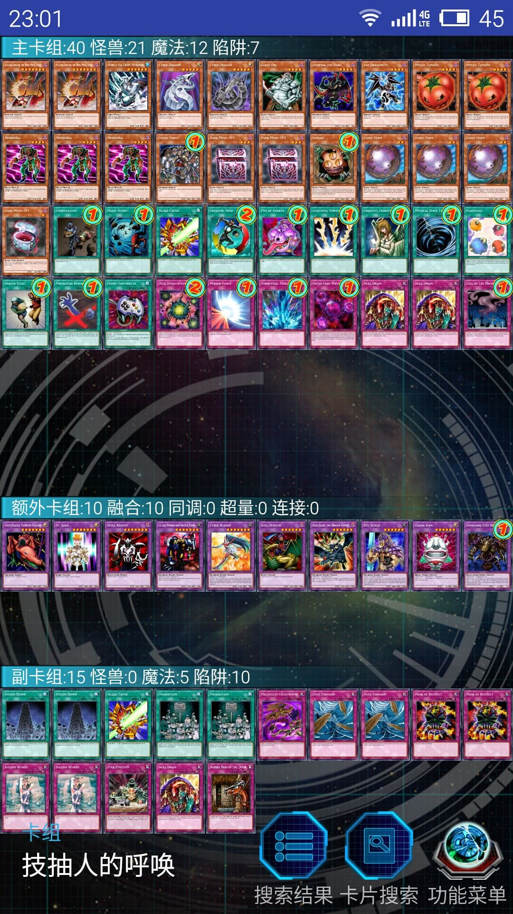
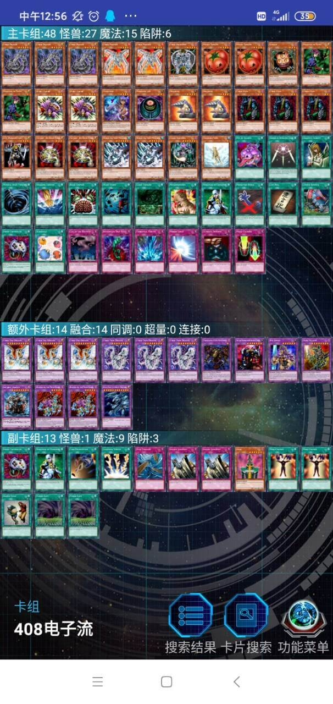
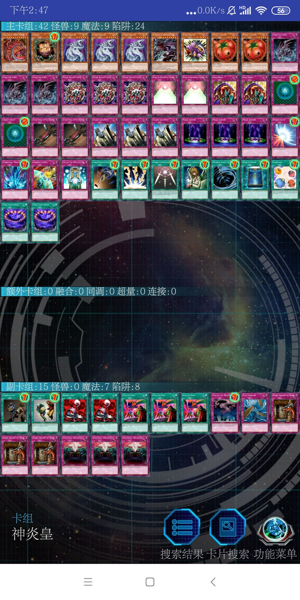
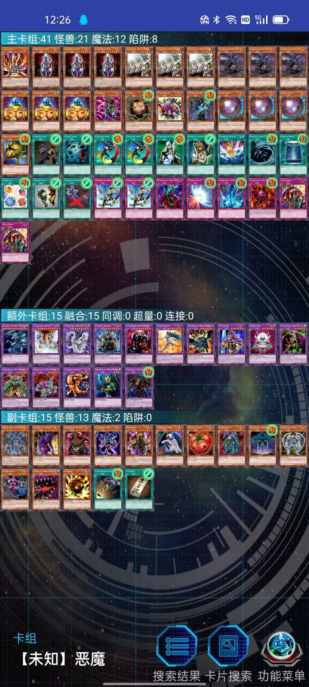

# 第九届汉诺杯战报（常规赛）

比赛时间 2022-2-3 14:00  
本比赛卡组构筑与历史上的上位思路会有少量差别  
卡池：前四期（1999-2006.4）OCG卡池  
卡表：2006年3月限制卡表  
规则：大师规则2020（无额外怪兽区，调整裁定按233服408端口处理结果）  
比赛原文：https://www.bilibili.com/read/cv14937626/  

[返回比赛信息](../../../Competitions.html)  

---

## 先说比赛结果
冠军：地属性（321）  
亚军：Good Stuff（薯片）  
季军：零件（冰火仙）  

    

诸位久等了！更新完视频后，比赛的战报也出来了。本次比赛报名人数12，参赛12，一开始还以为连8人都凑不齐，还好最后总算人够数了。本次比赛是历届比赛以来掉线事件最频发的，没有之一（悲）。本文不发详细战术，仅简单介绍一下卡组思路，有需要可以另外问。欢迎把本文作为“遗老”玩家的参考以及现环境玩家的娱乐阅读资料。大家可以发表自己的看法，互相讨论！日常打牌群708942347。  

特别感谢群友依然范特西的无私奉献，主动担任志愿者协助保存比赛录像文件。另外，有必要点名批评EGCLM和亚撒西立本男孩两位参赛者，都是在比赛开始前1小时才修改卡组内容，差点导致比赛延时举行。本次比赛并非完全禁止修改卡组内容，但在赛前1小时如此尴尬的时刻才提出修改，除了会给比赛造成不必要的紧急情况，也会给其他参赛者带来“黑幕”的感受，产生不良影响，本人对此在此作出严厉谴责。  

直播回放视频：https://www.bilibili.com/video/BV1b44y1W7E4/

## 冠军：地属性

第一轮 神炎皇××  
第二轮 昆虫族○○  
第三轮 混沌×○×  
第四轮 帝王○×○  
四强 零件○×○  
决赛 Good Stuff ×○○  

    
     
    这是历届比赛中难得的，甚至可以说是爆冷门的卡组类型。这个卡组可以说是十分简单粗暴，投入大量攻击力极高的地属性下级怪兽，在打点上直接对对方进行压制，甚至面对电子龙还不一定落于下风。这使得对方的beat类卡组面对极大的打点压力，很多时候不得不消耗宝贵的解场效果在一只原本攻击力就高的下级怪兽上，甚至这只下级怪兽还没有正面效果。而本卡组的遗言系统与归还系统也提供了解场和OTK解决方案，很好地降低了单纯打点高被对方利用效果拖时间后反杀的风险。在其他环境类似的民间赛制中，地属性beat也同样存在大爆冷门，艹死其他主流夺冠的经历，这也展现了这个卡组的巨大潜力。总体而言，这是个强度恰到好处，无论是比赛还是日常娱乐都能发挥实力，同时保障自己和对方游戏体验的卡组。本人也建议新手玩家可以参照这个卡组进行构筑或直接使用这个卡组，以便将精力放在尽快熟悉基本规则上。

## 亚军：Good Stuff
第一轮 昆虫族○×○
第二轮 神炎皇×○○
第三轮 零件××
第四轮 Good Stuff ○○
四强 自闭烧×○○
决赛 地属性○××

    
     
    老参赛者薯片回来了！他使用的依然是Good Stuff，而且他参加的这么多次比赛以来，Good Stuff卡组构筑基本没变多少，可以说已经是十分稳定了。从构筑修改少、参赛经常上位这两方面能看出薯片确实对408环境的理解比较到位，且操作水平十分高。这个卡组前几届比赛已经展示并评述过了，本人就不在此浪费篇幅，大家可以多多参考思路，提高姿势水平。

## 季军：零件
第一轮 技抽beat ○○
第二轮 Good Stuff ○○
第三轮 Good Stuff ○○
第四轮 自闭烧×○○
四强 地属性×○×
季军争夺战 自闭烧×○○

    
     
    冰火仙也是多届比赛的老整活参赛者了，这次他采用的卡组是除去零件。这个卡组只有40，因此冰火仙采用了6齿的构筑，减少多个齿轮同时上手的概率，这样一来也能多3个卡位可以投入解场卡或坑，增加能解决对方对方怪兽的资源。为了进一步换取资源，冰火仙投入了首领 扎鲁格，这样一来齿轮也有了能稳定进行手卡控制的手段，即使对方想将关键卡隐藏在手中规避被解场卡解决，也可能会被手卡控制，极大增加了对方的心理压力和思考量。在魔法陷阱解决方面，冰火仙采取了主卡组投入贤者 喀戎的而不是冰帝 美比乌斯的方案。主卡组中有18张魔法卡，这个量对于偶然将1-2张魔法卡变成风，对整个卡组的影响不大，且齿轮卡组极度依赖通常召唤，特殊召唤点十分少，难以将通常召唤点交给本来就需要解放怪兽的帝王，而贤者 喀戎无须上级召唤，攻击力也不差，即使被对方的召唤反映坑解决，损失也不会太大，因此这个方案也是十分合理的。在魔法卡方面，比起能简单1换1的地割，冰火仙更多偏向于采用虽然要2卡才能达成解场但可以在对方回合的伤害步骤中发动的收缩，这样一来收缩既能解场，也能干扰，而且能在伤害步骤发动，也可以使得对方无法连锁一般的速攻魔法或陷阱减少损失，只能硬生生看着收缩适用，可以说是便于利用规则排除对方对收缩的干扰。

## 以下是其他各参赛者的卡组，算是技术分享。

    
     
    四强 反则中级高手：经典自闭烧，比较勇的是竟然没有副卡组，也没有投入超重力网，而是采用了遗言怪兽辅助防守

---

    
     
    参赛者 未知生命体：搭载归还系统的昆虫族卡组

---

    
     
    参赛者 RL：投入了大量遗言怪兽的技抽beat卡组

---

    
     
    参赛者 忘儿大魔王：投入魔杂的混沌卡组，但不知道为何没有投入贪欲之壶

---

    
     
    参赛者 夜空深蓝：本来还在纠结这是齿轮还是帝王，然后看了看主卡组中帝王系统和解场卡的浓度以及显眼的黄泉青蛙，还是决定归类为帝王

---

    
     
    参赛者 EGCLM：机械族卡组，开赛前一小时才更新卡组的屑（恼）

---

    
     
    参赛者 左拾遗：神炎皇卡组。弟啊，你这更像是倒计时罢（半恼）

---

    
     
    参赛者 耀眼：60大卡堆，姑且算是Good Stuff吧，整活味道比较浓

---

    
     
    参赛者 亚撒西立本男孩：恶魔族卡组。弟啊你手抄也罢了还不自己重新截图，而且赛前一小时才更换整个卡组，有点过分了罢（恼）

---

本届汉☆诺☆杯已完满落幕，欢迎大家一同加入参赛或日常娱乐！