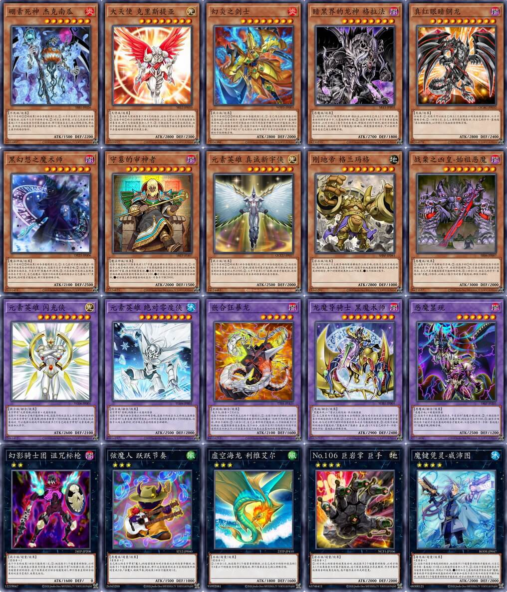
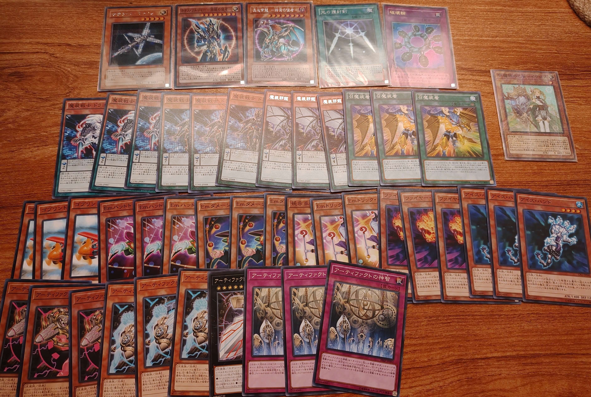
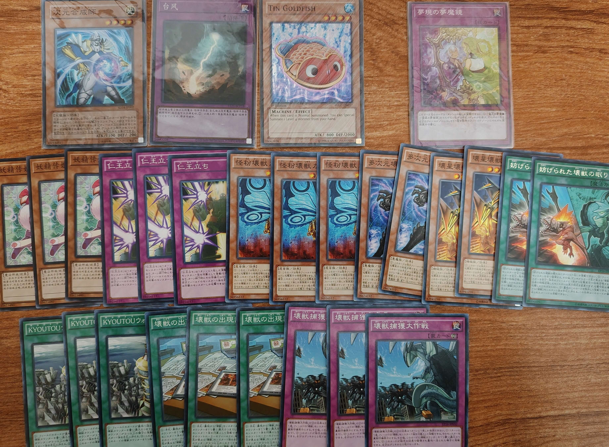
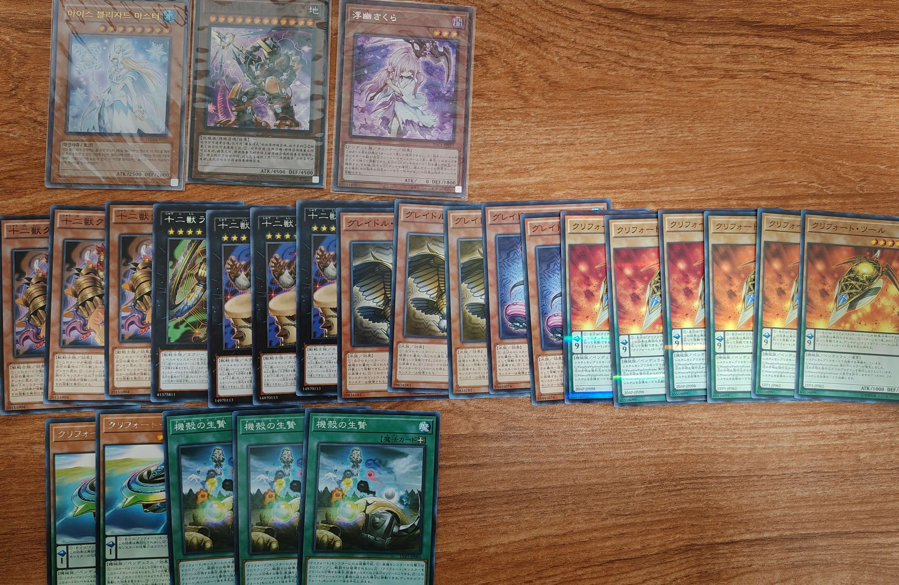
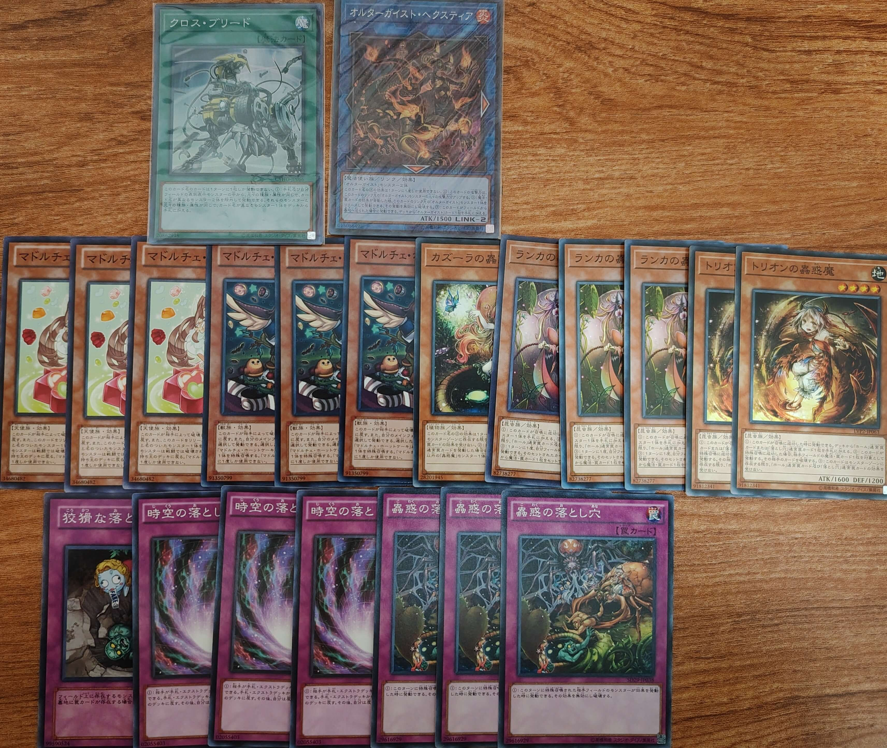

# 2025年5月汉诺杯间歇赛举办公告

[返回比赛信息](../../../Competitions.html)  

---

## 赛事简介
- **环境设定**：基于大师规则2020（无额外怪兽区），重制2006年3月OCG限制卡表+四期卡池的健康环境 （末位补充包编号为408，故称“408环境”）。  
- **核心目标**：适合新手入门，可培养OCG环境兴趣。  

---

## 规则摘要
1. **规则版本**  
   - 408环境规则省流版  
     ▷ 采用大师规则2020（不适用额外怪兽区）  
     ▷ 改订前效果+最新裁定  
     ▷ 2006年3月限制卡表+第四期完整卡池  
     *保留经典策略框架，同时规避旧规则复杂度  
   
   - **相关链接**  
     - [环境介绍](../../../../../Articles/Notices/Intro.html)  
     - [卡池范围](../../../../Cardpool%20Banlist/Cardpool.html)  
     - [线上决斗指南](../../../../Notices/Online.html)（软件下载与连线教程）  
   
3. **特殊规定**  
   - [ ] **本次比赛不采用**
   - [ ] **推广赛**：使用提供的8套预组卡组参赛，不可修改构筑（自由构筑可加入全国群约战）。  
   - [x] **其他**：跨时代对决  
   1. 在常规408环境卡池外，额外提供主卡组候选卡和额外卡组候选卡各10种；  
   2. 允许分别从两类候选卡中最多各选取1种，各投入1张（主卡组怪兽1张/额外怪兽1张）；  
   3. 可选择不添加任何候选卡，直接使用408环境常规卡组参赛。  
   4. 可在比赛群下载“Across_Era_Duel.ypk”文件（赛后可删）复制到“expansions”文件夹。  
   5. 代码`NF,M#(自定义密码)`。  

    

   | 序号 | 信息                                                         | 卡片种类 | 卡片密码 |
   | :--: | :----------------------------------------------------------- | :------: | :------: |
   |  1   | 硼素死神 杰克南瓜 [怪兽\|效果] 不死/炎 [★7] 1500/2200 这个卡名的①②的效果1回合各能使用1次。 ①：从手卡丢弃1只不死族怪兽才能发动。这张卡从手卡特殊召唤。 ②：对方主要阶段，以自己或者对方的墓地1只不死族怪兽为对象才能发动。那只怪兽在自己场上特殊召唤。那之后，表侧表示的这张卡直到结束阶段除外。这个效果特殊召唤的怪兽从场上离开的场合除外。 | 效果怪兽 | 36016907 |
   |  2   | 大天使 克里斯提亚 [怪兽\|效果] 天使/光 [★8] 2800/2300 ①：自己墓地的天使族怪兽只有4只的场合，这张卡可以从手卡特殊召唤。 ②：这张卡的①的方法特殊召唤成功的场合，以自己墓地1只天使族怪兽为对象发动。那只天使族怪兽加入手卡。 ③：只要这张卡在怪兽区域存在，双方不能把怪兽特殊召唤。 ④：场上的表侧表示的这张卡被送去墓地的场合，不去墓地回到持有者卡组最上面。 | 效果怪兽 | 59509952 |
   |  3   | 幻炎之剑士 [怪兽\|效果] 战士/炎 [★8] 2800/2000 这个卡名的①②③的效果1回合各能使用1次。 ①：自己场上的表侧表示的炎属性融合怪兽被战斗·效果破坏的场合才能发动。这张卡从手卡·墓地特殊召唤。 ②：这张卡和对方怪兽进行战斗的伤害步骤开始时才能发动。那2只进行战斗的怪兽破坏。 ③：这张卡被战斗或者其他卡的效果破坏的场合才能发动。7星以下的1只「炎之剑士」或者有那个卡名记述的怪兽从卡组·额外卡组特殊召唤。 | 效果怪兽 | 73936388 |
   |  4   | 暗黑界的龙神 格拉法 [怪兽\|效果] 恶魔/暗 [★8] 2700/1800 ①：这张卡可以让「暗黑界的龙神 格拉法」以外的自己场上1只「暗黑界」怪兽回到持有者手卡，从墓地特殊召唤。 ②：这张卡被效果从手卡丢弃去墓地的场合，以对方场上1张卡为对象发动。那张对方的卡破坏。被对方的效果丢弃的场合，再把对方手卡随机选1张确认。那是怪兽的场合，可以把那只怪兽在自己场上特殊召唤。 | 效果怪兽 | 34230233 |
   |  5   | 真红眼暗钢龙 [怪兽\|效果] 龙/暗 [★10] 2800/2400 旧效果： ①：这张卡可以把自己场上1只表侧表示的龙族怪兽除外，从手卡特殊召唤。 ②：1回合1次，自己主要阶段才能发动。从自己的手卡·墓地选「真红眼暗钢龙」以外的1只龙族怪兽特殊召唤。 | 效果怪兽 | 88264978 |
   |  6   | 黑幻想之魔术师 [怪兽\|效果] 魔法师/暗 [★7] 2100/2500 这个卡名的①③的效果1回合各能使用1次。 ①：自己在对方回合把魔法·陷阱卡的效果发动的场合才能发动。这张卡从手卡特殊召唤。 ②：这张卡只要在怪兽区域存在，卡名当作「黑魔术师」使用。 ③：只在这张卡在场上表侧表示存在才有1次，自己把魔法·陷阱卡的效果发动的场合以自己墓地1只「黑魔术师」为对象才能发动。那只怪兽特殊召唤。 | 效果怪兽 | 35191415 |
   |  7   | 守墓的审神者 [怪兽\|效果] 魔法师/暗 [★10] 2000/1500 这张卡也能把3只怪兽或者1只「守墓」怪兽解放表侧表示上级召唤。 ①：这张卡上级召唤成功时，可以从以下效果选择最多有为这张卡的上级召唤而解放的「守墓」怪兽的数量发动。 ●这张卡的攻击力上升因为这张卡的上级召唤而解放的怪兽的等级合计×100。 ●对方场上的里侧表示怪兽全部破坏。 ●对方场上的全部怪兽的攻击力·守备力下降2000。 | 效果怪兽 | 25524823 |
   |  8   | 元素英雄 真诚新宇侠 [怪兽\|效果] 战士/光 [★7] 2500/2000 这个卡名的①②的效果1回合各能使用1次，对方回合也能发动。 ①：把这张卡从手卡丢弃，以场上1只「英雄」怪兽为对象才能发动。那只怪兽的攻击力直到回合结束时上升2500。 ②：从手卡丢弃1只「英雄」怪兽才能发动。这张卡的攻击力直到回合结束时上升丢弃的怪兽的攻击力数值。 | 效果怪兽 | 14124483 |
   |  9   | 刚地帝 格兰玛格 [怪兽\|效果] 岩石/地 [★8] 2800/1000 这张卡可以把1只上级召唤的怪兽解放作上级召唤。这张卡上级召唤成功时，选择场上盖放的最多2张卡破坏。这张卡把地属性怪兽解放作上级召唤成功的场合，那个时候的效果加上以下效果。 ●从卡组抽1张卡。 | 效果怪兽 | 15545291 |
   |  10  | 战栗之凶皇-始祖恶魔 [怪兽\|效果] 恶魔/暗 [★8] 3000/2000 ①：这张卡可以不用解放作召唤。 ②：这张卡的①的方法召唤的这张卡的原本的攻击力·守备力变成一半，结束阶段破坏。 ③：只要这张卡在怪兽区域存在，自己不是恶魔族怪兽不能特殊召唤。 ④：1回合1次，把自己的手卡·墓地1张「恶魔」卡除外，以场上1张卡为对象才能发动。那张卡破坏。 | 效果怪兽 | 28423537 |
   |  11  | 元素英雄 闪光侠 [怪兽\|效果\|融合] 战士/光 [★8] 2600/2100 名字带有「元素英雄」的怪兽＋光属性怪兽 这张卡不用融合召唤不能特殊召唤。这张卡的攻击力上升从游戏中除外的自己的名字带有「元素英雄」的怪兽数量×300的数值。这张卡从场上送去墓地时，可以选择从游戏中除外的最多2只自己的名字带有「元素英雄」的怪兽加入手卡。 | 融合怪兽 | 22061412 |
   |  12  | 元素英雄 绝对零度侠 [怪兽\|效果\|融合] 战士/水 [★8] 2500/2000 名字带有「英雄」的怪兽＋水属性怪兽 这张卡不能作融合召唤以外的特殊召唤。这张卡的攻击力上升场上表侧表示存在的「元素英雄 绝对零度侠」以外的水属性怪兽数量×500的数值。这张卡从场上离开时，对方场上存在的怪兽全部破坏。 | 融合怪兽 | 40854197 |
   |  13  | 嵌合狂暴龙 [怪兽\|效果\|融合] 机械/暗 [★5] 2100/1600 「电子龙」怪兽×2只以上 这张卡的融合召唤不用上记的卡不能进行。 ①：这张卡融合召唤时，以最多有作为这张卡的融合素材的怪兽数量的场上的魔法·陷阱卡为对象才能发动。那些卡破坏。 ②：1回合1次，自己主要阶段才能发动。从卡组把最多2只机械族·光属性怪兽送去墓地。这个回合，这张卡在同1次的战斗阶段中在通常攻击外加上可以作出最多有这个效果送去墓地的怪兽数量的攻击。 | 融合怪兽 | 84058253 |
   |  14  | 龙魔导骑士 黑魔术师 [怪兽\|效果\|融合] 龙/暗 [★8] 2900/2400 「黑魔术师」＋7星以上的龙族·战士族怪兽 ①：自己怪兽向守备表示怪兽攻击的场合，给与对方为攻击力超过那个守备力的数值的战斗伤害。 ②：1回合1次，自己怪兽战斗破坏对方怪兽时才能发动。给与对方那只破坏的怪兽的原本攻击力数值的伤害。 ③：这张卡被破坏的场合才能发动。「黑魔术师」「龙骑士 盖亚」各1只从自己的手卡·卡组·额外卡组·墓地选出特殊召唤。 | 融合怪兽 | 5829717  |
   |  15  | 恶魔显现 [怪兽\|效果\|融合] 恶魔/暗 [★6] 2500/1200 「恶魔召唤」＋暗属性怪兽 ①：这张卡只要在怪兽区域存在，卡名当作「恶魔召唤」使用。 ②：只要这张卡在怪兽区域存在，自己场上的「恶魔召唤」的攻击力上升500。 ③：融合召唤的这张卡被对方送去墓地的场合才能发动。从自己的手卡·卡组·墓地选1只「恶魔召唤」特殊召唤。 | 融合怪兽 | 32775808 |
   |  16  | 幻影骑士团 诅咒标枪 [怪兽\|效果\|超量] 战士/暗 [☆2] 1600/0 2星怪兽×2 这个卡名的效果1回合只能使用1次。 ①：把这张卡1个超量素材取除，以对方场上1只表侧表示怪兽为对象才能发动（这张卡有「幻影骑士团」卡在作为超量素材的场合，这个效果在对方回合也能发动）。那只怪兽直到回合结束时攻击力变成0，效果无效化。 | 超量怪兽 | 12219047 |
   |  17  | 弦魔人 跃跃节奏 [怪兽\|效果\|超量] 恶魔/风 [☆3] 1500/1000 3星怪兽×2 自己场上的名字带有「魔人」的超量怪兽向对方怪兽攻击的伤害步骤时，把这张卡1个超量素材取除才能发动。那只攻击怪兽的攻击力直到结束阶段时变成2倍。「弦魔人 跃跃节奏」的效果1回合只能使用1次。 | 超量怪兽 | 26563200 |
   |  18  | 虚空海龙 利维艾尔 [怪兽\|效果\|超量] 水/风 [☆3] 1800/1600 3星怪兽×2 ①：1回合1次，把这张卡1个超量素材取除，以自己或对方的除外状态的1只4星以下的怪兽为对象才能发动。那只怪兽在自己场上特殊召唤。 | 超量怪兽 | 95992081 |
   |  19  | No.106 巨岩掌 巨手 [怪兽\|效果\|超量] 岩石/地 [☆4] 2000/2000 4星怪兽×2 ①：对方场上的怪兽的效果发动时，把这张卡2个超量素材取除，以对方场上1只效果怪兽为对象才能发动。这只怪兽表侧表示存在期间，作为对象的效果怪兽的效果无效化，也不能作表示形式的变更。 | 超量怪兽 | 63746411 |
   |  20  | 魔键凭灵-威沛图 [怪兽\|效果\|超量] 海龙/水 [☆4] 2000/2000 4星怪兽×2 ①：这张卡超量召唤成功的场合，把这张卡1个超量素材取除才能发动。从自己的卡组·墓地选1只4星以上的通常怪兽加入手卡。 ②：这张卡有通常怪兽在作为超量素材的场合，得到以下效果。 ●持有和自己墓地的通常怪兽或者「魔键」怪兽的其中任意种相同属性的对方怪兽和这张卡进行战斗的伤害步骤开始时，把这张卡1个超量素材取除才能发动。对方必须把那只怪兽送去墓地。 | 超量怪兽 | 68300121 |

---

## 参赛信息
- **比赛时间**：`2025年5月3日` 14:00（周六，五一假期第3日）  
- **报名方式**：  
  - **费用**：免费。  
  - **提交要求**：卡组需排序发送ydk文件（建议）或截图（包含卡片计数），于`2025年5月2日 24:00`前提交至[登记地址](https://www.wenjuan.com/s/bii2Yv3/)，逾期无效。  
  - **修改构筑**：截止前重填表格并告知主办方（神之吹息），请勿滥用权利。  
- **参赛群**：QQ群 `936891040`（有直播/录播，观赛无需加群）。  
- **退赛条件**：比赛当日0点前未加群、赛中退群/缺席均视为退赛，后果自负。  

---

## 比赛流程
- **共通规定**：[V2版本](../../Common_Rules.html)（必读）。  

---

## 奖品设置
- **邮寄规则**：包邮（10元内），偏远地区需补差价，支持到付/顺丰。  
- **奖项明细**：  
  
  | 名次     | 奖品内容                                                     |
  | -------- | ------------------------------------------------------------ |
  | **冠军** | 卡组残套（见图，含1张民间印刷卡） + 卡套1包 + 卡膜2包 + 自制衍生物×4 + 随机民间版卡40张 |
  | **亚军** | 卡组残套（见图，含1张民间印刷卡） + 卡套1包 + 卡膜1包 + 自制衍生物×3 + 随机民间版卡30张 |
  | **季军** | 卡组残套（见图） + 卡膜1包 + 自制衍生物×2 + 随机民间版卡20张 |
  | **殿军** | 卡组残套（见图） + 卡膜1包 + 自制衍生物×1 + 随机民间版卡10张 |
  

    
     
    部分冠军奖品

    
     
    部分亚军奖品

    
     
    部分季军奖品

    
     
    部分殿军奖品

---

## 注意事项
- **卡牌说明**：奖品卡可能存在轻微瑕疵，含简中、日语及其他语种卡。  

- **违规处理**：未按规提交卡组、退赛等行为将影响后续参赛资格。  

- **未尽事宜**：主办方保留最终解释权，未尽事宜以群公告为准。  
