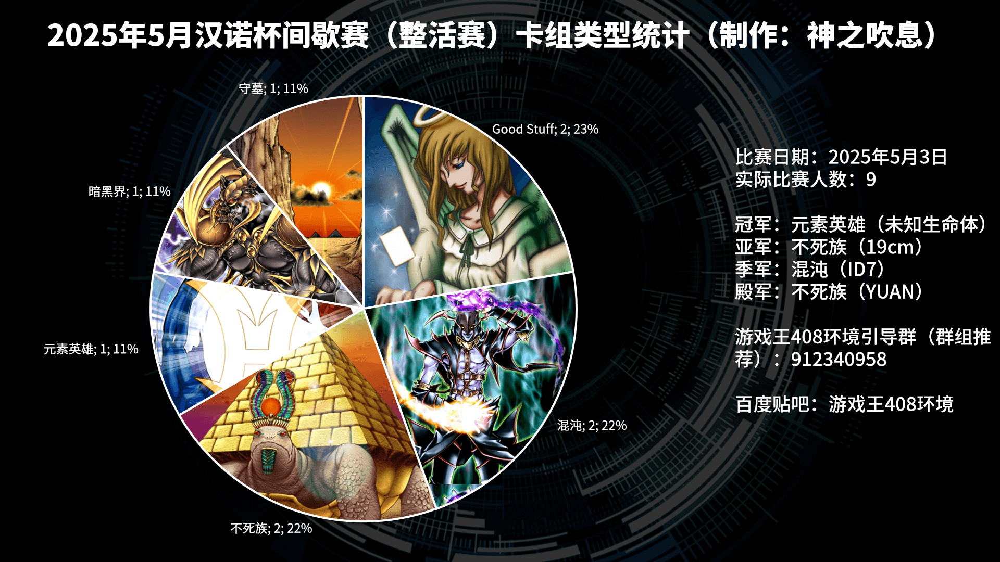
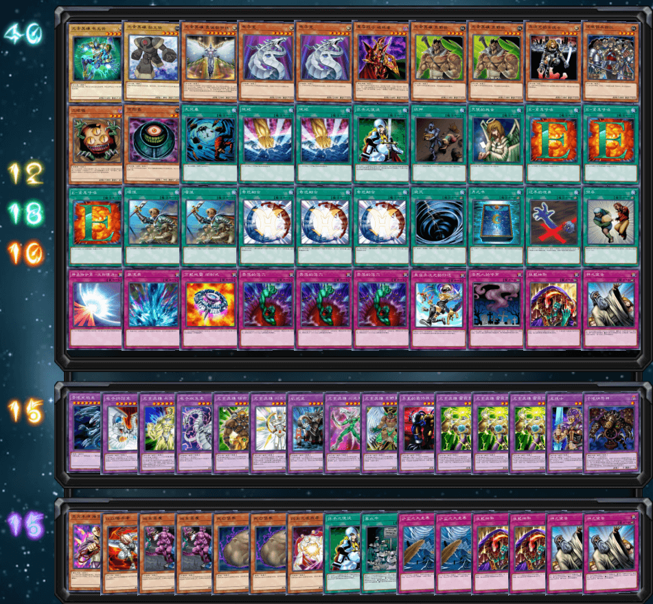
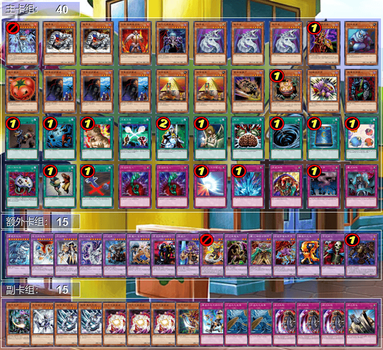
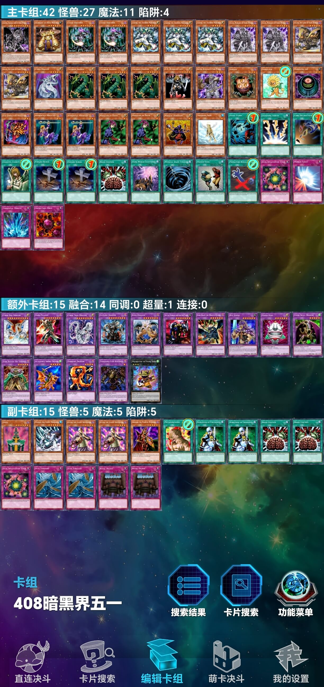
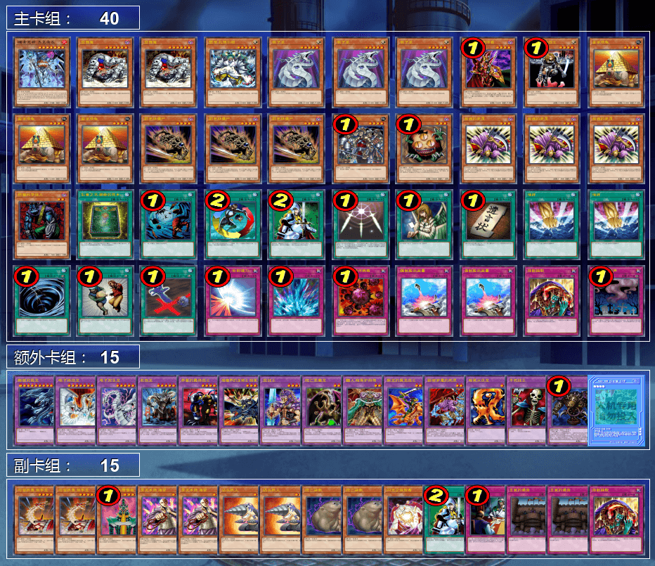
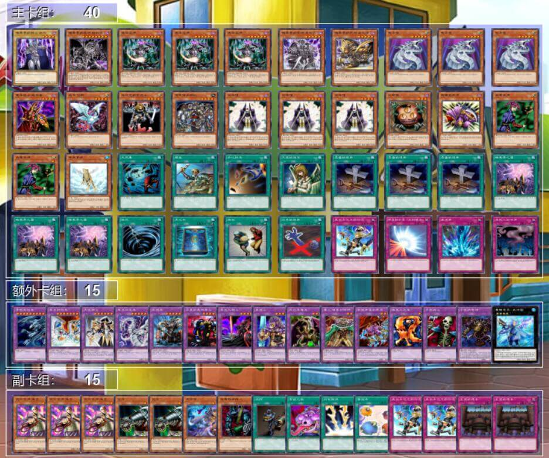
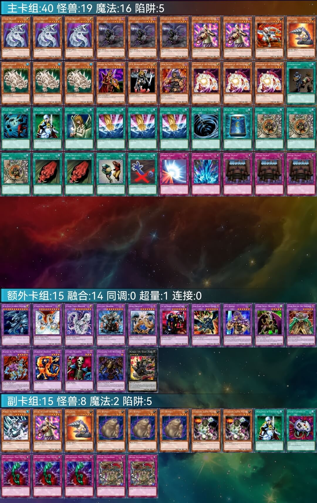
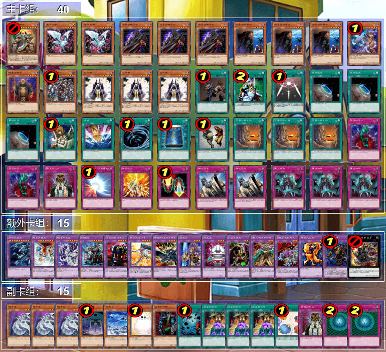
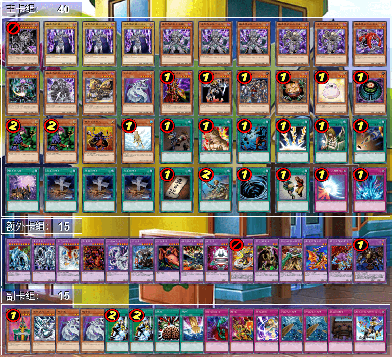

# 2025年5月汉诺杯间歇赛战报（整活赛）

[返回比赛信息](../../../Competitions.html)  

---

## 赛事概览

- **开赛时间**：2025年5月3日 14:00  
- **卡池规则**：前四期OCG卡池 + 2006年3月限制卡表  
- **对战规则**：大师规则2020（无额外怪兽区，裁定以MC服408端口为准）  
- **比赛公告**：[地址](./1.2025.5_0.html)  
- **直播回放**：[地址](https://www.bilibili.com/video/BV1T7GozHEgx/)  
- **比赛树状图**：[地址](https://challonge.com/zh_CN/408hanoi202505)  

---

## 比赛结果

| 名次 | 选手ID     | 卡组主题 |
| ---- | ---------- | -------- |
| 冠军 | 未知生命体 | 元素英雄 |
| 亚军 | 19cm       | 不死族   |
| 季军 | ID7        | 混沌     |
| 殿军 | YUAN       | 不死族   |

    

报名10人，参赛9人，未到的1人是记错比赛日期，1人中途退赛。本次是首次成功举办的汉诺杯间歇赛，也是首次允许投入后世额外卡片的汉诺杯。从赛后反馈来看，算是赢得精彩、输得服气，比赛在一片欢乐、兴奋的氛围中完满结束。感谢各位参赛者、观众姥爷的大力支持！以后的间歇赛中本人必将继续大力整活，为各位参赛者提供平时打牌可能较少特意尝试的游戏体验！

---

## 强者对战记录

### 冠军：元素英雄

    

- **第一轮**：Good Stuff ○×○  
- **第二轮**：混沌×○○  
- **第三轮**：不死族×○×  
- **第四轮**：混沌○×○  
- **半决赛**：混沌○○  
- **决赛**：不死族○○  

### 亚军：不死族

    

- **第一轮**：Good Stuff ○○  
- **第二轮**：不死族××  
- **第三轮**：元素英雄○×○  
- **第四轮**：混沌 双方放弃  
- **半决赛**：不死族×○○  
- **决赛**：元素英雄××  

###  季军：混沌

    

- **第一轮**：暗黑界○○  
- **第二轮**：元素英雄×○○  
- **第三轮**：不死族○○（G2因故投降）  
- **第四轮**：不死族 双方放弃  
- **半决赛**：元素英雄××  
- **季军争夺战**：不死族××  

### 殿军：不死族

    

- **第一轮**：混沌○○  
- **第二轮**：不死族○○  
- **第三轮**：混沌××（G2因故投降）  
- **第四轮**：Good Stuff ○○  
- **半决赛**：不死族○××  
- **季军争夺战**：混沌××  

---

## 参赛者卡组公开

### 其他参赛者

| ID             | 卡组主题及简评                                               | 构筑截图                                  |
| -------------- | ------------------------------------------------------------ | ----------------------------------------- |
| 纳迦莎         | 外挂暗黑界和召唤僧仙鹤小轴的混沌 通过魔键凭灵-威沛图调度暗黑界的骑士 祖尔连接上暗黑界的龙神 格拉法，天才！ |        |
| 阿伟           | 无混沌Good Stuff，主卡组不使用后世卡                         |           |
| 澜冬贝贝(浪费) | Good Stuff，主卡组不使用后世卡                               | +961832317.jpg) |
| 望远镜1437     | 守墓，可惜经常人弹分离（悲）                                 |     |
| GGBond         | 暗黑界，本家浓度极高                                         |         |

---

## 特别鸣谢

感谢以下赞助者（排名不分先后）：  
- B、冰老板、YUAN、虹霓、果拼、丰收鱼、gd小龙、卡卡帝、Daniel、亓、薯片、F……，以及多位匿名赞助者。  

---

## 加入社群

- **交流群**：QQ群 `912340958`  
- **参赛群**：QQ群 `936891040`  

---

## 云录像密码

作为密码输入至MC服408端口即可观看  

| 桌号 | 轮次   | 云录像编号                       |
| ---- | ------ | -------------------------------- |
| 1    | 瑞士轮 | R#951837685397065                |
| 2    | 瑞士轮 | R#3346764588439919               |
| 3    | 瑞士轮 | R#1798988496117243               |
| 4    | 瑞士轮 | R#7482767089903091               |
| 5    | 瑞士轮 | 缺席杀                           |
| 6    | 瑞士轮 | R#1080022938349827               |
| 7    | 瑞士轮 | R#7543282313325167               |
| 8    | 瑞士轮 | R#4657863754029361               |
| 9    | 瑞士轮 | R#3461797716255131               |
| 10   | 瑞士轮 | R#2212140157712891（G2因故投降） |
| 11   | 瑞士轮 | R#1207924334517839               |
| 12   | 瑞士轮 | R#3860961156935937               |
| 13   | 瑞士轮 | R#903734093856657                |
| 14   | 瑞士轮 | 双方放弃本轮                      |
| 15   | 瑞士轮 | R#2257245742812141               |
| 16   | 瑞士轮 | R#6476975421974317               |
| 17   | 瑞士轮 | R#5532296063414889               |
| 1    | 淘汰赛 | R#8715877182507149               |
| 2    | 淘汰赛 | R#3391202042505815               |
| 3    | 淘汰赛 | R#1178840499785347               |
| 4    | 淘汰赛 | R#668493584770685                |

---

**本届比赛圆满结束，欢迎参加下届赛事！**  