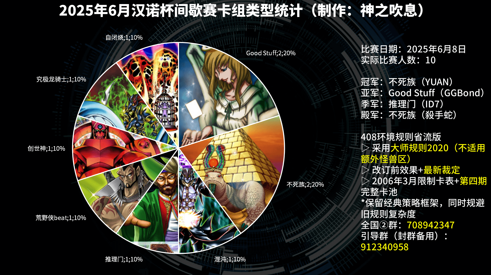
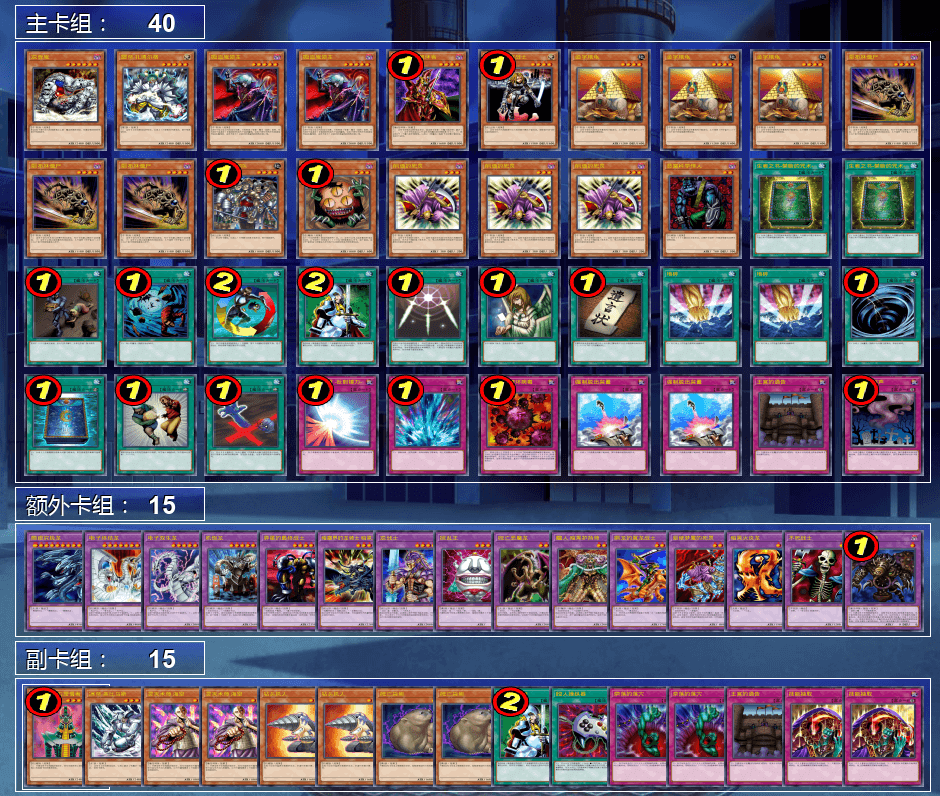
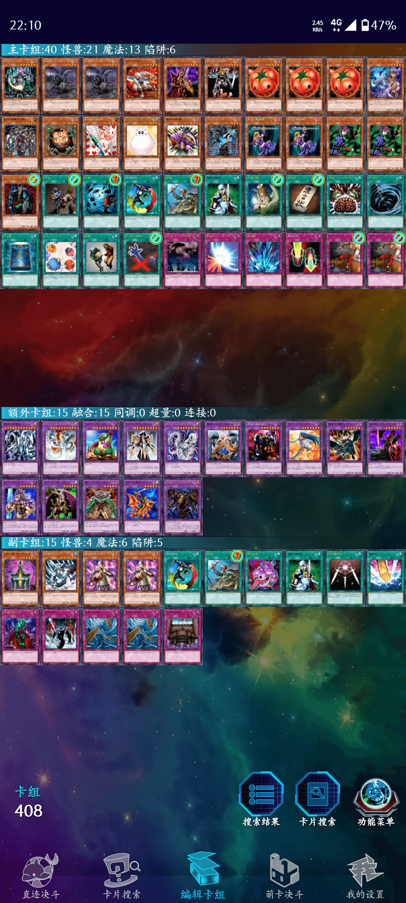
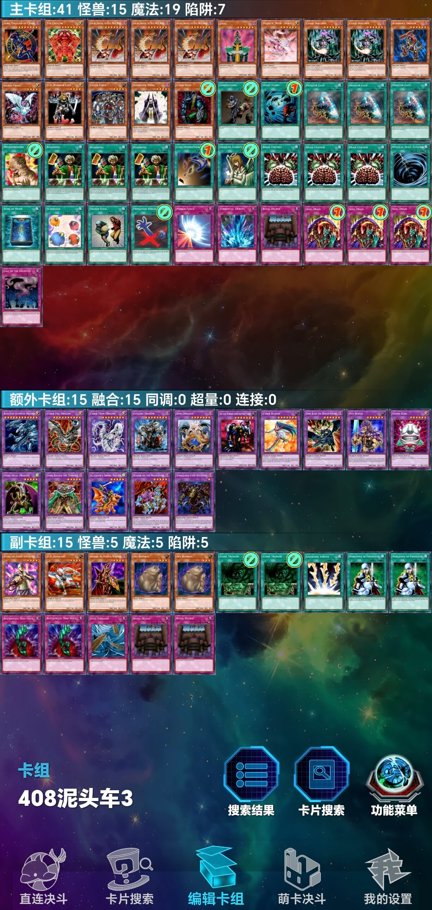
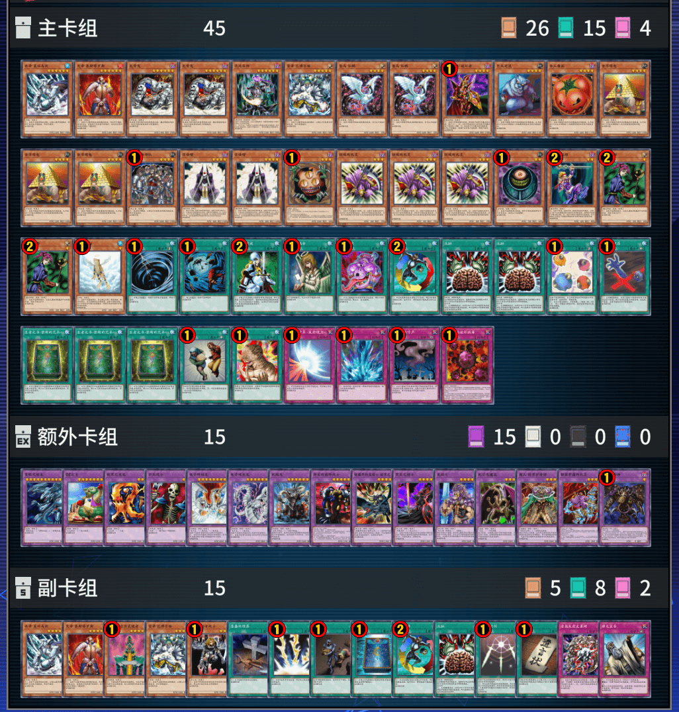

# 2025年6月汉诺杯间歇赛战报（整活赛）

[返回比赛信息](../../../Competitions.html)  

---

## 赛事概览

- **开赛时间**：2025年6月8日 13:00  
- **卡池规则**：前四期OCG卡池 + 2006年3月限制卡表  
- **对战规则**：大师规则2020（无额外怪兽区，裁定以MC服408端口为准）  
- **比赛公告**：[地址](./2.2025.6_0.html)  
- **直播回放**：[地址](https://www.bilibili.com/video/BV1bCTQz8EUy/)  
- **比赛树状图**：[地址](https://challonge.com/zh_CN/408hanoi202506/groups)  

---

## 比赛结果

| 名次 | 选手ID | 卡组主题   |
| :----: | :------: | :----------: |
| 冠军 | YUAN | 不死族 |
| 亚军 | GGBond | Good Stuff |
| 季军 | ID7  | 推理门 |
| 殿军 | 殺手蛇 |   不死族   |

    

报名10人，参赛10人。本人曾经在群内外见到不少有关于电子龙强度的讨论，受启发举办一回实验性整活赛，只禁止电子龙。本次比赛瑞士轮几乎每轮都拖到（接近）死三，还有观众姥爷评价“没有电子龙弱势方翻盘机会就少了”。看来电子龙对环境还是有帮助的，至少能加速战局快刀斩乱麻，不至于一轮比赛轻易僵持进死三，为参赛者和主办方节省时间精力，还能不影响吃晚饭（笑）。毕竟适当控制节奏不至于太拖沓也是增进游戏体验的一环。

---

## 强者对战记录

### 冠军：不死族

    

- **第一轮**：荒野侠beat ×○×  
- **第二轮**：混沌○○  
- **第三轮**：究极龙骑士○○  
- **第四轮**：Good Stuff ○×○  
- **半决赛**：推理门×○○  
- **决赛**：Good Stuff ○×○  

### 亚军：Good Stuff

    

- **第一轮**：混沌×○○（G1掉线杀）  
- **第二轮**：荒野侠beat ○○  
- **第三轮**：不死族×○×  
- **第四轮**：不死族×○×  
- **半决赛**：推理门×○○  
- **决赛**：不死族×○×  

###  季军：推理门

    

- **第一轮**：Good Stuff ×○○  
- **第二轮**：究极龙骑士×○×  
- **第三轮**：创世神×○○  
- **第四轮**：自闭烧○×○  
- **半决赛**：不死族○××  
- **季军争夺战**：不死族○○  

### 殿军：不死族

    

- **第一轮**：究极龙骑士○×○  
- **第二轮**：创世神○×○  
- **第三轮**：Good Stuff ○×○  
- **第四轮**：荒野侠beat ×○○  
- **半决赛**：Good Stuff ○××  
- **季军争夺战**：推理门××  

---

## 参赛者卡组公开

### 其他参赛者

| ID   | 卡组主题及简评 | 构筑截图 |
| :----: | :--------------: | :--------:  |
| 未知生命体 | 会用环境内所有召唤法（包括仪式召唤）的究极龙骑士 |  |
|    19cm    | 贴纸向荒野侠beat |  |
|  澜冬贝贝  | 经典自闭烧   |  |
| 猫耳 | 主打上级召唤的创世神，可惜在比赛中打不出日常决斗的上级召唤抽卡combo |  |
| 望远镜1437 | 投入凤凰神小轴+僧鹤系统+神鸟攻击的混沌 |  |
| 初心星游 | 有自闭卡含burn但主要靠beat的60卡Good Stuff |  |

---

## 特别鸣谢

感谢以下赞助者（排名不分先后）：  
- B、冰老板、YUAN、虹霓、果拼、丰收鱼、gd小龙、卡卡帝、Daniel、亓、薯片、F、殺手蛇等（未穷举）众多决斗者赞助。  

---

## 加入社群

- **交流群**：QQ群 `912340958`  
- **参赛群**：QQ群 `936891040`  

---

## 云录像密码

作为密码输入至MC服408端口即可观看  

| 桌号 | 轮次 | 云录像编号 |
| :----: | :----: | :----------: |
| 1 | 瑞士轮 | R#7915992141928481 |
| 2 | 瑞士轮 | R#4712497905100597 |
| 3 | 瑞士轮 | R#7770533984356713（G1掉线杀），R#2766340677088035（G1模拟胜负） |
| 4 | 瑞士轮 | R#1460807879903015 |
| 5 | 瑞士轮 | R#5410490034228697 |
| 6 | 瑞士轮 | R#1997954201949991 |
| 7 | 瑞士轮 | R#3716569907305059 |
| 8 | 瑞士轮 | R#76983236667657 |
| 9 | 瑞士轮 | R#126899388720557 |
| 10 | 瑞士轮 | R#3639628271856337 |
| 11 | 瑞士轮 | R#2752416834508349 |
| 12 | 瑞士轮 | R#2374770511284901 |
| 13 | 瑞士轮 | R#6053984188366079 |
| 14 | 瑞士轮 | R#4542092213423275 |
| 15 | 瑞士轮 | R#3392299148053947 |
| 16 | 瑞士轮 | R#338657825630971 |
| 17 | 瑞士轮 | R#7484966100094315 |
| 18 | 瑞士轮 | R#6442517695820385 |
| 19 | 瑞士轮 | R#4628593277774307 |
| 20 | 瑞士轮 | R#3554090574654871 |
| 1 | 淘汰赛 | R#4117474490335937 |
| 2 | 淘汰赛 | R#1310594385789539 |
| 3 | 淘汰赛 | R#7413106866037433 |
| 4 | 淘汰赛 | R#2061944982323133 |

---

**本届比赛圆满结束，欢迎参加下届赛事！**  