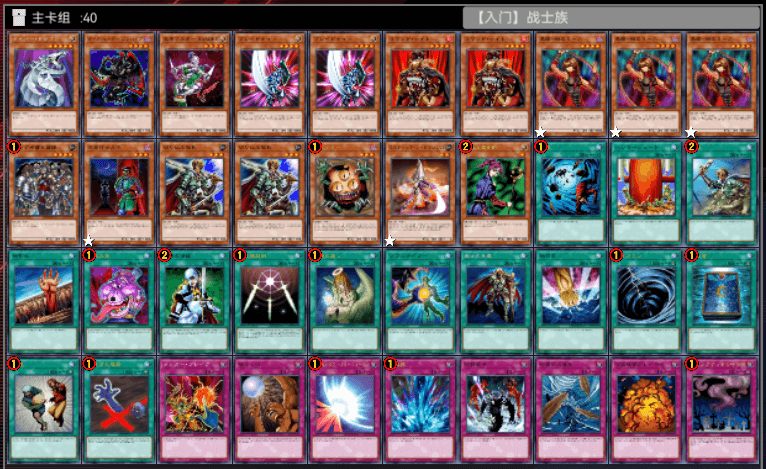
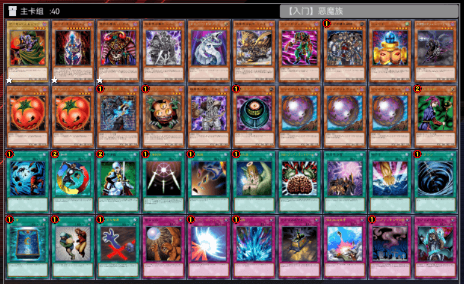
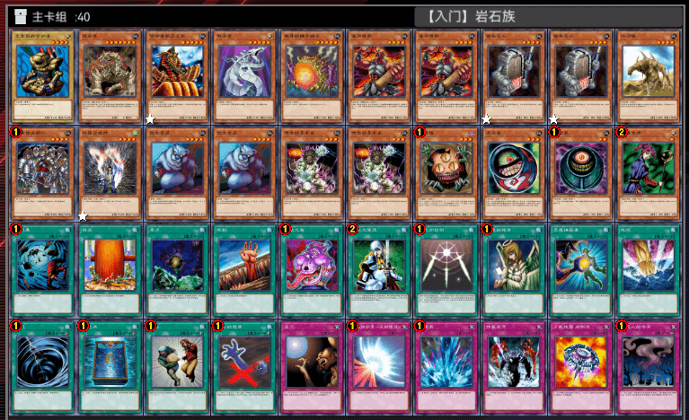
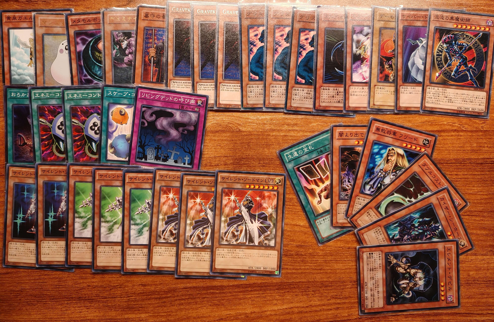

# 2025年7月汉诺杯间歇赛举办公告

[返回比赛信息](../../../Competitions.html)  

---

## 赛事简介

- **环境设定**：基于大师规则2020（无额外怪兽区），重制2006年3月OCG限制卡表+四期卡池的健康环境 （末位补充包编号为408，故称“408环境”）。  
- **核心目标**：适合新手入门，可培养OCG环境兴趣。  

---

## 规则摘要

1. **规则版本**  
   - 408环境规则省流版  
     ▷ 采用大师规则2020（不适用额外怪兽区）  
     ▷ 改订前效果+最新裁定  
     ▷ 2006年3月限制卡表+第四期完整卡池  
     *保留经典策略框架，同时规避旧规则复杂度  
   
   - **相关链接**  
     - [环境介绍](../../../../../Articles/Notices/Intro.html)  
     - [卡池范围](../../../../Cardpool%20Banlist/Cardpool.html)  
     - [线上决斗指南](../../../../Notices/Online.html)（软件下载与连线教程）  
   
3. **特殊规定**  
   
   - [x] **毕业杯**：使用提供的8套预组卡组参赛，不可修改构筑（自由构筑可加入全国群约战）。  
   
     |  卡组主题  |           构筑截图（补丁包含或比赛群单独下载ydk）            |
     | :--------: | :----------------------------------------------------------: |
     | Good Stuff |  |
     |   不死族   |  |
     |   战士族   |  |
     |    龙族    |  |
     |   恶魔族   |  |
     |  魔法师族  |  |
     |   岩石族   |  |
     |   机械族   |  |
   
     

---

## 参赛信息

- **比赛时间**：`2025年7月13日` 13:00（周日）  
- **报名方式**：  
  - **费用**：免费。  
  - **提交要求**：选择好要使用的唯一卡组，于`2025年7月12日 24:00`前提交至[登记地址](https://www.wenjuan.com/s/AfmuMrN/)，逾期无效。  
  - **修改构筑**：截止前重填表格并告知主办方（神之吹息），请勿滥用权利。  
- **参赛群**：QQ群 `936891040`（有直播/录播，观赛无需加群）。  
- **退赛条件**：比赛当日0点前未加群、赛中退群/缺席均视为退赛，后果自负。  

---

## 比赛流程

- **共通规定**：[V2版本](../../Common_Rules.html)（必读）。  

---

## 奖品设置

- **邮寄规则**：包邮（10元内），偏远地区需补差价，支持到付/顺丰。  
- **奖项明细**：  
  
  | 名次                                 | 奖品内容                                                     |
  | ------------------------------------ | ------------------------------------------------------------ |
  | **冠军**                             | 408环境正版卡组残套及单卡（见图） + 随机6张正版闪卡（NPR以上罕贵） + 自制衍生物×4 |
  | **亚军**                             | 408环境正版卡组残套及单卡（见图） + 随机5张正版闪卡（NPR以上罕贵） + 自制衍生物×3 |
  | **季军**                             | 408环境民间版卡组残套（见图） + 随机4张正版闪卡（NPR以上罕贵） + 自制衍生物×2 |
  | **殿军**                             | 408环境民间版卡组残套（见图） + 随机3张正版闪卡（NPR以上罕贵） + 自制衍生物×1 |
  | **八强其余（28人以上首轮实际参赛）** | 奖学金2坤（5）元                                             |
  

    
     
    部分冠军奖品

    
     
    部分亚军奖品

    
     
    部分季军奖品

    
     
    部分殿军奖品

---

## 注意事项

- **卡牌说明**：奖品卡可能存在轻微瑕疵，含简中、日语及其他语种卡。  

- **违规处理**：未按规提交卡组、退赛等行为将影响后续参赛资格。  

- **未尽事宜**：主办方保留最终解释权，未尽事宜以群公告为准。  
