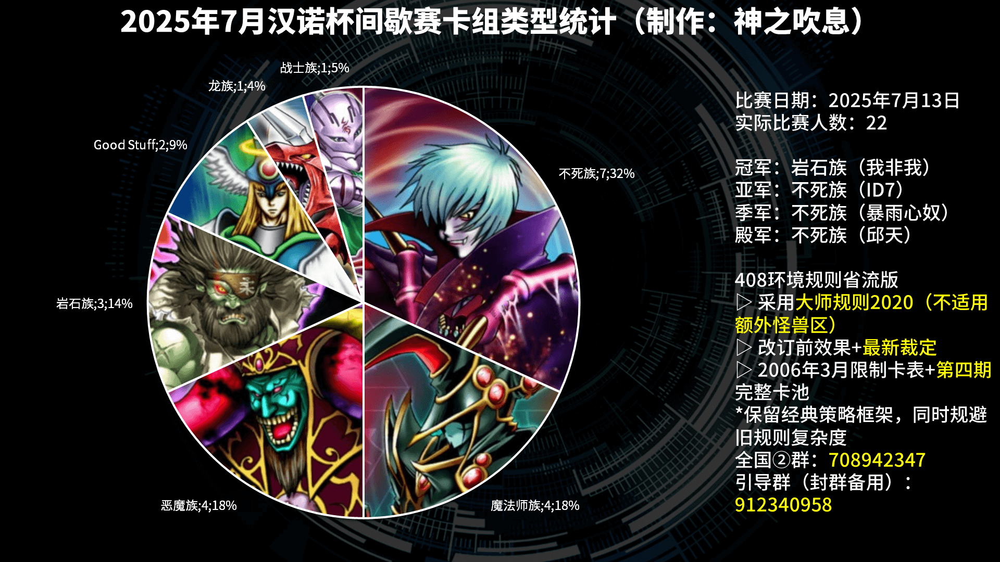

# 2025年7月汉诺杯间歇赛战报（毕业杯）

[返回比赛信息](../../../Competitions.html)  

---

## 赛事概览

- **开赛时间**：2025年7月13日 13:00  
- **卡池规则**：前四期OCG卡池 + 2006年3月限制卡表  
- **对战规则**：大师规则2020（无额外怪兽区，裁定以MC服408端口为准）  
- **比赛公告**：[地址](3.2025.7_0.html)  
- **直播回放**：[地址](https://www.bilibili.com/video/BV1mouPzAE1P/)  
- **比赛树状图**：[地址](https://challonge.com/zh_CN/408hanoi202507)  

---

## 比赛结果

| 名次 | 选手ID | 卡组主题   |
| :----: | :------: | :----------: |
| 冠军 | 我非我 | 岩石族 |
| 亚军 | ID7 | 不死族 |
| 季军 | 暴雨心奴 | 不死族 |
| 殿军 | 邱天 | 不死族 |

    

自本届起，原有的推广赛将配合高等院校毕业、高考、中考时间于暑假举行，并更名“毕业杯”。报名22人，参赛22人，其中完全全新面孔5人（以是否加入全国②群为准）。虽然人数达不到去年同期的数目，但也已经很不错了。这次竟然没有人选择使用机械族卡组，确实让我感到意外。我开始怀疑不死族预组是否强度过高，但2名用其他预组对战过不死族预组的参赛者竟然说不用改，这也是一个让我感到意外的方面，那就尊重参赛者的意见吧。  

---

## 卡组分布统计

### 八强

- 不死族：5  
- 魔法师族：2  
- 岩石族：1  

---

## 强者对战记录

### 冠军：岩石族

- **第一轮**：不死族○○（G2超时杀）  
- **第二轮**：龙族○○  
- **第三轮**：不死族○×○  
- **第四轮**：魔法师族×○×
- **八强**：魔法师族×○○ 
- **半决赛**：不死族○○  
- **决赛**：不死族○×○  

### 亚军：不死族

- **第一轮**：不死族×○-（G2死三杀，G3死三超时双杀）  
- **第二轮**：岩石族×○○（G3死三杀）  
- **第三轮**：Good Stuff ○○  
- **第四轮**：恶魔族○○
- **八强**：魔法师族○○（G2死三杀）  
- **半决赛**：不死族（缺席杀）  
- **决赛**：岩石族×○×  

###  季军：不死族

- **第一轮**：恶魔族○○  
- **第二轮**：恶魔族○○  
- **第三轮**：岩石族×○×  
- **第四轮**：恶魔族○○
- **八强**：不死族○○  
- **半决赛**：不死族（缺席杀）  
- **季军争夺战**：不死族×○○（G3死三杀）  

### 殿军：不死族

- **第一轮**：不死族○×○  
- **第二轮**：Good Stuff ○○  
- **第三轮**：恶魔族○×-（G1掉线杀）  
- **第四轮**：战士族○×○  
- **八强**：不死族×○○（G3死三杀）  
- **半决赛**：岩石族××  
- **季军争夺战**：不死族○××（G3死三杀）  

---

## 特别鸣谢

感谢以下赞助者（排名不分先后）：  
- B、冰老板、YUAN、虹霓、果拼、丰收鱼、gd小龙、卡卡帝、Daniel、亓、薯片、F、殺手蛇等（未穷举）众多决斗者赞助。  

---

## 加入社群

- **交流群**：QQ群 `912340958`  
- **参赛群**：QQ群 `936891040`  

---

## 云录像密码

作为密码输入至MC服408端口即可观看  

| 桌号 | 轮次 | 云录像编号 |
| :----: | :----: | :----------: |
| 1 | 瑞士轮 | R#5178959418480015 |
| 2 | 瑞士轮 | R#8145274602161167 |
| 3 | 瑞士轮 | 迟到杀+弃权 |
| 4 | 瑞士轮 | R#792876602589529 |
| 5 | 瑞士轮 | R#5793827483366349（G2死三杀，G3死三超时双杀） |
| 6 | 瑞士轮 | R#457075545030928（G2超时杀） |
| 7 | 瑞士轮 | R#5387798203004657 |
| 8 | 瑞士轮 | R#2035804100876595 |
| 9 | 瑞士轮 | R#4686418742449311 |
| 10 | 瑞士轮 | R#8255144509712251 |
| 11 | 瑞士轮 | R#565809787178369 |
| 12 | 瑞士轮 | R#3166704684463989 |
| 13 | 瑞士轮 | R#900697926145651 |
| 14 | 瑞士轮 | R#4252673190403495 |
| 15 | 瑞士轮 | R#2516026563300653 |
| 16 | 瑞士轮 | R#468525187588547 |
| 17 | 瑞士轮 | R#3606449511185711（G3死三杀） |
| 18 | 瑞士轮 | R#8188487698885409 |
| 19 | 瑞士轮 | R#1787503637325341 |
| 20 | 瑞士轮 | R#3615662693793141 |
| 21 | 瑞士轮 | 缺席杀 |
| 22 | 瑞士轮 | R#5889214889833073 |
| 23 | 瑞士轮 | R#3368294654251587 |
| 24 | 瑞士轮 | R#363441733920199（G1掉线杀），R#5143495624340211 |
| 25 | 瑞士轮 | R#7067674470783167 |
| 26 | 瑞士轮 | 弃权 |
| 27 | 瑞士轮 | 缺席杀 |
| 28 | 瑞士轮 | R#5551846966800751 |
| 29 | 瑞士轮 | R#5031661738312203 |
| 30 | 瑞士轮 | R#1229490673484119 |
| 31 | 瑞士轮 | R#8392746207014985 |
| 32 | 瑞士轮 | R#133760797094387（G2、G3死三杀） |
| 33 | 瑞士轮 | R#604230745278099 |
| 34 | 瑞士轮 | R#887051598107887 |
| 35 | 瑞士轮 | R#5035939634376251 |
| 36 | 瑞士轮 | R#486681991136987 |
| 37 | 瑞士轮 | R#4008975430957243（G2掉线杀） |
| 38 | 瑞士轮 | R#4639395776191681 |
| 39 | 瑞士轮 | R#8368860280440263 |
| 40 | 瑞士轮 | R#5708686712375501 |
| 41 | 瑞士轮 | 弃权 |
| 42 | 瑞士轮 | R#3441824935072777 |
| 43 | 瑞士轮 | 退赛杀 |
| 1 | 淘汰赛 | R#1177429124837057（G2死三杀） |
| 2 | 淘汰赛 | R#8821248450926443 |
| 3 | 淘汰赛 | R#7155050368981225（G3死三杀） |
| 4 | 淘汰赛 | R#3125092613401373 |
| 5 | 淘汰赛 | 缺席杀 |
| 6 | 淘汰赛 | R#1932576053420301 |
| 7 | 淘汰赛 | R#3007490877923173 |
| 8 | 淘汰赛 | R#8502108362148179（G3死三杀） |

---

**本届比赛圆满结束，欢迎参加下届赛事！**  