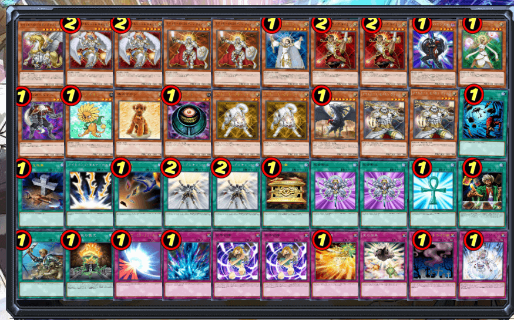
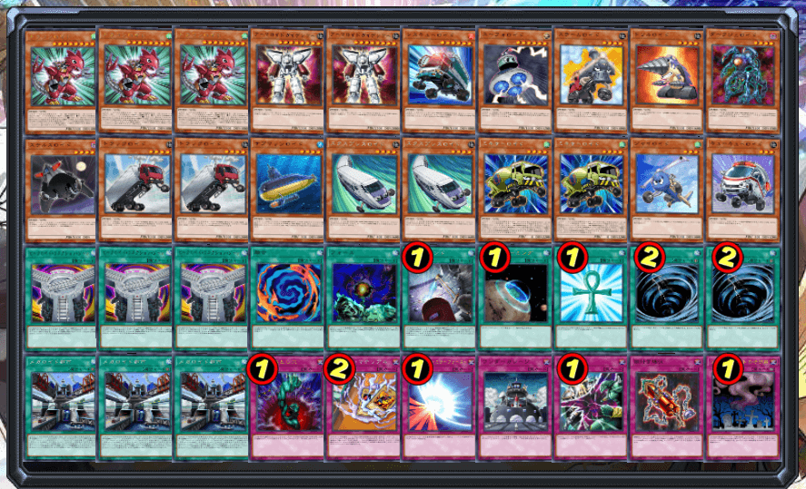
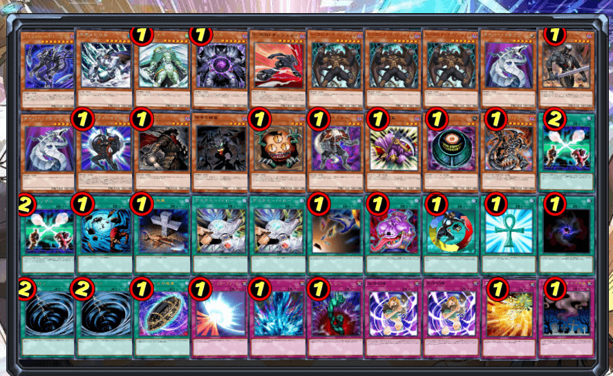
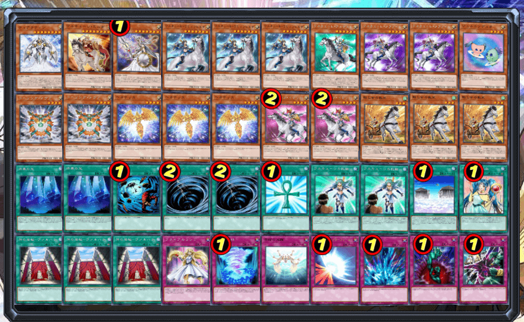
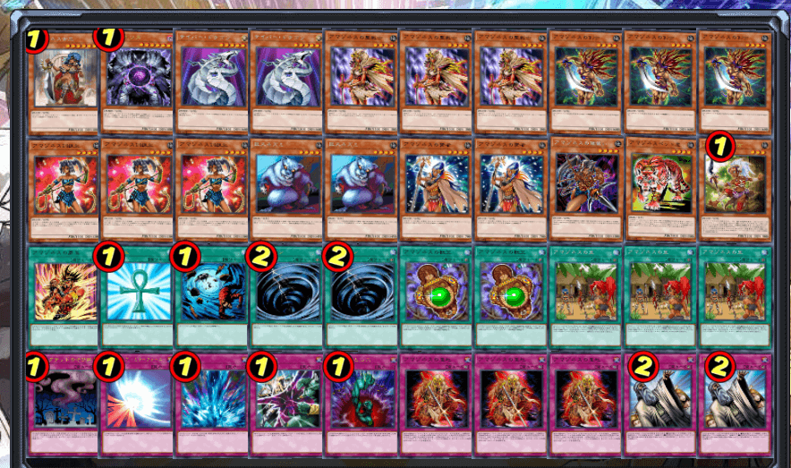

# 2025年11月汉诺杯间歇赛×GX第71届冠军赛举办公告

[返回比赛信息](../../../Competitions.html)  

---

## 赛事简介

本次比赛为408环境群与GX环境群合作举办。  

## 规则摘要

### 特殊规定

   - 每名参赛者准备2个**没有副卡组**的参赛卡组，408环境或GX环境的均可。
   - 比赛赛制：瑞士轮+淘汰赛。采取**单局**，三局两胜制。
   - 不限制每局用这2个卡组中的哪个，也不必告知对方是否更换卡组。
   - 新的单局中按上局败者的要求决定先后攻，上局和局则正常猜拳。  
   - 卡池卡表：
     - 408环境卡组采用408环境卡池、禁卡表。
     - GX环境卡组采用GX环境卡池、禁卡表“GX2025.9.1”，禁止幻神幻魔。
     - 卡池卡表文件、比赛客户端群内提供下载。
   - 本比赛适用大师规则3（**无额外怪兽区，无先攻抽卡，无起动效果优先权，场地共存，伤害步骤整合5步**），卡片适用**最新效果**与裁定（如三眼怪、王家的神殿）。
   - 比赛服务器：使用比赛专用服务器，地址：dragonn72.oicp.net，端口：2015。主机密码为“第X桌”（X为对阵表图片中对应的阿拉伯数字，后面以此类推，以便直播和裁判检查对战情况），如“第114514桌”。

---

## 参赛信息

- **比赛时间**：`2025年11月9日` 13:00（周日）  
- **报名方式**：  
  - **费用**：免费。  
  - **提交要求**：卡组需排序发送ydk文件（建议）或截图（包含卡片计数），于`2025年11月8日24:00`前提交至**登记地址**（https://www.wjx.cn/vm/mBzyqQM.aspx ），逾期无效。  
  - **修改构筑**：截止前重填表格并告知主办方（**未知生命体**），请勿滥用权利。  
- **参赛群**：QQ群 `936891040`（有直播/录播，观赛无需加群）。  
- **退赛条件**：比赛当日0点前未加群、赛中退群/缺席均视为退赛，后果自负。  

---

## 比赛流程

- **共通规定**：[V2版本](../../Common_Rules.html)（必读）。  

---

## 奖品设置

- **奖项明细**：  
  
  | 名次     | 奖品内容       |
  | -------- | -------------- |
  | **冠军** | 奖金100元+奖杯 |
  | **亚军** | 奖金30元       |
  | **季军** | 奖金20元       |

## 友情宣传

GX环境Q群57658937  
408环境Q群708942347  

### 408环境介绍

408环境规则省流版  
▷ 采用大师规则2020（不适用额外怪兽区）  
▷ 改订前效果+最新裁定  
▷ 2006年3月限制卡表+第四期完整卡池  
*保留经典策略框架，同时规避旧规则复杂度  

### GX环境介绍

GX版本保留游戏王动画第一、二部的卡片，定期不断维持平衡、更新卡池。拥有自己搭建的服务器，自带联机功能与禁卡限制，同时定制了专属的手机版客户端。每月还会举行冠军赛，获得名次者有现金奖励。新的时代即将来临！欢迎各位游戏王爱好者加入试玩！  

#### GX环境示例卡组

    
     
    光道

    
     
    机人

    
     
    命运英雄

    
     
    女武神

    
     
    亚马逊

---

## 注意事项

- **违规处理**：未按规提交卡组、退赛等行为将影响后续参赛资格。  

- **未尽事宜**：主办方保留最终解释权，未尽事宜以群公告为准。  