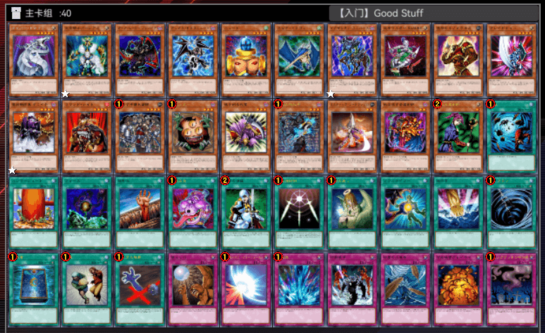
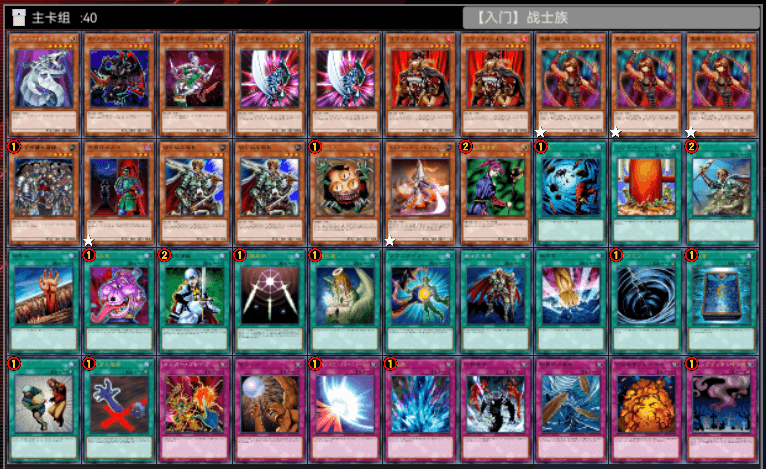
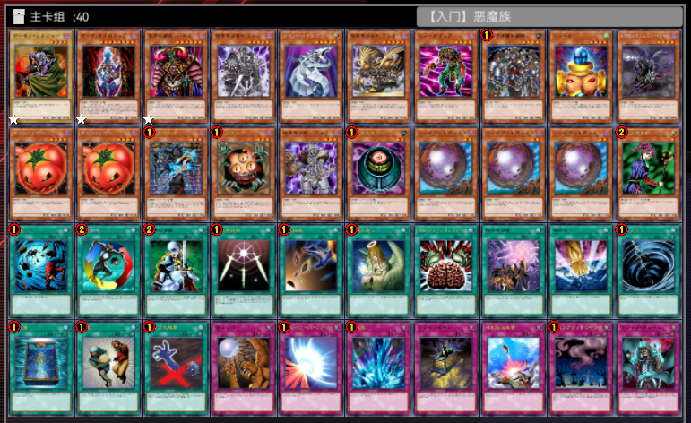
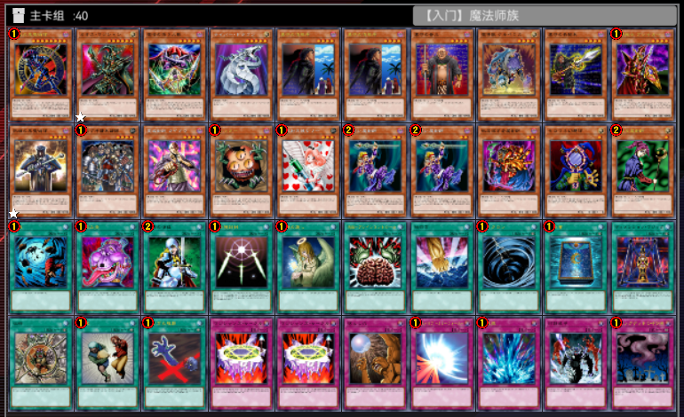
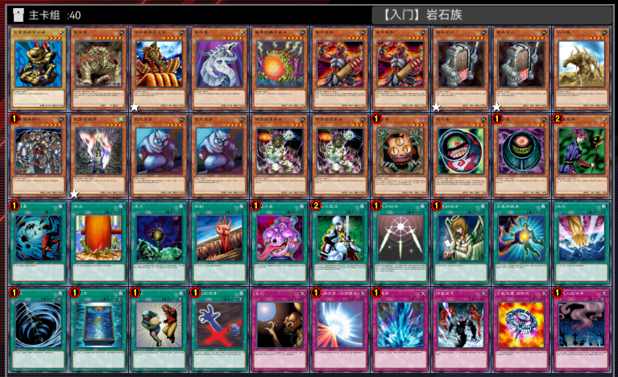
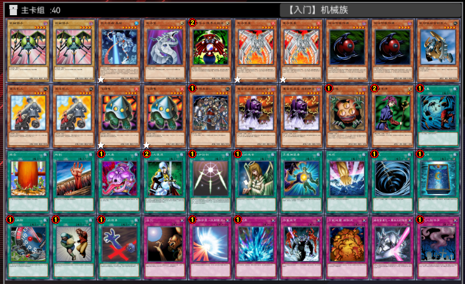

# 2026年8月汉诺杯间歇赛（推广赛）举办公告

[返回比赛信息](../../../Competitions.html)

---

# **赛事简介**

- **规则省流**：
  - 采用大师规则2020（不适用额外怪兽区）
  - 改订前效果+最新裁定
  - 传承自2006年3月限制卡表+第四期卡池（2006年4月末）
- **核心目标**：
  - 保留经典策略框架，同时规避早期规则复杂度。
  - 适合新手入门，有助于培养官方环境兴趣。

---

# **相关链接**

- [环境介绍](../../../../../Articles/Notices/Intro.html)
- [卡池范围](../../../../Cardpool%20Banlist/Cardpool.html)
- [线上决斗指南](../../../../Notices/Online.html)（软件下载与连线教程）
# **特殊规定**

   - **毕业杯**：使用提供的6套预组卡组参赛，不可修改构筑（自由构筑可加入全国群约战）。

---

# **参赛信息**

- **比赛时间**：`2026年8月10日` 14:00（周一）起，每天1轮**分组瑞士轮（包括淘汰赛部分）**，每日24:00左右强制出下一轮排表（包括开赛当日），无战果视为双败（以**无单局战绩**的平局显示）。提前打完可以提前安排下一轮。
- **类型**：娱乐赛。
- **报名方式**：
  - **费用**：免费。
  - **提交要求**：于`2026年8月9日 24:00`前至**报名地址**（https://docs.qq.com/form/page/DQWxLekNJWk5zdE9N ）填写，逾期无效。
  - **修改构筑**：截止前重填表格并告知主办方（神之吹息），请勿滥用权利。
- **参赛群**：QQ群 `936891040`（有直播/录播，观赛无需加群）。
- **退赛条件**：比赛当日0点前未加群、赛中退群/缺席均视为退赛，后果自负。

---

# **比赛流程**

- [**共通规定**](../../Common_Rules.html)（必读）。

---

# **奖品设置**

- **奖项明细**：  

  | 名次     | 奖励内容     |
  | -------- | ------------ |
  | **冠军** | 12坤（30）元 |
  | **亚军** | 8坤（20）元  |
  | **季军** | 4坤（10）元  |
  | **殿军** | 2坤（5）元   |

---

# **注意事项**

- **违规处理**：未按规提交卡组、退赛等行为将影响后续参赛资格。
- **未尽事宜**：主办方保留最终解释权，未尽事宜以群公告为准。