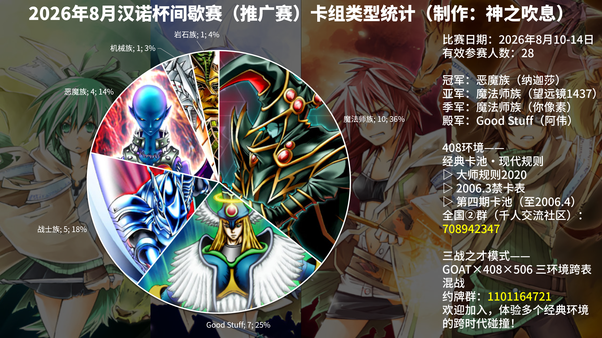

# 2026年8月汉诺杯间歇赛（推广赛）战报

[返回比赛信息](../../../Competitions.html)
**本文/视频参照CC BY（署名）协议开放转载，敬请保留原链接与作者信息噢~感谢传播！支持知识开放、协作与共享**。

---

# **赛事概览**

- **开赛时间**：2026年8月10-14日
- **卡池规则**：前四期OCG卡池 + 2006年3月限制卡表
- **对战规则**：大师规则2020（无额外怪兽区，裁定以MC服408端口为准），其余见比赛公告
- **比赛公告**：[地址](./6.2026.8_0html.html)
- **比赛树状图**：[地址](https://challonge.com/zh_CN/Hanoi202608)

---

# **比赛结果**

| 名次 | 选手ID | 卡组主题   |
| :----: | :------: | :----------: |
| 冠军 | 纳迦莎 | 恶魔族 |
| 亚军 | 望远镜1437 | 魔法师族 |
| 季军 | 你像素 | 魔法师族 |
| 殿军 | 阿伟 | Good Stuff |

28人报名、实际参与。每款卡组构筑可以看原比赛公告。本次比赛是第三次仅限使用入门预组的推广赛，虽然基本每次推广赛都有不少现有玩家来捧场（笑）。比起上次比赛，这次删掉了偏差最大的不死族和龙族2套入门预组，但还有无继续缩减选择的必要性，还需要继续研究。无论如何，本次比赛也有若干新面孔前来参赛、试玩408环境，也起到了推广的作用，现有玩家们也能从读到不同于平时构筑赛的博弈点，无论是新玩家还是现有玩家都能获取其乐趣。

---

# **卡组分布统计**

## **十六强**

- Good Stuff：6
- 魔法师族：6
- 战士族：3
- 恶魔族：1

## **八强**

- Good Stuff：3
- 魔法师族：3
- 战士族：1
- 恶魔族：1

---

# **强者对战记录**

## **冠军：恶魔族**

- **第一轮**：岩石族××
- **第二轮**：Good Stuff ○○
- **第三轮**：机械族○○
- **第四轮**：战士族○×○
- **十六强**：魔法师族○○
- **八强**：战士族○○
- **半决赛**：Good Stuff ○○
- **决赛**：魔法师族×○○

## **亚军：魔法师族**

- **第一轮**：战士族○○
- **第二轮**：Good Stuff ×○×
- **第三轮**：战士族×○○
- **第四轮**：魔法师族○○
- **十六强**：魔法师族○×○
- **八强**：Good Stuff ○○
- **半决赛**：魔法师族×○○
- **决赛**：恶魔族○××

##  **季军：魔法师族**

- **第一轮**：魔法师族×○○
- **第二轮**：魔法师族×○×
- **第三轮**：魔法师族×○×
- **第四轮**：机械族○○
- **十六强**：战士族×○○
- **八强**：Good Stuff ○○
- **半决赛**：魔法师族○××
- **季军争夺战**：Good Stuff ○○

## **殿军：Good Stuff**

- **第一轮**：魔法师族○○
- **第二轮**：魔法师族○×○
- **第三轮**：战士族○×○
- **第四轮**：魔法师族×○×
- **十六强**：Good Stuff ○○
- **八强**：魔法师族○×○
- **半决赛**：恶魔族××
- **季军争夺战**：魔法师族××

---

# **参赛者卡组公开**

## **八强**

| ID   | 卡组主题 |
| :----: | :--------------: |
| 沉晨 | Good Stuff |
| 不动刘醒 | Good Stuff |
| 融化的哈根达斯 | 魔法师族 |
| Victor | 战士族 |

## **十六强**

| ID   | 卡组主题 |
| :----: | :--------------: |
| 老岳爱双打 | 魔法师族 |
| 珠泪人 | 魔法师族 |
| 香茶白龙 | Good Stuff |
| 风行游弘 | 战士族 |
| vv矢量 | 战士族 |
| 12 | Good Stuff |
| 亚撒西立本男孩 | Good Stuff |
| Newcomer | 魔法师族 |

## **其他参赛者**

| ID   | 卡组主题 |
| :----: | :--------------: |
| 哈吉米 | 恶魔族 |
| 铃屋 | 魔法师族 |
| 浅薄录 | Good Stuff |
| 开个小车跟着你 | 恶魔族 |
| 我非我 | 机械族 |
| 炭岩 | 魔法师族 |
| laji1203 | 魔法师族 |
| 无名 | 恶魔族 |
| gd小龙  or 米库 | 战士族 |
| 方别 | 战士族 |
| GGBond | 魔法师族 |
| 万丈目闪电 | 岩石族 |

---

# **特别鸣谢**

历届义父义母赞助名单（排名不分先后，包括奖金回流）：
- LOF、B、EGCLM、Gaga、冰老板、YUAN、虹霓、果拼、丰收鱼、gd小龙、卡卡帝、Daniel、亓、薯片、F、殺手蛇、神风、未知生命体、老乞大猫、MyCard萌卡平台等（未穷举）众多善长人翁。

---

# **加入社群**

- **全国②群（千人大群）**：QQ群 `708942347`
- **引导群**：QQ群 `912340958`
- **三战之才模式群（GOAT×408×506 三环境跨表混战）**： QQ群 `1101164721`

---

# **云录像密码**

作为密码输入至MC服408端口即可观看

| 桌号 | 轮次 | 云录像编号 |
| :----: | :----: | :----------: |
| 1 | 瑞士轮第一轮 | R#7754080709246021 |
| 2 | 瑞士轮第一轮 | R#8564519495276437 |
| 3 | 瑞士轮第一轮 | R#1368492213857691 |
| 4 | 瑞士轮第一轮 | R#337950460917275（卡组错误，规则杀） |
| 5 | 瑞士轮第一轮 | R#692293783653139 |
| 6 | 瑞士轮第一轮 | R#6126411841677997 |
| 7 | 瑞士轮第一轮 | R#1247960889046193 |
| 8 | 瑞士轮第一轮 | R#552595665591379 |
| 9 | 瑞士轮第一轮 | R#3888612453199255 |
| 10 | 瑞士轮第一轮 | R#1535344124234711 |
| 11 | 瑞士轮第一轮 | R#3335716226577565 |
| 12 | 瑞士轮第一轮 | R#4824930460745995 |
| 13 | 瑞士轮第一轮 | R#8943453625926281 |
| 14 | 瑞士轮第一轮 | R#8468046985705911 |
| 15 | 瑞士轮第二轮 | R#2418671887908523 |
| 16 | 瑞士轮第二轮 | R#8947734037468621 |
| 17 | 瑞士轮第二轮 | R#5255575915305329 |
| 18 | 瑞士轮第二轮 | R#7425788524782269 |
| 19 | 瑞士轮第二轮 | R#8934261989610937 |
| 20 | 瑞士轮第二轮 | R#1964856891459301 |
| 21 | 瑞士轮第二轮 | R#4106419180986895 |
| 22 | 瑞士轮第二轮 | R#8031320859123741 |
| 23 | 瑞士轮第二轮 | R#1239968968253173 |
| 24 | 瑞士轮第二轮 | R#441317004157745 |
| 25 | 瑞士轮第二轮 | 缺席杀 |
| 26 | 瑞士轮第二轮 | R#2515058687764331 |
| 27 | 瑞士轮第二轮 | R#4074242802343741 |
| 28 | 瑞士轮第二轮 | R#7709214361457827 |
| 29 | 瑞士轮第三轮 | R#3554119859253695 |
| 30 | 瑞士轮第三轮 | R#1296795933993507 |
| 31 | 瑞士轮第三轮 | R#1074013394207165 |
| 32 | 瑞士轮第三轮 | R#5560208034359429 |
| 33 | 瑞士轮第三轮 | R#7763616897245347 |
| 34 | 瑞士轮第三轮 | R#4529110170372299 |
| 35 | 瑞士轮第三轮 | R#5669180902467383 |
| 36 | 瑞士轮第三轮 | R#3124443831836763 |
| 37 | 瑞士轮第三轮 | R#1951572767869423 |
| 38 | 瑞士轮第三轮 | R#4102599728483455 |
| 39 | 瑞士轮第三轮 | R#4540086754998751 |
| 40 | 瑞士轮第三轮 | R#4617149775582639 |
| 41 | 瑞士轮第三轮 | R#8809930911010529 |
| 42 | 瑞士轮第四轮 | R#3598069807011461 |
| 43 | 瑞士轮第四轮 | R#1726745417800253 |
| 44 | 瑞士轮第四轮 | R#3598069807011461 |
| 45 | 瑞士轮第四轮 | R#6664924163696135 |
| 46 | 瑞士轮第四轮 | R#3589595504279647 |
| 47 | 瑞士轮第四轮 | R#2731094245521219 |
| 48 | 瑞士轮第四轮 | R#7592166909788365 |
| 49 | 瑞士轮第四轮 | R#6600893789273549 |
| 50 | 瑞士轮第四轮 | R#3148285089136715 |
| 51 | 瑞士轮第四轮 | R#1465007827614607 |
| 52 | 瑞士轮第四轮 | R#1543645820631043 |
| 53 | 瑞士轮第四轮 | R#3158112639465809 |
| 54 | 瑞士轮第四轮 | 缺席杀 |
| 1 | 淘汰赛十六强 | R#6050426440044579 |
| 2 | 淘汰赛十六强 | R#349221255887875 |
| 3 | 淘汰赛十六强 | R#4977374906670149 |
| 4 | 淘汰赛十六强 | R#2917700238491117 |
| 5 | 淘汰赛十六强 | R#3006035981796317 |
| 6 | 淘汰赛十六强 | R#7186978084993305 |
| 7 | 淘汰赛十六强 | R#3672892463689805 |
| 8 | 淘汰赛十六强 | R#386381357038101 |
| 9 | 淘汰赛八强 | R#6820341811472119 |
| 10 | 淘汰赛八强 | R#6151580165542037 |
| 11 | 淘汰赛八强 | R#8236823038725771 |
| 12 | 淘汰赛八强 | R#5824843019579557 |
| 13 | 淘汰赛半决赛 | R#8670984503636659 |
| 14 | 淘汰赛半决赛 | R#2543363816311573 |
| 15 | 淘汰赛决赛 | R#1386580616463597 |
| 16 | 淘汰赛季军争夺战 | R#2636656257137569 |

---

**本届比赛圆满结束，欢迎参加下届比赛！**