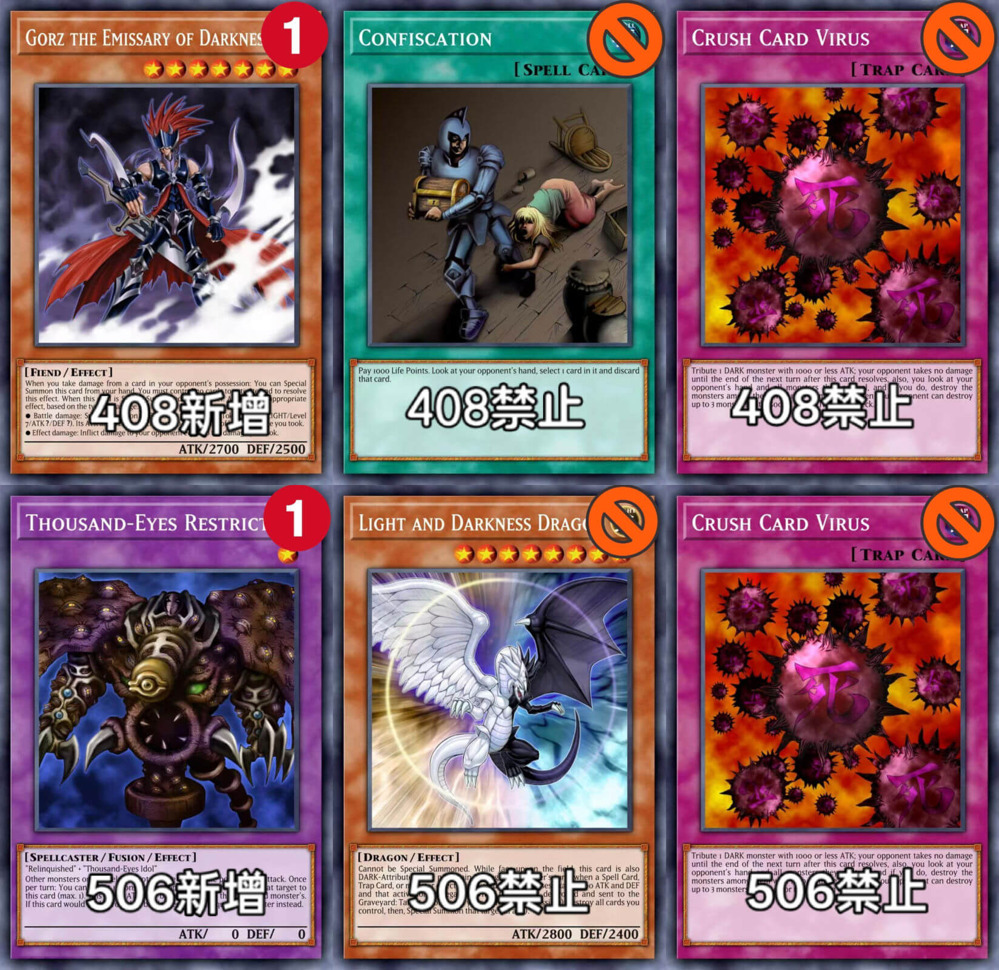

# 2026年9月汉诺杯间歇赛×第二届风帝杯举办公告

[返回比赛信息](../../../Competitions.html)

**本文/视频参照CC BY（署名）协议开放转载，敬请保留原链接与作者信息噢~感谢传播！支持知识开放、协作与共享**。

---

# **赛事简介**

- **规则省流**：
  - 采用大师规则2020（不适用额外怪兽区）
  - 改订前效果+最新裁定
  - 传承自2006年3月限制卡表+第四期卡池（2006年4月末）/2007年9月限制卡表+卡池截止2007.8.9，含TCG503至506先行卡
- **核心目标**：
  - 保留经典策略框架，同时规避早期规则复杂度。
  - 适合新手入门，有助于培养官方环境兴趣。

---

# **特殊规定**

   - **其他**：游戏王【408/506奇迹融合】
408禁止死毒，收押。新增限制卡冥府使者格斯
506禁止死毒，光暗龙。解除千眼纳祭神转为限制卡

---

# **参赛信息**

- **比赛时间**：`2026年9月4日` 13:00（周五）起，每天1轮**分组瑞士轮（包括淘汰赛部分）**，每日24:00左右强制出下一轮排表（包括开赛当日），无战果视为双败（以**无单局战绩**的平局显示）。提前打完可以提前安排下一轮。
- **类型**：娱乐赛。
- **报名方式**：
  - **费用**：免费。
  - **提交要求**：卡组需排序发送截图（包含卡片计数），于`2026年9月3日24:00`前提交至**登记地址**（https://docs.qq.com/form/page/DQUhPYkFqV01Hanhs ），逾期无效。
  - **修改构筑**：截止前重填表格并告知主办方（神之吹息），请勿滥用权利。
- **参赛群**：QQ群 `936891040`。
- **退赛条件**：比赛当日0点前未加群、赛中退群/缺席均视为退赛，后果自负。

---

# **比赛流程**

- [**共通规定**](../../Common_Rules.html)（必读）。

---

# **奖品设置**

- **奖项明细**：  

  | 名次     | 奖励内容                 |
  | -------- | ------------------------ |
  | **冠军** | 开学季助学金16坤（40）元 |
  | **亚军** | 开学季助学金10坤（25）元 |
  | **季军** | 开学季助学金6坤（15）元  |

---

# **注意事项**

- **违规处理**：未按规提交卡组、退赛等行为将影响后续参赛资格。
- **未尽事宜**：主办方保留最终解释权，未尽事宜以群公告为准。