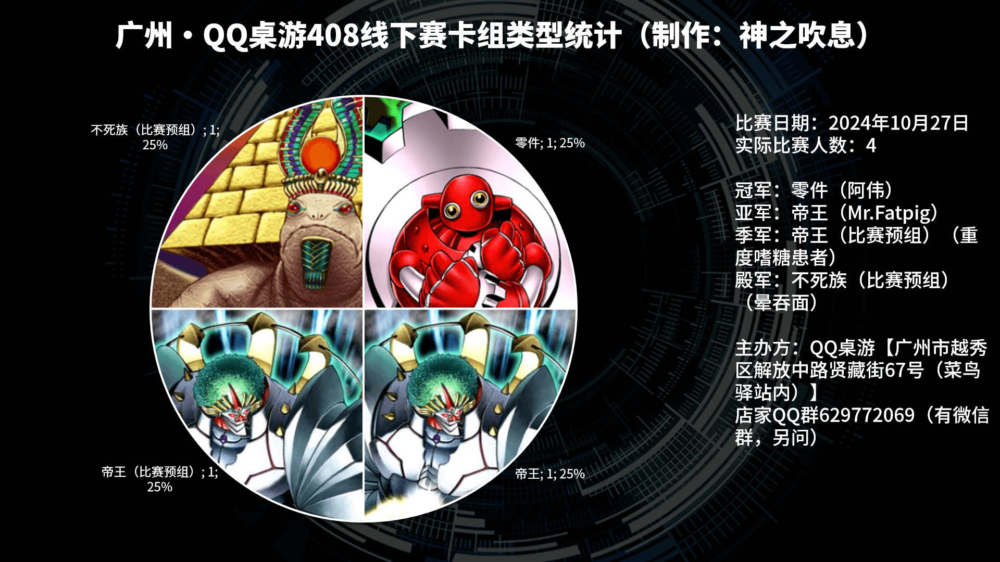
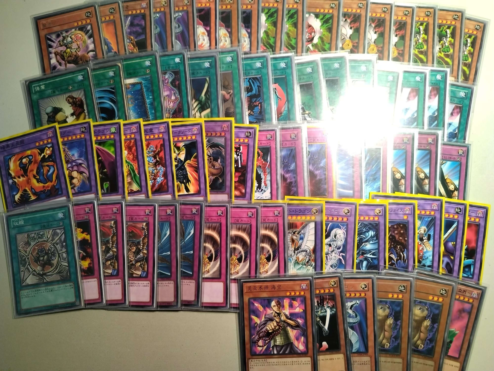
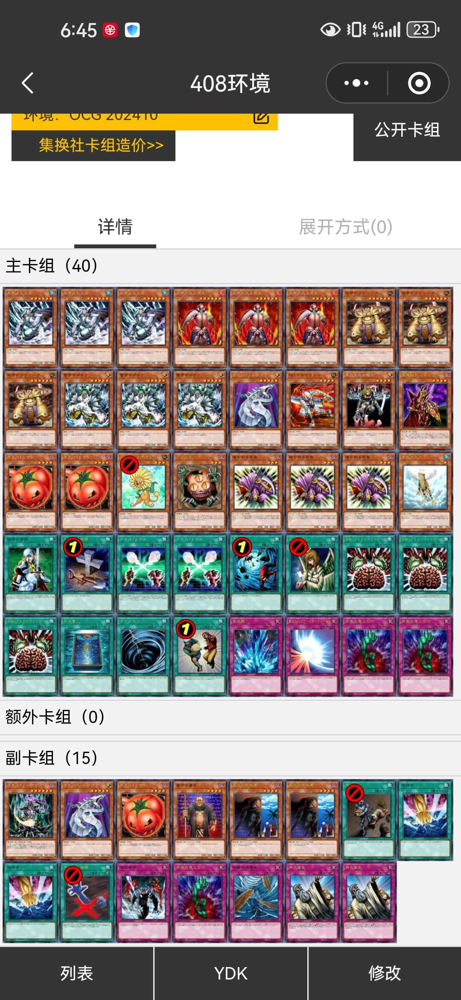
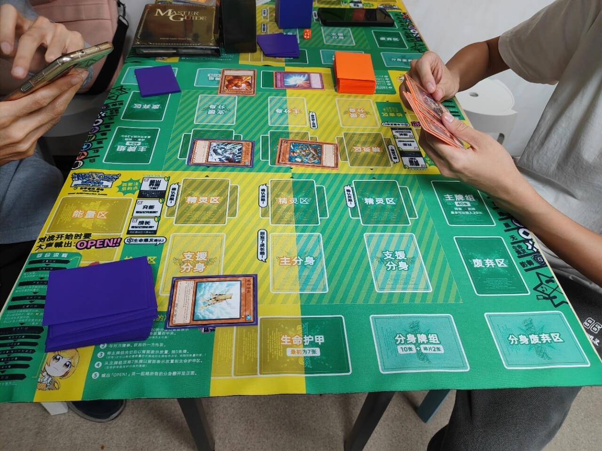
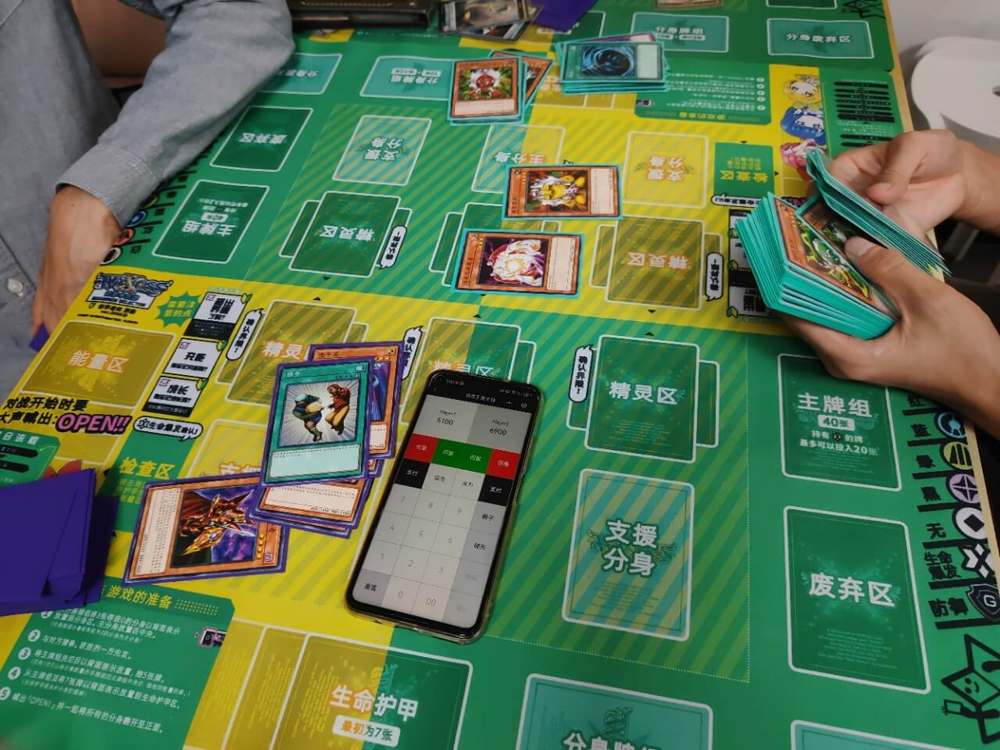

# 广州·QQ桌游408线下赛战报

开赛时间：2024年10月27日 13:00  
卡池：前四期OCG卡池  
卡表：2006年3月限制卡表  
规则：大师规则2020（不适用额外怪兽区）  
主办方：QQ桌游【广州市越秀区解放中路贤藏街67号（菜鸟驿站内）】（旧址）  

[返回比赛信息](../../../../Competitions.html)  

---

## 比赛结果

冠军：零件（阿伟）  
亚军：帝王（Mr.Fatpig）  
季军：帝王（比赛预组）（重度嗜糖患者）  
殿军：不死族（比赛预组）（晕吞面）  

    

久违了的四 人 大 会（笑）。本次比赛有首次体验408环境的2回坑玩家，其中1位与老板晕吞面亲自使用比赛预组参赛，亲身感受这些曾在线上赛厮杀中取得前四的卡组（部分修改过去掉额外利用部件）。本文仅简单展示卡组，有需要可以评论问思路。欢迎发表看法，互相讨论！店家QQ群629772069（有微信群，另问）。  
（非店家群）引导群（群组推荐）912340958。直播回放（合集列表中没有决赛就是正在更新）：https://www.bilibili.com/video/BV15E1gY6EZB/  

## 冠军：零件

第一轮 帝王○○  
第二轮 帝王（比赛预组）××  
半决赛 不死族（比赛预组）○○  
决赛 帝王○○  

    
     
    反光的2张魔法卡是收缩

## 亚军：帝王

第一轮 零件××  
第二轮 不死族（比赛预组）○○  
半决赛 帝王（比赛预组）×○○  
决赛 零件××  

    

## 季军：帝王（比赛预组）

第一轮 不死族（比赛预组）○○（G2死三杀）  
第二轮 零件○○  
半决赛 帝王○××  
季军争夺战 不死族（比赛预组）○○  

## 殿军：不死族（比赛预组）

第一轮 帝王（比赛预组）××（G2死三杀）  
第二轮 帝王××  
半决赛 零件××  
季军争夺战 帝王（比赛预组）××  

---

## 以下是赛后自由决斗活动照

    
     
    试玩其他比赛预组-1

---

    
     
    与其他牌友测试帝王新构筑，本 群 人 均 手 控

---

    
     
    试玩其他比赛预组-2

---

比赛已完满落幕，欢迎大家加群参赛或日常娱乐！