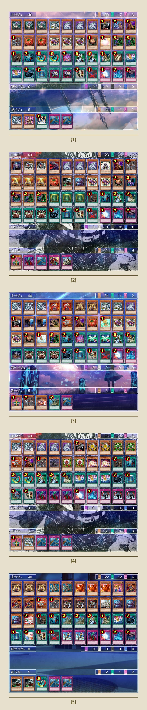

# **广州·三战之才（GOAT×408×506环境跨表）月赛（线下·常驻）**

[返回比赛信息](../../../../Competitions.html)  

---

# **广州·游戏王三战之才（跨表对决）2026年9月月赛（9.6）可借卡组**

📅 2026年9月6日（周日）14:30
📍 废柴猫概念馆-桌游卡牌团建(时尚天河店)【广州市天河区体育东路时尚天河东五街型动街区负二层（体育中心地铁站D3出口进商场右转）】

**无报名费 | 可借卡组 | 打印/民间卡通用**

🎮 规则：大师规则2020（无额外怪兽区）+ 原效果 + 最新裁定；
🃏 卡池：GOAT、408、506环境择一构筑不切换，根据各自规则（见附表）跨表决斗
⏱️ 瑞士轮：40分钟后进入10分钟死三，超时双败｜须服从主办安排
🎁 奖励：8人以上**冠亚季殿**奖金各20/15/10/5元；4-7人**冠亚季**奖金各15/10/5元。冠军自制纪念卡垫1张，四强自制纪念衍生物各1张。追加——冠军：英文白碎表情包三叉龙➕真红眼黑龙卡套➕恒威内胆卡套，亚军：日文金碎异画导游➕真红眼黑龙卡套，季军：英文白碎替罪羊➕恒威内胆卡套
🗂️ **先借先得**体验比赛预组（暂限408环境，见附图；各2份，均5张副卡组）：混沌/不死族/帝王/零件/地属性，**提前沟通主办携带**

👉 报名：集换社比赛码**3TRJKO**
⚠️ 报名后务必加主办微信 `masteryuten` ！
⚔️ 没有虚门槛，只谈硬实力！
🔥 不怕来挑战，就怕你不来！

| 环境名 |                             卡池                             |       禁限卡表       |            环境卡组示例            |
| :----: | :----------------------------------------------------------: | :------------------: | :--------------------------------: |
|  GOAT  | 2005年8月5日止**TCG**环境+**阿匹卜之化神、死亡魔导龙、闪电之战士 吉尔福德、宇宙人马兽、血腥魔兽人、火箭战士、漆黑之豹战士**等7张卡 | 2005年4月（**TCG**） |      混沌、战士beat、地属性等      |
|  408   |                    2006年4月止**OCG**环境                    |      2006年3月       | 零件（齿轮）、混沌、不死族、帝王等 |
|  506   |       2007年8月9日止**OCG**环境+**TCG 503至506先行卡**       |      2007年9月       | 光与暗之龙、帝王、高仪虫、宝玉兽等 |

> 三个经典的时代，三种环境的代表，一场不可能的决斗。
> **2005年GOAT环境**的开辟向混沌，**2006年408环境**的电子龙全盛零件（齿轮），**2007年506环境**的光与暗之龙——
> 这些王者曾在各自时空称霸，却从未有机会同时正面交锋。
>
> 如今，我们打破时间的桎梏，让这些经典卡组一决高下！
> 这不是单纯的还原历史，而是**致敬经典**，我们**保留了每个环境的灵魂——卡池与禁限卡表**。
>
> 统一采用“**大师规则2020（不适用额外怪兽区） + 原效果 + 最新裁定**”，让经典卡组在新时代规则下**焕发新生**。
> 同时，也是诚邀各位体验**更为严谨、稳定的新规则下经典卡组的全新活力**。
> 无论你是偏好**开辟双刀的爆发斩杀**，还是钟情于**9卡零件的持久续航**，或是想再现**光与暗之龙的无双压制**——这里都有你的舞台。
>
> 有人问：不同环境怎么打？答曰：用实力打，用热爱打。
> 这不仅是一次尝试，一场试炼，一个起点，更可能是宏大未来的第一步——属于经典卡牌爱好者共同的**跨表对决**。
> **经典从未衰落，只是换个方式再战一场！**也期待更多**新的面孔**，一道踏上这趟冒险的起点。
>
> 静候成为“**三战之才**”的你：**三**个经典民间环境混**战之**中的胜者人**才**。

  

#游戏王GOAT环境 #游戏王408环境 #游戏王506环境 #游戏王大师决斗 #游戏王决斗链接 #经典时光 #时间旅行 #梁山卡牌 #广州 #桌游 