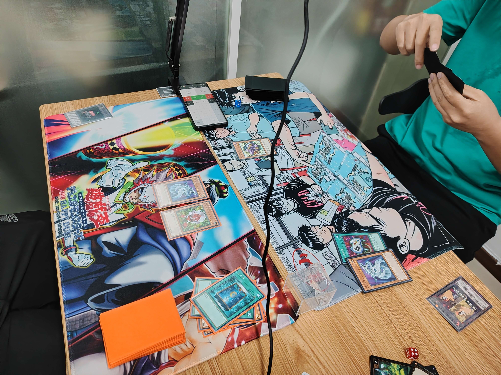

# 2025年10月5日游戏王408环境月赛战报

[返回比赛信息](../../../../Competitions.html)  

---

7人大会，3人是首次参加的新鲜血液，其中更有1人是外省来穗旅游，1人是他市来穗出差的牌友！
3轮瑞士轮出4强
感谢场地赞助梁山卡牌！
地点：广州·梁山卡牌

## 强者构筑

**冠军：零件 比赛预组（Kura）**  
不换side强者

---

    
     
    亚军：铁骑士beat（神之吹息）

---

    
     
    季军：混沌（小福泥贝儿） 无side强者

---

**殿军：混沌 比赛预组（长弓起灵）**  
不换side强者2号

---

## 其余玩家卡组类型

Good Stuff
反击天使
帝王

## 当日活动记录

    
      
    
      
    
      
    
      
    
      

