# 2025年11月16日游戏王408环境月赛战报

[返回比赛信息](../../../../Competitions.html)  

---

## 比赛结果

| 名次 | 选手ID | 卡组主题   |
| :----: | :------: | :----------: |
| 冠军 | 阿伟 | 零件 |
| 亚军 | 天使的施舍 | 帝王 |
| 季军 | 初心星游 | 混沌（比赛预组） |
| 殿军 | 红尘不渡我 | 帝王（比赛预组） |

    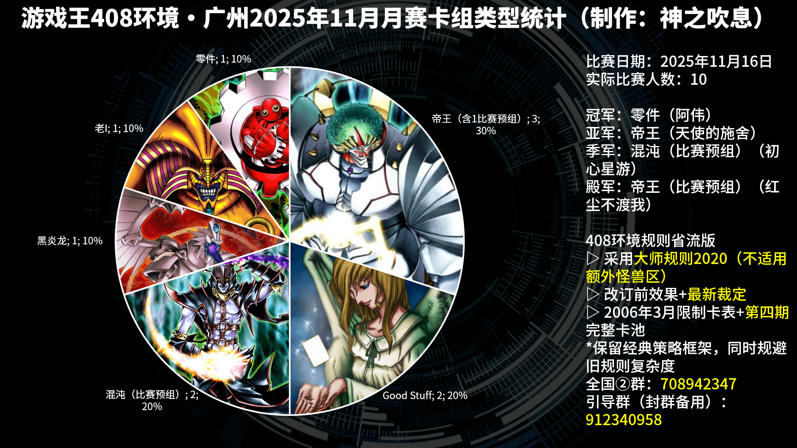

10人大会，4轮瑞士轮出4强。本次是参赛人数最多的1次，其中4人为异地牌友。感谢场地赞助梁山卡牌@逗小沙 ，卡套奖品赞助@CK顽牌 ，卡夹赞助@桃桃_Bracy的伟大航路 ，以及DIY纪念卡赞助牌友秋月。摄像头也是借梁山卡牌老板的，这次老板也亲自参赛了，玩得十分开心。人数足够的话还是得有个裁判，能规避不少口胡。因本次比赛已达8人，赛果会计入总使用情况统计。比赛视频：https://www.bilibili.com/video/BV1ESCbB9ECt/ 。	

## 强者对战记录

### 冠军：零件

    

- **第一轮**：Good Stuff 胜  
- **第二轮**：混沌（比赛预组） 胜  
- **第三轮**：帝王（比赛预组） 负  
- **第四轮**：老I 胜  
- **半决赛**：混沌（比赛预组） 胜  
- **决赛**：帝王 胜  

### 亚军：帝王

    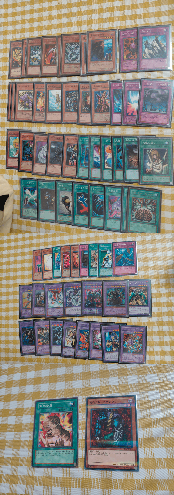
       
    下2部分照片为额外卡组与副卡组

- **第一轮**：帝王（比赛预组） 胜  
- **第二轮**：Good Stuff 胜  
- **第三轮**：老I 胜  
- **第四轮**：黑炎龙 胜  
- **半决赛**：帝王（比赛预组） 胜  
- **决赛**：零件 负  

###  季军：混沌（比赛预组）

- **第一轮**：Good Stuff 胜  
- **第二轮**：零件 负  
- **第三轮**：混沌（比赛预组） 胜  
- **第四轮**：帝王（比赛预组） 胜  
- **半决赛**：零件 负  
- **季军争夺战**：帝王（比赛预组） 胜  

### 殿军：帝王（比赛预组）

- **第一轮**：帝王 负  
- **第二轮**：帝王 胜  
- **第三轮**：零件 胜  
- **第四轮**：混沌（比赛预组） 负  
- **半决赛**：帝王 负  
- **季军争夺战**：混沌（比赛预组） 负  

---

## 参赛者卡组公开

### 其他参赛者

| ID   | 卡组主题及简评 | 构筑截图 |
| :----: | :--------------: | :--------: |
| 秋秋月 | 除本人外第2个实卡比赛中的黑炎龙 | 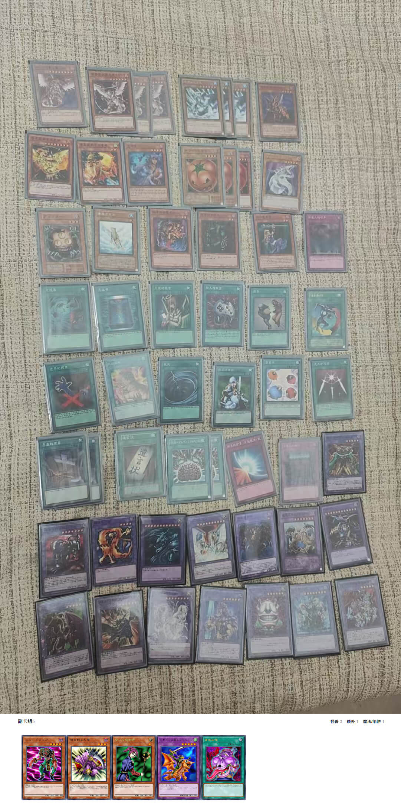    |
| 新会阿图姆，，条靓 | 无副卡组的Good Stuff | 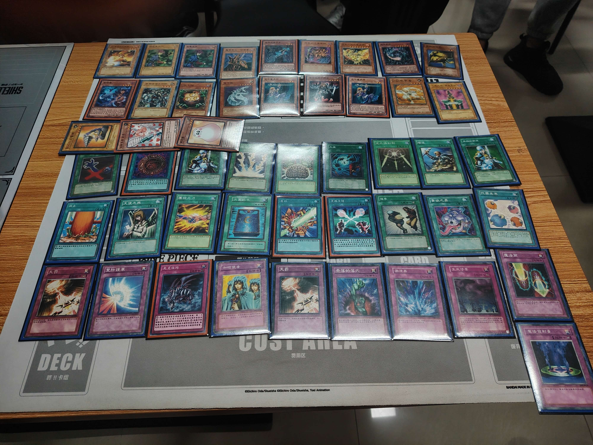    |
| 粤J先生 | 无副卡组的帝王，不小心投入某张非环境卡被规则杀了1把单局（悲） | 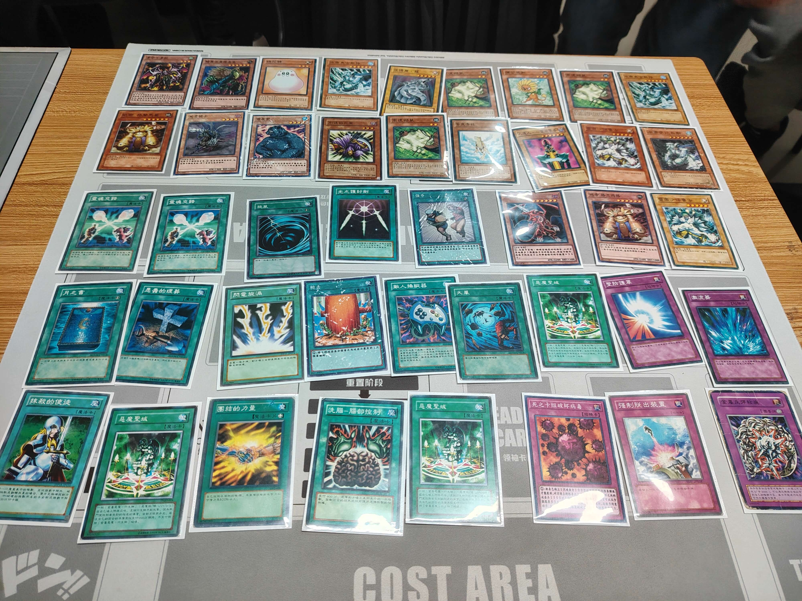    |
| 收藏家精品阁 | 老I，下方2行是副卡组 | 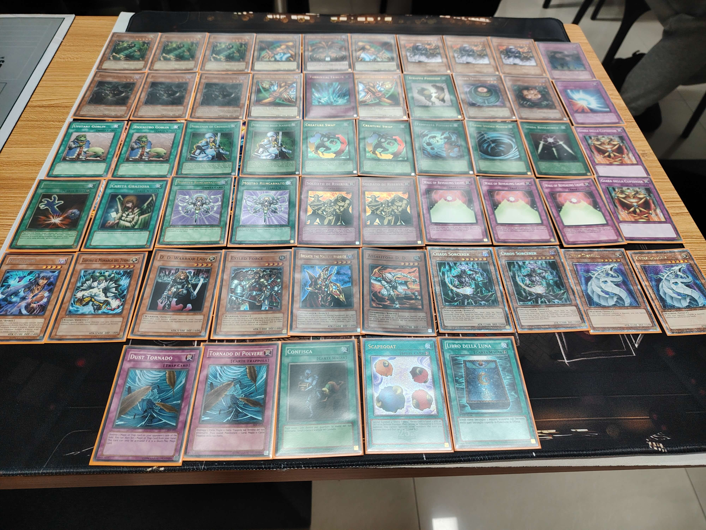    |
| 梁山卡牌 | 混沌（比赛预组） | 固定构筑，略 |
| 小福泥贝儿 | 无副卡组的Good Stuff |     |

## 当日活动记录

    
      
     本人组织的线下比赛首次10人同时决斗的场面！
      
    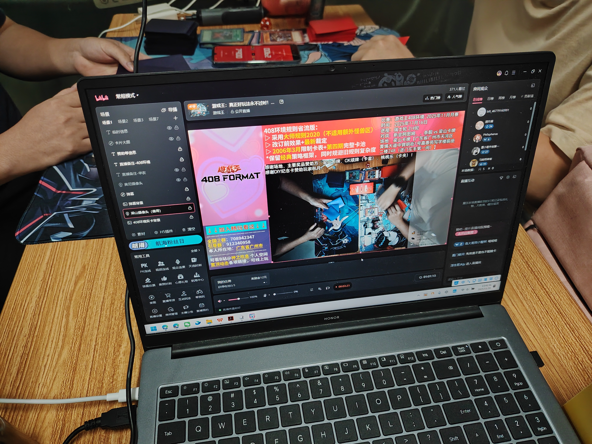
      
     直播+录播中
      
    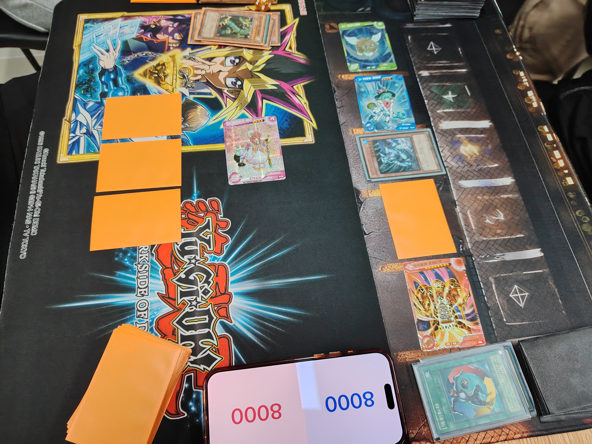
      
     DIY卡当衍生物，还行，视觉效果不错
      
    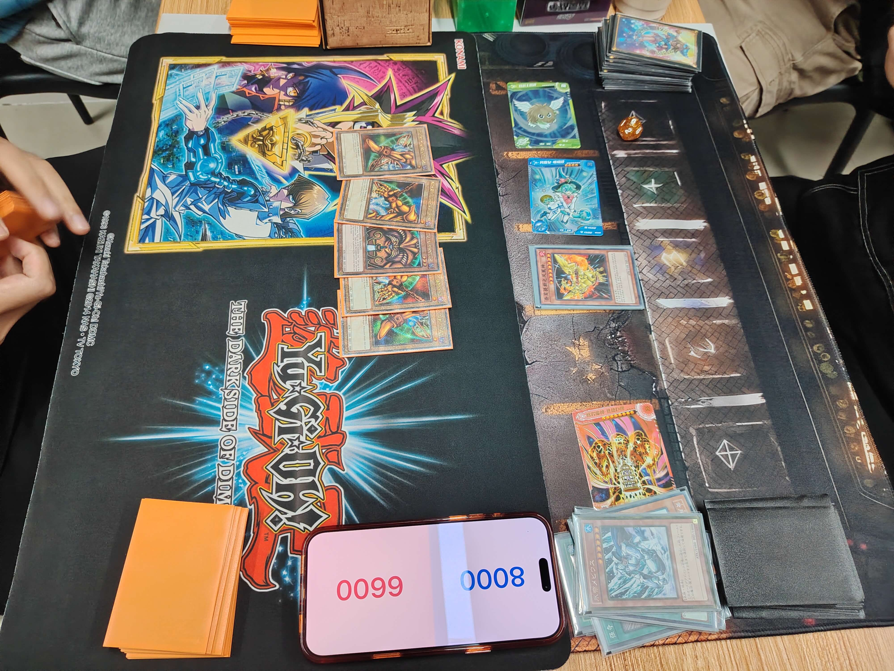
      
     本人组织的线下赛首次特殊胜利，尤其是老I胜利
      
    
      
     部分奖品
      
     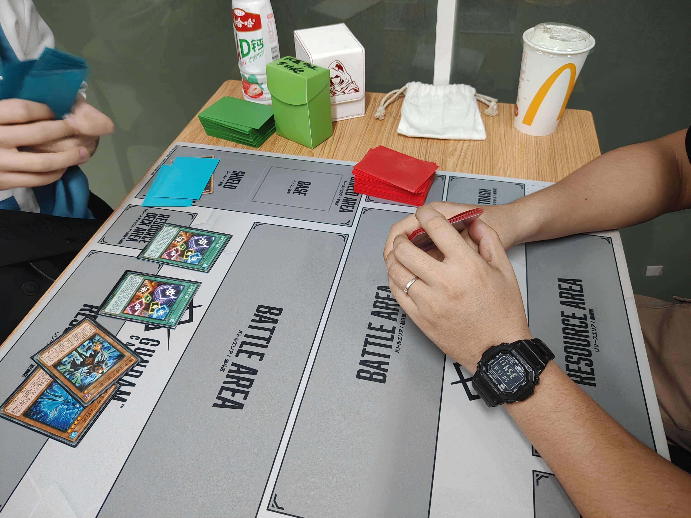
      
     跨 表 对 决
      
     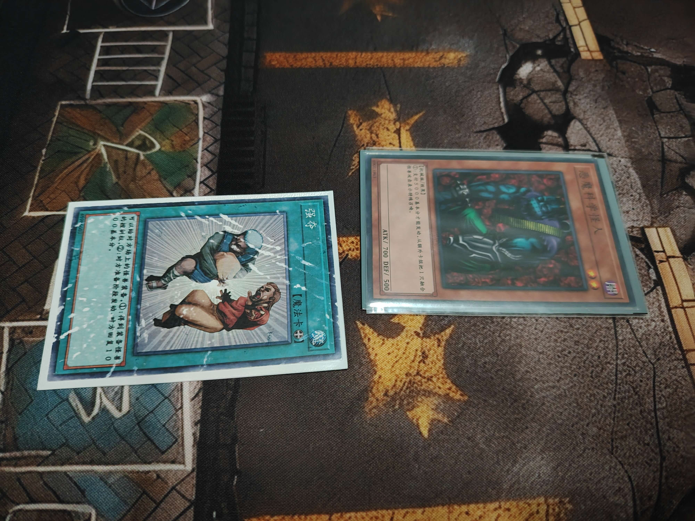
      
     伊拉克损的打印卡2333
           
     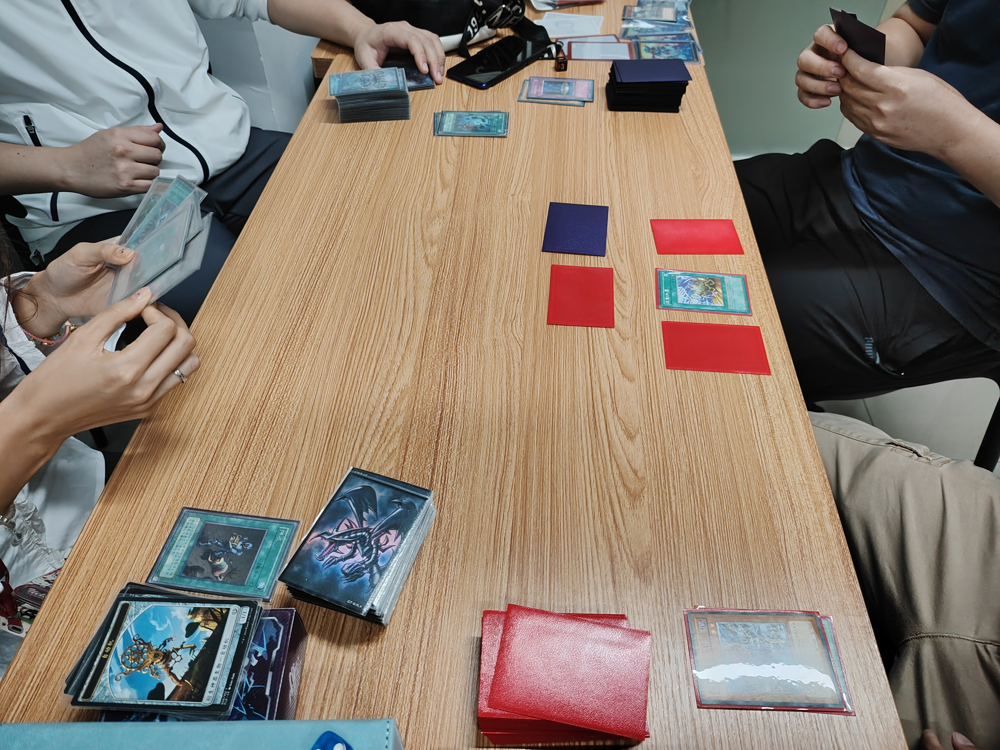
      
     赛后欢乐双打
           
     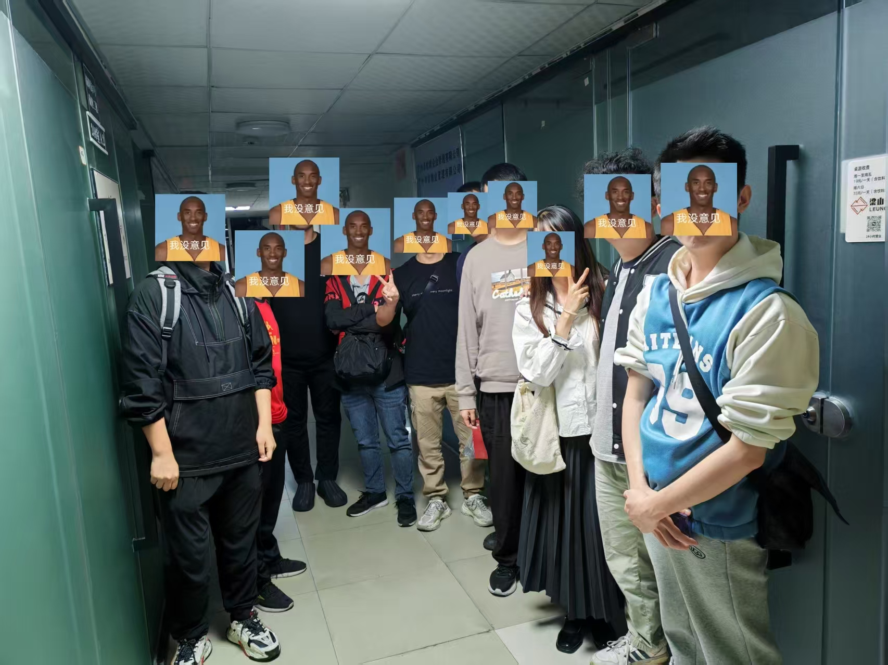
      
     参赛者与裁判合影（老板持机）

