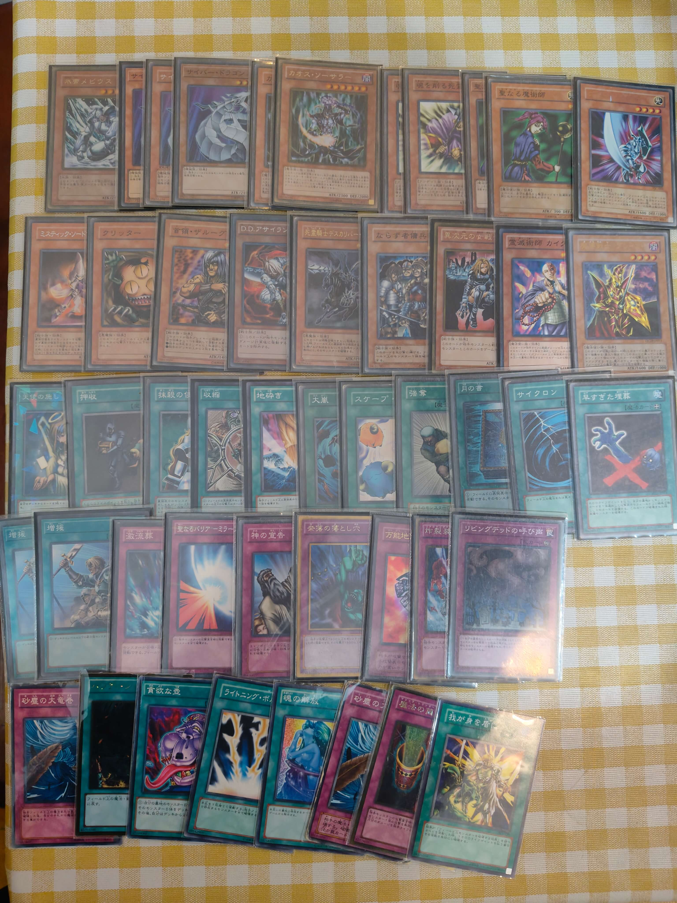
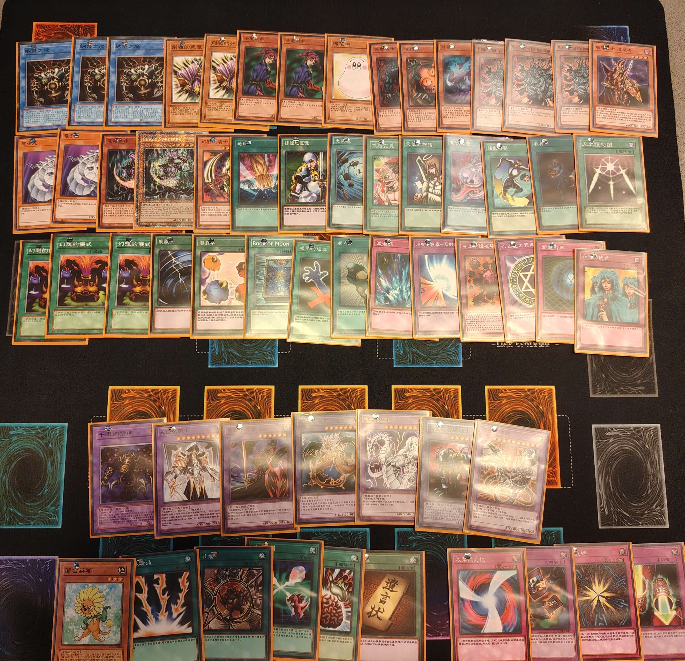
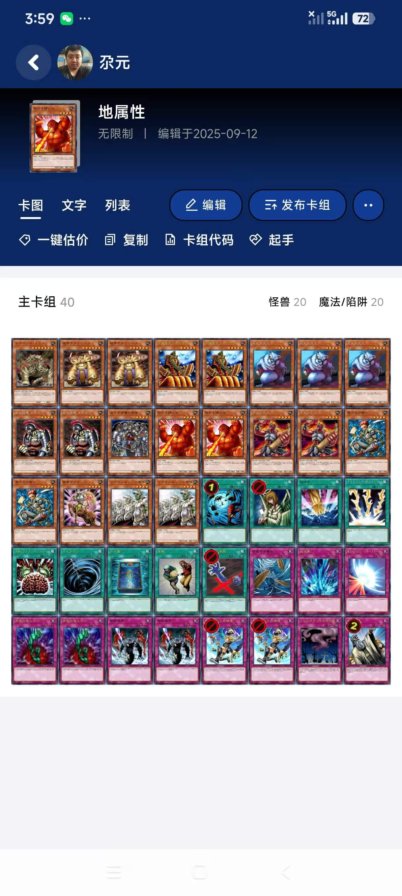
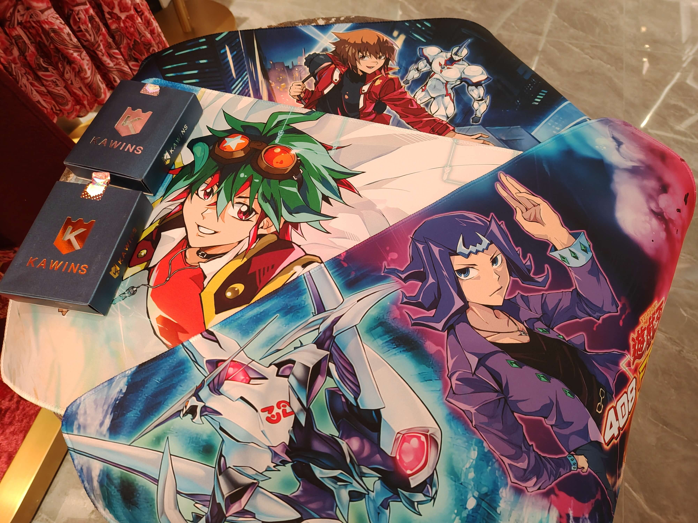
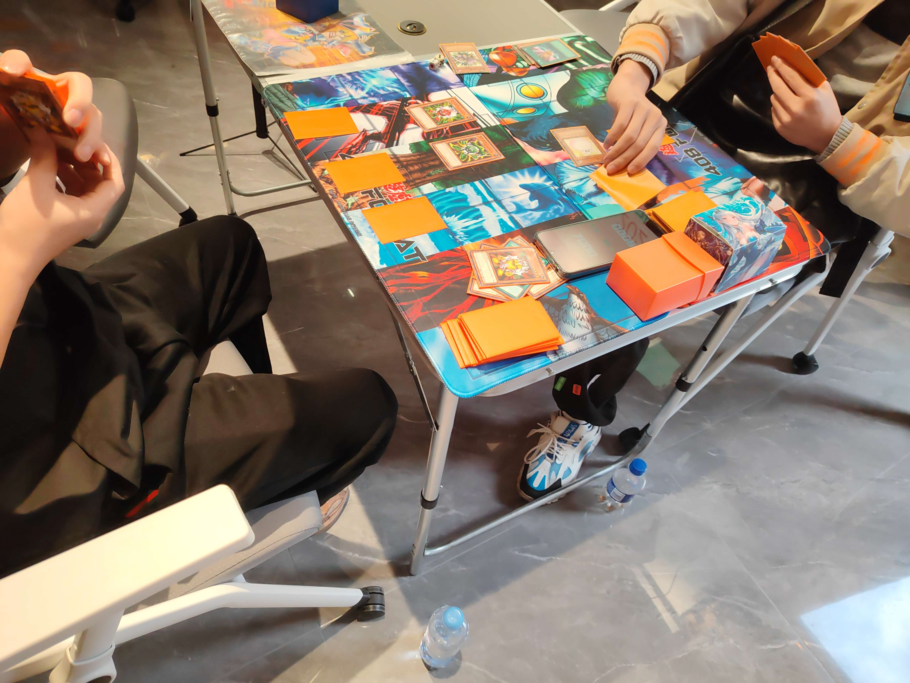
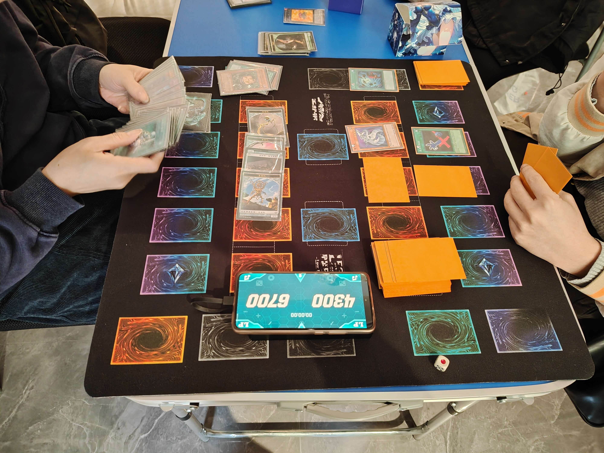
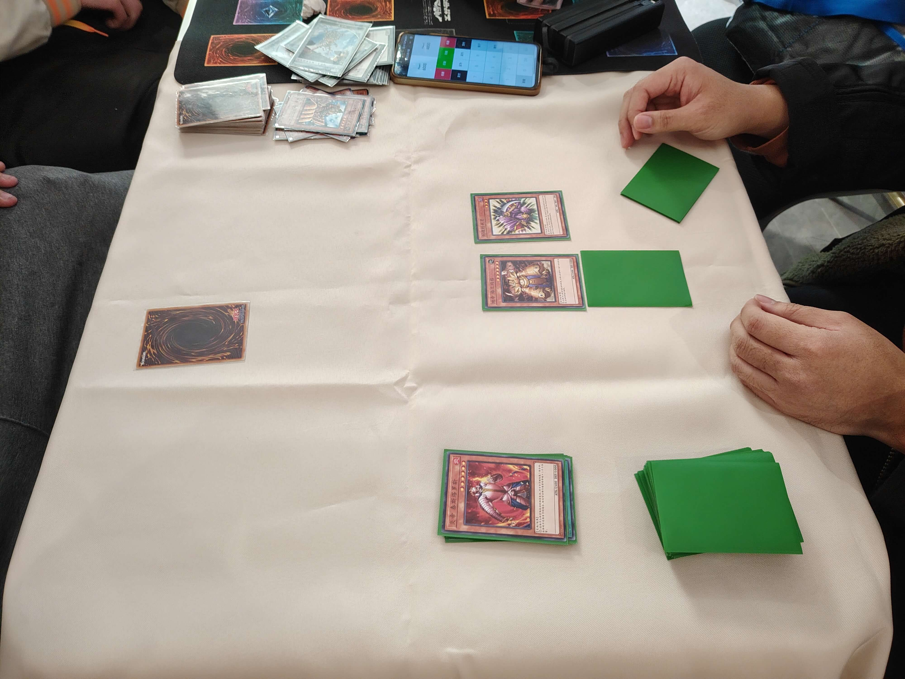
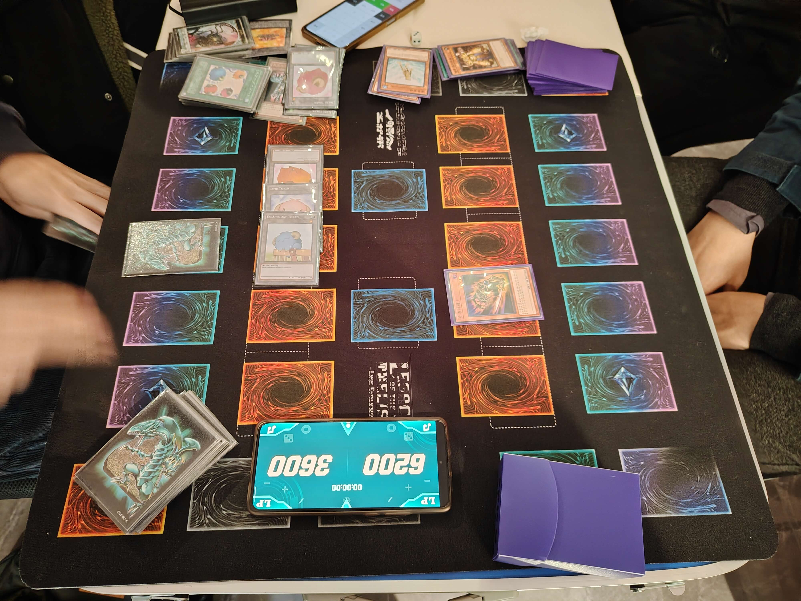
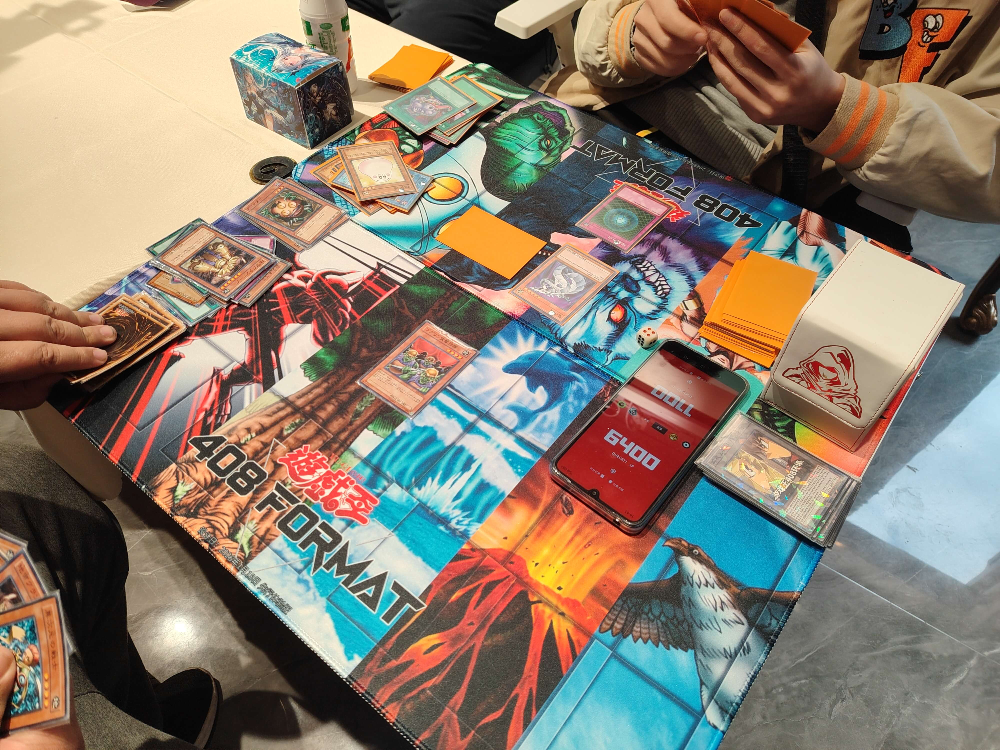

# 2026年2月游戏王408环境月赛战报

[返回比赛信息](../../../../Competitions.html)  
**本文/视频参照CC BY（署名）协议开放转载，敬请保留原链接与作者信息噢~感谢传播！支持知识开放、协作与共享**

---

## 赛事概览

- **开赛时间**：2026年2月8日 14:30
- **卡池规则**：前四期OCG卡池 + 2006年3月限制卡表
- **对战规则**：大师规则2020（无额外怪兽区）
- **直播回放**：[地址](https://www.bilibili.com/video/BV16Zcgz7EMi/)
- **比赛对阵表**：集换社小程序比赛码PKBJNE

---

## 比赛结果

| 名次 | 选手ID | 卡组主题   |
| :----: | :------: | :----------: |
| 冠军 | 菲利普阿达 | 帝王（比赛预组） |
| 亚军 | 天使的施舍 | 混沌 |
| 季军 | 暗爪老朋友 | 零件（比赛预组） |
| 殿军 | Elenno | 帝王（比赛预组） |

2026年2月8日的比赛，6人大会，3轮瑞士轮出4强。其中2人为首次参赛牌友，2人在本场比赛与2011探索者环境·第二届战鬼杯中来回参赛（笑）！感谢场地赞助熊猫高定体验馆（生产商：广州市利工民针织有限公司；场地赞助商是西装企业，可购买、定制西装） ，以及冠亚军奖品赞助义父天使的施舍！

本次比赛是408环境与2011探索者环境首次在广州，很可能也是国内首次同场联合举办的一场。
比赛规模虽不算盛大，却有着前无古人的象征意义——不同的民间环境线下实卡群组，通过同场办赛的方式梦 幻 联 动，擦出了“穿梭多元宇宙”的火花！
群组之间从孤立、猜疑、内耗，走向开放、包容、联合，现更是朝着线上线下分工协作、互补互助的方向大步迈进。
这是两个群组之间握手的一小步，也是民间环境历史的一大步。愿国内民间环境在一次次碰撞中发展壮大，蒸蒸日上！

感谢所有参与的玩家！

---

## 强者对战记录

### 冠军：帝王（比赛预组）

- **第一轮**：混沌 胜
- **第二轮**：地属性 胜
- **第三轮**：零件（比赛预组） 胜
- **半决赛**：帝王（比赛预组） 胜
- **决赛**：混沌 胜

### 亚军：混沌

    

- **第一轮**：帝王（比赛预组） 负
- **第二轮**：纳祭 胜
- **第三轮**：帝王（比赛预组） 胜
- **半决赛**：零件（比赛预组） 胜
- **决赛**：帝王（比赛预组） 负

###  季军：零件（比赛预组）

- **第一轮**：纳祭 胜（G1卡组混入side，对方同意继续）
- **第二轮**：帝王（比赛预组） 胜
- **第三轮**：帝王（比赛预组） 负
- **半决赛**：混沌 负
- **季军争夺战**：帝王（比赛预组） 胜

### 殿军：帝王（比赛预组）

- **第一轮**：地属性 胜
- **第二轮**：零件（比赛预组） 负
- **第三轮**：混沌 负
- **半决赛**：帝王（比赛预组） 负
- **季军争夺战**：零件（比赛预组） 负

---

## 参赛者卡组公开

### 其他参赛者

| ID   | 卡组主题及简评 | 构筑截图 |
| :----: | :--------------: | :--------: |
| 红尘不渡我 | 纳祭 |     |
| 大元 | 地属性 |     |

---

## 当日活动记录

    
     
    部分奖品——线上群管理虹霓手绘卡垫，天使的施舍赞助卡套卡膜

    
     
    橙 人 游 戏（指两人卡套都是橙色）

    
     
    乱入的万智牌公用衍生物

    
     
    现场环境

    
     
    666还有PPT投影

    
     
    不戴套（？）的参赛者正在比赛

    
     
    私家羊衍生物

    
     
    复刻的6属性遗言垫子与初印制的6属性场地垫子

    
     
    季殿军合影

    
     
    冠亚季军合影（殿军已先行离开）

    
     
    冠亚季军与作为组织者的本人合影

---

## 加入社群

- **全国②群**：QQ群 `708942347`
- **引导群**：QQ群 `912340958`

---

**本届比赛圆满结束，欢迎参加下届赛事！**  