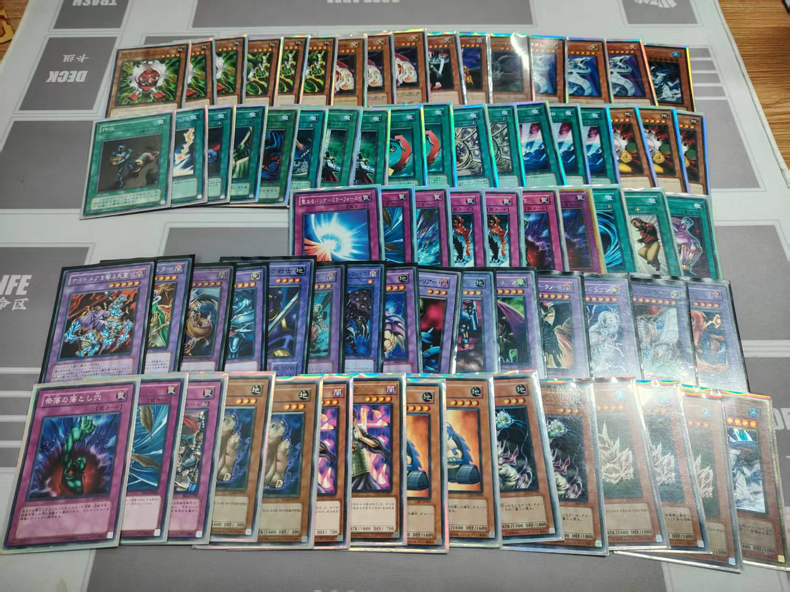
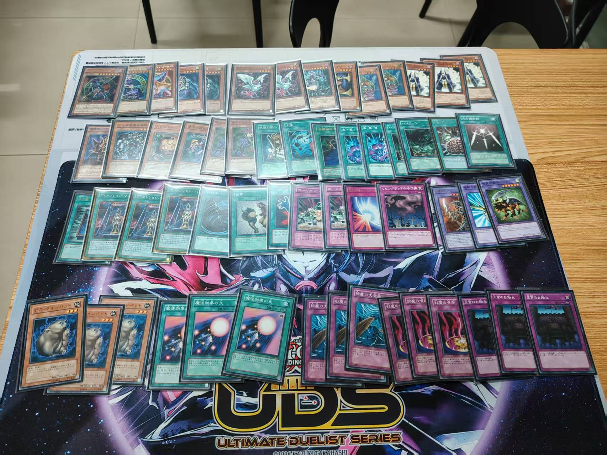
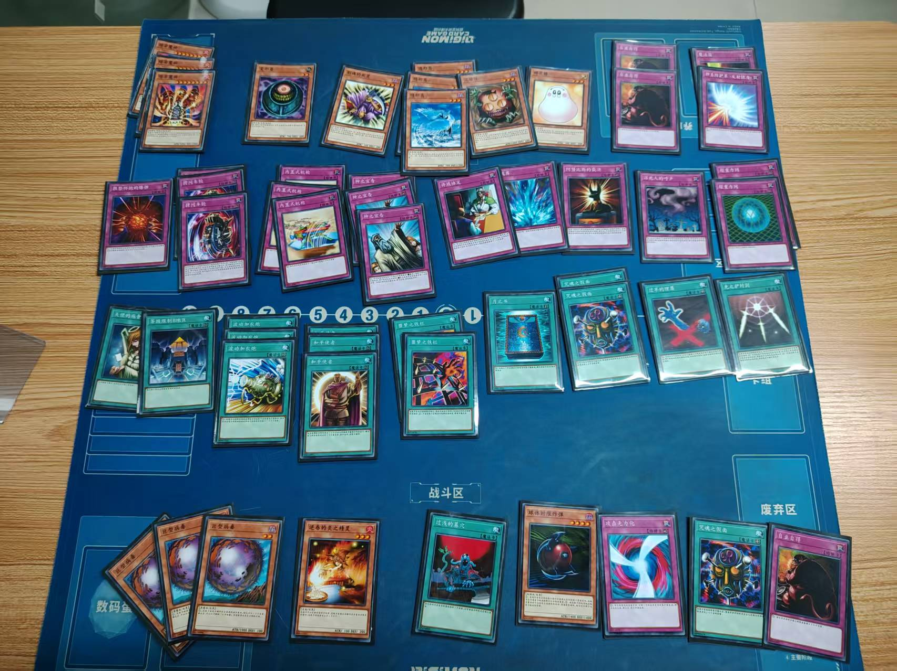
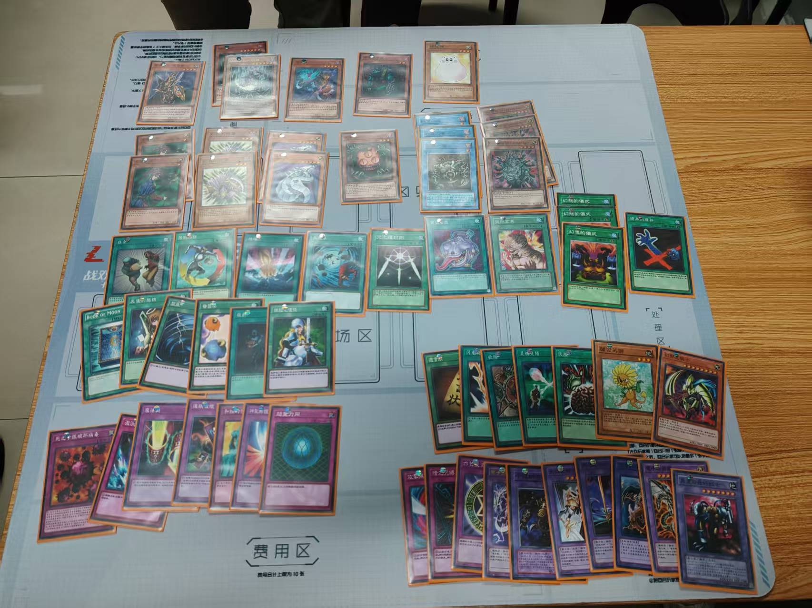
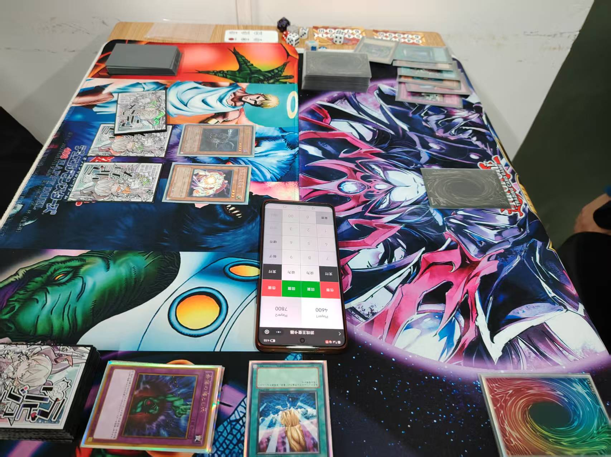
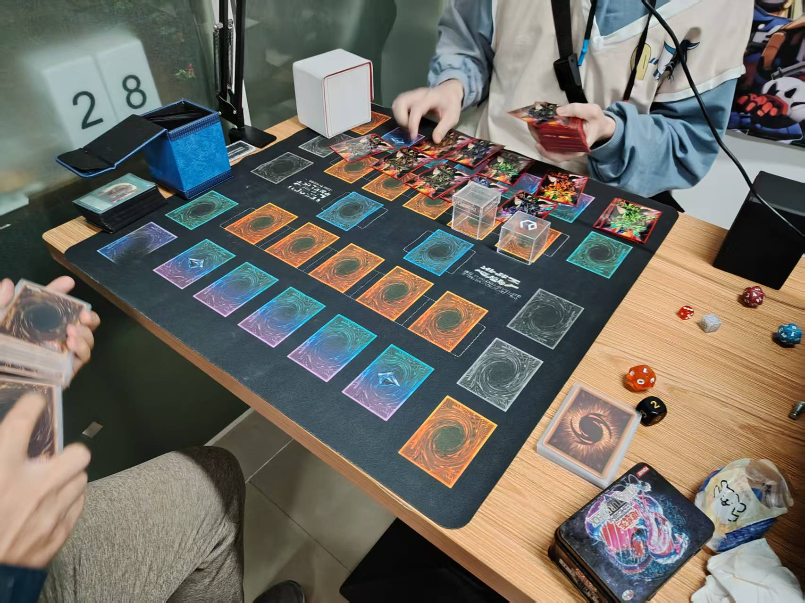
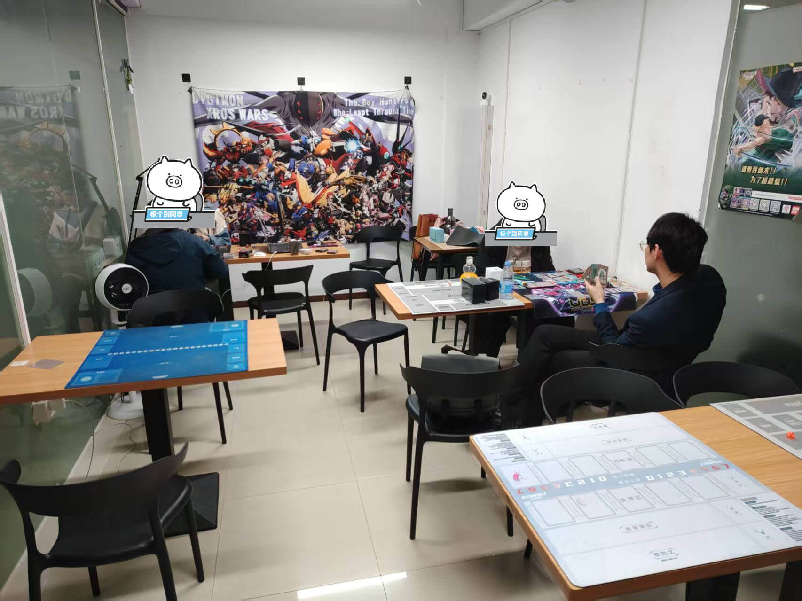

# 2026年3月游戏王408环境月赛战报

[返回比赛信息](../../../../Competitions.html)  
**本文/视频参照CC BY（署名）协议开放转载，敬请保留原链接与作者信息噢~感谢传播！支持知识开放、协作与共享**

---

## 赛事概览

- **开赛时间**：2026年3月15日 14:30
- **卡池规则**：前四期OCG卡池 + 2006年3月限制卡表
- **对战规则**：大师规则2020（无额外怪兽区）
- **直播回放**：[地址](https://www.bilibili.com/video/BV1dFwfz5EFJ/)
- **比赛对阵表**：集换社小程序比赛码SBC2RY

---

## 比赛结果

| 名次 | 选手ID | 卡组主题   |
| :----: | :------: | :----------: |
| 冠军 |    阿伟    |   零件   |
| 亚军 |    猫耳    | 黑魔术师 |
| 季军 |   Elenno   |  自闭烧  |
| 殿军 | 红尘不渡我 | 纳祭 |

2026年3月15日的比赛，4人大会，3轮瑞士轮（循环赛？），因产生同分而进行加时赛。其中1人为首次参赛+外地牌友——第27届汉诺杯冠军·守护者卡组使用者，线上娱乐强者猫耳桑！感谢场地提供梁山卡牌，广州租场玩桌游可联系微信wobushidousha。本次战报这么晚才出来，还是太懒狗，人一懒狗起来就不想动了（笑）。由于只有4人，卡组类型分布十分明确，就不做饼图了。

---

## 强者对战记录

### 冠军：零件

    

- **第一轮**：自闭烧 胜
- **第二轮**：纳祭 胜
- **第三轮**：黑魔术师 负
- **加时赛**：黑魔术师 胜

### 亚军：黑魔术师

    

- **第一轮**：纳祭 负
- **第二轮**：自闭烧 胜
- **第三轮**：零件 胜
- **加时赛**：零件 负

###  季军：自闭烧

    

- **第一轮**：零件 负
- **第二轮**：黑魔术师 负
- **第三轮**：纳祭 胜
- **加时赛**：纳祭 胜

### 殿军：纳祭

    

- **第一轮**：黑魔术师 胜
- **第二轮**：零件 负
- **第三轮**：自闭烧 负
- **加时赛**：自闭烧 负

---

## 当日活动记录

    
     
    比赛场面1

    
     
    比赛场面2

    
     
    比赛现场，4 人 大 会

    
     
    冠亚军合照

    
     
    殿军照片（季军先行离开了）

---

## 加入社群

- **全国②群**：QQ群 `708942347`
- **引导群**：QQ群 `912340958`

---

**本届比赛圆满结束，欢迎参加下届赛事！**  