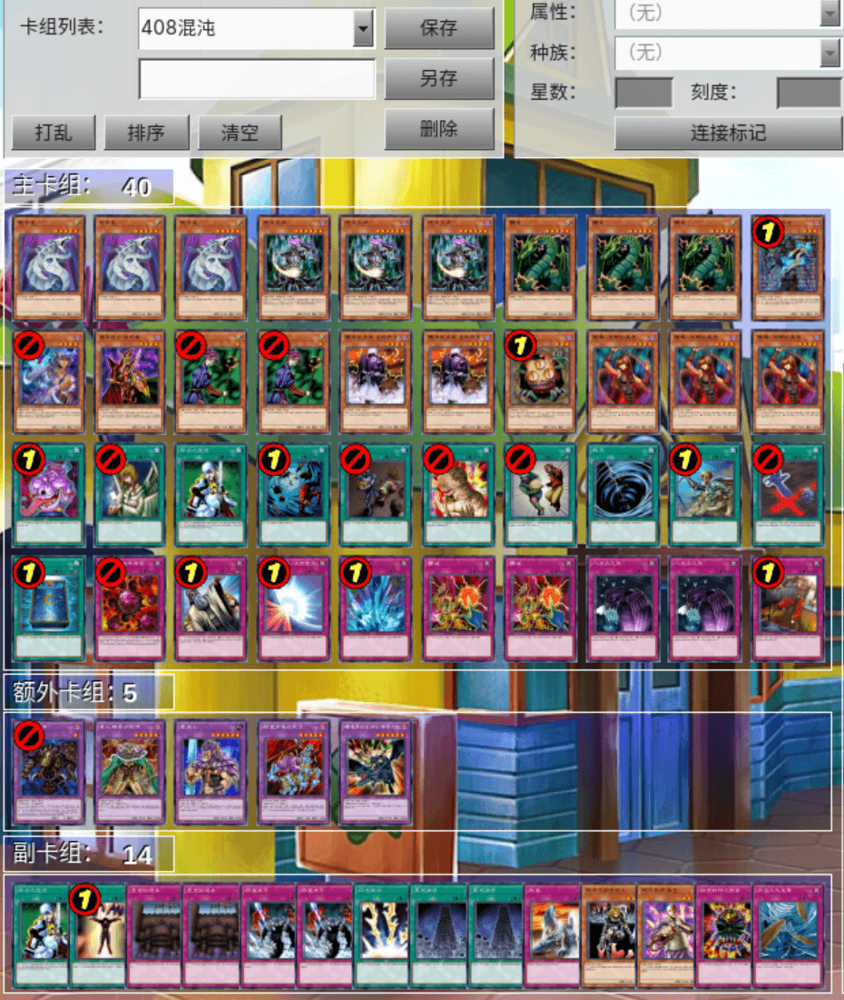
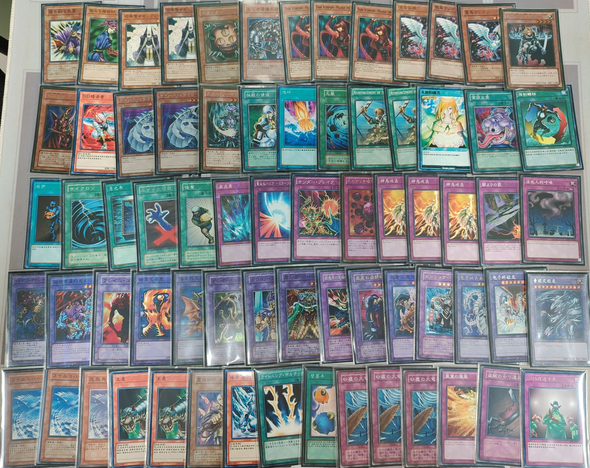
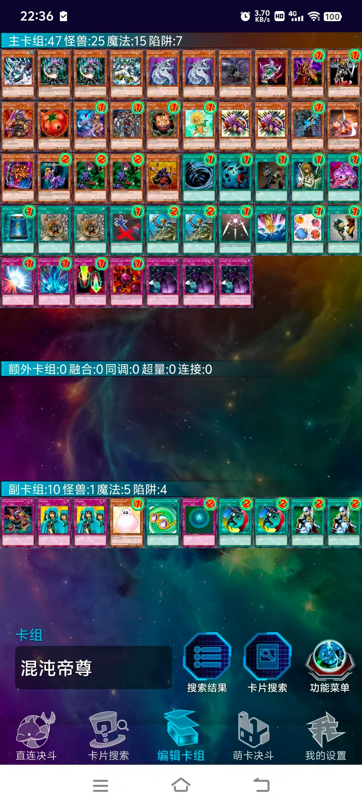
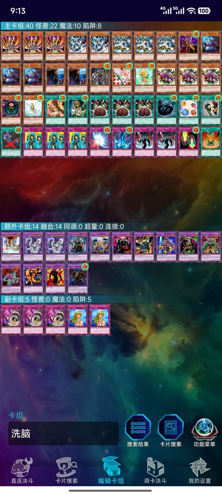
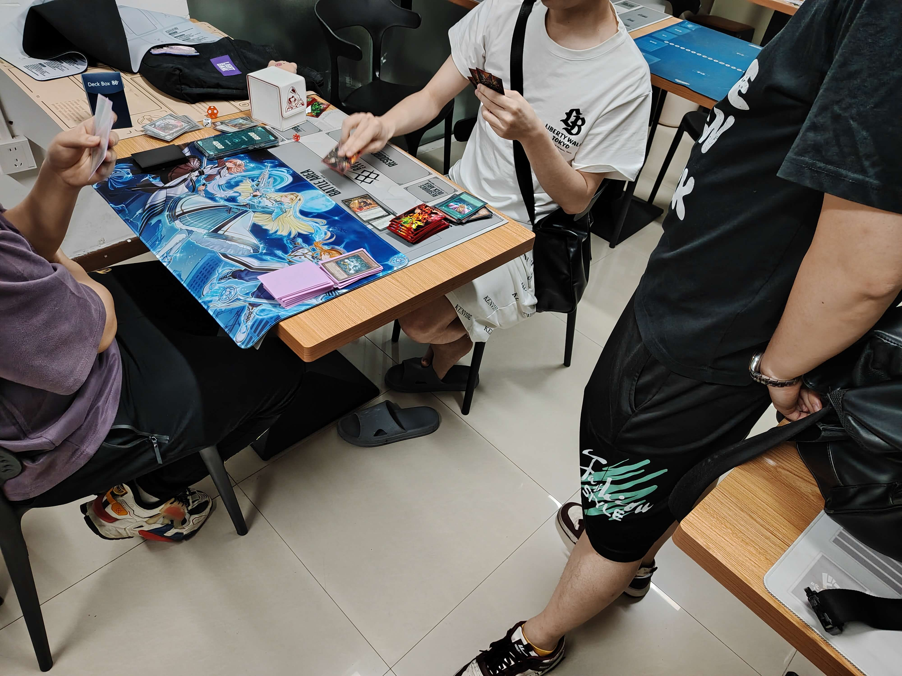
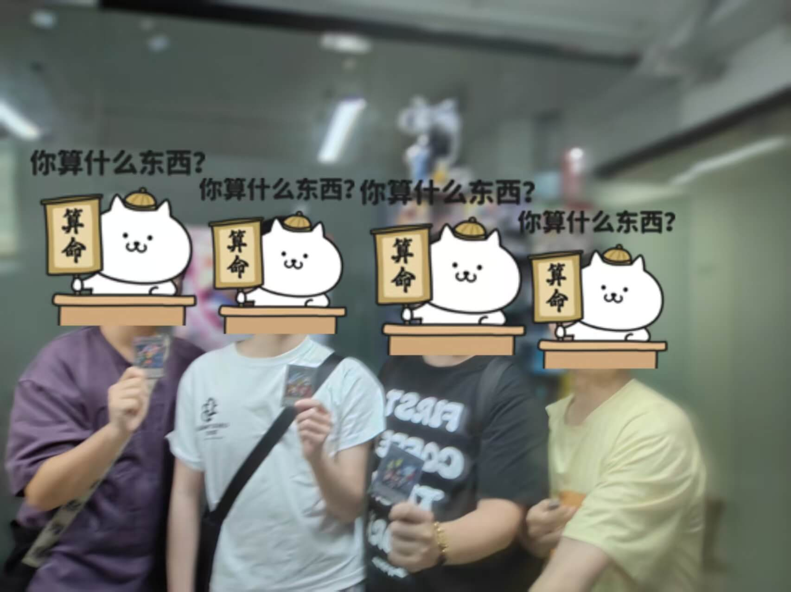

# 2026年4月游戏王408环境月赛战报

[返回比赛信息](../../../../Competitions.html)
**本文/视频参照CC BY（署名）协议开放转载，敬请保留原链接与作者信息噢~感谢传播！支持知识开放、协作与共享**

---

# **赛事概览**

- **开赛时间**：2026年4月18日 14:30
- **卡池规则**：前四期OCG卡池 + 2006年3月限制卡表
- **对战规则**：大师规则2020（无额外怪兽区）
- **直播回放**：[地址](https://www.bilibili.com/video/BV1grdsBoEMG/)
- **比赛对阵表**：集换社小程序比赛码TRE1W2（忽略淘汰赛部分）

---

# **比赛结果**

| 名次 | 选手ID | 卡组主题   |
| :----: | :------: | :----------: |
| 冠军（输第3轮） |    龙骑    |   混沌   |
| 亚军（输第2轮） |  神之吹息  | 僧鹤beat |
| 季军（输第1轮） | 红尘不渡我 |   混沌   |
| 殿军 | 秋月 | 帝王 |

2026年4月18日的比赛，依然是4人大会，3轮循环赛，时间太晚就不进行加时赛，按照仅输的那一轮的顺序简易决定名次。欢迎龙骑桑在多年后重新参加本人举办的408环境线下实卡比赛！之前几次都由于人数问题，本人不便亲自参加成为奇数人导致轮空，这次终于可以把一个构筑了一段时间的竞技卡组拿去参赛了。感谢场地提供梁山卡牌，广州租场玩桌游可联系微信wobushidousha。由于只有4人，卡组类型分布十分明确，就不做饼图了。

---

# **强者对战记录**

## **冠军：混沌**

    

- **第一轮**：帝王 胜
- **第二轮**：僧鹤beat 胜
- **第三轮**：混沌 负

## **亚军：僧鹤beat**

    

- **第一轮**：混沌 胜
- **第二轮**：混沌 负
- **第三轮**：帝王 胜

##  **季军：混沌**

    

- **第一轮**：僧鹤beat 负
- **第二轮**：帝王 胜
- **第三轮**：混沌 胜

## **殿军：帝王**

    

- **第一轮**：混沌 负
- **第二轮**：混沌 负
- **第三轮**：僧鹤beat 负

---

# **当日活动记录**

    
     
    比赛场面，4 人 大 会，其中一桌打完后围观另一桌

    
     
    参与玩家合照

---

# **加入社群**

- **全国②群**：QQ群 `708942347`
- **引导群**：QQ群 `912340958`

---

**本届比赛圆满结束，欢迎参加下届赛事！**