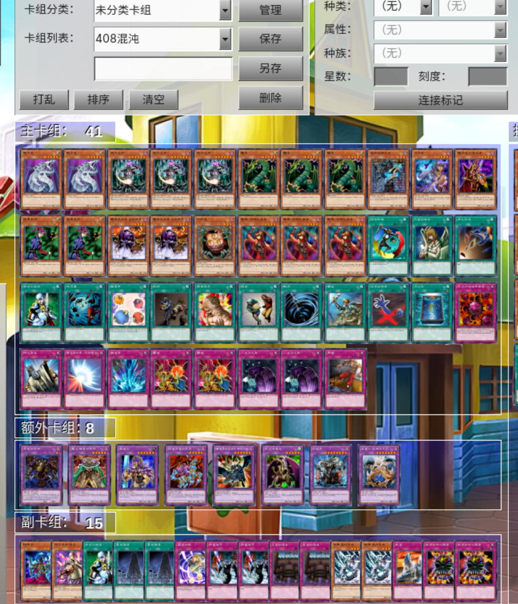
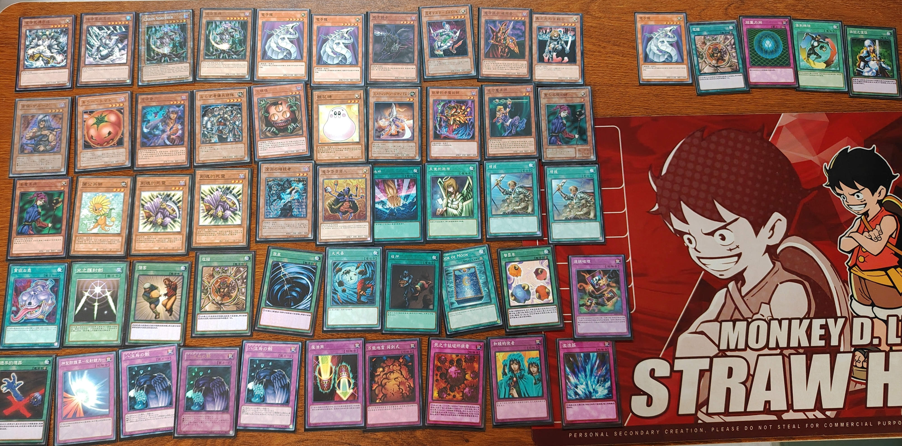
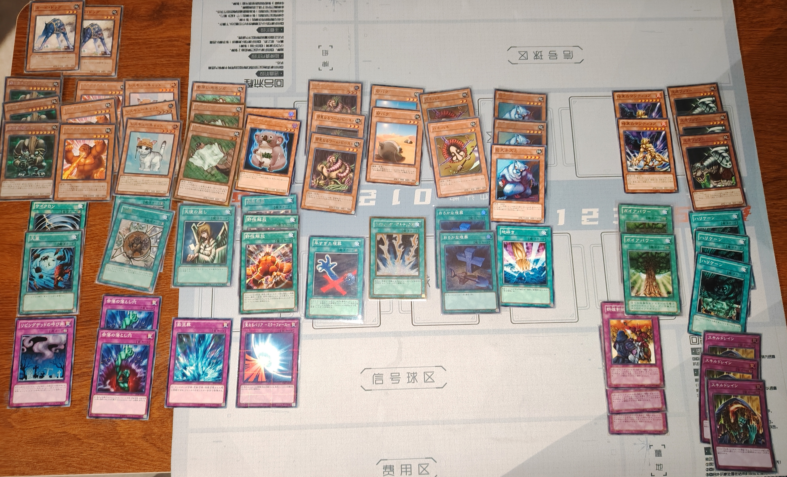
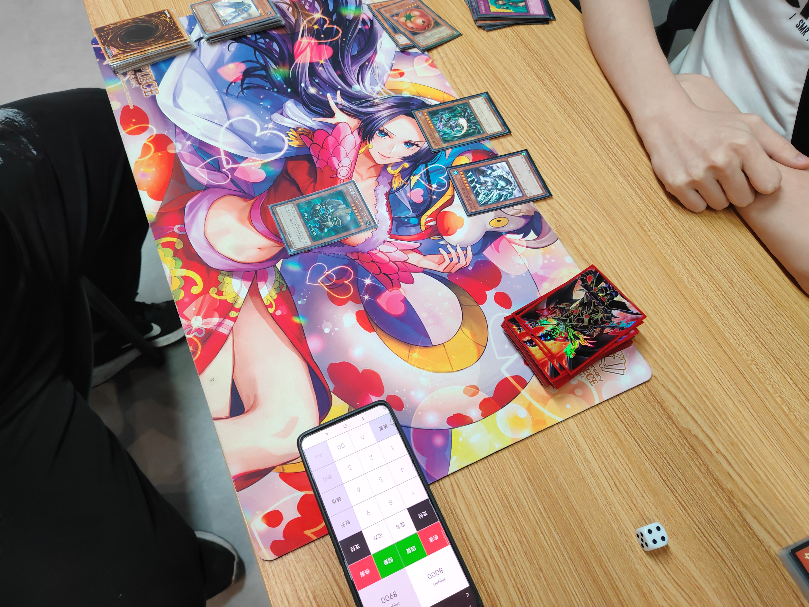
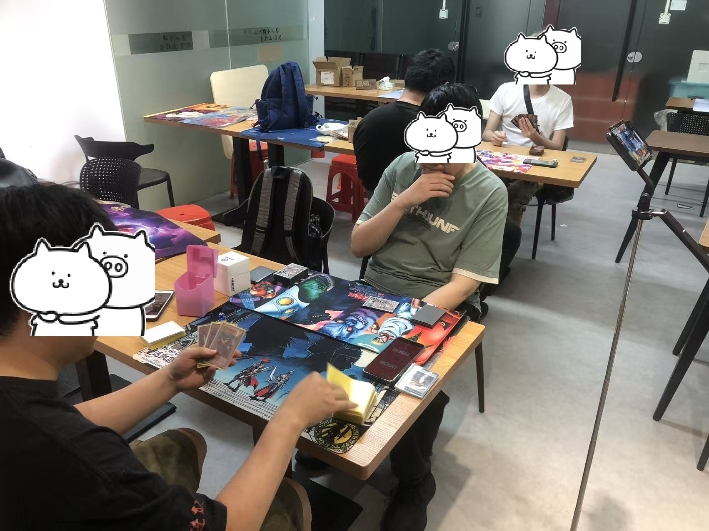

# 2026年5月游戏王408环境月赛战报

[返回比赛信息](../../../../Competitions.html)
**本文/视频参照CC BY（署名）协议开放转载，敬请保留原链接与作者信息噢~感谢传播！支持知识开放、协作与共享**

---

# **赛事概览**

- **开赛时间**：2026年5月16日 14:30
- **卡池规则**：前四期OCG卡池 + 2006年3月限制卡表
- **对战规则**：大师规则2020（无额外怪兽区）
- **录播**：[地址](https://www.bilibili.com/video/BV1j1LF6iESq/)
- **比赛对阵表**：集换社小程序比赛码KQ6D1L（忽略淘汰赛部分）

---

# **比赛结果**

| 名次 | 选手ID | 卡组主题   |
| :----: | :------: | :----------: |
| 冠军 |    阿伟    |   零件   |
| 亚军 |    龙骑    |   混沌   |
| 季军 | 红尘不渡我 |   混沌   |
| 殿军 |    大元    |   狒狒   |

2026年5月16日的比赛，依然是4人大会，3轮循环赛，刚好不需要加赛。虽然人不多，但只要大家玩得开心，一切都是值得的，恭喜梁山卡牌TCG项目的新场地投入使用！好久没录播了，即便是经过剪辑、转码清晰度还挺足，还有60FPS。感谢场地提供梁山卡牌，广州租场玩桌游可联系微信wobushidousha。观众姥爷可以配合高倍速+调戏进度条查看打牌过程。由于只有4人，卡组类型分布十分明确，就不做饼图了。

---

# **强者对战记录**

## **冠军：零件**

    

- **第一轮**：狒狒 胜
- **第二轮**：混沌 胜
- **第三轮**：混沌 胜

## **亚军：混沌**

    

- **第一轮**：混沌 胜
- **第二轮**：零件 负
- **第三轮**：狒狒 胜

##  **季军：混沌**

    

- **第一轮**：混沌 负
- **第二轮**：狒狒 胜
- **第三轮**：零件 负

## **殿军：狒狒**

    

- **第一轮**：零件 负
- **第二轮**：混沌 负
- **第三轮**：混沌 负

---

# **当日活动记录**

    
     
    
     
    
     
    比赛场面，惯例4 人 大 会

    
     
    参与玩家合照

    
     
    赛后娱乐局

---

# **加入社群**

- **全国②群**：QQ群 `708942347`
- **引导群**：QQ群 `912340958`

---

**本届比赛圆满结束，欢迎参加下届赛事！**