# 2026年9月三战之才（GOAT×408×506环境跨表）广州月赛战报

[返回比赛信息](../../../../Competitions.html)

**本文/视频参照CC BY（署名）协议开放转载，敬请保留原链接与作者信息噢~感谢传播！支持知识开放、协作与共享**

---

# **赛事概览**

- **开赛时间**：2026年9月6日 14:30
- **卡池规则**：
    - 2005年8月5日止TCG环境 + 阿匹卜之化神、死亡魔导龙、闪电之战士 吉尔福德、宇宙人马兽、血腥魔兽人、火箭战士、漆黑之豹战士等7张卡 + 2005年4月禁限卡表（TCG）
    - 2006年4月止OCG环境 + 2006年3月禁限卡表
    - 2007年8月9日止OCG环境 + TCG 503至506先行卡 + 2007年9月禁限卡表
- **对战规则**：大师规则2020（无额外怪兽区）
- **录播**：[地址](https://www.bilibili.com/video/BV1DLbN6BEpT/)
- **比赛对阵表**：集换社小程序比赛码3TRJKO

---

# **比赛结果**

| 名次 | 选手ID | 卡组主题   |
| :----: | :------: | :----------: |
| 冠军 |  阿伟  |    408-零件    |
| 亚军 | Victor |  GOAT-自闭烧   |
| 季军 |  阿一  |    408-帝王    |
| 殿军 |  大元  | 506-高等仪式术 |

    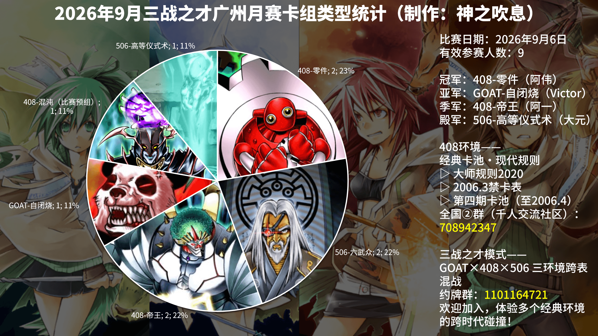

    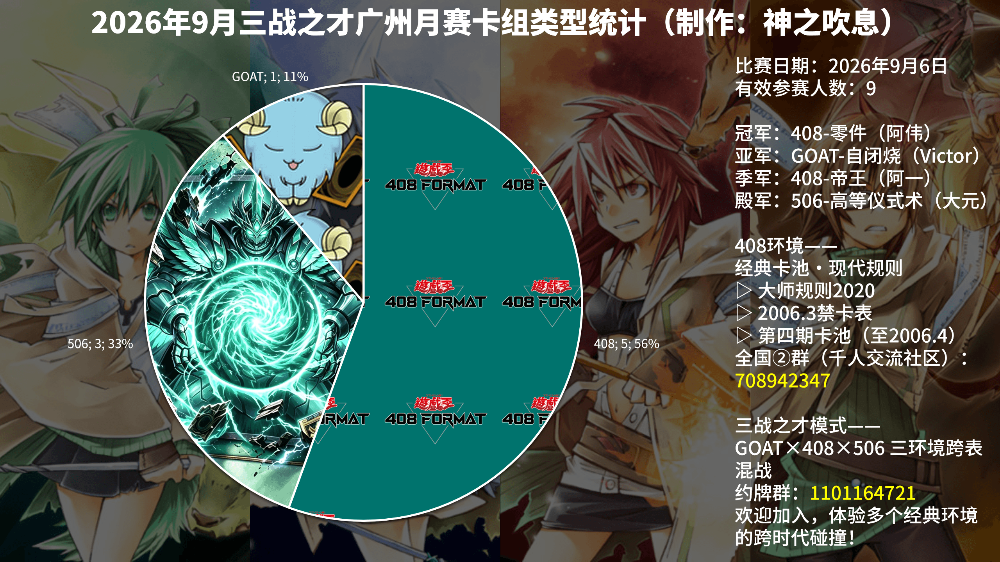

感谢赞助老板**老赵（集换社：老赵的卡本）**提供的追加奖品高罕卡、卡套等。第一次三战之才模式线下赛举办非常完满！GOAT、408、506三个环境的卡组都有。9人大会，本人也参赛了，4轮瑞士轮1-3无法出轮，虽然有丶可惜，但能参与这历史开拓性的一赛就已经感觉不亏了。希望三战之才这个**创新**的模式能让这三个环境内更多的玩家可以**打破规则的隔离**一同决斗，获得**新的快乐**！

---

# **强者对战记录**

## **冠军：408-零件**

    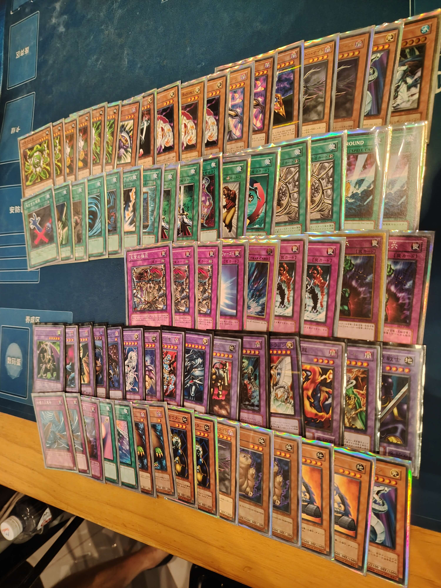

- **第一轮**：506-高等仪式术 胜
- **第二轮**：506-六武众 胜
- **第三轮**：408-混沌（比赛预组） 胜
- **第四轮**：408-零件 胜
- **半决赛**：408-帝王 胜
- **决赛**：GOAT-自闭烧 胜

## **亚军：GOAT-自闭烧**

    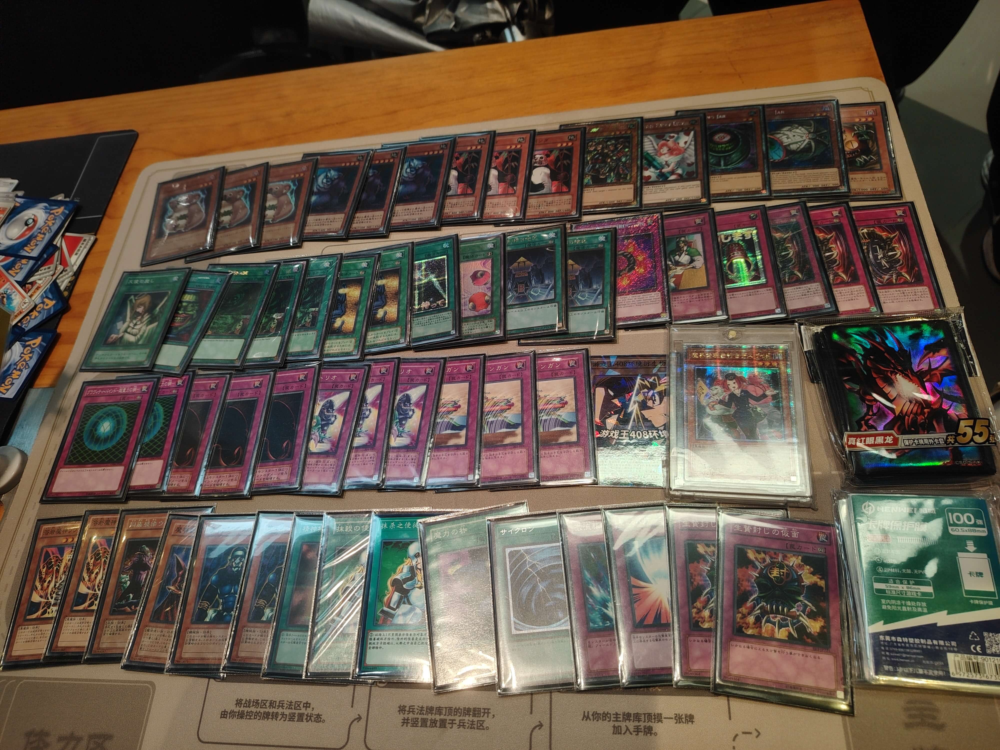

- **第一轮**：408-帝王 胜
- **第二轮**：408-零件 胜
- **第三轮**：408-帝王 胜
- **第四轮**：506-高等仪式术 胜
- **半决赛**：506-高等仪式术 胜
- **决赛**：408-零件 负

##  **季军：408-帝王**

    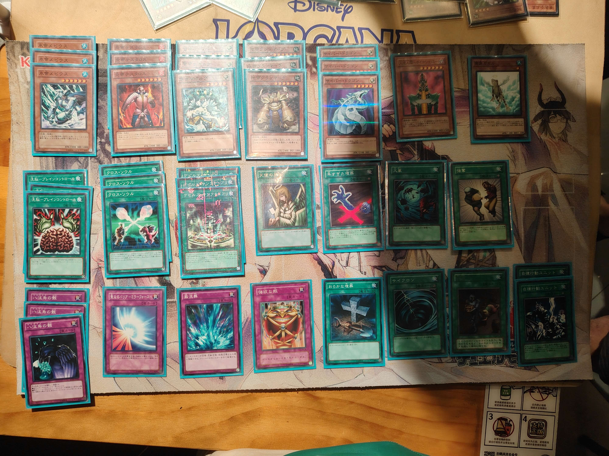

- **第一轮**：轮空
- **第二轮**：408-混沌（比赛预组） 胜
- **第三轮**：GOAT-自闭烧 负
- **第四轮**：506-六武众 胜
- **半决赛**：408-零件 负
- **季军争夺战**：GOAT-自闭烧 胜

## **殿军：506-高等仪式术**

    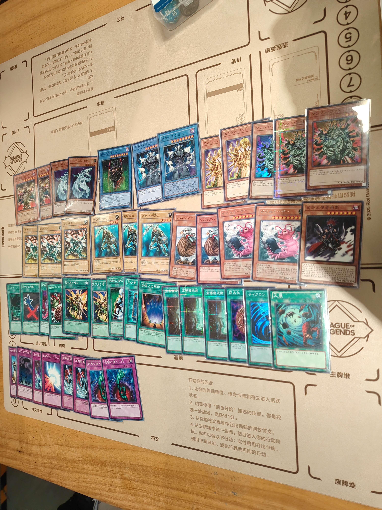

- **第一轮**：408-零件 负
- **第二轮**：轮空
- **第三轮**：408-零件 胜
- **第四轮**：GOAT-自闭烧 负
- **半决赛**：GOAT-自闭烧 负
- **季军争夺战**：408-帝王 负

---

# **参赛者卡组公开**

## **其他参赛者**

| ID   | 卡组主题 | 构筑截图 |
| :----: | :--------------: | :--------: |
| 神之吹息 | 408-零件 | 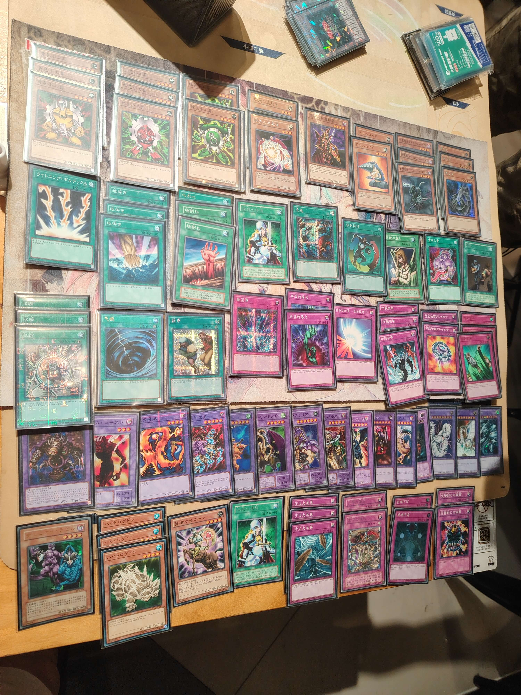    |
| 龙骑 | 506-六武众 | 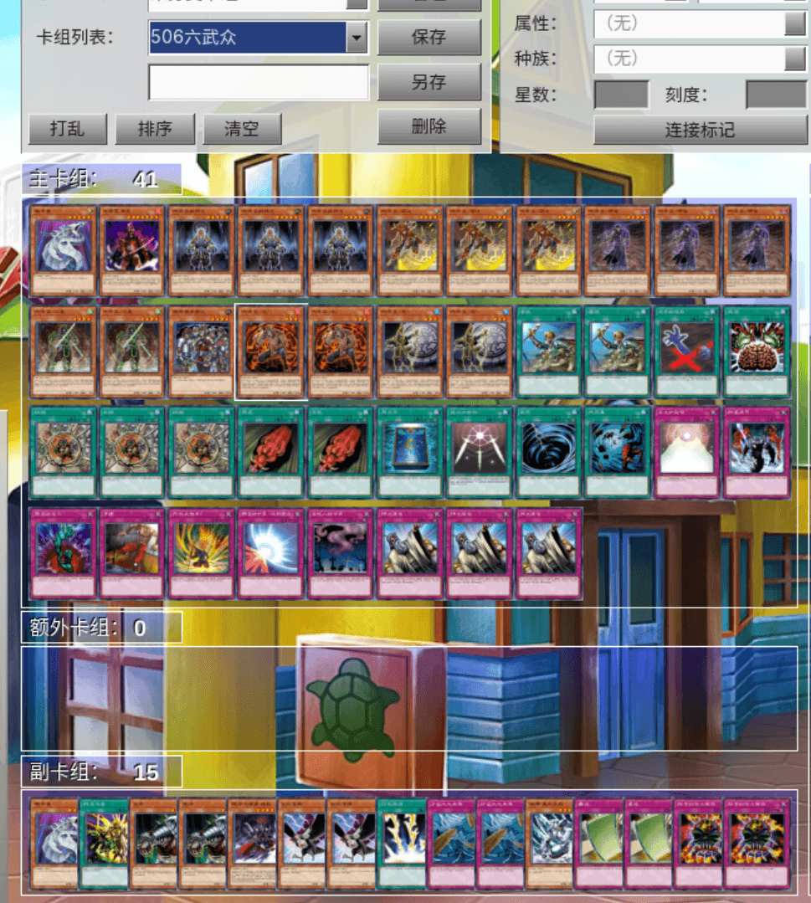    |
| 红尘不渡我 | 506-六武众 | 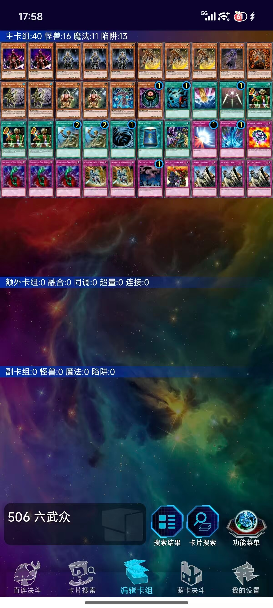    |
| 夜清歌 | 408-混沌（比赛预组） | 已公开，略 |
| yao | 408-帝王 | 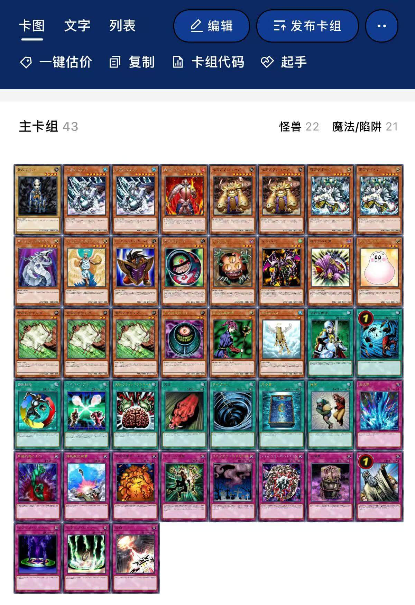    |

---

# **当日活动记录**

    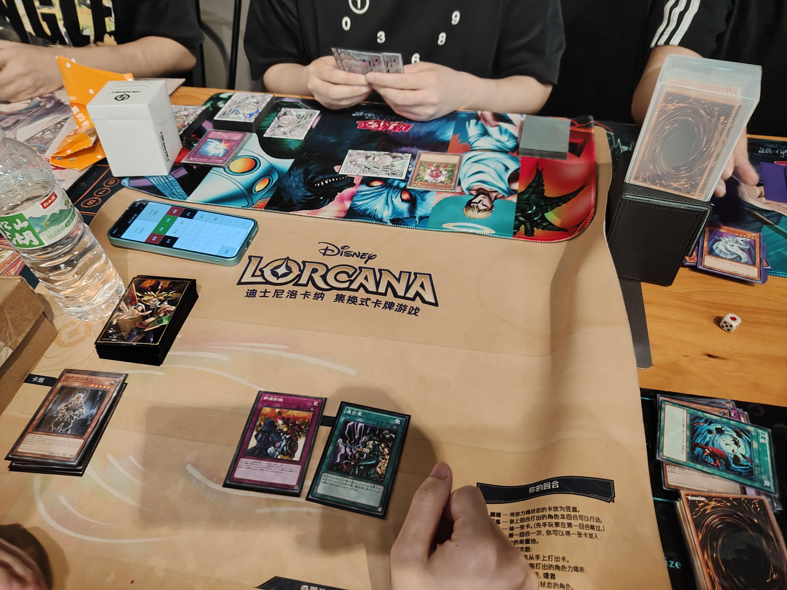
     
    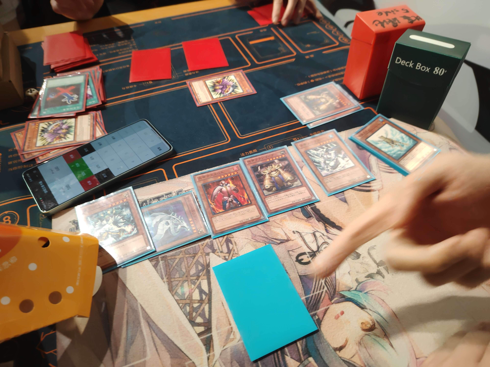
     
    比赛场面选集

    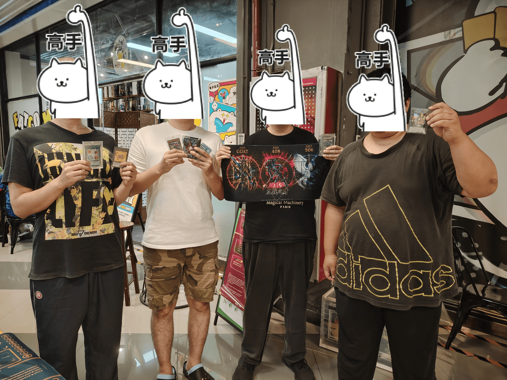
     
    四强玩家合照

---

# **加入社群**

- **408环境全国②群（千人大群）**：QQ群 `708942347`
- **引导群**：QQ群 `912340958`
- **三战之才模式群（GOAT×408×506 三环境跨表混战）**： QQ群 `1101164721`

---

**本届比赛圆满结束，欢迎参加下届赛事！**