# 本人实卡卡组记录（2025-4-25）

**【注意】**仅提供构筑灵感，不保证强度、胜率，也不建议直接手抄。自己构筑、改进的卡组玩起来会更有游戏体验。  

卡组名已在截图中。  

[返回卡组分享（原创·投稿）](../../Original_Submit.html)

---

    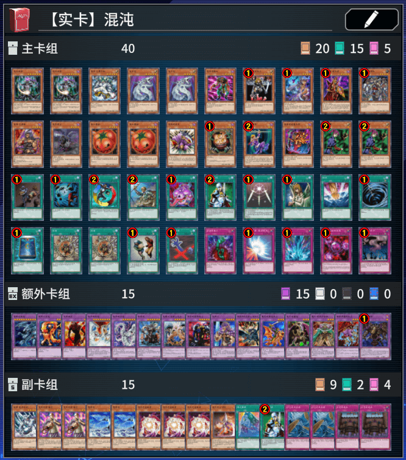
     
    卡组类型：beat/burn

---

    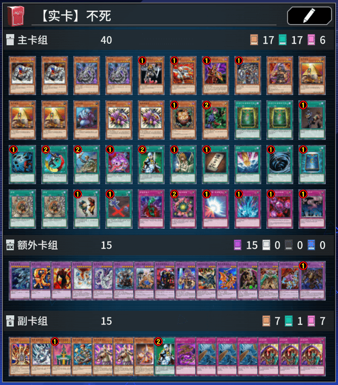
     
    卡组类型：beat/burn

---

    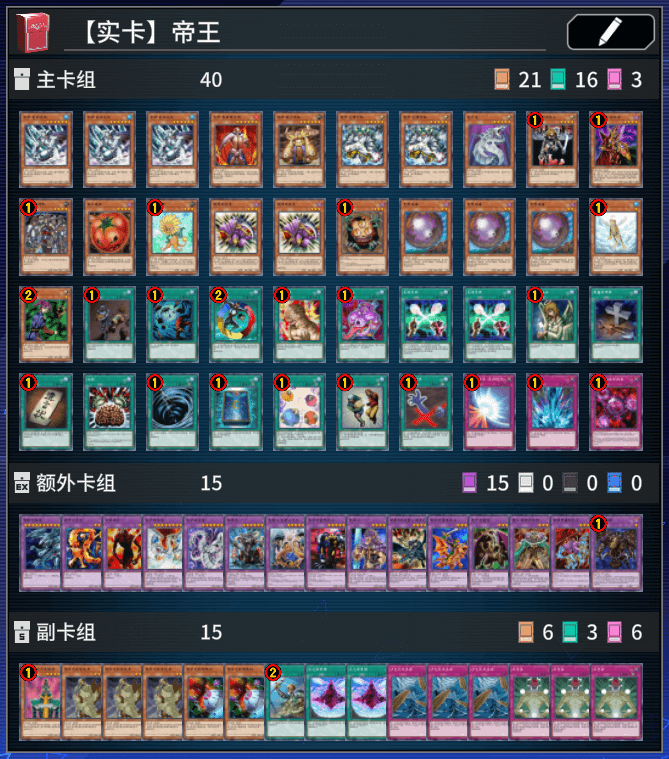
     
    卡组类型：beat/burn

---

    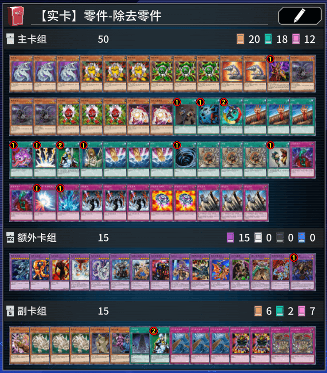
     
    卡组类型：beat

---

    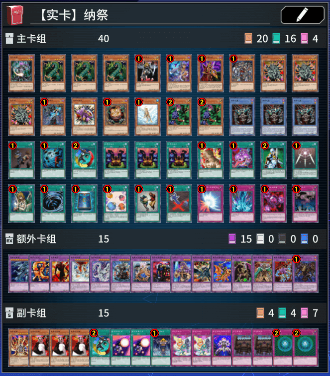
     
    卡组类型：beat/burn

---

    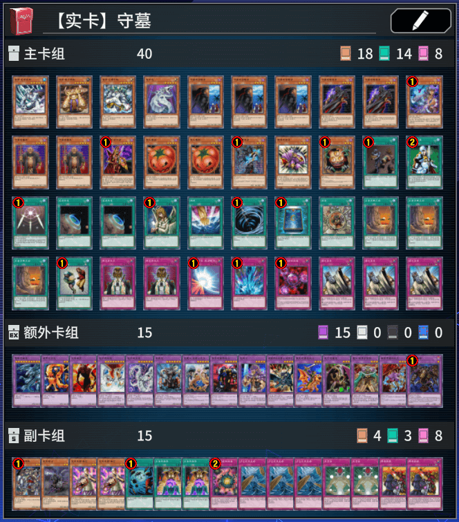
     
    卡组类型：beat/burn

---

    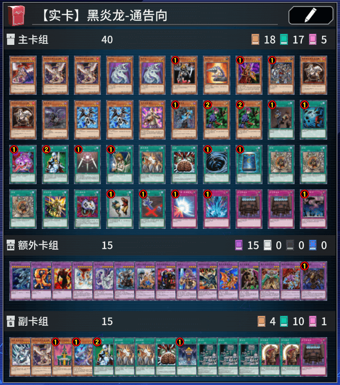
     
    卡组类型：beat/burn

---

    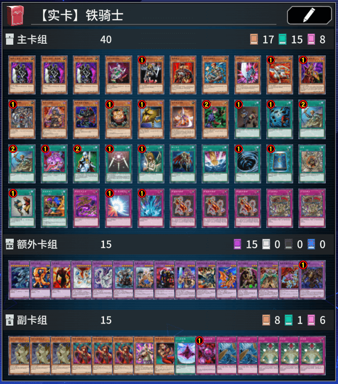
     
    卡组类型：beat

---

    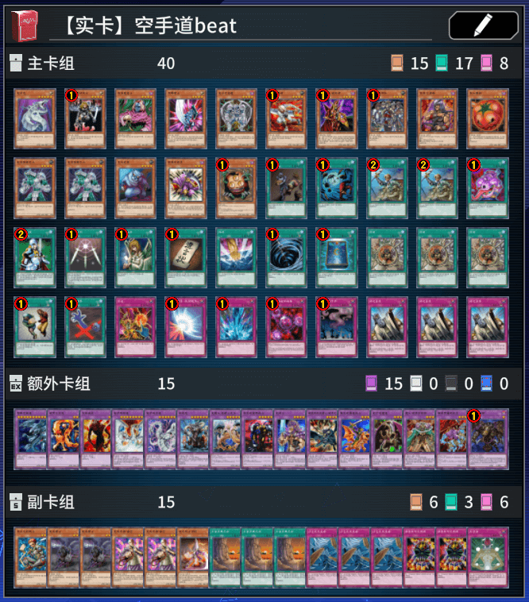
     
    卡组类型：beat

---

    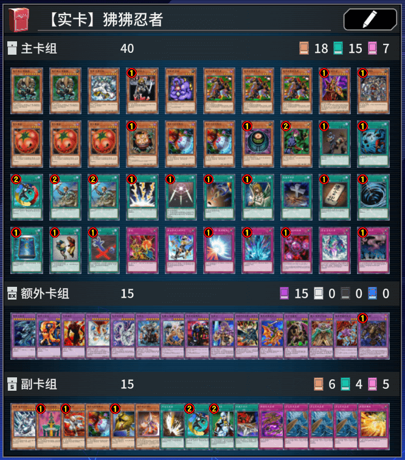
     
    卡组类型：beat

---

    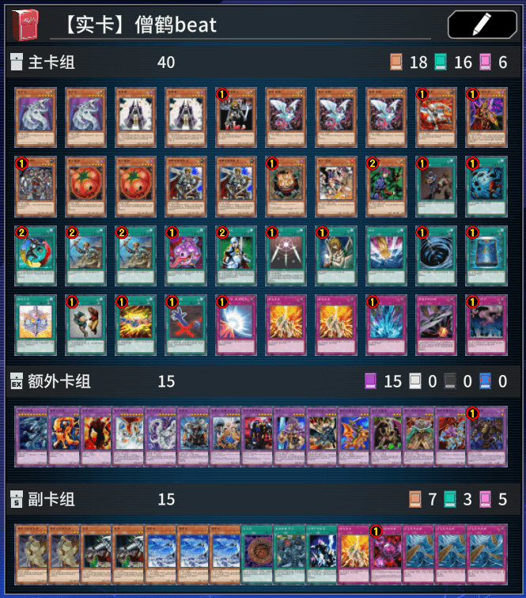
     
    卡组类型：beat/burn

---

    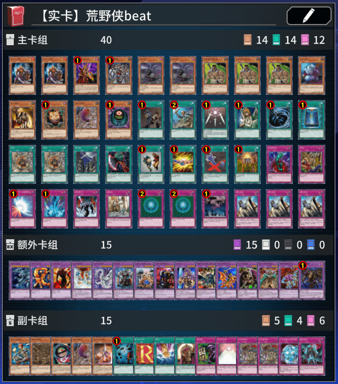
     
    卡组类型：beat

