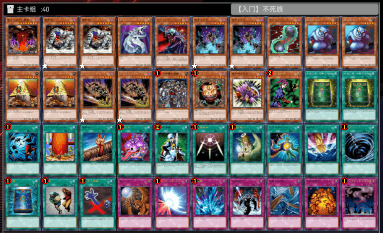
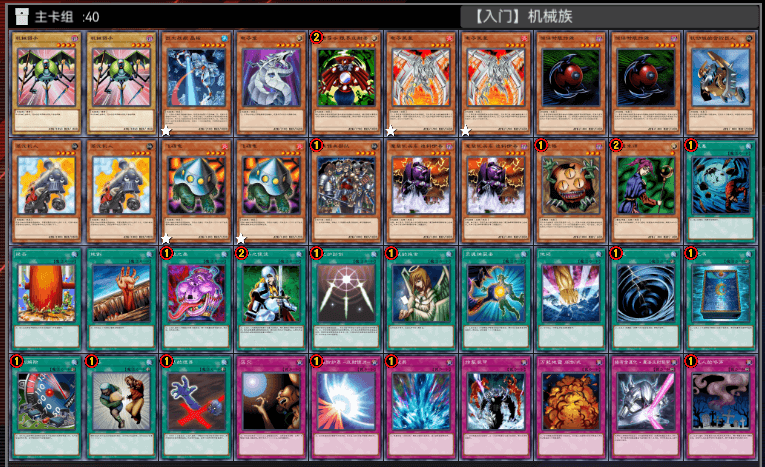

# 入门预组、比赛预组（批量配给）

**【注意】**由本人及若干群友合作研究推出，**限制强度避免准新人追求效率只玩预组，伤害环境多样性、构筑积极性**。  
YDK文件与打印文件均放在度娘网盘中。  

[返回卡组分享（原创·投稿）](../../Original_Submit.html)

---

## 入门预组

用于让新人**熟悉基础规则**和**感性认知408环境的游戏节奏、战术思路风格**。

    
     
    【入门】Good Stuff

---

    
     
    【入门】不死族

---

    
     
    【入门】战士族

---

    
     
    【入门】龙族

---

    
     
    【入门】恶魔族

---

    
     
    【入门】魔法师族

---

    
     
    【入门】岩石族

---

    
     
    【入门】机械族

## 比赛预组

用于让**有一定认识基础**的玩家**快速参加比赛**，强度有胜出瑞士轮、冲击淘汰赛优胜的能力。

    
     
    【比赛】混沌

---

    
     
    【比赛】不死族

---

    
     
    【比赛】帝王

---

    
     
    【比赛】零件

---

    
     
    【比赛】地属性

