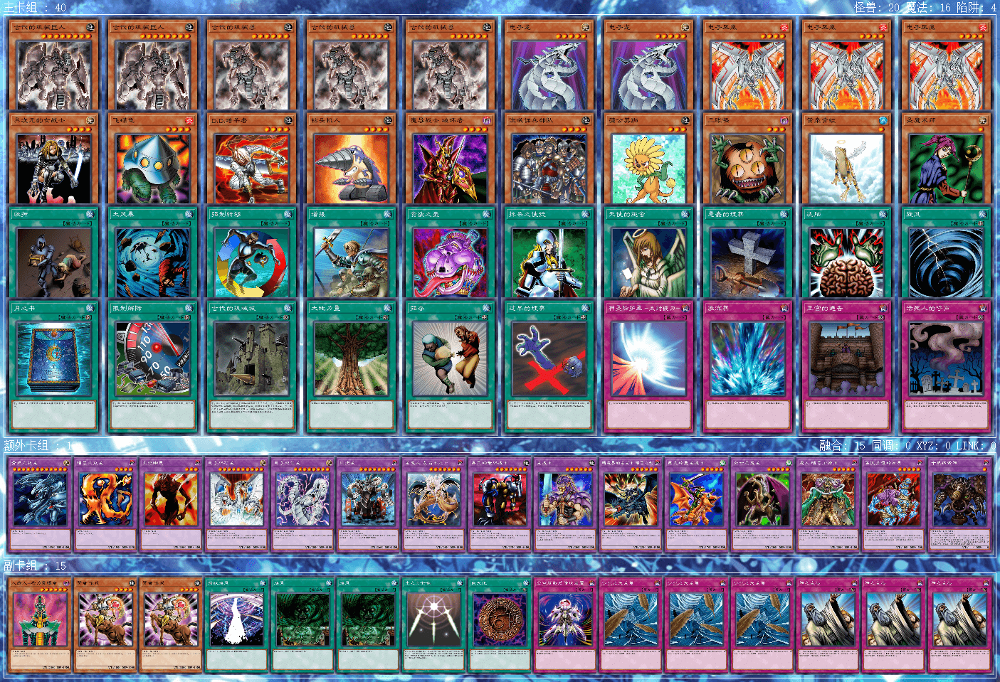

# 本人实卡卡组记录（2025-9-25）

**【注意】**仅提供构筑灵感，不保证强度、胜率，也不建议直接手抄。自己构筑、改进的卡组玩起来会更有游戏体验。  

部分卡组的副卡组仅为参考，因为本人不会将其用于比赛。  

[返回卡组分享（原创·投稿）](../../Original_Submit.html)

---

    
     
    卡组名称：混沌
     
    卡组类型：beat

---

    
     
    卡组名称：不死族
     
    卡组类型：beat

---

    
     
    卡组名称：帝王
     
    卡组类型：beat

---

    
     
    卡组名称：零件-50除去零件
     
    卡组类型：beat

---

    
     
    卡组名称：纳祭
     
    卡组类型：beat

---

    
     
    卡组名称：守墓
     
    卡组类型：beat/报社

---

    
     
    卡组名称：黑炎龙-宣告向
     
    卡组类型：beat

---

    
     
    卡组名称：铁骑士beat
     
    卡组类型：beat

---

    
     
    卡组名称：空手道beat
     
    卡组类型：beat

---

    
     
    卡组名称：狒狒忍者
     
    卡组类型：beat

---

    
     
    卡组名称：僧鹤beat
     
    卡组类型：beat

---

    
     
    卡组名称：荒野侠beat
     
    卡组类型：beat

---

    
     
    卡组名称：推理门-新宇侠特化
     
    卡组类型：beat

---

    
     
    卡组名称：自闭烧-炎属性
     
    卡组类型：burn/报社

---

    
     
    卡组名称：岩石族-自闭向
     
    卡组类型：beat

---

    
     
    卡组名称：水产-海龙
     
    卡组类型：beat

---

    
     
    卡组名称：究极昆虫
     
    卡组类型：beat

---

    
     
    卡组名称：融合-光属性
     
    卡组类型：beat

---

    
     
    卡组名称：Good Stuff-60
     
    卡组类型：beat

---

    
     
    卡组名称：最上级beat-生札冥札向
     
    卡组类型：beat

---

    
     
    卡组名称：黑魔术师
     
    卡组类型：beat

---

    
     
    卡组名称：青眼-仪式向
     
    卡组类型：beat

---

    
     
    卡组名称：暗黑界-手控向
     
    卡组类型：beat

---

    
     
    卡组名称：反击天使
     
    卡组类型：beat

---

    
     
    卡组名称：恶魔族-哥布林王
     
    卡组类型：beat

---

    
     
    卡组名称：神炎皇-技抽向
     
    卡组类型：beat

---

    
     
    卡组名称：次元beat
     
    卡组类型：beat

---

    
     
    卡组名称：沉默剑士
     
    卡组类型：beat

---

    
     
    卡组名称：不死族-装备向
     
    卡组类型：beat

---

    
     
    卡组名称：古代的机械
     
    卡组类型：beat

