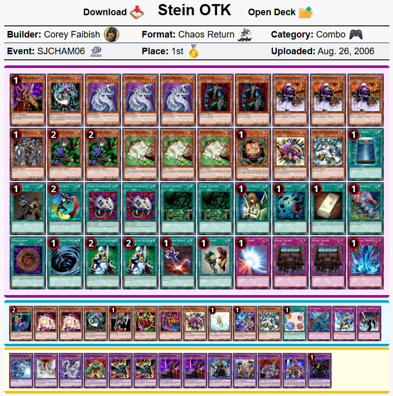
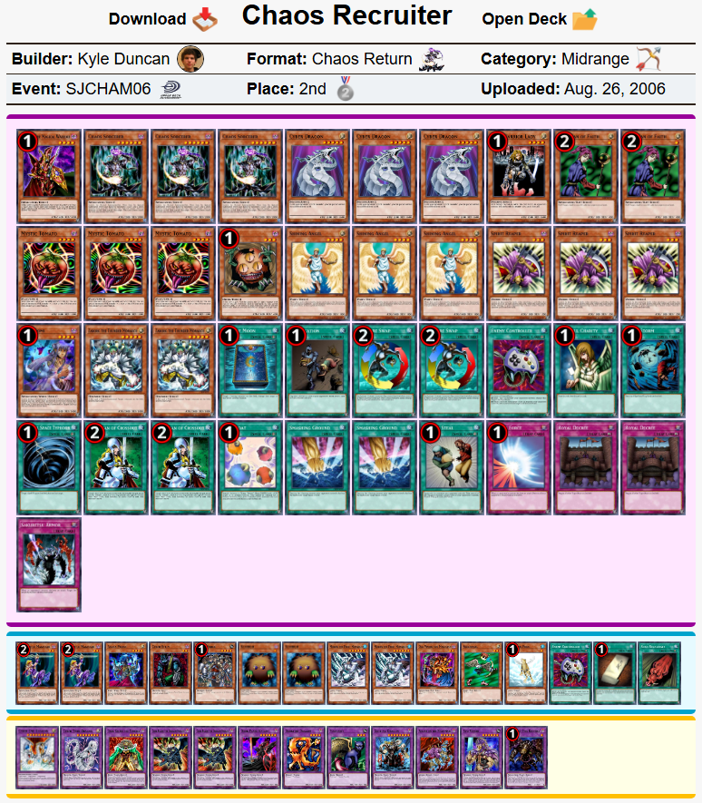
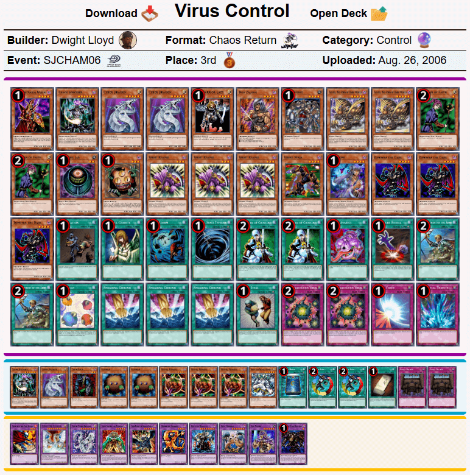
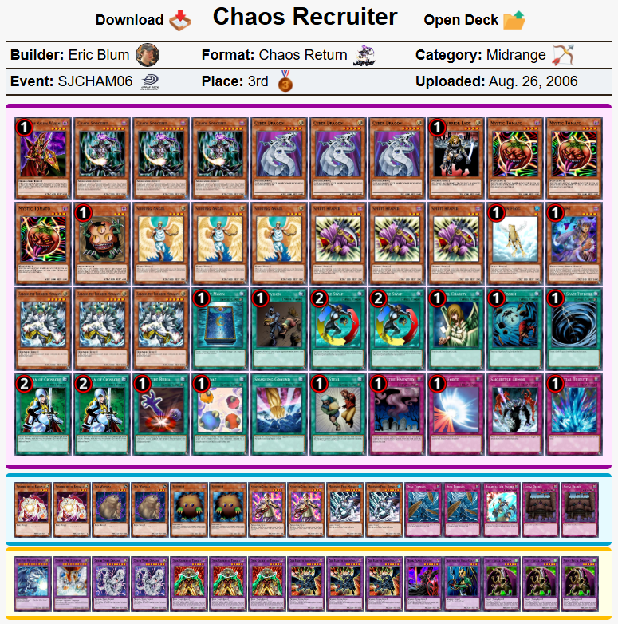
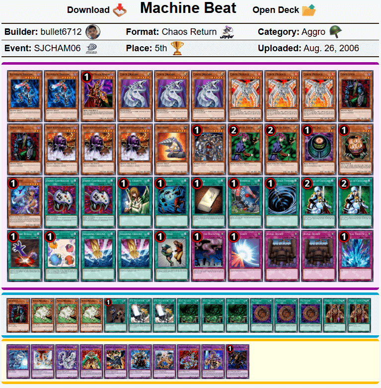
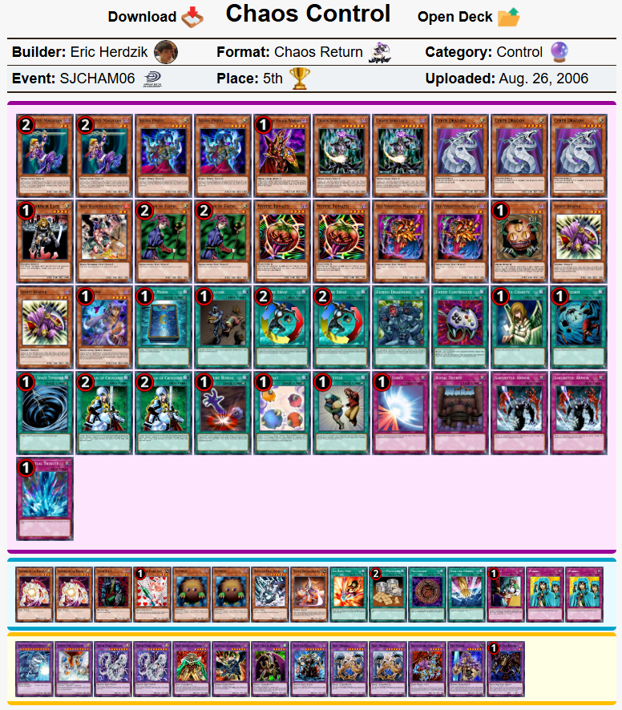
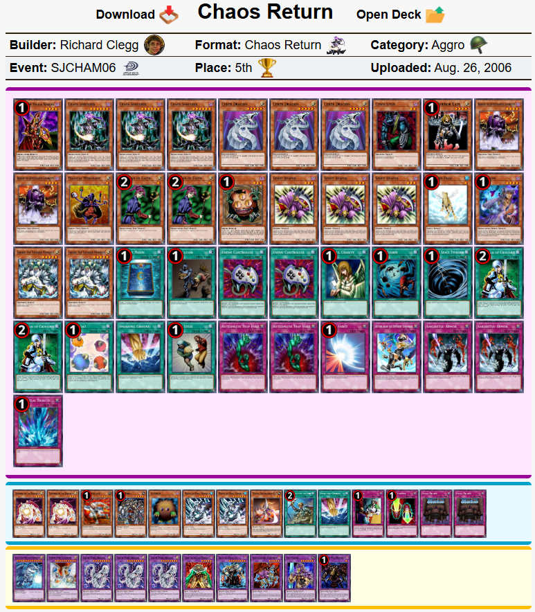
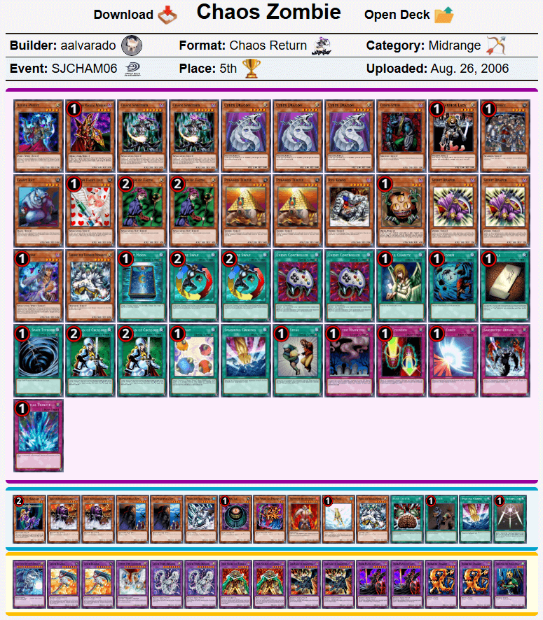

# SJC汉密尔顿2006历史上位搬运
来源：游戏王赛制库  
地址：https://www.formatlibrary.com/events/SJCHAM06  
译者：本文卡组的卡池卡表虽然与408环境基本相同，但由于适用规则、调整裁定有差别，且TCG相比同时期OCG缺少部分卡片，建议参考时略作修改再用于408环境游戏。  

[返回卡组分享（搬运·翻译）](../../Deck_Transport.html)

---

## SJC汉密尔顿2006（SJC Hamilton 2006）
冠军：Corey FaibishCorey  
社团（指举办方）：Upper Deck Entertainment  
参赛者：426  
赛制：混沌归还  
冠军卡组：科学怪人一回杀  
日期：2006年8月26日（当地时间）  

    
     
    科学怪人一回杀 - Corey Faibish - 冠军

---

    
     
    遗言混沌 - Kyle Duncan - 亚军

---

    
     
    病毒控制 - Dwight Lloyd - 四强

---

    
     
    遗言混沌 - Eric Blum - 四强

---

    
     
    机械Beat - Bullet88 - 八强

---

    
     
    混沌控制 - Eric Herdzik - 八强

---

    
     
    混沌归还 - Richard Clegg - 八强

---

    
     
    混沌不死 - aalvarado - 八强

