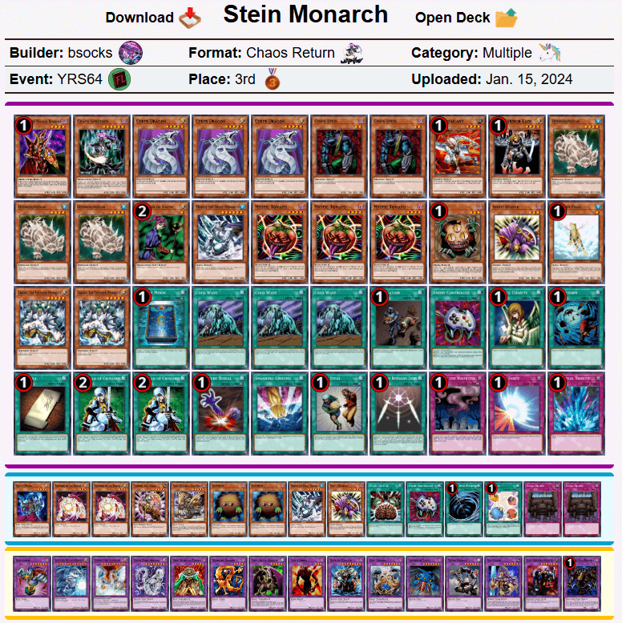

# 游戏王复古系列64现代上位搬运
来源：游戏王赛制库  
地址：https://www.formatlibrary.com/events/YRS64  
译者：本文卡组的卡池卡表虽然与408环境基本相同，但由于适用规则、调整裁定有差别，且TCG相比同时期OCG缺少部分卡片，建议参考时略作修改再用于408环境游戏。原文有饼图与卡片投入统计数据，但难以搬运，略过。  

[返回卡组分享（搬运·翻译）](../../Deck_Transport.html)

---

## 游戏王复古系列64（Yugioh Retro Series 64）
冠军：AlephYa2  
社团（指举办方）：赛制库（Format Library）  
参赛者：22  
赛制：混沌归还  
冠军卡组：报社“无效”  
日期：2024年1月1日（当地时间，此处与卡组中日期数据不一致）  

    
     
    报社“无效” - AlephYa2 - 冠军

---

    
     
    科学怪人帝 - IzunaGaiden - 亚军

---

    
     
    混沌控制 - Aretos - 四强

---

    
     
    科学怪人帝 - bsocks - 四强

---

    
     
    混沌控制 - AlienKW - 八强

---

    
     
    混沌归还 - GBO - 八强

---

    
     
    次元帝 - clemxns12 - 八强

---

    
     
    混沌控制 - paoloNS - 八强

