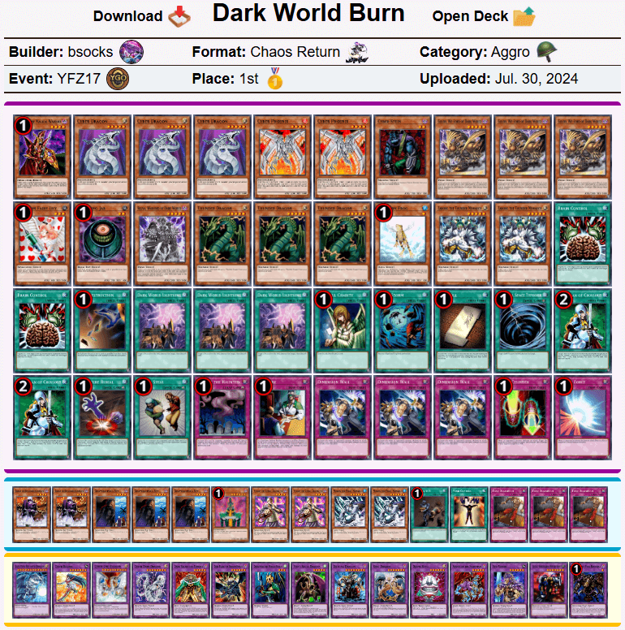
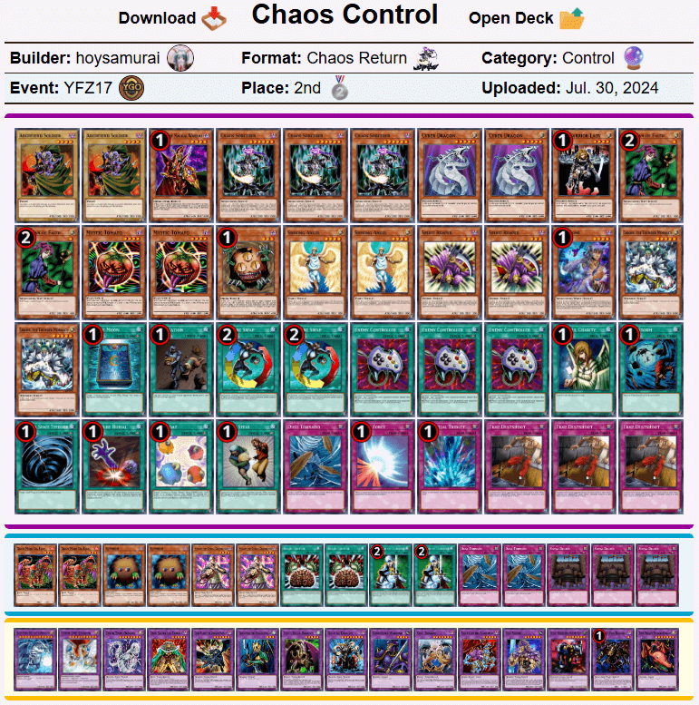
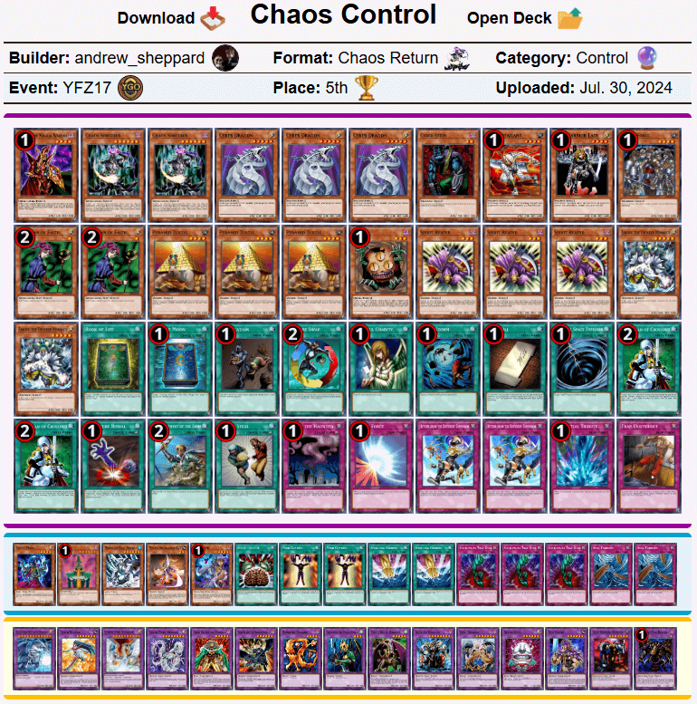
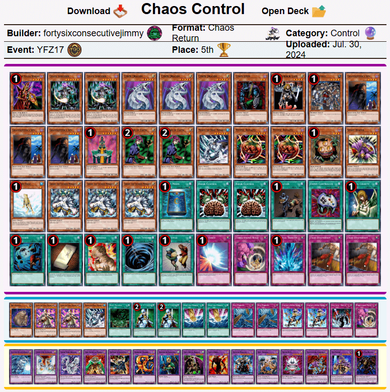

# 游戏王从0开始的复古锦标赛17现代上位搬运
来源：游戏王赛制库  
地址：https://www.formatlibrary.com/events/YFZ17  
译者：本文卡组的卡池卡表虽然与408环境基本相同，但由于适用规则、调整裁定有差别，且TCG相比同时期OCG缺少部分卡片，建议参考时略作修改再用于408环境游戏。原文有饼图与卡片投入统计数据，但难以搬运，略过。  

[返回卡组分享（搬运·翻译）](../../Deck_Transport.html)

---

## 游戏王从0开始的复古锦标赛17（YGOFrom0's Retro Tournament 17）
冠军：AlephYa2  
社团（指举办方）：游戏王从0开始（YGOFrom0）  
参赛者：25  
赛制：混沌归还  
冠军卡组：暗黑界烧  
日期：2024年7月14日（当地时间）  

    
     
    暗黑界烧 - bsocks - 冠军

---

    
     
    混沌控制 - Hoy - 亚军

---

    
     
    混沌控制 - Ke$ha - 四强

---

    
     
    科学怪人帝 - splevin - 四强

---

    
     
    报社“无效” - AlephYa2 - 八强

---

    
     
    混沌控制 - Andrew_ - 八强

---

    
     
    混沌控制 - food0675 - 八强

---

    
     
    混沌控制 - jimb0b - 八强

---

    
     
    混沌帝 - TheIndieXP - 九强（原文为8th，经典的八强有九人）

