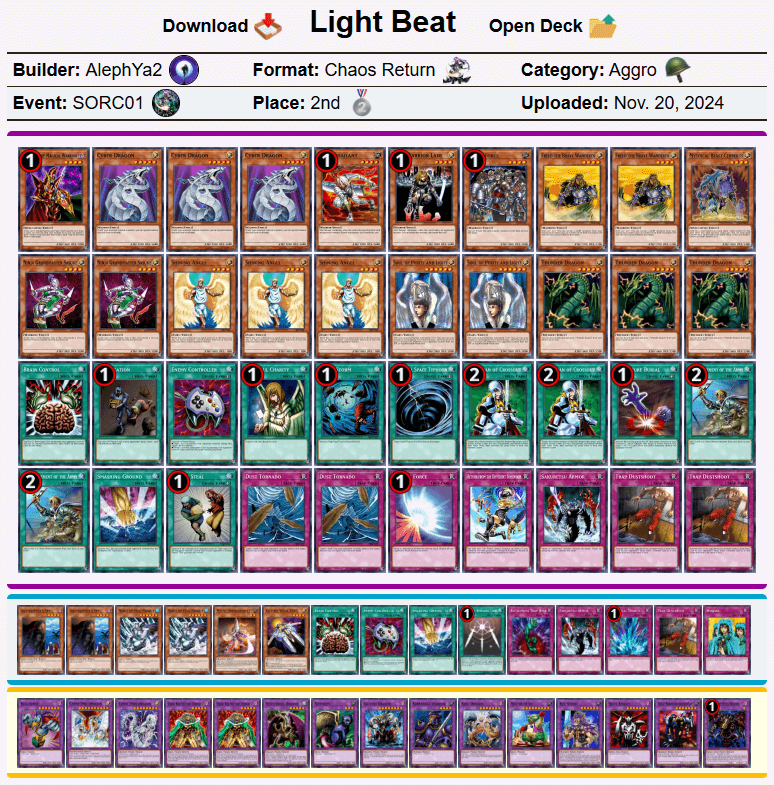

# 巫师大满贯1：混沌归还之归还 现代上位搬运
来源：游戏王赛制库  
地址：https://www.formatlibrary.com/events/SORC01  
译者：本文卡组的卡池卡表虽然与408环境基本相同，但由于适用规则、调整裁定有差别，且TCG相比同时期OCG缺少部分卡片，建议参考时略作修改再用于408环境游戏。原文有饼图与卡片投入统计数据，但难以搬运，略过。  

[返回卡组分享（搬运·翻译）](../../Deck_Transport.html)

---

## 巫师大满贯1：混沌归还之归还（Sorcerer Slam 1: The Return of Chaos Return）
冠军：lollo_8888  
社团（指举办方）：混沌归还（Chaos Return）  
参赛者：14  
赛制：混沌归还  
冠军卡组：科学怪人帝王  
日期：2024年11月10日（当地时间）  

    
     
    科学怪人帝王 - lollo_8888 - 冠军

---

    
     
    光属性Beat - AlephYa2 - 亚军

